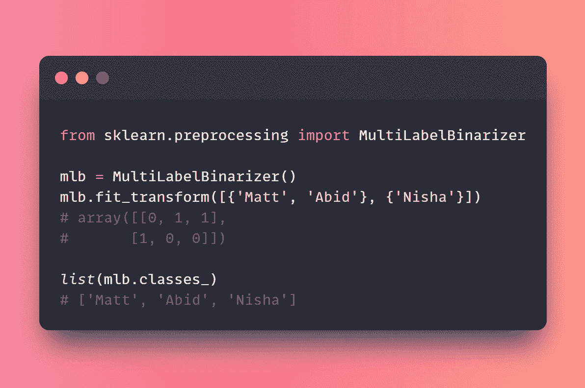
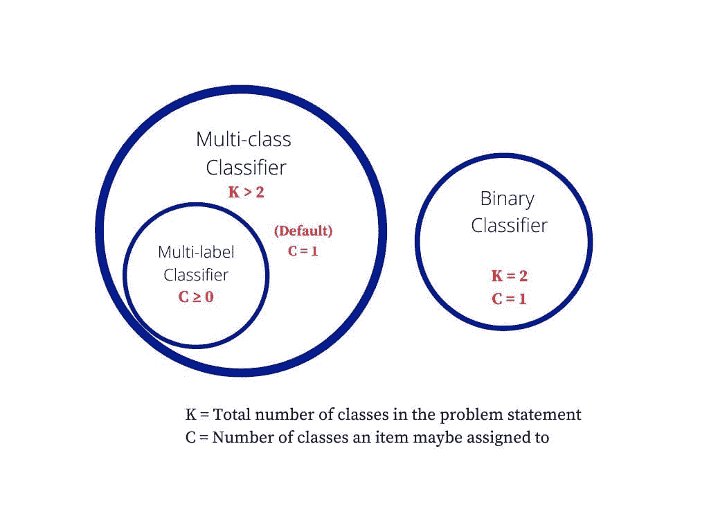
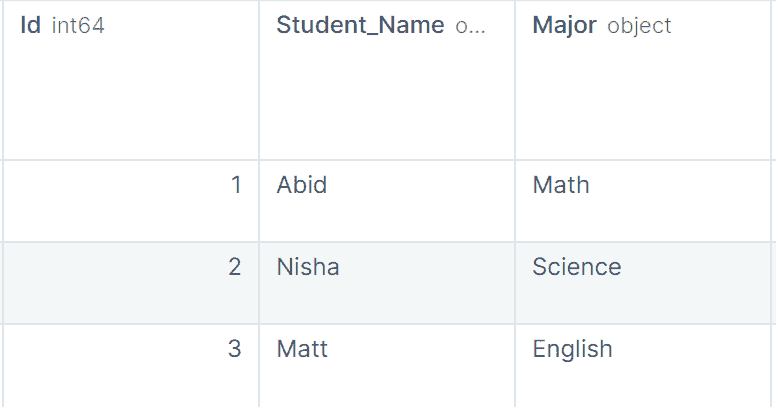
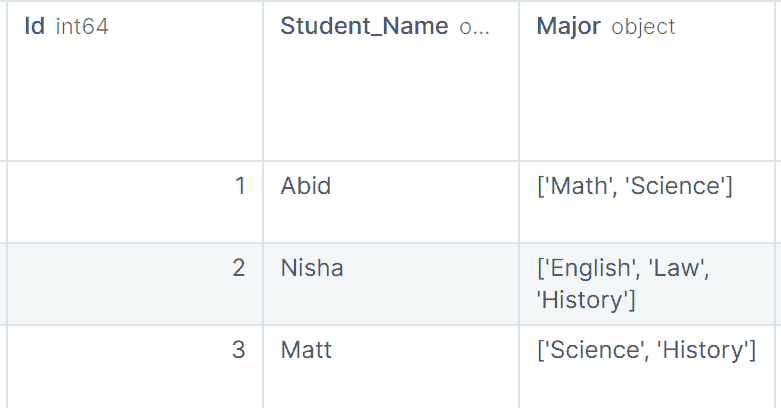
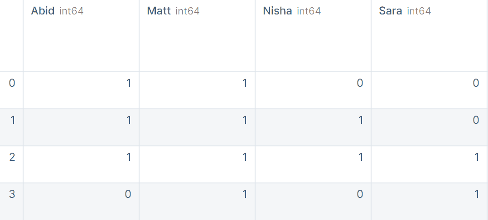

# 使用 MultiLabelBinarizer 编码分类特征

> 原文：[`www.kdnuggets.com/2023/01/encoding-categorical-features-multilabelbinarizer.html`](https://www.kdnuggets.com/2023/01/encoding-categorical-features-multilabelbinarizer.html)



作者提供的图片

过去，你可能通过 One Hot、Label 和 Ordinal 编码器将分类特征转换为数值特征。你处理的数据每个样本只有一个标签。但是，如何处理具有多个标签的样本呢？

* * *

## 我们的前 3 个课程推荐

 1\. [Google 网络安全证书](https://www.kdnuggets.com/google-cybersecurity) - 快速入门网络安全职业。

 2\. [Google 数据分析专业证书](https://www.kdnuggets.com/google-data-analytics) - 提升你的数据分析技能

 3\. [Google IT 支持专业证书](https://www.kdnuggets.com/google-itsupport) - 在 IT 领域支持你的组织

* * *

在本迷你教程中，你将学习多分类和多标签的区别。此外，我们将应用 Scikit-Learn 的 MultiLabelBinarizer 函数，将可迭代的可迭代对象和多标签目标进行转换。

# 多分类与多标签

在机器学习中，多分类数据包含两个以上的类别，每个样本只分配一个标签。而在多标签分类中，每个样本会分配多个标签。



图片来源于 [Thamme Gowda](https://stats.stackexchange.com/a/133205)

我们将通过示例来理解这两种分类任务。

## 多分类

在多分类中，每个学生的记录只有一个标签（主修），并且有超过两个类别。学生只能选择数学、科学或英语作为主修。



作者提供的图片

## 多标签

在多标签分类中，学生可以拥有多个主修。例如，Nisaha 选择了英语、法律和历史作为她的主修课程。

我们还可以看到，数组的长度有所不同，有些学生有两个主修课程，有些则有三个。

学生有 0 到 N 个主修课程。



作者提供的图片

# Scikit-Learn MultiLabelBinarizer 示例

我们现在将使用 Scikit-learn 的 MultiLabelBinarizer 将可迭代的可迭代对象和多标签目标转换为二进制编码。

## 示例 1

在第一个示例中，我们使用 MultiLabelBinarizer 函数将 List of Lists 转换为二进制编码。`fit_transform` 理解数据并应用转换。

```py
import pandas as pd
from sklearn.preprocessing import MultiLabelBinarizer

mlb = MultiLabelBinarizer()
print(mlb.fit_transform([["Abid", "Matt"], ["Nisha"]]))
```

**输出：**

我们得到了一个由 1 和 0 组成的数组。

```py
array([[1, 1, 0],
       [0, 0, 1]])
```

## 示例 2

我们还可以将字典列表转换为表示类标签存在的二进制矩阵。

转换后，你可以使用 `.classes_` 查看类标签。

```py
y = mlb.fit_transform(
    [
        {"Abid", "Matt"},
        {"Nisha", "Abid", "Matt"},
        {"Nisha", "Abid", "Sara", "Matt"},
        {"Matt", "Sara"},
    ]
)
print(list(mlb.classes_))
```

**输出：**

```py
['Abid', 'Matt', 'Nisha', 'Sara']
```

要理解二进制矩阵，我们将把输出转换成带有类名的 Pandas DataFrame。

```py
res = pd.DataFrame(y, columns=mlb.classes_)
res
```

就像独热编码一样，它将标签表示为 1 和 0。



MultiLabelBinarizer 通常用于图像和新闻分类。转换后，你可以迅速训练简单的随机森林或神经网络。

**[Abid Ali Awan](https://www.polywork.com/kingabzpro)** ([@1abidaliawan](https://twitter.com/1abidaliawan)) 是一位认证的数据科学专家，他热爱构建机器学习模型。目前，他专注于内容创作，并撰写有关机器学习和数据科学技术的技术博客。Abid 拥有技术管理硕士学位和电信工程学士学位。他的愿景是利用图神经网络构建一个 AI 产品，帮助那些在心理健康方面挣扎的学生。

### 更多相关话题

+   [如何处理机器学习中的分类数据](https://www.kdnuggets.com/2021/05/deal-with-categorical-data-machine-learning.html)

+   [在机器学习模型中处理稀疏特征](https://www.kdnuggets.com/2021/01/sparse-features-machine-learning-models.html)

+   [如何在 Python 中构建日期特征](https://www.kdnuggets.com/2021/08/engineer-date-features-python.html)

+   [创建机器学习特征的挑战](https://www.kdnuggets.com/2022/02/challenges-creating-features-machine-learning.html)

+   [5 个 ChatGPT 功能提升你的日常工作](https://www.kdnuggets.com/2023/05/5-chatgpt-features-boost-daily-work.html)

+   [你的特征重要吗？这并不意味着它们是好的](https://www.kdnuggets.com/your-features-are-important-it-doesnt-mean-they-are-good)
