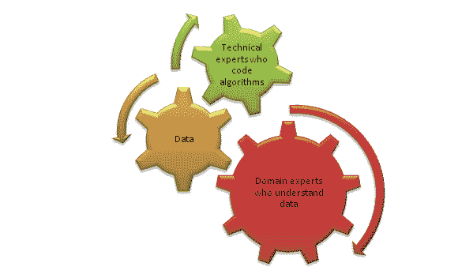
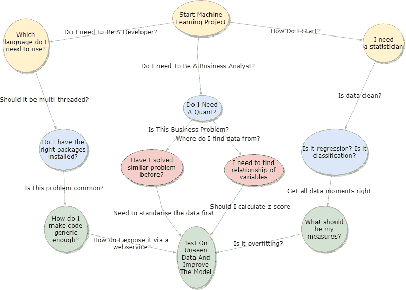
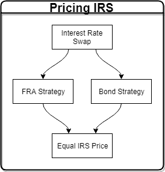
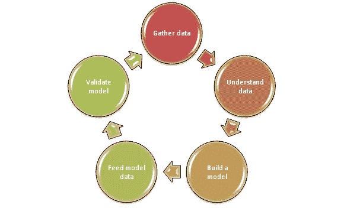
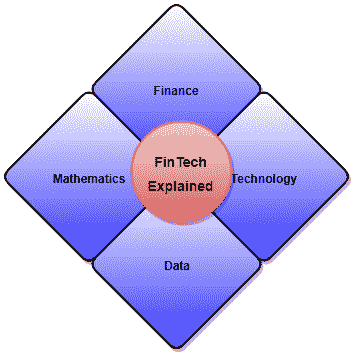

# 机器学习项目的端到端指南

> 原文：[`www.kdnuggets.com/2019/01/end-to-end-guide-machine-learning-project.html`](https://www.kdnuggets.com/2019/01/end-to-end-guide-machine-learning-project.html)

 评论

很难找到一篇简洁的文章提供关于如何实施一个[机器学习项目](https://www.kdnuggets.com/2020/03/20-machine-learning-datasets-project-ideas.html)的端到端指南。我们在线上找到很多信息丰富的文章，深入覆盖了如何实施机器学习/数据科学项目的各个部分，但有时我们只需要高层次的步骤提供清晰的指导。

当我刚接触机器学习和数据科学时，我常常寻找那些清晰地列出我需要做什么步骤来完成项目的文章。

> * * *
> 
> ## 我们的前三个课程推荐
> ## 
>  1\. [谷歌网络安全证书](https://www.kdnuggets.com/google-cybersecurity) - 快速进入网络安全职业生涯。
> 
>  2\. [谷歌数据分析专业证书](https://www.kdnuggets.com/google-data-analytics) - 提升你的数据分析技能
> 
>  3\. [谷歌 IT 支持专业证书](https://www.kdnuggets.com/google-itsupport) - 支持你所在组织的 IT 工作
> 
> * * *
> 
> 本文旨在提供一个端到端指南，以实现一个成功的机器学习项目。

### 记住这一点，让我们开始吧

> *简而言之，一个机器学习项目主要包括三个部分：数据理解、数据收集与清理，以及最后的模型实施与调优。通常，数据理解、收集和清理占据 60–70%的时间。为此，我们需要领域专家。*

### 场景

让我们假设你正在尝试进行一个机器学习项目。本文将为你提供逐步指南，帮助你按照流程实施一个成功的项目。

一开始，我们的大脑中会产生很多问题

> 数据科学是试验与错误，它是研究与递归，它是实践与理论的结合，它需要领域知识，它提升你的战略技能，你会学习统计学并掌握编程技能。但最重要的是，它教会你保持耐心，因为你总是接近找到更好的答案。

### 步骤

**两个前提步骤：**

**1\. 确保你理解机器学习及其三个关键领域。点击阅读：**

[**机器学习 8 分钟**

*机器学习是现在和未来。所有的技术专家、数据科学家和金融专家都可以受益…*medium.com](https://medium.com/fintechexplained/introduction-to-machine-learning-4b2d7c57613b)

**2\. 选择你的目标语言。熟悉 Python。点击阅读：**

[**从零开始学习 Python**

*Python 是数据分析和机器学习中最受欢迎的编程语言之一。此外，还有大量的…*medium.com](https://medium.com/fintechexplained/from-python-installation-to-arima-exchange-rates-forecasting-9467ba03ee0c)

### 开始实施

**1\. 选择合适的机器学习算法。点击阅读：**

[**机器学习算法比较**

*有大量的机器学习（ML）算法可用。在本文中，我将描述和…*medium.com](https://medium.com/fintechexplained/machine-learning-algorithm-comparison-f14ce372b855)

> 到现在为止，你应该已经明白你尝试解决的是一个监督式还是非监督式问题。

总是有可能找到另一个正确答案。在预测问题中，通常会有多个正确答案。

**2\. 如果这是一个监督式机器学习问题，请确保你了解它是回归问题还是分类问题。点击阅读：**

[**监督式机器学习：回归与分类**

*在这篇文章中，我将解释回归和分类监督式机器学习之间的关键区别…*medium.com](https://medium.com/fintechexplained/supervised-machine-learning-regression-vs-classification-18b2f97708de)

**3\. 如果这是一个时间序列回归问题，请在预测之前使时间序列数据平稳。点击阅读：**

[**如何预测时间序列？**

*预测、建模和预测时间序列在许多领域越来越受欢迎。时间序列…*medium.com](https://medium.com/fintechexplained/forecasting-time-series-explained-5cc773b232b6)

**4\. 提前找出测量算法性能的方法。点击阅读：**

[**每个数据科学家必须了解的数学度量**

*每个数据科学家都需要了解大量的数学度量。本文概述了…*medium.com](https://medium.com/fintechexplained/must-know-mathematical-measures-for-data-scientist-15bfc4f7f39c)

**5\. 测量你的时间序列回归模型的性能。点击阅读：**

[**我的预测模型有多好——回归分析**

*预测是计量经济学和数据科学中的一个重要概念。它在人工智能中也得到了广泛应用…*medium.com](https://medium.com/fintechexplained/part-3-regression-analysis-bcfe15a12866)

**6\. 调查是否需要使用 ARIMA 模型。点击阅读：**

[**理解自回归滑动平均模型——ARIMA**

*在我的文章《如何预测时间序列》中，我提供了时间序列分析的概述。文章的核心…*medium.com](https://medium.com/fintechexplained/understanding-auto-regressive-model-arima-4bd463b7a1bb)

**7\. 如果这是一个无监督机器学习问题，那么了解聚类是如何工作的及其实现。点击阅读：**

[**无监督机器学习：聚类和 K 均值**](https://medium.com/fintechexplained/what-is-dimension-reduction-in-data-science-2aa5547f4d29)

*在本文中，我想解释无监督机器学习中的聚类是如何工作的。特别是，我想要……* [medium.com](https://medium.com/fintechexplained/unsupervised-machine-learning-clustering-and-k-means-5f6fee22009a)

**8\. 探索神经网络和深度学习，看看它是否适用于你的问题。点击阅读：**

[**理解神经网络：从激活函数到反向传播**](https://medium.com/fintechexplained/how-to-fine-tune-your-machine-learning-models-to-improve-forecasting-accuracy-e18e67e58898)

*本文旨在提供对神经网络的概述。它概述了神经网络的基本概念。* [medium.com](https://medium.com/fintechexplained/neural-networks-activation-function-to-back-propagation-understanding-neural-networks-bdd036c3f29f)

**9\. 丰富你的特征集，重新缩放、标准化和归一化它们。点击阅读：**

[**处理数据以提高机器学习模型的准确性**](https://medium.com/fintechexplained/neural-networks-activation-function-to-back-propagation-understanding-neural-networks-bdd036c3f29f)

*有时我们建立一个机器学习模型，用训练数据训练它，然后让它预测未来……* [medium.com](https://medium.com/fintechexplained/processing-data-to-improve-machine-learning-models-accuracy-de17c655dc8e)

> 数据清理=良好的结果。

**10\. 减少特征维度空间。点击阅读：**

[**数据科学中的维度减少是什么？**](https://medium.com/fintechexplained/what-is-dimension-reduction-in-data-science-2aa5547f4d29)

*现在我们有大量的数据。大量的数据可以让我们创建一个预测模型，其中……* [medium.com](https://medium.com/fintechexplained/what-is-dimension-reduction-in-data-science-2aa5547f4d29)

> 如果在丰富特征和减少维度后，你的模型仍然没有产生准确的结果，那么可以考虑调整模型参数。

**11\. 精细调整你的机器学习模型参数。点击阅读：**

[**如何精细调整你的机器学习模型以提高预测准确性？**](https://medium.com/fintechexplained/what-is-dimension-reduction-in-data-science-2aa5547f4d29)

*精细调整机器学习预测模型是提高预测结果准确性的关键步骤。在……* [medium.com](https://medium.com/fintechexplained/how-to-fine-tune-your-machine-learning-models-to-improve-forecasting-accuracy-e18e67e58898)

> 始终确保你没有过拟合或欠拟合

**12\. 最后，重复这些步骤直到获得准确结果：**

1.  *丰富特征*

1.  *精细调整模型参数*

总是分析你的数据集，查看是否缺少任何重要信息，当发现问题时要解决，但始终记得备份并保存你的工作，因为你可能需要回到之前的步骤。

> 机器学习本质上是递归的

### 摘要

我希望有一个简单的页面列出实现机器学习模型所需遵循的步骤。本文旨在提供一个从头到尾的成功机器学习项目实施指南。

希望这能帮到你。

**简介：[Farhad Malik](https://medium.com/@farhadmalik84)** 用简单的术语解释复杂的数学、金融和技术概念。[FinTechExplained](https://medium.com/fintechexplained)的编辑。联系方式：FarhadMalik84@googlemail.com

[原文](https://medium.com/fintechexplained/end-to-end-guide-for-machine-learning-project-146c288186dc)。已获转载许可。

**相关内容：**

+   Keras 四步工作流程

+   机器学习过程的框架

+   机器学习项目检查清单

### 更多相关话题

+   [成为伟大数据科学家所需的 5 项关键技能](https://www.kdnuggets.com/2021/12/5-key-skills-needed-become-great-data-scientist.html)

+   [每个初学者数据科学家应掌握的 6 种预测模型](https://www.kdnuggets.com/2021/12/6-predictive-models-every-beginner-data-scientist-master.html)

+   [2021 年最佳 ETL 工具](https://www.kdnuggets.com/2021/12/mozart-best-etl-tools-2021.html)

+   [初学者的端到端机器学习指南](https://www.kdnuggets.com/2021/12/beginner-guide-end-end-machine-learning.html)

+   [停止学习数据科学，找到目标，然后...](https://www.kdnuggets.com/2021/12/stop-learning-data-science-find-purpose.html)

+   [学习数据科学统计的顶级资源](https://www.kdnuggets.com/2021/12/springboard-top-resources-learn-data-science-statistics.html)
