# 关于时间序列分析和预测的端到端项目与 Python

> 原文：[`www.kdnuggets.com/2018/09/end-to-end-project-time-series-analysis-forecasting-python.html`](https://www.kdnuggets.com/2018/09/end-to-end-project-time-series-analysis-forecasting-python.html)

评论

**作者 [Susan Li](https://www.linkedin.com/in/susanli/)，高级数据科学家**


图片来源：Pexels

[时间序列](https://en.wikipedia.org/wiki/Time_series)分析包括了分析时间序列数据的方法，以提取有意义的统计数据和其他数据特征。时间序列预测是利用模型根据以前观察到的值来预测未来的值。

时间序列广泛用于非平稳数据，如经济、天气、股票价格和零售销售。我们将展示不同的零售销售时间序列预测方法。让我们开始吧！

### 数据

我们使用的 [超市销售数据](https://community.tableau.com/docs/DOC-1236) 可以从 [这里](https://community.tableau.com/docs/DOC-1236) 下载。

```py

import warnings
import itertools
import numpy as np
import matplotlib.pyplot as plt
warnings.filterwarnings("ignore")
plt.style.use('fivethirtyeight')
import pandas as pd
import statsmodels.api as sm
import matplotlib

matplotlib.rcParams['axes.labelsize'] = 14
matplotlib.rcParams['xtick.labelsize'] = 12
matplotlib.rcParams['ytick.labelsize'] = 12
matplotlib.rcParams['text.color'] = 'k'

```

超市销售数据中有几个类别，我们从家具销售的时间序列分析和预测开始。

```py
df = pd.read_excel("Superstore.xls")
furniture = df.loc[df['Category'] == 'Furniture']
```

我们有一份很好的 4 年家具销售数据。

```py
furniture['Order Date'].min(), furniture['Order Date'].max()
```

***时间戳(‘2014–01–06 00:00:00’)，时间戳(‘2017–12–30 00:00:00’)***

### 数据预处理

这一步包括去除不需要的列、检查缺失值、按日期聚合销售数据等。

```py
cols = ['Row ID', 'Order ID', 'Ship Date', 'Ship Mode', 'Customer ID', 'Customer Name', 'Segment', 'Country', 'City', 'State', 'Postal Code', 'Region', 'Product ID', 'Category', 'Sub-Category', 'Product Name', 'Quantity', 'Discount', 'Profit']
furniture.drop(cols, axis=1, inplace=True)
furniture = furniture.sort_values('Order Date')

furniture.isnull().sum()
```

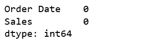

图 1

```py
furniture = furniture.groupby('Order Date')['Sales'].sum().reset_index()
```

### 使用时间序列数据进行索引

```py
furniture = furniture.set_index('Order Date')
furniture.index
```

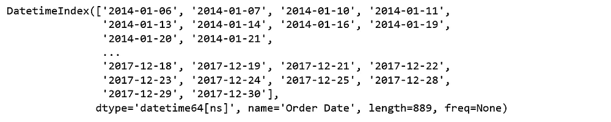

图 2

我们当前的日期时间数据可能很难处理，因此我们将使用该月的平均每日销售值，并将每月的开始作为时间戳。

```py
y = furniture['Sales'].resample('MS').mean()
```

快速浏览一下 2017 年的家具销售数据。

```py
y['2017':]
```

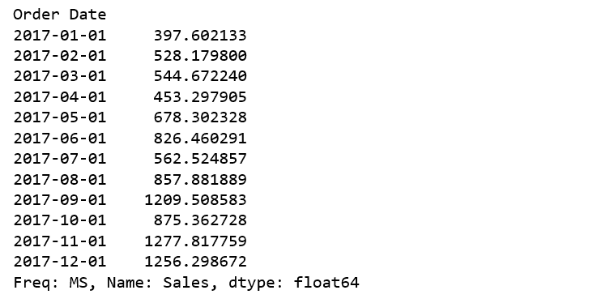

图 3

### **可视化家具销售时间序列数据**

```py
y.plot(figsize=(15, 6))
plt.show()
```

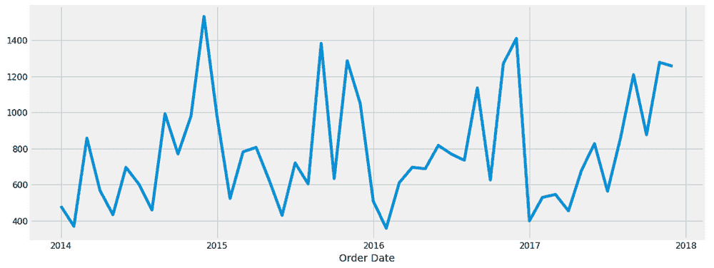

图 4

当我们绘制数据时，出现了一些明显的模式。时间序列具有季节性模式，例如销售在年初总是较低，而在年末较高。每年总是存在一个上升趋势，年中有几个月的销售较低。

我们还可以使用一种称为时间序列分解的方法来可视化我们的数据，这种方法可以将时间序列分解为三个不同的组成部分：趋势、季节性和噪声。

```py
from pylab import rcParams
rcParams['figure.figsize'] = 18, 8

decomposition = sm.tsa.seasonal_decompose(y, model='additive')
fig = decomposition.plot()
plt.show()
```

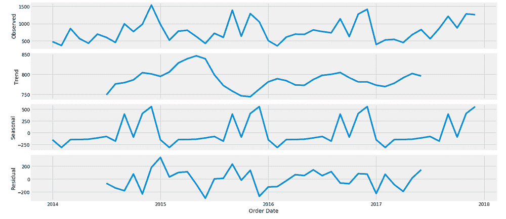

图 5

上面的图表清楚地显示了家具销售不稳定，并且有明显的季节性。

### **使用 ARIMA 进行时间序列预测**

我们将应用最常用的时间序列预测方法之一，即 ARIMA，代表自回归积分滑动平均模型。

ARIMA 模型用`ARIMA(p, d, q)`表示。这三个参数考虑了数据中的季节性、趋势和噪声：

```py
p = d = q = range(0, 2)
pdq = list(itertools.product(p, d, q))
seasonal_pdq = [(x[0], x[1], x[2], 12) for x in list(itertools.product(p, d, q))]

print('Examples of parameter combinations for Seasonal ARIMA...')
print('SARIMAX: {} x {}'.format(pdq[1], seasonal_pdq[1]))
print('SARIMAX: {} x {}'.format(pdq[1], seasonal_pdq[2]))
print('SARIMAX: {} x {}'.format(pdq[2], seasonal_pdq[3]))
print('SARIMAX: {} x {}'.format(pdq[2], seasonal_pdq[4]))
```

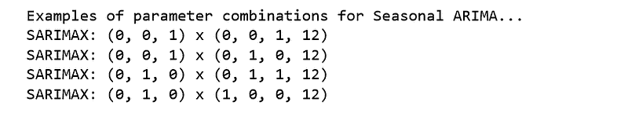

图 6

这一步是我们家具销售 ARIMA 时间序列模型的参数选择。我们的目标是使用“网格搜索”来找到最佳的参数集，从而实现模型的最佳性能。

```py
for param in pdq:
    for param_seasonal in seasonal_pdq:
        try:
            mod = sm.tsa.statespace.SARIMAX(y,
                                            order=param,
                                            seasonal_order=param_seasonal,
                                            enforce_stationarity=False,
                                            enforce_invertibility=False)

results = mod.fit()

print('ARIMA{}x{}12 - AIC:{}'.format(param, param_seasonal, results.aic))
        except:
            continue
```

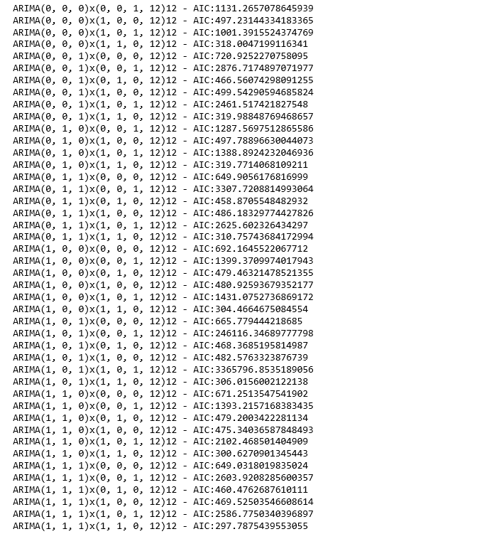

图 7

上述输出表明，`SARIMAX(1, 1, 1)x(1, 1, 0, 12)`产生了最低的`AIC`值 297.78。因此，我们应考虑这是最优选项。

### 拟合 ARIMA 模型

```py
mod = sm.tsa.statespace.SARIMAX(y,
                                order=(1, 1, 1),
                                seasonal_order=(1, 1, 0, 12),
                                enforce_stationarity=False,
                                enforce_invertibility=False)

results = mod.fit()

print(results.summary().tables[1])
```

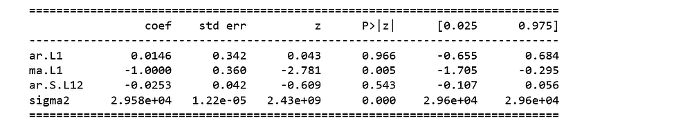

图 8

我们应该始终运行模型诊断，以调查任何异常行为。

```py
results.plot_diagnostics(figsize=(16, 8))
plt.show()
```

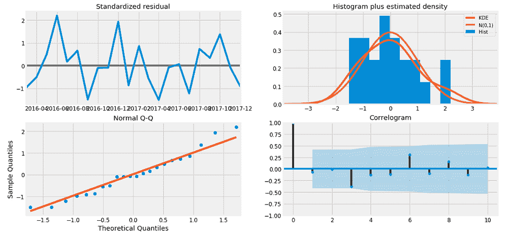

图 9

尽管如此，我们的模型诊断表明，模型残差接近正态分布。

### **验证预测**

为了帮助我们理解预测的准确性，我们将预测销售额与时间序列的实际销售额进行比较，并且我们将预测设定为从 2017 年 1 月 1 日开始到数据的结束。

```py
pred = results.get_prediction(start=pd.to_datetime('2017-01-01'), dynamic=False)
pred_ci = pred.conf_int()

ax = y['2014':].plot(label='observed')
pred.predicted_mean.plot(ax=ax, label='One-step ahead Forecast', alpha=.7, figsize=(14, 7))

ax.fill_between(pred_ci.index,
                pred_ci.iloc[:, 0],
                pred_ci.iloc[:, 1], color='k', alpha=.2)

ax.set_xlabel('Date')
ax.set_ylabel('Furniture Sales')
plt.legend()

plt.show()
```


图 10

线图显示了观察值与滚动预测值的比较。总体而言，我们的预测与真实值非常吻合，显示了从年初开始的上升趋势，并在年底捕捉到季节性变化。

```py
y_forecasted = pred.predicted_mean
y_truth = y['2017-01-01':]

mse = ((y_forecasted - y_truth) ** 2).mean()
print('The Mean Squared Error of our forecasts is {}'.format(round(mse, 2)))
```

***我们预测的均方误差为 22993.58***

```py
print('The Root Mean Squared Error of our forecasts is {}'.format(round(np.sqrt(mse), 2)))
```

***我们预测的均方根误差为 151.64***

在统计学中，[均方误差 (MSE)](https://en.wikipedia.org/wiki/Mean_squared_error)测量的是估计器的误差平方的平均值——即估计值与真实值之间的平均平方差。MSE 是估计器质量的衡量标准——它总是非负的，MSE 越小，我们找到最佳拟合线的可能性就越大。

[均方根误差 (RMSE)](https://en.wikipedia.org/wiki/Root-mean-square_deviation)告诉我们，我们的模型能够在测试集内预测日均家具销售额与实际销售额的误差为 151.64。我们的家具日销售额范围从约 400 到超过 1200。在我看来，这个模型目前表现相当不错。

### **生成和可视化预测**

```py
pred_uc = results.get_forecast(steps=100)
pred_ci = pred_uc.conf_int()

ax = y.plot(label='observed', figsize=(14, 7))
pred_uc.predicted_mean.plot(ax=ax, label='Forecast')
ax.fill_between(pred_ci.index,
                pred_ci.iloc[:, 0],
                pred_ci.iloc[:, 1], color='k', alpha=.25)
ax.set_xlabel('Date')
ax.set_ylabel('Furniture Sales')

plt.legend()
plt.show()
```

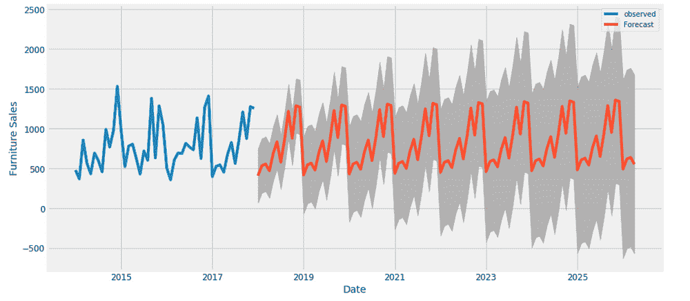

图 11

我们的模型明显捕捉到了家具销售的季节性。随着我们预测的时间越长，对预测值的信心自然会下降。这在模型生成的置信区间中体现出来，置信区间随着预测时间的延长而变大。

上述关于家具的时间序列分析让我对其他类别感到好奇，并想了解它们之间的比较。因此，我们将比较家具与办公供应商的时间序列。

### **家具与办公用品的时间序列**

根据我们的数据，多年来办公用品的销售数量远远超过了家具。

```py
furniture = df.loc[df['Category'] == 'Furniture']
office = df.loc[df['Category'] == 'Office Supplies']
furniture.shape, office.shape
```

***((2121, 21), (6026, 21))***

### 数据探索

我们将比较两个类别在同一时间段的销售。这意味着将两个数据框合并为一个，并将这两个类别的时间序列绘制到一个图中。

```py
cols = ['Row ID', 'Order ID', 'Ship Date', 'Ship Mode', 'Customer ID', 'Customer Name', 'Segment', 'Country', 'City', 'State', 'Postal Code', 'Region', 'Product ID', 'Category', 'Sub-Category', 'Product Name', 'Quantity', 'Discount', 'Profit']
furniture.drop(cols, axis=1, inplace=True)
office.drop(cols, axis=1, inplace=True)

furniture = furniture.sort_values('Order Date')
office = office.sort_values('Order Date')

furniture = furniture.groupby('Order Date')['Sales'].sum().reset_index()
office = office.groupby('Order Date')['Sales'].sum().reset_index()

furniture = furniture.set_index('Order Date')
office = office.set_index('Order Date')

y_furniture = furniture['Sales'].resample('MS').mean()
y_office = office['Sales'].resample('MS').mean()

furniture = pd.DataFrame({'Order Date':y_furniture.index, 'Sales':y_furniture.values})
office = pd.DataFrame({'Order Date': y_office.index, 'Sales': y_office.values})

store = furniture.merge(office, how='inner', on='Order Date')
store.rename(columns={'Sales_x': 'furniture_sales', 'Sales_y': 'office_sales'}, inplace=True)
store.head()
```

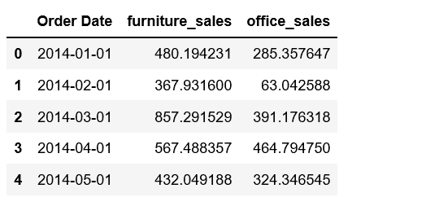

图 12

```py
plt.figure(figsize=(20, 8))
plt.plot(store['Order Date'], store['furniture_sales'], 'b-', label = 'furniture')
plt.plot(store['Order Date'], store['office_sales'], 'r-', label = 'office supplies')
plt.xlabel('Date'); plt.ylabel('Sales'); plt.title('Sales of Furniture and Office Supplies')
plt.legend();
```

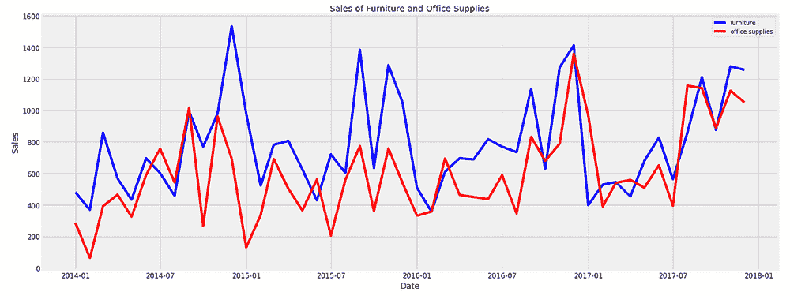

图 13

我们观察到家具和办公用品的销售都呈现出相似的季节性模式。年初是这两个类别的淡季。夏季似乎也是办公用品的淡季。此外，大多数月份家具的日均销售量高于办公用品。可以理解，因为家具的价值应该远高于办公用品。偶尔，办公用品的日均销售量会超过家具。让我们找出第一次办公用品销售超过家具的时间。

```py
first_date = store.ix[np.min(list(np.where(store['office_sales'] > store['furniture_sales'])[0])), 'Order Date']

print("Office supplies first time produced higher sales than furniture is {}.".format(first_date.date()))
```

***办公室用品首次在 2014 年 7 月 1 日销售超过家具***。

是 2014 年 7 月！

### **使用 Prophet 的时间序列建模**

Facebook 于 2017 年发布的预测工具 [Prophet](https://research.fb.com/prophet-forecasting-at-scale/) 旨在分析在不同时间尺度上显示模式的时间序列，例如年度、每周和每日。它还具有建模假期对时间序列的影响和实现自定义变更点的高级功能。因此，我们正在使用 Prophet 来建立和运行模型。

```py
from fbprophet import Prophet

furniture = furniture.rename(columns={'Order Date': 'ds', 'Sales': 'y'})
furniture_model = Prophet(interval_width=0.95)
furniture_model.fit(furniture)

office = office.rename(columns={'Order Date': 'ds', 'Sales': 'y'})
office_model = Prophet(interval_width=0.95)
office_model.fit(office)

furniture_forecast = furniture_model.make_future_dataframe(periods=36, freq='MS')
furniture_forecast = furniture_model.predict(furniture_forecast)

office_forecast = office_model.make_future_dataframe(periods=36, freq='MS')
office_forecast = office_model.predict(office_forecast)

plt.figure(figsize=(18, 6))
furniture_model.plot(furniture_forecast, xlabel = 'Date', ylabel = 'Sales')
plt.title('Furniture Sales');
```

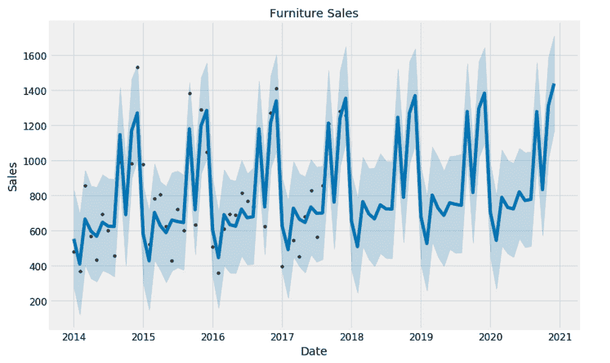

图 14

```py
plt.figure(figsize=(18, 6))
office_model.plot(office_forecast, xlabel = 'Date', ylabel = 'Sales')
plt.title('Office Supplies Sales');
```

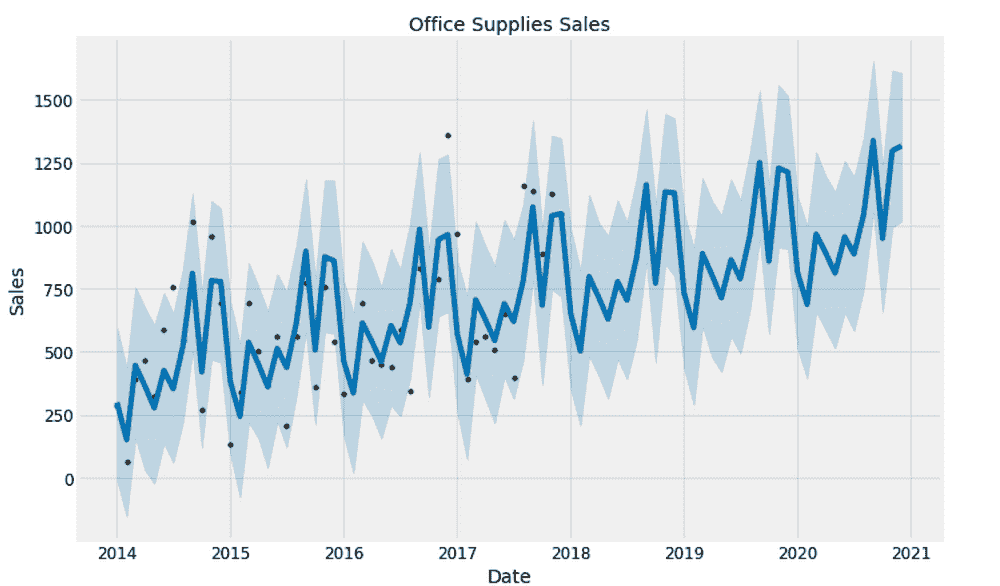

图 15

### **比较预测**

我们已经有了这两个类别未来三年的预测。现在我们将它们结合起来，以比较它们未来的预测。

```py
furniture_names = ['furniture_%s' % column for column in furniture_forecast.columns]
office_names = ['office_%s' % column for column in office_forecast.columns]

merge_furniture_forecast = furniture_forecast.copy()
merge_office_forecast = office_forecast.copy()

merge_furniture_forecast.columns = furniture_names
merge_office_forecast.columns = office_names

forecast = pd.merge(merge_furniture_forecast, merge_office_forecast, how = 'inner', left_on = 'furniture_ds', right_on = 'office_ds')

forecast = forecast.rename(columns={'furniture_ds': 'Date'}).drop('office_ds', axis=1)
forecast.head()
```

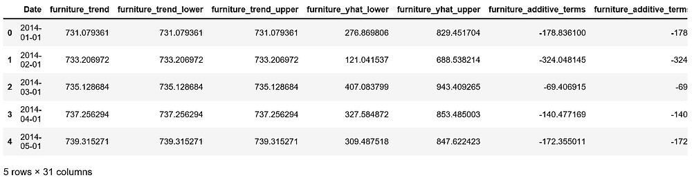

图 16

### 趋势和预测可视化

```py
plt.figure(figsize=(10, 7))
plt.plot(forecast['Date'], forecast['furniture_trend'], 'b-')
plt.plot(forecast['Date'], forecast['office_trend'], 'r-')
plt.legend(); plt.xlabel('Date'); plt.ylabel('Sales')
plt.title('Furniture vs. Office Supplies Sales Trend');
```

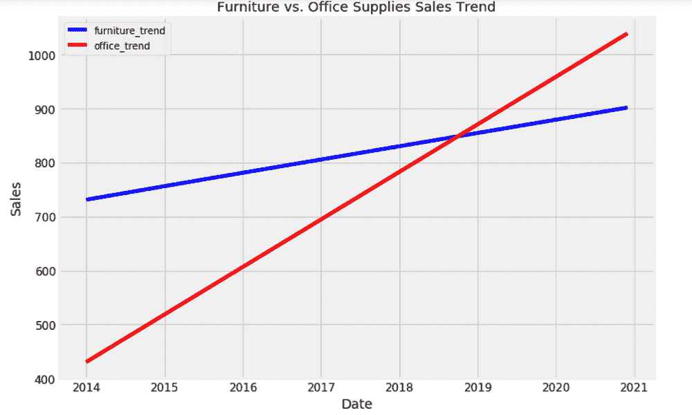

图 17

```py
plt.figure(figsize=(10, 7))
plt.plot(forecast['Date'], forecast['furniture_yhat'], 'b-')
plt.plot(forecast['Date'], forecast['office_yhat'], 'r-')
plt.legend(); plt.xlabel('Date'); plt.ylabel('Sales')
plt.title('Furniture vs. Office Supplies Estimate');
```

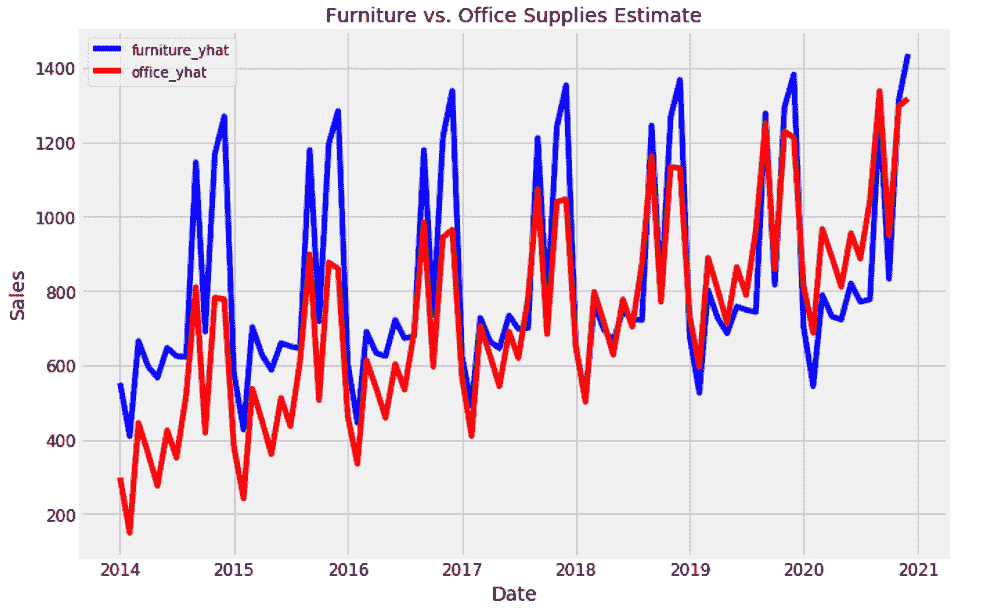

图 18

### **趋势和模式**

现在，我们可以使用 Prophet 模型检查这两个类别在数据中的不同趋势。

```py
furniture_model.plot_components(furniture_forecast);
```

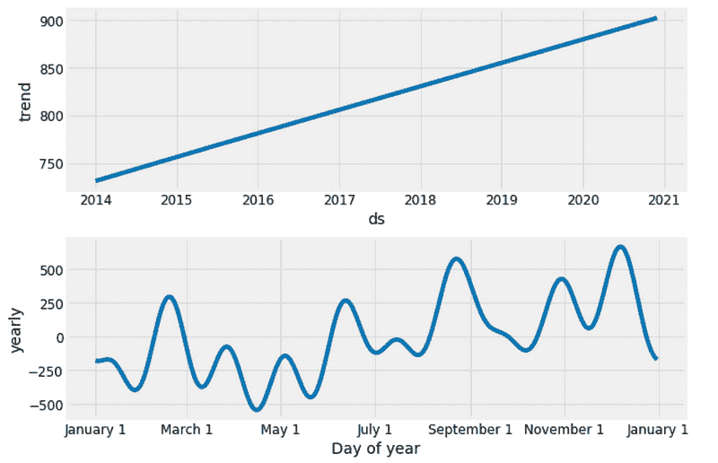

图 19

```py
office_model.plot_components(office_forecast);
```

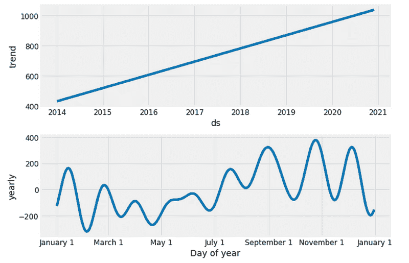

图 20

很高兴看到家具和办公用品的销售量随着时间的推移线性增长，并将继续增长，尽管办公用品的增长似乎略微强劲。

家具的最差月份是 4 月，办公用品的最差月份是 2 月。家具的最佳月份是 12 月，而办公用品的最佳月份是 10 月。

我们可以从现在开始探索许多时间序列分析，比如带有不确定性范围的预测、变更点和异常检测、以及使用外部数据源的时间序列预测。我们才刚刚开始。

源代码可以在 [Github](https://github.com/susanli2016/Machine-Learning-with-Python/blob/master/Time%20Series%20Forecastings.ipynb) 找到。我期待您的反馈或问题。

**个人简介：[Susan Li](https://www.linkedin.com/in/susanli/)** 正在改变世界，一篇文章一个时间。她是位于加拿大多伦多的高级数据科学家。

[原文](https://towardsdatascience.com/an-end-to-end-project-on-time-series-analysis-and-forecasting-with-python-4835e6bf050b)。经许可转载。

**相关：**

+   使用 Scikit-Learn 进行多类文本分类

+   使用 fast.ai 进行快速特征工程

+   时间序列入门——三步流程

* * *

## 我们的前三大课程推荐

 1\. [谷歌网络安全证书](https://www.kdnuggets.com/google-cybersecurity) - 快速进入网络安全职业生涯。

 2\. [谷歌数据分析专业证书](https://www.kdnuggets.com/google-data-analytics) - 提升你的数据分析技能

 3\. [谷歌 IT 支持专业证书](https://www.kdnuggets.com/google-itsupport) - 支持组织的 IT 需求

* * *

### 更多相关话题

+   [使用 Ploomber、Arima、Python 和 Slurm 进行时间序列预测](https://www.kdnuggets.com/2022/03/time-series-forecasting-ploomber-arima-python-slurm.html)

+   [使用 statsmodels 和 Prophet 进行时间序列预测](https://www.kdnuggets.com/2023/03/time-series-forecasting-statsmodels-prophet.html)

+   [利用 XGBoost 进行时间序列预测](https://www.kdnuggets.com/2023/08/leveraging-xgboost-timeseries-forecasting.html)

+   [使用 HuggingFace 实现的简单端到端项目](https://www.kdnuggets.com/a-simple-to-implement-end-to-end-project-with-huggingface)

+   [初学者的端到端机器学习指南](https://www.kdnuggets.com/2021/12/beginner-guide-end-end-machine-learning.html)

+   [完整的机器学习算法端到端部署…](https://www.kdnuggets.com/2021/12/deployment-machine-learning-algorithm-live-production-environment.html)
