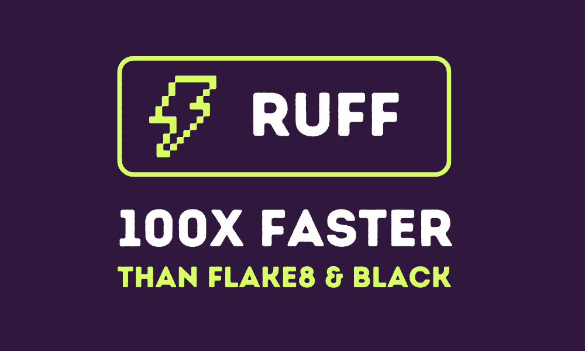
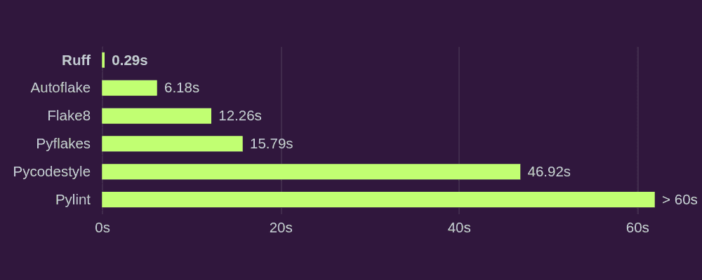
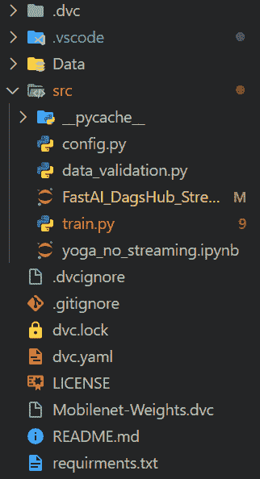
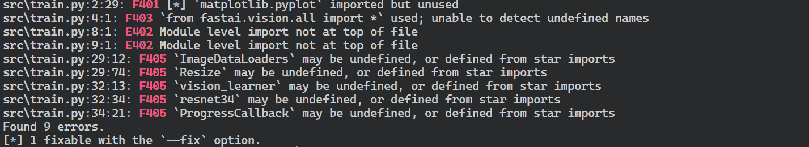
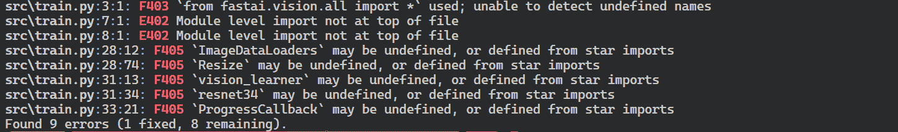
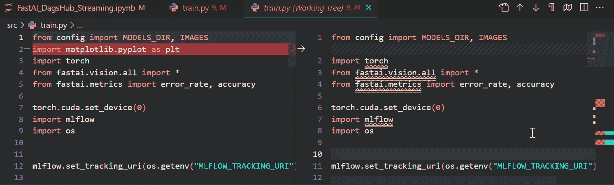
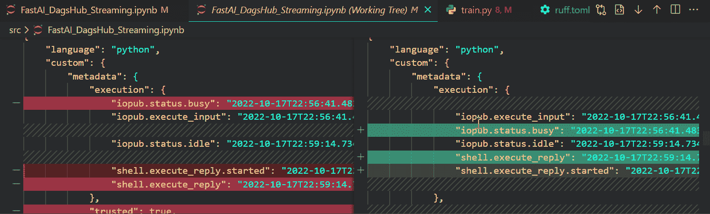
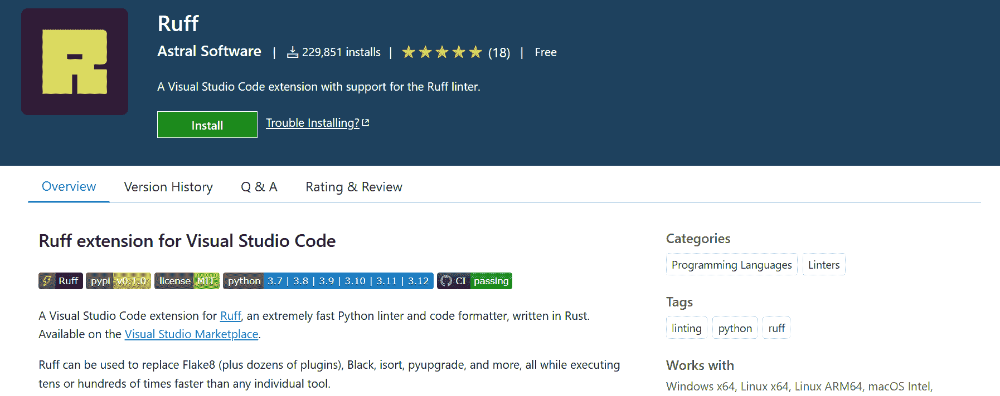

# 使用 Ruff 提升您的 Python 编码风格

> 原文：[`www.kdnuggets.com/enhance-your-python-coding-style-with-ruff`](https://www.kdnuggets.com/enhance-your-python-coding-style-with-ruff)



编辑器提供的图片

# 什么是 Ruff

* * *

## 我们的三大课程推荐

 1\. [谷歌网络安全证书](https://www.kdnuggets.com/google-cybersecurity) - 快速进入网络安全职业道路。

 2\. [谷歌数据分析专业证书](https://www.kdnuggets.com/google-data-analytics) - 提升您的数据分析技能

 3\. [谷歌 IT 支持专业证书](https://www.kdnuggets.com/google-itsupport) - 支持您组织的 IT

* * *

[Ruff](https://github.com/astral-sh/ruff)是一个极其快速的 Python linter 和格式化工具，使用 Rust 编写，旨在取代和改进现有工具如 Flake8、Black 和 isort。它提供 10-100 倍的更快性能，同时通过 700 多个内置规则和流行插件的重新实现保持一致性。



来自 Ruff 的统计数据 | 从头开始 Linting CPython 代码库

Ruff 支持现代 Python，兼容 3.12，并支持`pyproject.toml`。它还提供自动修复支持、缓存和编辑器集成。Ruff 对 monorepo 友好，广泛用于 Pandas、FastAPI 等主要开源项目中。通过结合速度、功能和可用性，Ruff 将 Linting、格式化和自动修复集成到一个工具中，比现有选项快几个数量级。

# 开始使用 Ruff

我们可以通过使用 PIP 轻松安装`ruff`。

```py
pip install ruff
```

为了测试运行 Ruff 的简便性和速度，我们可以使用 DagHub 仓库[kingabzpro/Yoga-Pose-Classification](https://dagshub.com/kingabzpro/Yoga-Pose-Classification)。您可以克隆它或使用您自己的项目进行格式化。



项目结构

首先，我们将对项目运行 linter。你也可以通过将“.”替换为文件位置来对单个文件运行 linter。

```py
ruff check .
```



Ruff 已识别出 9 个错误和 1 个可修复错误。要修复错误，我们将使用--fix 标志。

```py
ruff check --fix .
```

如您所见，它已经修复了 1 个可修复的错误。



要格式化项目，我们将使用`ruff format`命令。

```py
$ ruff format .
>>> 3 files reformatted
```

Ruff linter 和 formatter 对代码进行了大量更改。但我们为什么需要这些工具呢？答案很简单——它们有助于执行编码标准和规范。因此，您和您的团队可以专注于代码中的重要方面。此外，它们有助于提高我们代码的质量、可维护性和安全性。



Gif 由作者提供

# Jupyter 笔记本的代码检查和格式化

要在项目中使用 Ruff 进行 Jupyter 笔记本的检查，您需要创建 `ruff.toml` 文件，并添加以下代码：

```py
extend-include = ["*.ipynb"]
```

您也可以对 `pyproject.toml` 文件做同样的操作。

然后重新运行这些命令，以查看它对 Jupyter 笔记本文件进行的更改。

2 个文件被重新格式化，我们有 2 个 Notebook 文件。

```py
$ ruff format .
>>> 2 files reformatted, 3 files left unchanged
```

我们还通过重新运行 `check` 命令修复了这些文件中的问题。

```py
$ ruff check --fix .
>>> Found 51 errors (6 fixed, 45 remaining).
```

最终结果非常惊人。它在没有破坏代码的情况下完成了所有必要的更改。



Gif 由作者提供

# Ruff 配置

通过编辑 `ruff.toml` 文件来调整 linter 和 formatter 设置，可以轻松配置 Ruff 以用于 Jupyter 笔记本。有关更多详细信息，请查看 [配置 Ruff 文档](https://docs.astral.sh/ruff/configuration/)。

```py
target-version = "py311"
extend-include = ["*.ipynb"]
line-length = 80

[lint]
extend-select = [
  "UP",  # pyupgrade
  "D",   # pydocstyle
]

[lint.pydocstyle]
convention = "google"
```

# GitHub Action 和预提交钩子

开发人员和团队可以通过 `ruff-pre-commit` 将 Ruff 作为预提交钩子使用：

```py
- repo: https://github.com/astral-sh/ruff-pre-commit
  # Ruff version.
  rev: v0.1.5
  hooks:
    # Run the linter.
    - id: ruff
      args: [ --fix ]
    # Run the formatter.
    - id: ruff-format
```

它也可以作为 GitHub Action 通过 `ruff-action` 使用：

```py
name: Ruff
on: [ push, pull_request ]
jobs:
  ruff:
    runs-on: ubuntu-latest
    steps:
      - uses: actions/checkout@v3
      - uses: chartboost/ruff-action@v1
```

# Ruff VSCode 扩展

Ruff 最令人愉悦的方面是它的 VSCode 扩展。它简化了格式化和代码检查，免去了对第三方扩展的需求。只需在扩展市场中搜索 [Ruff](https://marketplace.visualstudio.com/items?itemName=charliermarsh.ruff) 即可安装。



图片来自 [Ruff - Visual Studio Marketplace](https://marketplace.visualstudio.com/items?itemName=charliermarsh.ruff)

我已配置 `setting.json` 以便在保存时进行格式化。

# 结论

Ruff 提供了快速的 linting 和格式化，能够生成更干净、更一致的 Python 代码。凭借 700 多条内置规则在 Rust 中重新实现以提高性能，Ruff 从 Flake8、isort 和 pyupgrade 等流行工具中汲取灵感，以执行全面的编码最佳实践。经过精心策划的规则集专注于捕捉错误和关键的风格问题，而不进行过多的挑剔。

与预提交钩子、GitHub Actions 和 VSCode 等编辑器的无缝集成，使 Ruff 融入现代 Python 工作流程变得轻而易举。无与伦比的速度和精心设计的规则集使 Ruff 成为那些重视快速反馈、清洁代码和顺畅团队协作的 Python 开发人员的必备工具。Ruff 通过将强大的功能与闪电般的性能相结合，为 Python 的 linting 和格式化设定了新的标准。

[](https://www.polywork.com/kingabzpro)****[Abid Ali Awan](https://www.polywork.com/kingabzpro)**** ([@1abidaliawan](https://www.linkedin.com/in/1abidaliawan)) 是一位认证的数据科学专业人士，热衷于构建机器学习模型。目前，他专注于内容创作，并撰写关于机器学习和数据科学技术的技术博客。Abid 拥有技术管理硕士学位和电信工程学士学位。他的愿景是利用图神经网络为面临心理疾病困扰的学生打造一款 AI 产品。

### 更多相关内容

+   [提升工作生产力的 6 个 ChatGPT 提示](https://www.kdnuggets.com/6-chatgpt-prompts-to-enhance-your-productivity-at-work)

+   [GPT-工程师：你的新 AI 编程助手](https://www.kdnuggets.com/2023/07/gpt-engineer-ai-coding-assistant.html)

+   [数据科学中你必须了解的 15 个 Python 编程面试问题](https://www.kdnuggets.com/2022/04/15-python-coding-interview-questions-must-know-data-science.html)

+   [免费 Python 项目编码课程](https://www.kdnuggets.com/2022/08/free-python-project-coding-course.html)

+   [数据科学中的 3 个难题 Python 编程面试问题](https://www.kdnuggets.com/2023/03/3-hard-python-coding-interview-questions-data-science.html)

+   [7 个必须了解的 Python 编程面试技巧](https://www.kdnuggets.com/2023/03/7-mustknow-python-tips-coding-interviews.html)
