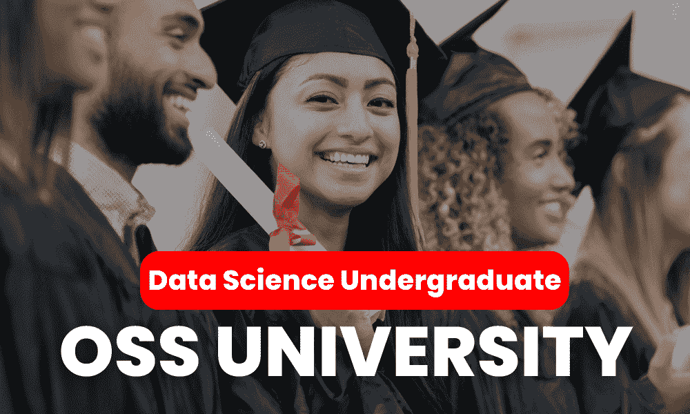
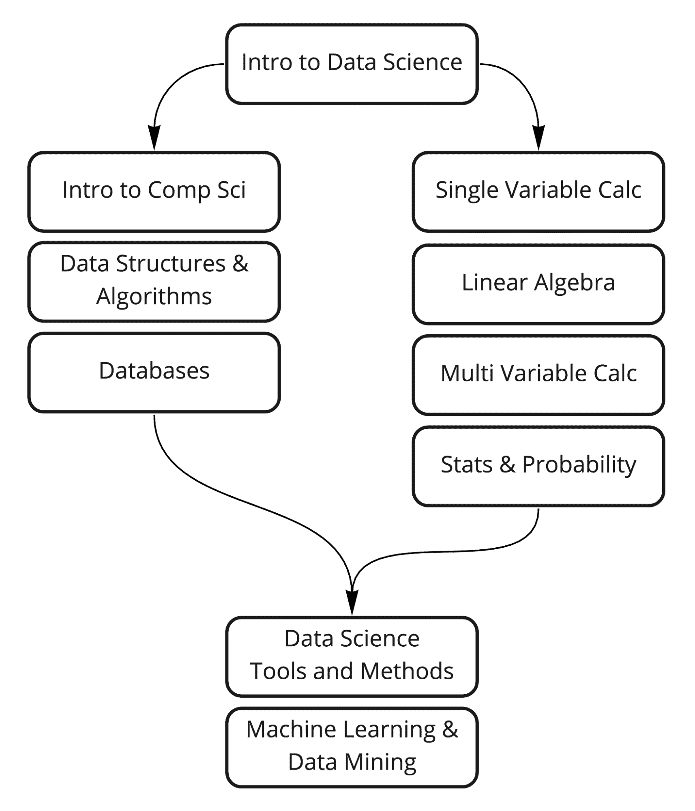

# 免费报名数据科学本科项目

> 原文：[`www.kdnuggets.com/enroll-in-a-data-science-undergraduate-program-for-free`](https://www.kdnuggets.com/enroll-in-a-data-science-undergraduate-program-for-free)

作者提供的图片

我很高兴与大家分享另一个类似于我们之前讨论的计算机科学学位项目的学位项目。该项目由开源社会大学提供，并且完全免费。

* * *

## 我们的三大课程推荐

 1\. [Google 网络安全证书](https://www.kdnuggets.com/google-cybersecurity) - 快速进入网络安全职业生涯。

 2\. [Google 数据分析专业证书](https://www.kdnuggets.com/google-data-analytics) - 提升你的数据分析技能

 3\. [Google IT 支持专业证书](https://www.kdnuggets.com/google-itsupport) - 支持你的组织的 IT

* * *

[ossu/data-science](https://github.com/ossu/data-science) 课程旨在为那些自我激励并希望以自己的节奏探索数据科学世界的学习者提供服务。该项目提供了一个综合的本科数据科学课程，使用来自世界顶级大学的课程。最重要的是，报名该项目的学习者无需承担经济负担。

# 课程设置

该项目课程包括你掌握数据科学并为职业生涯做好准备所需的所有必修和选修课程。数据科学项目重点关注理论、数学、算法、统计学和数据科学工具。以下是我们将在该项目中涵盖的完整主题列表：

1.  **数据科学入门：** 理解数据科学的基础知识和范围。

1.  **计算机科学入门：** 对初学者至关重要；精通任何编程语言的人可以跳过此部分。

1.  **编程课程：**

    1.  Python 为每个人

    1.  使用 Python 进行计算机科学与编程入门

    1.  计算思维与数据科学入门

1.  **数据结构与算法：** 使用 Java 讲授（Java 编程，算法，第一部分和第二部分）。

1.  **数据库：** 从数据库管理基础到面向开发者的 MongoDB。

1.  **数学：** 包括单变量微积分、线性代数和多变量微积分。

1.  **统计学与概率：** 课程涵盖从描述性统计到推断统计。

1.  **数据科学工具与方法：** 数据科学工具，数据科学方法论，数据清理。

1.  **机器学习/数据挖掘：** 课程涵盖从入门到专业主题如流程挖掘。

> **⚠️免责声明**
> 
> 本项目在完成后不会授予官方学位。它是一个自学课程，基于免费的资源，包括视频、代码示例和测验。参与者无需正式注册；所有材料和指南都可以通过指定的 GitHub 仓库 https://github.com/ossu/data-science 访问。该项目的结构旨在提供类似于数据科学学位的广泛学习体验；然而，它是非官方的，不授予学术认证或教育机构的认可。

# 如何开始

## 1\. 持续时间和规划

如果每周分配约 20 小时用于学习，你可以在 2 年内完成该项目。为了帮助你计划，可以使用这个 [电子表格](https://docs.google.com/spreadsheets/d/1TEGSUQDFuWL3TYNjiM8G3esly-tKOcgHSDABt92mzdA/copy) 来估算你的结束日期。只需在时间轴表中输入你的开始日期和每周学习时间即可。你可以通过更新课程数据表来跟踪你的进度，记录每门课程的完成日期。

## 2\. 课程顺序

你需要了解某些课程可以同时进行，而其他课程则需要依次完成。你可以查看提供的图表来理解主题和课程的顺序。

图片来源于 [ossu/data-science](https://github.com/ossu/data-science)

## 3\. 追踪进度

创建一个 Trello 账户并将提供的 [看板](https://trello.com/b/JpvLwQfr/ossu-data-science) 复制到你的账户中。你可以在 [这里](https://support.atlassian.com/trello/docs/copying-cards-lists-or-boards/) 找到如何操作的说明。之后，随着你课程的进展，将卡片移动到“进行中”或“完成”列。

## 4\. 编程语言选择

Python、R 和 SQL 是数据科学社区中主要的编程语言。课程涵盖了这三种语言，但重要的是要关注理解核心概念，而不仅仅是语言本身。这些基础概念需要彻底理解，以便可以使用任何编程工具进行应用。

## 5\. 先决条件

这门课程的先决条件是具备高中水平的基础数学和统计学知识。

# 结论

报名参加免费的数据科学本科课程是一个很好的起点，但重要的是要记住，这只是开始。成为受人追捧的“超级数据科学家”不仅仅依赖于课程学习。它需要你在专业领域扩展知识，积极参与项目，并通过实习获得实践经验。你必须愿意一步步构建你的职业生涯，每掌握一项新技能和经验都为你的基础打下坚实的基础。

遵循这个结构化和集中的课程，你正踏上掌握数据科学的道路。记住，成为一名熟练的数据科学家之旅与目标同样重要。接受并享受你的学习过程，每一步都让你更接近实现你的职业目标，在这个激动人心且不断发展的领域中。

****[Abid Ali Awan](https://www.polywork.com/kingabzpro)**** ([@1abidaliawan](https://www.linkedin.com/in/1abidaliawan)) 是一名认证的数据科学专业人士，热衷于构建机器学习模型。目前，他专注于内容创作和撰写关于机器学习和数据科学技术的技术博客。Abid 拥有技术管理硕士学位和电信工程学士学位。他的愿景是使用图神经网络构建一种 AI 产品，帮助那些在精神健康方面有困难的学生。

### 更多相关主题

+   [报名参加免费的 4 年计算机科学学位课程](https://www.kdnuggets.com/enroll-in-a-4-year-computer-science-degree-program-for-free)

+   [不要错过！在 2023 年结束前报名免费课程](https://www.kdnuggets.com/dont-miss-out-enroll-in-free-courses-before-2023-ends)

+   [2022 年最值得报名的 8 个数据科学课程，助力职业迅猛发展](https://www.kdnuggets.com/2022/02/scaler-8-best-data-science-courses-enroll-2022-steep-career-advancement.html)

+   [利用第三最佳在线数据硕士课程最大化你的价值](https://www.kdnuggets.com/2023/05/bay-path-maximize-value-online-masters-data-science.html)

+   [通过第三最佳在线数据硕士课程推进你的职业生涯](https://www.kdnuggets.com/2023/07/bay-path-advance-career-3rd-best-online-masters-data-science-program.html)

+   [通过第三最佳在线课程攻读数据科学硕士学位](https://www.kdnuggets.com/2023/09/bay-path-pursue-masters-data-science-3rd-best-online-program)
