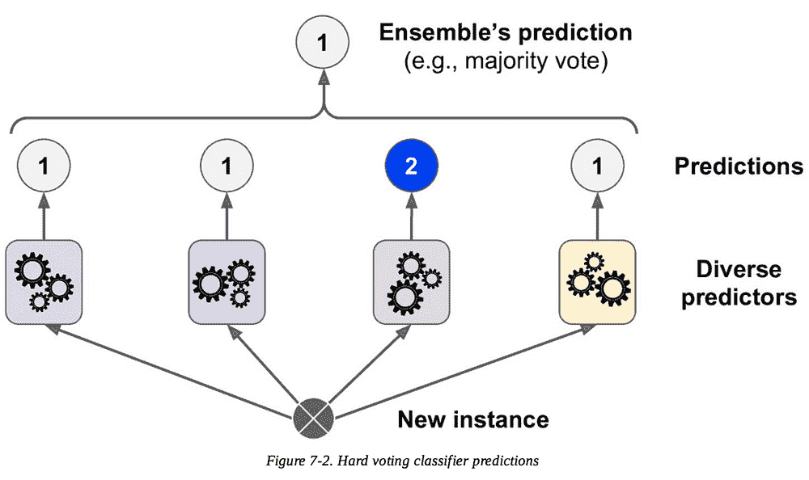
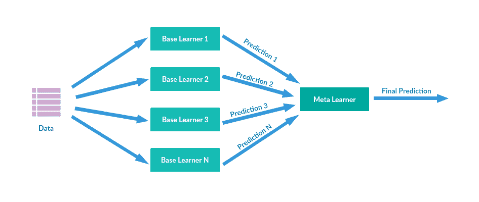
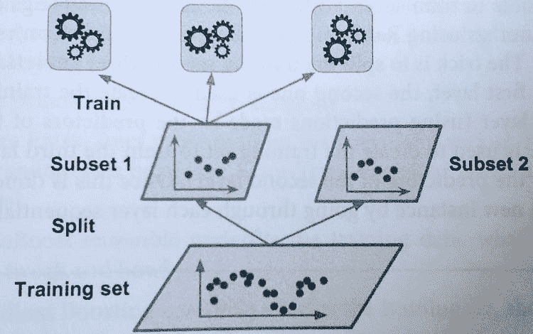
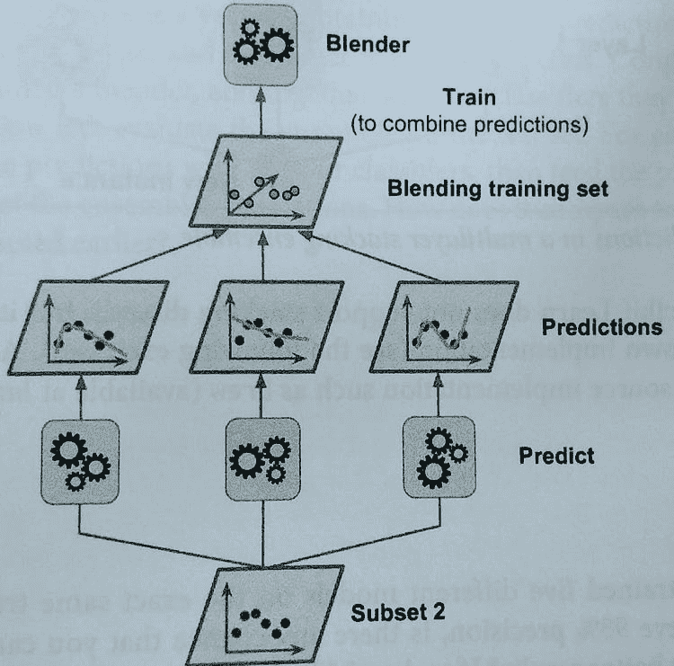
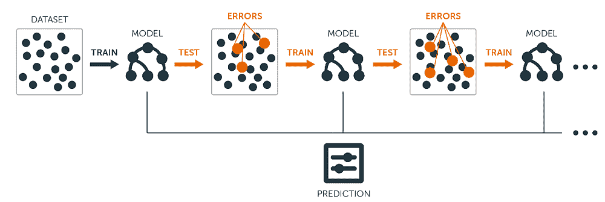

# 集成学习：5 种主要方法

> 原文：[`www.kdnuggets.com/2019/01/ensemble-learning-5-main-approaches.html`](https://www.kdnuggets.com/2019/01/ensemble-learning-5-main-approaches.html)

 评论

**由 [Diogo Menezes Borges](https://www.linkedin.com/in/diogomenezesborges/?locale=en_US)，数据科学家**。

*还记得几个月前每个人对裙子的颜色（蓝色还是金色）或运动鞋的颜色（粉色还是灰色）进行狂猜吗？对我来说，集成学习有点像这样。一组弱学习者汇聚成一个强学习者，从而提高了任何机器学习模型的准确性。*

* * *

## 我们的前三个课程推荐

 1\. [Google 网络安全证书](https://www.kdnuggets.com/google-cybersecurity) - 快速进入网络安全职业的快车道。

 2\. [Google 数据分析专业证书](https://www.kdnuggets.com/google-data-analytics) - 提升你的数据分析技能

 3\. [Google IT 支持专业证书](https://www.kdnuggets.com/google-itsupport) - 支持你的组织的 IT

* * *

你听说过*群体智慧*吗？不是那个电视剧，而是真实的术语。没有？好吧……那么，想象一下你向成千上万的随机人提出一个复杂的问题。现在，将他们的答案汇总起来。

你可能会发现多数人给出的答案比专家的答案更好。

> *“**群体智慧**是一个群体的集体意见，而不是单个专家的意见”*—[维基百科](https://en.wikipedia.org/wiki/Wisdom_of_the_crowd)

回到机器学习领域，我们可以应用相同的想法。例如，如果我们汇总一组预测者（例如分类器和回归器）的预测，我们可能会得到比最好的单个预测者更好的预测结果。

> *一组预测者称为集成。因此，这种机器学习技术被称为集成学习。瞧！*

在我上一篇文章[《决策树的新鲜空气》](https://medium.com/diogo-menezes-borges/a-breath-of-fresh-air-with-decision-trees-e660455bbfc8)中，我讨论了决策树算法以及我们如何使用它进行预测。正如你所知，在自然界中，一组树木组成了一个森林。嗯……这意味着……

想象一下，我训练了一组决策树分类器，根据训练数据集的不同子集进行个体预测。然后，我预测一个观察值的预期类别，考虑到多数人对同一实例的预测。因此，这意味着，我基本上是在使用一组决策树的知识，或者更常被称为**随机森林**。

在本文中，我们将讨论包括*bagging、boosting、stacking*及其他一些最流行的集成方法。在详细介绍之前，请记住以下几点：

> *“集成方法在预测器尽可能独立时效果最佳。获得多样化分类器的一种方法是使用非常不同的算法进行训练。这增加了它们产生不同类型错误的机会，从而提高集成的准确性。”**—**“**动手学深度学习与 Scikit-Learn & TensorFlow，第七章*

#### 简单集成技术

+   **硬投票分类器**

这是该技术最简单的例子，我们已经友好地介绍过。投票分类器通常用于分类问题。想象一下你训练并拟合了几个分类器（逻辑回归分类器、SVM 分类器、随机森林分类器等）到你的训练数据集中。

创建更好分类器的一种简单方法是汇总每个分类器的预测，并将多数选择作为最终预测。基本上，我们可以将其视为获取所有预测器的众数。

**《动手学深度学习与 Scikit-Learn & TensorFlow》第七章**

+   **平均法**

我们看到的第一个例子主要用于分类问题。现在让我们来看看一种用于回归问题的技术，称为平均法。类似于硬投票，我们取多个算法做出的预测并计算其平均值以得出最终预测。

+   **加权平均**

这种技术与平均法相同，只是所有模型根据其对最终预测的重要性分配不同的权重。

#### 高级集成技术

+   **堆叠**

也称为堆叠泛化，这种技术基于训练一个模型，该模型将执行我们之前看到的常规聚合操作。

我们有 N 个预测器，每个预测器做出预测并返回最终值。之后，Meta Learner 或 Blender 将这些预测作为输入并做出最终预测。

让我们看看它是如何工作的……

训练 Meta Learner 的常用方法是保留集。首先，将训练集拆分为两个子集。第一个子集的数据用于训练预测器。

之后，将在第一个子集上训练的相同预测器用于对第二个（保留的）集合进行预测。通过这样做，确保了预测的清洁性，因为这些算法从未见过数据。

利用这些新预测，我们可以生成一个新的训练集，这个训练集将用作输入特征（使新的训练集变为三维）并保留目标值。

因此，最后，元学习器在这个新数据集上进行训练，并考虑第一个预测提供的值来预测目标值。

此外，你可以使用这种方法训练多个元学习器（例如，一个使用线性回归，另一个使用随机森林回归，等等）。要使用多个元学习器，你必须将训练集拆分成三个或更多的子集：第一个用于训练第一层预测器，第二个用于对未知数据进行预测并创建新数据集，第三个用于训练元学习器并对目标值进行预测。

+   **袋装和粘贴**

另一种方法是对每个预测器使用相同的算法（例如，所有的决策树），然而，使用不同的训练集随机子集以获得更一般化的结果。

**文章“[使用可适应随机森林的降尺度降水](https://www.researchgate.net/publication/309031320_Spatial_downscaling_of_precipitation_using_adaptable_random_forests?_sg=0FdXhCBDcpE3PGA1c_SnLcE36GH-G47WJbTr70zdEg1yUkijY1C0U1FyRmBlsfxbxdCOXKDiYDi-QiAXqOwjYua8wVUOz-M45Q)”**

关于子集的创建，你可以选择进行[*替换*](https://web.ma.utexas.edu/users/parker/sampling/repl.htm)或不进行替换。如果我们假设有替换，一些观察可能会出现在多个子集中，这就是我们称这种方法为*袋装*（即[*自助聚合*](https://en.wikipedia.org/wiki/Bootstrap_aggregating)）。当抽样没有替换时，我们确保每个子集中的所有观察都是唯一的，从而保证每个子集中没有重复的观察。

一旦所有预测器都训练完成，集成模型可以通过聚合所有训练过的预测器的预测值来对新实例进行预测，就像我们在硬投票分类器中看到的那样。尽管每个单独的预测器比在原始数据集上训练时具有更高的偏差，但聚合可以减少偏差和方差（查看我的[文章](https://medium.com/diogo-menezes-borges/whats-the-trade-off-between-bias-and-variance-c05b241b15d9)关于偏差-方差权衡）。

使用粘贴（pasting），这些模型给出相同结果的可能性很高，因为它们获取了相同的输入。自助抽样（bootstrapping）在每个子集中引入了更多的多样性，因此你可以预期袋装（bagging）具有更高的偏差，这意味着预测器之间的相关性较低，从而减少了集成的方差。总体而言，袋装模型通常提供更好的结果，这解释了为什么你通常会听到更多关于袋装而不是粘贴的内容。

+   **提升**

如果一个数据点被第一个模型以及接下来的模型（可能是所有模型）错误预测，那么它们结果的组合是否能提供更好的预测？这就是*提升*发挥作用的地方。

也被称为*假设提升*，指的是任何可以将弱学习者组合成更强学习者的集成方法。这是一个顺序过程，每个后续模型试图修正其前任模型的错误。

**[来源](https://blog.bigml.com/2017/03/14/introduction-to-boosted-trees/)**

每个模型在整个数据集上的表现可能不佳。然而，它们在数据集的部分区域有很好的表现。因此，从提升中我们可以预期每个模型实际上都会有助于提升整体集成的性能。

#### 基于袋装和提升的算法

最常用的集成学习技术是袋装和提升。以下是这些技术中一些最常见的算法。我会在不久的将来写单独的文章介绍这些算法。

**袋装算法：**

+   [随机森林](https://medium.com/diogo-menezes-borges/random-forests-8ae226855565)

**提升算法：**

+   [AdaBoost](https://medium.com/diogo-menezes-borges/boosting-with-adaboost-and-gradient-boosting-9cbab2a1af81)

+   [梯度提升机 (GBM)](https://medium.com/diogo-menezes-borges/boosting-with-adaboost-and-gradient-boosting-9cbab2a1af81)

+   [XGBoost](https://medium.com/diogo-menezes-borges/boosting-with-adaboost-and-gradient-boosting-9cbab2a1af81)

+   [Light GBM](https://medium.com/diogo-menezes-borges/boosting-with-adaboost-and-gradient-boosting-9cbab2a1af81)

**简介**：[Diogo Menezes Borges](https://www.linkedin.com/in/diogomenezesborges/?locale=en_US) 是一名数据科学家，拥有工程背景和 2 年的经验，使用预测建模、数据处理和数据挖掘算法解决复杂的商业问题。

[原文](https://medium.com/diogo-menezes-borges/ensemble-learning-when-everybody-takes-a-guess-i-guess-ec35f6cb4600)。已获许可转载。

**资源：**

+   [在线和基于网络的：分析、数据挖掘、数据科学、机器学习教育](https://www.kdnuggets.com/education/online.html)

+   [分析、数据科学、数据挖掘和机器学习的软件](https://www.kdnuggets.com/software/index.html)

**相关内容：**

+   [直观的集成学习指南与梯度提升](https://www.kdnuggets.com/2018/07/intuitive-ensemble-learning-guide-gradient-boosting.html)

+   [提高神经网络性能](https://www.kdnuggets.com/2018/05/improving-performance-neural-network.html)

+   [机器学习新手的前 10 大算法巡礼](https://www.kdnuggets.com/2018/02/tour-top-10-algorithms-machine-learning-newbies.html)

### 相关主题更多内容

+   [带示例的集成学习](https://www.kdnuggets.com/2022/10/ensemble-learning-examples.html)

+   [集成学习技术：Python 中的随机森林演练](https://www.kdnuggets.com/ensemble-learning-techniques-a-walkthrough-with-random-forests-in-python)

+   [何时使用集成技术是一个好选择？](https://www.kdnuggets.com/2022/07/would-ensemble-techniques-good-choice.html)

+   [人工智能、分析、机器学习、数据科学、深度学习……](https://www.kdnuggets.com/2021/12/developments-predictions-ai-machine-learning-data-science-research.html)

+   [机器学习的数据标注：市场概述、方法和工具](https://www.kdnuggets.com/2021/12/data-labeling-ml-overview-and-tools.html)

+   [机器学习的最佳实践：NLP 和文档分析中的纯方法](https://www.kdnuggets.com/2022/05/machine-learning-sweet-spot-pure-approaches-nlp-document-analysis.html)
