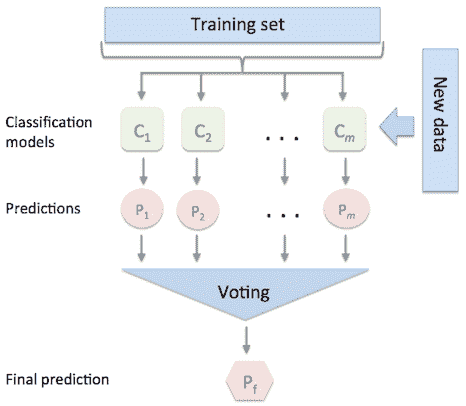
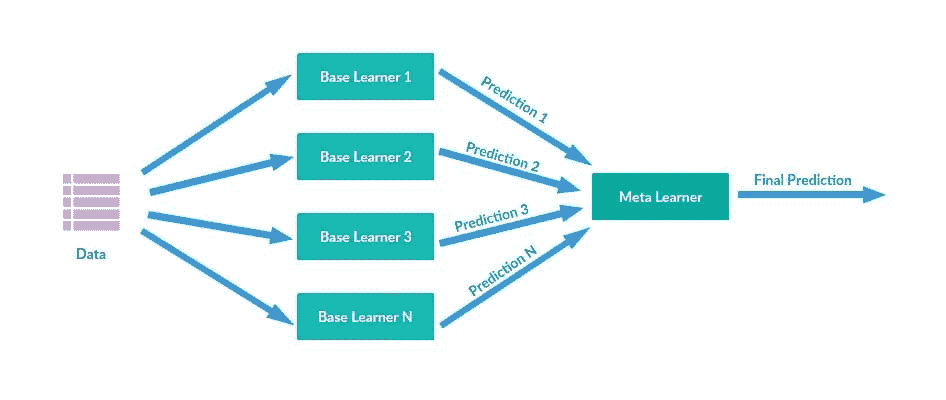
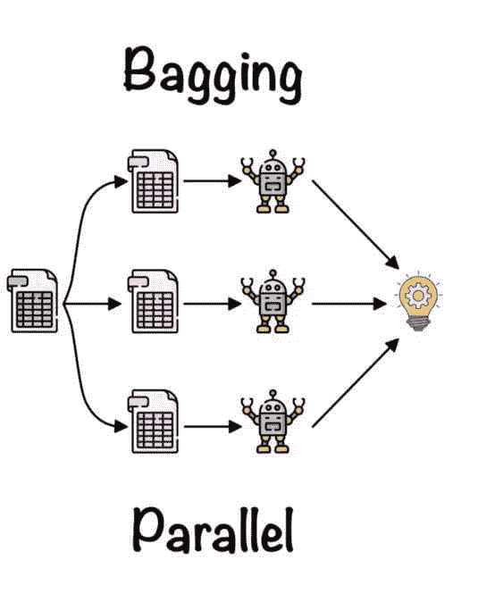
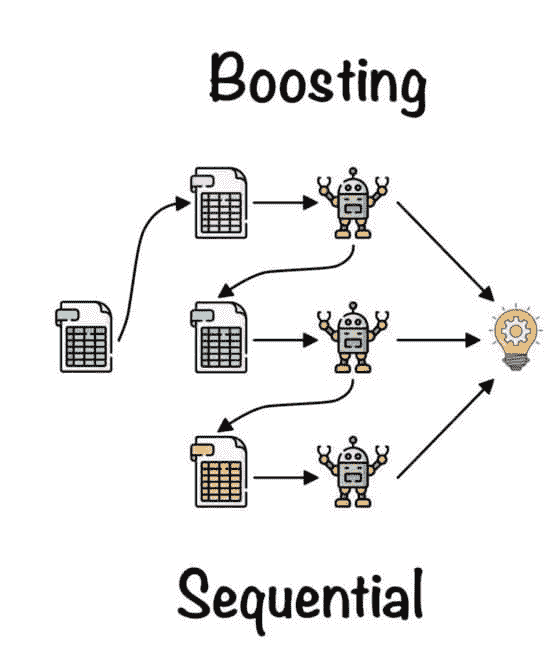

# 集成学习实例

> 原文：[`www.kdnuggets.com/2022/10/ensemble-learning-examples.html`](https://www.kdnuggets.com/2022/10/ensemble-learning-examples.html)


作者提供的图片

# 什么是集成学习？

* * *

## 我们的三大课程推荐

 1\. [Google 网络安全证书](https://www.kdnuggets.com/google-cybersecurity) - 加速进入网络安全职业生涯。

 2\. [Google 数据分析专业证书](https://www.kdnuggets.com/google-data-analytics) - 提升你的数据分析能力

 3\. [Google IT 支持专业证书](https://www.kdnuggets.com/google-itsupport) - 支持你的组织的 IT 需求

* * *

集成学习结合多个模型以获得更好的模型性能。它有助于提高模型的鲁棒性并提供通用模型。简而言之，它结合了模型的不同决策来提高性能。

在本教程中，我们将通过示例学习各种集成方法。我们将使用 Kaggle 上的[心脏病分析与预测](https://www.kaggle.com/datasets/rashikrahmanpritom/heart-attack-analysis-prediction-dataset)数据集。我们的重点是利用各种特征找到心脏病发作的高风险和低风险患者。

**输出：**

+   0 = 较低的心脏病发作风险

+   1 = 更高的心脏病发作风险

# 平均

我们将从导入所需的实用程序和机器学习包开始。

## 简单平均

我们将通过将所有模型的输出相加并除以模型总数来计算简单平均。

1.  使用 pandas 加载了 heart.csv 文件。

1.  目标是“输出”特征。

1.  删除“输出”以创建训练特征。

1.  使用 StandardScaler()对特征进行缩放

1.  将数据拆分为训练集和测试集。

1.  构建所有三个模型对象。我们使用的是 RandomForestClassifier、LogisticRegression 和 SGDClassifier。

1.  在训练集上训练模型，并使用测试集预测输出。

1.  使用平均公式并将输出四舍五入为仅显示 1 和 0。

1.  显示准确性和 AUC 指标。

我们的模型在默认超参数下表现良好。

```py
Accuracy: 85.246%
AUC score: 0.847
```

## 加权平均

在加权平均中，我们给表现最佳的模型赋予最高权重，给表现较差的模型赋予最低权重，同时计算平均值。

|  | **model_1** | **model_2** | **model_3** |
| --- | --- | --- | --- |
| **权重** | 30% | 60% | 10% |

下面的代码显示，通过给予**model_2**更高的权重，我们达到了更好的性能。

> **注意：** 在赋予权重时，确保它们的总和为 1。例如，0.3 + 0.6 + 0.1 = 1

```py
Accuracy: 90.164%
AUC score: 0.89
```

# 最大投票

最大投票法通常用于分类问题。在这种方法中，每个模型对每个样本进行预测并投票。从样本类别中，只有得票最高的类别会被纳入最终预测类别。



图像来自[rasbt.github.io](http://rasbt.github.io/mlxtend/user_guide/classifier/EnsembleVoteClassifier/)

在下面的例子中，我添加了第四个模型 KNeighborsClassifier。我们将使用 Scikit-Learn 的 VotingClassifier，并添加三个分类器：RandomForestClassifier、LogisticRegression 和 KNeighborsClassifier。

正如我们所见，我们得到了比简单平均更好的结果。

```py
Accuracy: 90.164%
AUC score: 0.89
```

# 堆叠

堆叠通过元模型（meta-classifier 或 meta-regression）组合多个基础模型。基础模型在完整数据集上进行训练。元模型在基础模型的特征（输出）上进行训练。基础模型和元模型通常是不同的。简而言之，元模型帮助基础模型找到有用的特征，以实现高性能。



图像来自[opengenus.org](https://iq.opengenus.org/content/images/2019/08/stacking.PNG)

在这个例子中，我们将使用随机森林、逻辑回归和 AdaBoost 分类器作为基础模型（估计器），并使用 GradientBoosting 分类器作为元模型（final_estimator）。

堆叠模型未能产生更好的结果。

```py
Accuracy: 81.967%
AUC score: 0.818
```

# Bagging

Bagging，也称为 Bootstrap Aggregating，是一种集成方法，用于提高机器学习模型的稳定性和准确性。它用于最小化方差和过拟合。通常，它应用于决策树方法。



Bagging 由[Fernando López](https://towardsdatascience.com/ensemble-learning-bagging-boosting-3098079e5422)介绍

Bagging 随机创建训练数据的子集，以公平分布整个数据集，并在其上训练模型。最终输出是通过组合所有基础模型的输出生成的。

在我们的例子中，我们将使用一种类型的模型，并在不同的训练数据子集上进行训练。一个子集也称为“包”，因此称为 bagging 算法。

在这个例子中，我们使用 Scikit-learn 的 BaggingClassifier，并利用逻辑回归作为基础估计器。

Bagging 算法已产生最佳和可靠的结果。

```py
Accuracy: 90.164%
AUC score: 0.89
```

# 提升

提升方法通过组合弱分类器来创建强分类器。它减少了偏差并改善了单个模型的性能。

通过将弱分类器串联训练，你可以实现高性能。第一个模型在训练数据上进行训练，然后第二个模型在第一个模型中纠正错误。这是一个迭代算法，根据之前的模型调整权重。



由 [Fernando López](https://towardsdatascience.com/ensemble-learning-bagging-boosting-3098079e5422) 提供的提升方法

提升算法给予先前模型准确预测的观测值更多的权重。这个过程持续进行，直到所有训练数据集都被正确预测或达到了最大模型数量。

在这个示例中，我们将使用 AdaBoost 分类器。自适应提升算法（AdaBoost）是将弱分类器组合成一个强大分类器的经典技术。

```py
Accuracy: 80.328%
AUC score: 0.804
```

# 结论

尽管集成学习应该应用于所有机器学习应用中，但在大型神经网络的情况下，你需要考虑吞吐量、计算和操作成本，以决定是否训练和服务多个模型。

在本教程中，我们学习了集成学习的重要性。此外，我们还学习了平均、最大投票、堆叠、袋装和提升的方法及其代码示例。

希望你喜欢这个教程，如果你对最佳技术有任何疑问，请在下面的评论区留言。

**[Abid Ali Awan](https://www.polywork.com/kingabzpro)** ([@1abidaliawan](https://twitter.com/1abidaliawan)) 是一位认证的数据科学专业人士，他热衷于构建机器学习模型。目前，他专注于内容创作，并撰写有关机器学习和数据科学技术的技术博客。Abid 拥有技术管理硕士学位和电信工程学士学位。他的愿景是利用图神经网络为面临心理健康问题的学生构建 AI 产品。

### 更多相关主题

+   [集成学习技术：使用 Python 中的随机森林逐步讲解](https://www.kdnuggets.com/ensemble-learning-techniques-a-walkthrough-with-random-forests-in-python)

+   [何时选择集成技术是一个好选择？](https://www.kdnuggets.com/2022/07/would-ensemble-techniques-good-choice.html)

+   [选择示例以理解机器学习模型](https://www.kdnuggets.com/2022/11/picking-examples-understand-machine-learning-model.html)

+   [SQL LIKE 运算符示例](https://www.kdnuggets.com/2022/09/sql-like-operator-examples.html)

+   [学习数据科学、机器学习和深度学习的可靠计划](https://www.kdnuggets.com/2023/01/mwiti-solid-plan-learning-data-science-machine-learning-deep-learning.html)

+   [人工智能、分析、机器学习、数据科学、深度学习……](https://www.kdnuggets.com/2021/12/developments-predictions-ai-machine-learning-data-science-research.html)
