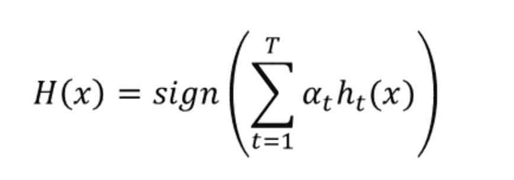
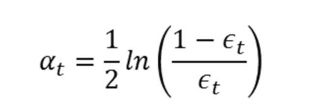
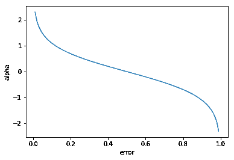
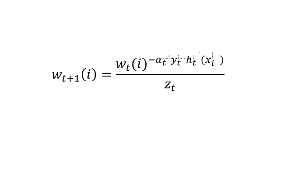
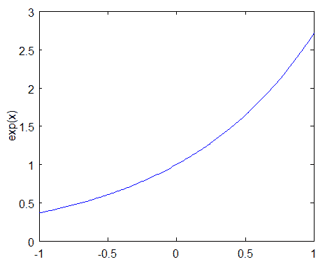

# 机器学习的集成方法：AdaBoost

> 原文：[`www.kdnuggets.com/2019/09/ensemble-methods-machine-learning-adaboost.html`](https://www.kdnuggets.com/2019/09/ensemble-methods-machine-learning-adaboost.html)

评论

**由 [Valentina Alto](https://www.linkedin.com/in/valentina-alto-6a0590148/)，数据科学与商业分析硕士**


* * *

## 我们的三大课程推荐

 1\. [谷歌网络安全证书](https://www.kdnuggets.com/google-cybersecurity) - 快速进入网络安全职业。

 2\. [谷歌数据分析专业证书](https://www.kdnuggets.com/google-data-analytics) - 提升你的数据分析技能

 3\. [谷歌 IT 支持专业证书](https://www.kdnuggets.com/google-itsupport) - 支持你的组织的 IT 需求

* * *

在统计学和机器学习中，集成方法使用多个学习算法来获得比任何单个学习算法所能获得的更好的预测性能。

结合多个算法的想法最初由计算机科学家兼教授 Michael Kerns 提出，他想知道 *“弱学习能力是否等同于强学习能力”*。目标是将一个略好于随机猜测的弱算法转变为强学习算法。结果发现，如果我们要求弱算法创建一堆分类器（定义上都很弱），然后将它们结合起来，可能会得到一个更强的分类器。

**AdaBoost**，即“自适应提升”，是一种机器学习元算法，可与许多其他类型的学习算法结合使用，以提高性能。

在这篇文章中，我将介绍 Adaboost 背后的数学原理，并提供一个 Python 实现。

### AdaBoost 的直觉和数学

想象一下，我们有一个样本，将其划分为训练集和测试集，以及一堆分类器。每个分类器在训练集的随机子集上进行训练（注意这些子集实际上可以重叠——这与交叉验证不同）。然后，对于每个子集中的每个观察值，AdaBoost 分配一个权重，决定该观察值出现在训练集中的概率。权重较高的观察值更有可能被包含在训练集中。因此，AdaBoost 倾向于将更高的权重分配给那些被误分类的观察值，以便它们在下一个分类器的训练集中占据更大份额，目标是使下一个训练的分类器在这些观察值上表现更好。

考虑一个简单的二分类问题，其目标由‘正’或‘负’（表示为 1 和-1）的符号表示，最终分类器的方程如下：



基本上，最终分类器对观察值 x 的输出等于 T 个弱分类器的输出 h_t(x)的加权和的符号，权重为α_t。

更具体地说，α_t 是分配给分类器 t 输出的权重（注意，这个权重与分配给观察值的权重不同，后续将讨论）。它的计算方式如下：



其中ε_t 是分类器 t 的误差项（错误分类的观察值/总观察值）。当然，误差低的分类器会在加权和中优先考虑，因此它们的权重会更高。实际上，如果我们查看不同误差对应的α：

```py
import numpy as np
import matplotlib.pyplot as plt

epsilon=np.arange(0,1,0.01)
alpha=1/2*np.log((1-epsilon)/epsilon)

plt.plot(epsilon, alpha)
plt.xlabel('error')
plt.ylabel('alpha')
```



正如你所见，当误差接近 0 时，分类器的权重会指数增长，而当误差接近 1 时，它会指数地减少。

然后，α的值用于计算另一种类型的权重，即分配给子集观察值的权重。对于第一个分类器，权重被均等初始化，因此每个观察值的权重=1/n（其中 n 为子集的大小）。从第二个分类器开始，每个权重递归计算如下：



其中 y_t 是目标值（1 或-1），变量 w_t 是权重向量，每个训练样本都有一个权重。‘i’是训练样本的编号。这个方程展示了如何更新第 i 个训练样本的权重。

我们可以将 w_t 视为一个分布：这与我们一开始所说的一致，即权重表示训练样本被选为训练集的一部分的概率。

为了使其成为一个分布，这些概率的总和应该为 1。为确保这一点，我们通过将每个权重除以所有权重之和 Z_t 来归一化权重。

让我们解释一下这个公式。由于我们处理的是二分类问题（-1 与 1），如果实际值和拟合值具有相同的符号（分类正确），则 y_t*h_t(x_i)的乘积为正；如果它们的符号不同（分类错误），则乘积为负。因此：

+   如果产品为正且α大于零（强分类器），则分配给第 i 个观察值的权重会很小。

+   如果产品为正且α小于零（弱分类器），则分配给第 i 个观察值的权重会很高。

+   如果产品为负且α大于零（强分类器），则分配给第 i 个观察值的权重会很高。

+   如果产品为负且 alpha 小于零（弱分类器），则分配给第 i 个观察值的权重将很小。

注意：当我说‘小’和‘高’时，我指的是如果我们考虑归一化前的指数，分别小于 1 和大于 1。实际上：



现在我们对 AdaBoost 的工作原理有了了解，让我们看看它在 Python 中的实现，使用的是著名的鸢尾花数据集。

### 使用 Python 实现

首先，让我们导入数据：

```py
from sklearn.ensemble import AdaBoostClassifier
from sklearn import datasets
from sklearn.model_selection import train_test_split
from sklearn import metrics

iris = datasets.load_iris()
X = iris.data
y = iris.target

X_train, X_test, y_train, y_test = train_test_split(X, y, test_size=0.3)
```

AdaBoost 的默认算法是决策树，但你可以决定手动设置不同的分类器。在这里，我将使用支持向量机分类器（你可以在[这里](https://medium.com/swlh/support-vector-machine-from-scratch-ce095a47dc5c)阅读更多关于 SVM 的内容）。

```py
from sklearn.svm import SVC
from sklearn import metrics
svc=SVC(probability=True, kernel='linear')

abc =AdaBoostClassifier(n_estimators=50, base_estimator=svc,learning_rate=1)

model = abc.fit(X_train, y_train)

y_pred = model.predict(X_test)
print("Accuracy:",metrics.accuracy_score(y_test, y_pred))

Output:
Accuracy: 0.9777777777777777
```

如你所见，我们几乎 98%的观察结果已被正确分类。

### 结论

AdaBoost 是一种易于实现的技术。它通过迭代纠正弱分类器的错误，提高准确性。然而，它并非没有*陷阱*。实际上，由于它寻求减少训练误差，因此对异常值特别敏感，存在生成过拟合模型的风险，这种模型无法很好地适应新的、未标记的数据，因为它缺乏泛化能力（你可以在[这里](https://towardsdatascience.com/preventing-overfitting-regularization-5eda7d5753bc)阅读更多关于过拟合的内容）。

*最初发布于*[*http://datasciencechalktalk.com*](https://datasciencechalktalk.com/2019/09/07/ensemble-methods-for-machine-learning-adaboost/)*于 2019 年 9 月 7 日。*

**简介：[Valentina Alto](https://www.linkedin.com/in/valentina-alto-6a0590148/)** 是一位机器学习和统计学爱好者，目前在博科尼大学攻读数据科学硕士学位。

[原始](https://medium.com/@valentinaalto/ensemble-methods-for-machine-learning-adaboost-2ff70d5518f3)。经许可转载。

**相关：**

+   梯度提升的直观集成学习指南

+   集成学习：5 种主要方法

+   理解梯度提升机

### 进一步阅读

+   [在 Scikit-learn 中实现 Adaboost](https://www.kdnuggets.com/2022/10/implementing-adaboost-scikitlearn.html)

+   [带例子的集成学习](https://www.kdnuggets.com/2022/10/ensemble-learning-examples.html)

+   [集成学习技术：Python 中随机森林的演练](https://www.kdnuggets.com/ensemble-learning-techniques-a-walkthrough-with-random-forests-in-python)

+   [何时集成技术是一个好的选择？](https://www.kdnuggets.com/2022/07/would-ensemble-techniques-good-choice.html)

+   [机器学习中的替代特征选择方法](https://www.kdnuggets.com/2021/12/alternative-feature-selection-methods-machine-learning.html)

+   [k-means 聚类的质心初始化方法](https://www.kdnuggets.com/2020/06/centroid-initialization-k-means-clustering.html)
