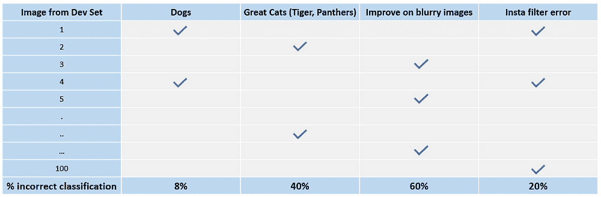
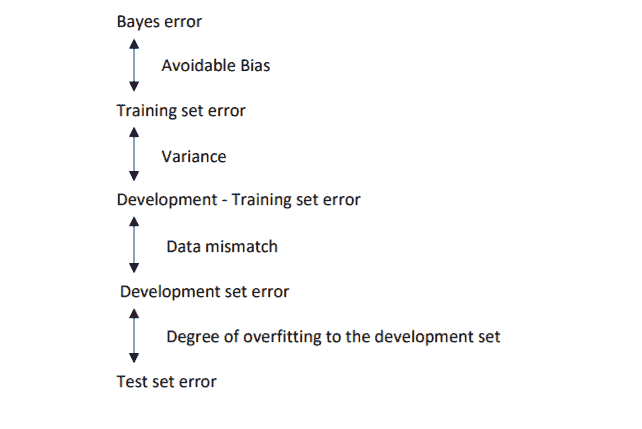

# 错误分析拯救你 – 从 Andrew Ng 的课程中学到的经验，第三部分

> 原文：[`www.kdnuggets.com/2018/01/error-analysis-your-rescue.html`](https://www.kdnuggets.com/2018/01/error-analysis-your-rescue.html)

 评论

欢迎来到 Ng 经验的第三章 ML 课程！是的，这一章完全基于 Andrew Ng 在 Coursera 上最新的 [课程](https://www.coursera.org/learn/machine-learning-projects/home/welcome) 的延续。虽然这篇文章可以独立学习，但阅读前两篇文章将有助于更好地理解这篇文章。以下是系列中的 [第一篇](https://www.kdnuggets.com/2017/12/improve-machine-learning-performance-lessons-andrew-ng.html) 和 [第二篇](https://www.kdnuggets.com/2017/12/improve-machine-learning-algorithm-lessons-andrew-ng-part2.html) 文章的链接。开始吧！

当尝试解决一个新的机器学习问题（一个尚未有太多在线资源的问题）时，Andrew Ng 建议你快速构建第一个系统，然后进行迭代。建立一个模型，然后逐步识别错误并不断修复它们。如何发现错误以及如何修复它们？就在你考虑这些时，**错误分析**以巨大的袍子、长长的胡须藏在腰带下、戴着半月眼镜的形象出现，并说道 -

> * * *
> 
> ## 我们的前 3 个课程推荐
> ## 
>  1\. [谷歌网络安全证书](https://www.kdnuggets.com/google-cybersecurity) - 快速进入网络安全职业生涯。
> 
>  2\. [谷歌数据分析专业证书](https://www.kdnuggets.com/google-data-analytics) - 提升你的数据分析水平
> 
>  3\. [谷歌 IT 支持专业证书](https://www.kdnuggets.com/google-itsupport) - 支持组织的 IT 工作
> 
> * * *
> 
> ‘正是这些错误，哈利，告诉我们我们的模型到底是什么，远比准确性更能揭示真相’

**为什么要进行错误分析？**

在构建新的机器学习模型时，你应该尝试遵循以下步骤 -

*设定目标:* 设置开发/测试集并选择一个评估指标来衡量性能（参考第一篇文章）

*快速构建初始模型：*

1\. 使用训练集进行训练 — 调整参数

2\. 开发集 — 调整参数

3\. 测试集 — 评估性能

*优先考虑下一步：*

1\. 使用偏差和方差分析来处理欠拟合和过拟合（见 [第二篇文章](https://www.kdnuggets.com/2017/12/improve-machine-learning-algorithm-lessons-andrew-ng-part2.html)）

2\. 分析导致错误的原因并修复它们，直到你拥有所需的模型！

手动检查算法所犯的错误可以让你深入了解下一步该怎么做。这个过程被称为错误分析。举个例子，你构建了一个猫分类器，显示出 10%的测试错误，而你的一个同事指出你的算法把狗的图像误分类为猫。你是否应该尝试让你的猫分类器在狗的图像上表现得更好？

**修复哪个错误？**

好吧，与其花几个月时间去做这些，最后发现这没有太大帮助，不如采用一种错误分析程序，可以让你非常迅速地判断这是否值得你的努力。

1\. 获取约 100 个标记错误的开发集样本

2\. 计算有多少张是狗的图片

3\. 如果你只有 5%的狗图像，并且你完全解决了这个问题，你的错误率最多只能从 10%降到 9.5%！

4\. 相反，如果你有 50%的狗图像，你可以更乐观地期待改善你的错误，并希望将其从 10%降低到 5%

这就是你评估单一错误修正方法的方式。类似地，你可以通过创建网格并选择最佳的改进性能的想法来评估多个想法 -

这个过程的结论给你一个关于各类错误工作价值的估计。例如，显然我们在模糊图像上犯了很多错误，其次是优秀的猫图像。这让你了解了最佳的选项。

这也告诉你，无论你在狗图像或 Instagram 图像上表现得多么出色，最多也只能提高 8%或 20%的性能。因此，根据你对改善优秀猫图像或模糊图像的想法数量，你可以选择其中一个，或者如果你的团队有足够的人员，也许可以让两个不同的团队分别独立工作。

现在，如果在模型构建过程中，你发现你的数据有一些错误标记的数据点，你应该怎么做？

**错误标记的数据**

*训练集修正*

深度学习算法对于训练集中的随机错误相当鲁棒。只要错误是无意的和相当随机的，就不必投入过多时间去修复它们。例如，我们的猫分类器训练集中几张标记错误的狗图像。

然而！然而，深度学习算法对系统性错误并不鲁棒，例如，如果你将所有白色的狗图像标记为猫，你的分类器将学习到这个模式。

*开发/测试集修正*

你还可以选择对开发/测试集进行错误分析，查看其中有多少比例的图片被标注错误，并判断是否值得修复。如果你的开发集错误率是 10%，而由于标注错误的开发集图片导致错误率为 0.5%，那么在这种情况下，可能不值得花时间去修复它们。但如果你的开发集错误率是 2%，而 0.5%的错误是由于标注错误的开发集图片造成的，那么在这种情况下，修复它们是明智的，因为这占你总错误的 25%。

你可能选择只修复训练集，而不修复开发/测试集中的标注错误。在这种情况下，请记住，现在你的训练集和开发/测试集都来自稍微不同的分布。这是可以接受的。让我们讨论如何处理训练集和开发/测试集来自不同分布的情况。

**训练集和开发/测试集不匹配**

*在不同分布上进行训练和测试*

假设你正在开发一个应用程序，用于对用户点击的图片进行猫的分类。现在你有两个来源的数据。第一个是来自网页的 200,000 张高分辨率图片，第二个是来自应用程序的 10,000 张非专业/模糊的用户拍摄图片。

现在，为了使训练集和开发/测试集有相同的分布，你可以将来自两个来源的图片进行洗牌，并在两个组之间随机分配。然而，在这种情况下，你的开发集将在 2500 张图片中仅包含约 200 张来自移动用户的图片。这将优化你的算法在网页图片上的表现。但，理想的开发/测试集选择是使其反映你期望未来获得的数据，并考虑到对其表现的重要性。

我们可以做的是，将所有的开发/测试集中的图片都来自移动用户，并将其余的移动用户图片与网页图片一起放入训练集中。这会导致训练集和开发/测试集中的分布不一致，但从长远来看，它会让你实现预期目标。

*偏差和方差与数据分布不匹配*

当训练集与开发集和测试集的分布不同时，分析偏差和方差的方法会有所变化。你不能再将训练集和开发集之间的错误称为方差（显然它们来自不同的分布）。你可以定义一个**训练/开发集**，该集具有与训练集相同的分布，但不用于训练。然后，你可以按下图所示分析你的模型。

**结论**

了解你的机器学习算法的应用，根据需要收集数据，并随机划分训练/开发/测试集。提出一个单一的优化评估指标，并调整参数以改进该指标。使用偏差/方差分析来理解你的模型是否过拟合、欠拟合，或是运行良好。进行错误分析，识别哪个修复最有效，最后，努力调整你的模型！

这是该系列的最后一篇文章。感谢阅读！希望它能帮助你更好地处理错误。

如果你有任何问题/建议，请随时在此处留下评论或通过[LinkedIn](https://www.linkedin.com/in/kritikajalan/)/[Twitter](https://twitter.com/Kritika_Jalan)与我联系。

[原文](https://towardsdatascience.com/error-analysis-to-your-rescue-773b401380ef)。经授权转载。

**相关**

+   [**如何提高机器学习性能？Andrew Ng 的经验**](https://www.kdnuggets.com/2017/12/improve-machine-learning-performance-lessons-andrew-ng.html)

+   [**如何改进机器学习算法？来自 Andrew Ng 的经验，第二部分**](https://www.kdnuggets.com/2017/12/improve-machine-learning-algorithm-lessons-andrew-ng-part2.html)

+   [**机器学习模型指标**](https://www.kdnuggets.com/2018/01/machine-learning-model-metrics.html)

### 更多相关内容

+   [管理过多的 Python 版本？Pyenv 来救援](https://www.kdnuggets.com/too-many-python-versions-to-manage-pyenv-to-the-rescue)

+   [实施推荐系统的十大关键经验](https://www.kdnuggets.com/2022/07/ten-key-lessons-implementing-recommendation-systems-business.html)

+   [来自高级数据科学家的经验](https://www.kdnuggets.com/2022/09/lessons-senior-data-scientist.html)

+   [KDnuggets 新闻，9 月 28 日：Python 课程免费提供 •…](https://www.kdnuggets.com/2022/n38.html)

+   [4 个职业经验帮助我应对困难的就业市场](https://www.kdnuggets.com/2023/05/4-lessons-made-difference-navigating-current-job-market.html)

+   [机器学习不像你的大脑 第一部分：神经元速度慢，…](https://www.kdnuggets.com/2022/04/machine-learning-like-brain-part-one-neurons-slow-slow-slow.html)
