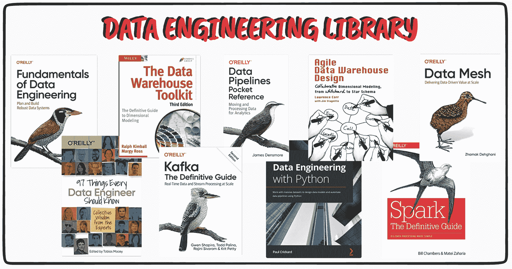

# 你需要成为数据工程师的基本书籍

> 原文：[`www.kdnuggets.com/2022/10/essential-books-need-become-data-engineer.html`](https://www.kdnuggets.com/2022/10/essential-books-need-become-data-engineer.html)

作者提供的图片

书籍 - 传统的学习方式。有些人可能更喜欢上课程，而有些人则希望沉浸在书本中。在这篇文章中，我将探讨成为数据工程师所需的书籍路线图。

* * *

## 我们的前三课程推荐

 1\. [谷歌网络安全证书](https://www.kdnuggets.com/google-cybersecurity) - 快速进入网络安全职业道路。

 2\. [谷歌数据分析专业证书](https://www.kdnuggets.com/google-data-analytics) - 提升你的数据分析能力

 3\. [谷歌 IT 支持专业证书](https://www.kdnuggets.com/google-itsupport) - 支持你的组织的 IT

* * *

在开始之前，让我们快速回顾一下数据工程师是什么

# 数据工程师是什么？

数据工程是数据科学的一部分。数据科学家负责探索数据，然后构建机器学习算法来解决任务或问题。而数据工程师则更关注使这些算法有效运行以及创建数据管道。

数据工程师负责建立和维护组织的数据基础设施。其他职责包括：

+   数据获取

+   发展、构建、测试和维护符合业务需求的架构

+   提高数据的准确性、效率和质量

+   执行预测性和规范性建模

+   实施分析工具、机器学习和统计方法

+   与利益相关者沟通发现

# 你需要达到目标的书籍

## 基础知识

那么让我们从数据工程的基础开始吧。

+   [数据工程基础：规划与构建稳健的数据系统](https://www.amazon.co.uk/Fundamentals-Data-Engineering-Robust-Systems/dp/1098108302/ref=asc_df_1098108302/?tag=googshopuk-21&linkCode=df0&hvadid=570436520144&hvpos=&hvnetw=g&hvrand=110988235206462544&hvpone=&hvptwo=&hvqmt=&hvdev=c&hvdvcmdl=&hvlocint=&hvlocphy=9044965&hvtargid=pla-1643937444435&psc=1&th=1&psc=1)

+   [每个数据工程师都应该知道的 97 件事：专家的集体智慧](https://www.amazon.co.uk/Things-Every-Data-Engineer-Should/dp/1492062413)

+   [数据仓库工具包：维度建模的权威指南](https://www.amazon.co.uk/Data-Warehouse-Toolkit-Definitive-Dimensional/dp/1118530802?&linkCode=sl1&tag=understandi00-21&linkId=50a288800f3324f8ac8fc28046b71815&language=en_GB&ref_=as_li_ss_tl)

+   [数据管道袖珍参考：用于分析的数据移动与处理](https://amzn.to/39P2kaF)

+   [用 Python 进行数据工程](https://amzn.to/37Cdtee)

## 更加专业

一旦你很好地理解了基础知识，你的下一个目标就是在你感兴趣的领域中变得更加专业。

+   [Spark：权威指南：简化大数据处理](https://amzn.to/3RPyZ1s)

+   [敏捷数据仓库设计：从白板到星型模式的协作维度建模](https://www.amazon.co.uk/Agile-Data-Warehouse-Design-Collaborative/dp/0956817203/ref=asc_df_0956817203/?tag=googshopuk-21&linkCode=df0&hvadid=310762413837&hvpos=&hvnetw=g&hvrand=8367547137275978688&hvpone=&hvptwo=&hvqmt=&hvdev=c&hvdvcmdl=&hvlocint=&hvlocphy=9044965&hvtargid=pla-334867027108&psc=1&th=1&psc=1)

+   [Kafka - 权威指南：规模化实时数据和流处理](https://www.amazon.co.uk/Kafka-Definitive-Real-Time-Stream-Processing/dp/1492043087/ref=sr_1_1?crid=24UOL1S2552R6&keywords=kafka+guide&qid=1665396798&qu=eyJxc2MiOiIxLjk4IiwicXNhIjoiMC4wMCIsInFzcCI6IjAuMDAifQ%3D%3D&sprefix=kafka+guide%2Caps%2C54&sr=8-1)

+   [Cassandra - 权威指南，第 3 版：Web 规模分布式数据](https://www.amazon.co.uk/Cassandra-Definitive-Guide-Jeff-Carpenter/dp/1098115163/ref=sr_1_2?crid=1PQWIQDHI6IHT&keywords=cassandra+guide&qid=1665396845&sprefix=cassandra+guide%2Caps%2C44&sr=8-2)

+   [大数据：可扩展实时数据系统的原则与最佳实践](https://amzn.to/2SoDoi9)

## 数据架构与管理

+   [数据网格：在规模上实现数据驱动的价值](https://www.amazon.co.uk/Data-Mesh-Delivering-Data-Driven-Value/dp/1492092398/ref=d_pd_vtp_sccl_2_1/261-1235052-2231453?pd_rd_w=FN40D&content-id=amzn1.sym.2204c855-5dd7-4df3-b470-8459f4c43f4a&pf_rd_p=2204c855-5dd7-4df3-b470-8459f4c43f4a&pf_rd_r=98FGNVF196H8SEEGQYRH&pd_rd_wg=AMY9v&pd_rd_r=c8cc5667-cc78-4032-a928-9ddc5bd06e68&pd_rd_i=1492092398&psc=1)

+   [数据解决方案架构基础：管理成功的数据项目](https://www.amazon.co.uk/Foundations-Architecting-Data-Solutions-Successful/dp/1492038741/ref=d_pd_sim_sccl_3_10/261-1235052-2231453?pd_rd_w=zri79&content-id=amzn1.sym.b6c57670-da52-480c-9517-fd61033283cf&pf_rd_p=b6c57670-da52-480c-9517-fd61033283cf&pf_rd_r=HS0NZJF7VRFGAXT9A7W0&pd_rd_wg=K2CoQ&pd_rd_r=d1cba944-4df1-46dc-a687-65dab3b588ea&pd_rd_i=1492038741&psc=1)

+   [现代数据平台架构：企业级 Hadoop 指南](https://www.amazon.co.uk/Architecting-Modern-Data-Platforms-Kunigk/dp/149196927X/ref=pd_bxgy_sccl_2/261-1235052-2231453?pd_rd_w=0JkuB&content-id=amzn1.sym.79b812bf-5c8b-4c0c-851c-784423adaff5&pf_rd_p=79b812bf-5c8b-4c0c-851c-784423adaff5&pf_rd_r=7KJS3E5RGGPKNJZS3XC6&pd_rd_wg=hEL2c&pd_rd_r=2fbb2288-8303-40ac-9568-17623c18a90c&pd_rd_i=149196927X&psc=1)

+   [规模数据管理：企业架构的最佳实践](https://www.amazon.co.uk/Data-Management-Scale-Enterprise-Architecture/dp/149205478X/ref=d_pd_vtp_sccl_3_5/261-1235052-2231453?pd_rd_w=tpLta&content-id=amzn1.sym.2204c855-5dd7-4df3-b470-8459f4c43f4a&pf_rd_p=2204c855-5dd7-4df3-b470-8459f4c43f4a&pf_rd_r=SA7C9KCT41QBWYN519S6&pd_rd_wg=G3wku&pd_rd_r=71910296-4284-41bd-8647-d3585002caed&pd_rd_i=149205478X&psc=1)

## 超越极限

根据你希望担任的数据工程师职位，你总有更多可以学习的内容。无论是为了获得特定工作还是仅仅为了知识，以下是一些可以帮助你实现目标的书籍

+   [像工程师一样思考：改变我们生活的思想内部](https://www.amazon.co.uk/Think-Like-Engineer-Inside-Changing/dp/1780748647/ref=asc_df_1780748647/?tag=googshopuk-21&linkCode=df0&hvadid=310970710731&hvpos=&hvnetw=g&hvrand=16442668124805260928&hvpone=&hvptwo=&hvqmt=&hvdev=c&hvdvcmdl=&hvlocint=&hvlocphy=9044965&hvtargid=pla-549422447178&psc=1&th=1&psc=1)

+   [数据治理：权威指南：人、过程和工具以实现数据可信性](https://www.amazon.co.uk/Data-Governance-Definitive-Operationalize-Trustworthiness/dp/1492063495/ref=asc_df_1492063495/?tag=googshopuk-21&linkCode=df0&hvadid=499448001284&hvpos=&hvnetw=g&hvrand=16442668124805260928&hvpone=&hvptwo=&hvqmt=&hvdev=c&hvdvcmdl=&hvlocint=&hvlocphy=9044965&hvtargid=pla-950818558255&psc=1&th=1&psc=1)

+   [团队拓扑：组织业务和技术团队以实现快速流动](https://www.amazon.co.uk/Team-Topologies-Organizing-Business-Technology/dp/1942788819/ref=d_pd_sim_sccl_3_12/261-1235052-2231453?pd_rd_w=zri79&content-id=amzn1.sym.b6c57670-da52-480c-9517-fd61033283cf&pf_rd_p=b6c57670-da52-480c-9517-fd61033283cf&pf_rd_r=HS0NZJF7VRFGAXT9A7W0&pd_rd_wg=K2CoQ&pd_rd_r=d1cba944-4df1-46dc-a687-65dab3b588ea&pd_rd_i=1942788819&psc=1)

# 总结

当谈到基础知识时，你希望能够涵盖所有这些方面和主题。这些将为你的数据工程职业提供基础，从此之后，你可以选择你更感兴趣的领域以及你期望在未来 5-10 年内的发展方向。

如果你有兴趣在学习时通过课程测试你的知识，可以阅读这篇文章：免费数据工程课程

祝好运！

**[Nisha Arya](https://www.linkedin.com/in/nisha-arya-ahmed/)** 是一位数据科学家和自由技术作家。她特别感兴趣于提供数据科学职业建议或教程及理论知识。她还希望探索人工智能如何有助于人类寿命的延续。作为一个热心的学习者，她寻求拓展自己的技术知识和写作技能，同时帮助指导他人。

### 更多相关主题

+   [成为数据工程师所需的 9 项技能](https://www.kdnuggets.com/2021/03/9-skills-become-data-engineer.html)

+   [成为专业数据工程师所需的唯一免费课程](https://www.kdnuggets.com/the-only-free-course-you-need-to-become-a-professional-data-engineer)

+   [成为 SAS 认证机器学习工程师所需的一切](https://www.kdnuggets.com/2023/11/sas-everything-need-become-sas-certified-machine-learning-engineer)

+   [成为 MLOps 工程师所需的唯一免费课程](https://www.kdnuggets.com/the-only-free-course-you-need-to-become-a-mlops-engineer)

+   [2022 年你需要阅读的机器学习书籍](https://www.kdnuggets.com/2022/04/machine-learning-books-need-read-2022.html)

+   [KDnuggets 新闻，4 月 27 日：关于带代码论文的简要介绍；…](https://www.kdnuggets.com/2022/n17.html)
