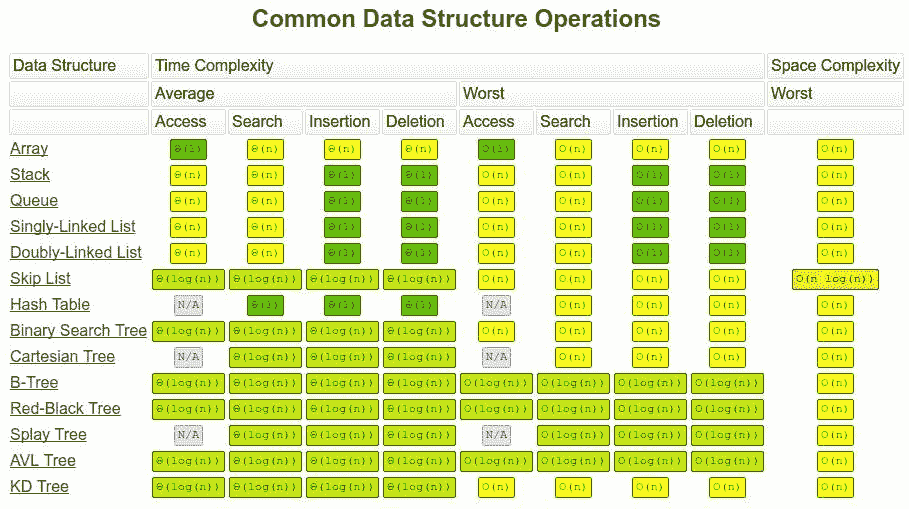
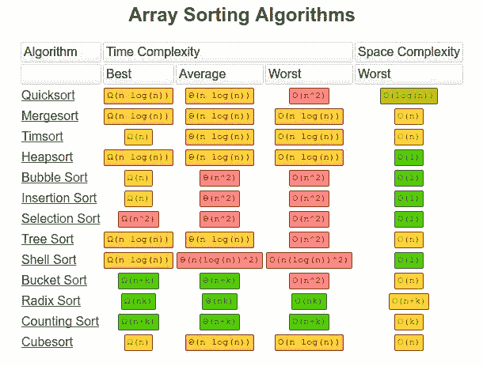
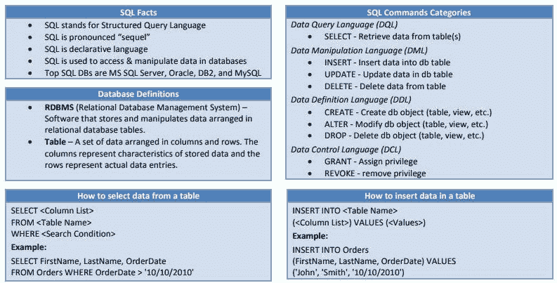

# 30 张基础数据科学、机器学习与深度学习备忘单

> 原文：[`www.kdnuggets.com/2017/09/essential-data-science-machine-learning-deep-learning-cheat-sheets.html/3`](https://www.kdnuggets.com/2017/09/essential-data-science-machine-learning-deep-learning-cheat-sheets.html/3)

### 神经网络与深度学习

神经网络架构（通过 [Asimov Institute](http://www.asimovinstitute.org/neural-network-zoo/)）

神经网络细胞（通过 [Asimov Institute](http://www.asimovinstitute.org/neural-network-zoo-prequel-cells-layers/)）

* * *

## 我们的前三大课程推荐

 1\. [Google 网络安全证书](https://www.kdnuggets.com/google-cybersecurity) - 快速入门网络安全职业。

 2\. [Google 数据分析专业证书](https://www.kdnuggets.com/google-data-analytics) - 提升你的数据分析技能

 3\. [Google IT 支持专业证书](https://www.kdnuggets.com/google-itsupport) - 支持组织的 IT 工作

* * *

神经网络图表（通过 [Asimov Institute](http://www.asimovinstitute.org/neural-network-zoo-prequel-cells-layers/)）

TensorFlow（通过 [Altoros](https://www.altoros.com/tensorflow-cheat-sheet.html)）

Keras（通过 [DataCamp](https://s3.amazonaws.com/assets.datacamp.com/blog_assets/Keras_Cheat_Sheet_Python.pdf)）

### 统计学、概率与数学

概率（通过 [William Chen & Joe Blitzstein](https://static1.squarespace.com/static/54bf3241e4b0f0d81bf7ff36/t/55e9494fe4b011aed10e48e5/1441352015658/probability_cheatsheet.pdf)）

统计学（通过 [MIT](http://web.mit.edu/~csvoss/Public/usabo/stats_handout.pdf)）

线性代数（通过 [minireference.com](https://minireference.com/static/tutorials/linear_algebra_in_4_pages.pdf)）

### 数据结构与算法

](http://bigocheatsheet.com/)

大 O 复杂度（通过 [Big O Cheat Sheet](http://bigocheatsheet.com/)）](http://bigocheatsheet.com/)

常见数据结构操作（通过 [Big O Cheat Sheet](http://bigocheatsheet.com/)）](http://bigocheatsheet.com/)

常见排序算法（通过 [Big O Cheat Sheet](http://bigocheatsheet.com/)）](https://www.clear.rice.edu/comp160/data_cheat.html)

数据结构（通过 [Rice University](https://www.clear.rice.edu/comp160/data_cheat.html)）](http://scikit-learn.org/stable/_static/ml_map.png)

机器学习算法选择（通过 [Scikit-learn](http://scikit-learn.org/stable/_static/ml_map.png)）

### 结构化查询语言 (SQL)

](http://www.sql-tutorial.net/sql-cheat-sheet.pdf)

SQL（通过 [sql-tutorial.net](http://www.sql-tutorial.net/sql-cheat-sheet.pdf)）

**相关**：

+   50+ 数据科学和机器学习备忘单

+   50+ 数据科学、机器学习备忘单，已更新

+   我应该使用哪种机器学习算法？

### 该主题的更多信息

+   [建立一个稳固的数据团队](https://www.kdnuggets.com/2021/12/build-solid-data-team.html)

+   [使用管道编写干净的 Python 代码](https://www.kdnuggets.com/2021/12/write-clean-python-code-pipes.html)

+   [停止学习数据科学以寻找目标，并通过寻找目标来...](https://www.kdnuggets.com/2021/12/stop-learning-data-science-find-purpose.html)

+   [顶级 7 个必备备忘单，助你在数据科学面试中脱颖而出](https://www.kdnuggets.com/top-7-essential-cheat-sheets-to-ace-your-data-science-interview)

+   [学习数据科学统计的顶级资源](https://www.kdnuggets.com/2021/12/springboard-top-resources-learn-data-science-statistics.html)

+   [数据工程的 7 个必备备忘单](https://www.kdnuggets.com/2022/12/7-essential-cheat-sheets-data-engineering.html)
