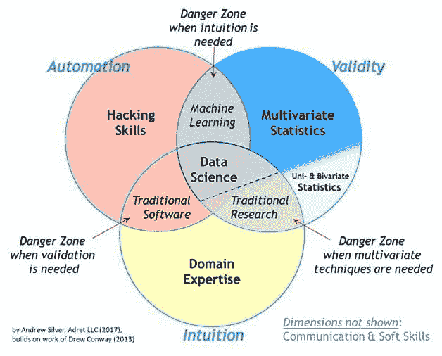
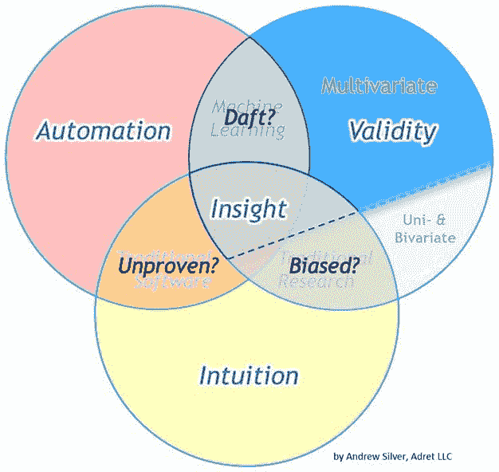
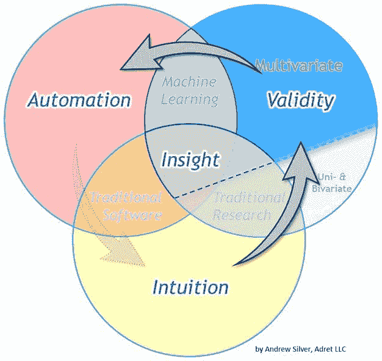

# 基本数据科学维恩图

> 原文：[`www.kdnuggets.com/2019/02/essential-data-science-venn-diagram.html`](https://www.kdnuggets.com/2019/02/essential-data-science-venn-diagram.html)

 评论

**作者：[Andrew Silver](http://adret-llc.com/)，Adret LLC**

几年前，Drew Conway 提出了并分享了他现在无处不在的 [数据科学维恩图](http://drewconway.com/zia/2013/3/26/the-data-science-venn-diagram)。这非常有帮助，我们都受到了启发。感谢你，Conway 博士！

* * *

## 我们的前三个课程推荐

 1\. [Google 网络安全证书](https://www.kdnuggets.com/google-cybersecurity) - 快速进入网络安全职业

 2\. [Google 数据分析专业证书](https://www.kdnuggets.com/google-data-analytics) - 提升你的数据分析能力

 3\. [Google IT 支持专业证书](https://www.kdnuggets.com/google-itsupport) - 支持你所在组织的 IT

* * *

[许多变体](https://www.kdnuggets.com/2016/10/battle-data-science-venn-diagrams.html)随后出现，我在这里建议我自己的改进。希望它们也能带来启发。我提出了两个补充：区分统计应用（多变量 vs. 非多变量）以及增加学科精髓（即每个技能集的主要贡献或功能）。

首先，让我说我的维恩图，就像所有的维恩图一样，固有地存在缺陷。为什么？因为它是一个二维图示，展示了固有的多维动态。这部分反映在左下角的免责声明中，沟通维度（听觉+视觉）和软技能没有显示。*创造力*、*毅力*、*内省诚实* 和其他属性也在图形中缺失。

**必要性**

统计学广泛涉及量化方差的结构，其快乐结果是能够构建描述性、解释性、预测性和规范性模型（数据科学的输出）。因此，指出统计方法在数据科学维恩图上方差最大来源并不羞愧：*多变量*统计方法（评估≥3 个变量）与 [单变量和双变量] 统计方法之间的差异。

是的，我在这里暗示这比有监督与无监督统计建模、参数与非参数建模之间的差异要大。基于的方差度量是人群中对高级统计方法的意识差异明显。需要的是人们应该更加了解在第四次工业革命中发挥核心作用的多变量分析。

这种划分的一个含义是，“传统研究”在很大程度上没有充分利用多变量统计。根据你的学科，这一含义可能不成立。不幸的是，对于许多学科而言，这一含义确实成立。可以说，这一事实是许多行业易受干扰的原因之一。

一个例子是对决定系数（R-squared）的持续过度依赖，这种情况在许多领域依然存在。R-squared 对异常值不具抗性，仅对目标变量具有相对性，可能会因序列相关数据而膨胀，而且在许多其他方面可能不可靠。尽管如此，它仍被广泛使用——部分原因是 Excel 和几乎所有其他图表工具都使其易于获得。虽然 R-squared 可能是一个有用的工具，但它仍然是一个需要正确使用的工具（例如，用于评估双变量线性关联）。

多变量问题需要多变量工具，而大多数商业挑战本质上是多变量的。许多分析师和技术专业人员在学习如何正确应用计算多变量统计（⊆“机器学习”）方面仍有很长的路要走。因此，他们仍然容易受到利用多变量算法从数据中获得更好洞察力的竞争对手的干扰……或者通过采用无效策略（*例如*，[创新者的困境](https://en.wikipedia.org/wiki/The_Innovator%27s_Dilemma)的典型表现，即忽视下市场、低利润机会，未来竞争可能会在这些地方产生）的自我干扰。

**基本意义**

这三种专业领域也可以用它们所提供的更简单的术语来表达（*即*，它们的***本质***）：***直觉***、***有效性***和***自动化***。自动化也可以称为*扩展*。它们的融合为我们提供了改进的***洞察力***。正如所描述的，洞察力也可以简单地来源于具有有效直觉的重叠（自动化不是前提）。这种情况在历史上确实存在。当前对高级分析的炒作在很大程度上是关于通过自动化数据收集、处理和分析来加速洞察力。

“偏差”的危险存在于“传统研究”领域，这是更新数据科学维恩图的主要灵感来源。统计学中的“偏差”指的是排除或忽视重要变量，这与口语中的含义相似。由于大多数人不熟悉处理多变量分析，当多变量问题被视为双变量或单变量问题时，偏差的危险最容易出现。如上所述，偏差的存在使得组织容易受到新进入者的干扰，这些新进入者通过多变量方法成为更具洞察力的竞争者。

还要注意，与“机器学习”相关的重叠区域缺乏直觉（*即*，是“愚蠢”的——一种明显的偏差）。一些人无疑会对此提出异议。但考虑到在与物理世界和社会的互动中，人们获得了一种机器学习模型无法接近的直觉（*例如*，有任何机器学习应用知道并欣赏盐的味道吗？）。机器学习模型只知道我们告诉它们的内容（我们提供的数据），模型输出最终将反映这一点。机器学习模型可以非常擅长我们训练它们做的事情，但它们仍然需要由人类来训练。（注意：即使是年轻人也需要由年长而睿智的人来训练。）从广泛经验中获得的*背景*构建了*直觉*。背景很重要。

标记为“传统软件”的区域描述起来较为困难。这回到试图用二维图形总结多变量系统的局限性。这一重叠区域也可以用来描述机械自动化（这无疑构成了全球经济的一个重要部分）。就本讨论而言，并且在大多数白领知识性工作的背景下，可以说这一领域代表了在执行风险评估时缺乏严谨性。

**操作顺序**

在大多数情况下，每个专业领域的整合都有固有的操作顺序或“最佳实践”。通常的顺序是*直觉*首先，然后是*验证*，最后是*自动化*。我们通常在直觉引导我们想到一个想法之后才会测试这个想法是否有效。同样，在未首先确认其有效性之前，我们不应该扩大（自动化）实现。

上述序列是否有例外？当然有！机器学习的输出有时会引起领域专家对他们之前忽视或不了解的关联的关注。也有许多情况，其中领域专家的启发式方法已经在自动化系统中实施，并在数据收集变得可能后得到了验证。我们也不要忘记自动化在帮助我们首先收集数据方面的作用，这些数据随后可以通过领域专长和统计严谨性进行评估。

**Σ**

总结来说，这个新的维恩图告诉我们一些我们已经知道的事情，但可能没有正式表达出来。这是一个简单的模式，作为这样的模式，它可以帮助人们更好地优先排序他们的工作流程。例如，它鼓励数据科学家在开始工作时首先与领域专家交谈——这已经被誉为最佳实践。如果你是那种不仅对*什么*要做感到满意，还想理解*为什么*的人，理解事情发生的*本质*会有所帮助。

近 70 年前，[塞缪尔·威尔克斯写道](https://quotablemath.blogspot.com/2018/02/misquoted-hg-wells-on-statistics.html) *“统计思维有一天将像读写能力一样对有效公民至关重要。”* 在不久的将来，*多元* 统计思维可能会成为更多职业的先决条件。如果我对数据科学维恩图的重新阐述能对任何人有所帮助，我会认为这段时间花得非常值得。

***世界是我们创造的，它需要更智能***。如果你喜欢这篇文章，请考虑与朋友分享。

（注意：这些维恩图图形可在注明出处的情况下使用。上述图表的初步版本首次发布于 [www.adret-llc.com](http://www.adret-llc.com) 和 [LinkedIn](https://www.linkedin.com/feed/update/urn:li:activity:6256833177369792512) 上，时间是 2017 年初。 文章 [在 Medium 上转载](https://towardsdatascience.com/the-essential-data-science-venn-diagram-35800c3bef40)。）

**简历**: [安德鲁·西尔弗](http://adret-llc.com/) 是一名地质学家（领域专家）和统计学家，拥有德克萨斯农工大学的 M.S. Analytics 和莱斯大学的 M.S. Earth Science 学位。他目前在上游能源领域提供咨询服务。

**资源:**

+   [在线和基于网络的：分析、数据挖掘、数据科学、机器学习教育](https://www.kdnuggets.com/education/online.html)

+   [分析、数据科学、数据挖掘和机器学习的软件](https://www.kdnuggets.com/software/index.html)

**相关:**

+   [什么是数据科学中的维度缩减？](https://www.kdnuggets.com/2019/01/dimension-reduction-data-science.html)

+   [数据科学的淘金热：数据科学中的顶级职位及如何获得它们](https://www.kdnuggets.com/2019/01/top-jobs-data-science.html)

+   [初创企业的数据科学项目流程](https://www.kdnuggets.com/2019/01/data-science-project-flow-startups.html)

### 更多相关话题

+   [成为优秀数据科学家所需的 5 种关键技能](https://www.kdnuggets.com/2021/12/5-key-skills-needed-become-great-data-scientist.html)

+   [每个初学者数据科学家应该掌握的 6 种预测模型](https://www.kdnuggets.com/2021/12/6-predictive-models-every-beginner-data-scientist-master.html)

+   [2021 年最佳 ETL 工具](https://www.kdnuggets.com/2021/12/mozart-best-etl-tools-2021.html)

+   [停止学习数据科学以寻找目标，并找到目标以…](https://www.kdnuggets.com/2021/12/stop-learning-data-science-find-purpose.html)

+   [学习数据科学统计的顶级资源](https://www.kdnuggets.com/2021/12/springboard-top-resources-learn-data-science-statistics.html)

+   [建立一个稳固的数据团队](https://www.kdnuggets.com/2021/12/build-solid-data-team.html)
