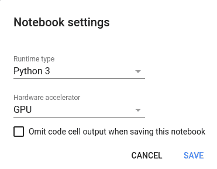
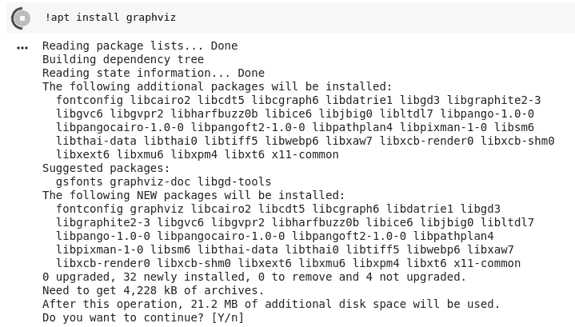

# 3 个必备的 Google Colaboratory 小贴士和技巧

> 原文：[`www.kdnuggets.com/2018/02/essential-google-colaboratory-tips-tricks.html`](https://www.kdnuggets.com/2018/02/essential-google-colaboratory-tips-tricks.html)

评论


像你们中的许多人一样，我对 Google 的 Colaboratory 项目感到非常兴奋。虽然它并不完全是新的，但最近的公开发布引起了对这个协作平台的许多新的兴趣。

对于那些不知道的人，[Google Colaboratory](https://colab.research.google.com/notebooks/welcome.ipynb) 是...

> [...] 一个 Google 研究项目，旨在帮助传播机器学习教育和研究。这是一个 Jupyter notebook 环境，使用时无需设置，完全运行在云端。

以下是一些简单的提示，帮助你在使用 Colab 时更好地发挥其能力。需要明确的是，这些不是隐藏的技巧，而是一个实用的文档（并进一步澄清）功能集合，这些功能可能是必不可少的。

### **1\. 使用免费的 GPU 运行时**

选择“运行时”，“更改运行时类型”，这就是你看到的弹出窗口：



确保“硬件加速器”设置为 GPU（默认是 CPU）。之后，确保你已连接到运行时（菜单带子中“连接”旁有一个绿色勾号）。

要检查你是否有可见的 GPU（即你当前是否连接到 GPU 实例），运行以下摘录（直接来自 Google 的代码示例）：

```py
import tensorflow as tf
device_name = tf.test.gpu_device_name()
if device_name != '/device:GPU:0':
  raise SystemError('GPU device not found')
print('Found GPU at: {}'.format(device_name))
```

如果你已连接，以下是响应：

```py
Found GPU at: /device:GPU:0
```

另外，供需问题可能导致以下情况：


就这样。这允许你一次使用免费 GPU 最长达 12 小时。

### **2\. 安装库**

目前，Google Colaboratory 中的软件安装是不持久的，也就是说，你每次（重新）连接到实例时，都必须重新安装库。由于 Colab 默认安装了许多有用的常见库，因此这并不像看起来那么成问题，而未预装的库可以通过几种不同的方法轻松添加。

然而，你需要意识到，安装任何需要从源代码构建的软件可能会比在连接/重新连接到实例时的时间更长。

Colab 支持 `pip` 和 `apt` 包管理器。无论你使用哪种管理器，请记得在任何 bash 命令前加上 !。

```py

# Install Keras with pip
!pip install -q keras
import keras

>>> Using TensorFlow backend.

# Install GraphViz with apt
!apt-get install graphviz -y

```



### **3\. 上传和使用数据文件**

你需要在 Colab 笔记本中使用数据，对吧？你可以使用类似 `wget` 的工具从网上获取数据，但如果你有一些本地文件想上传到 Google Drive 中的 Colab 环境并使用怎么办？

我认为这是最简单的方法，附带一点来自[这里](https://stackoverflow.com/questions/47320052/load-local-data-files-to-colaboratory)的指引。

在一个三步过程的第一步，首先在你的笔记本中调用一个文件选择器，使用：

```py
from google.colab import files
uploaded = files.upload()

```

选择文件后，使用以下方法迭代上传的文件，以查找它们的关键名称，使用：

```py
for fn in uploaded.keys():
  print('User uploaded file "{name}" with length {length} bytes'.format(name=fn, length=len(uploaded[fn])))

```

示例输出：

```py
User uploaded file "iris.csv" with length 3716 bytes
```

现在，使用以下方法将文件内容加载到 Pandas DataFrame 中：

```py
import pandas as pd
import io
df = pd.read_csv(io.StringIO(uploaded['iris.csv'].decode('utf-8')))
print(df)

```

就这样。虽然还有其他方法可以达到相同的目的，上传和使用数据文件，但我发现这种方法最直接、最简单。

Google Colab 让我兴奋地尝试以类似于使用 Jupyter 笔记本的方式进行机器学习，但设置和管理更少。无论如何，这就是我们的想法；我们拭目以待。

如果你有任何有用的 Colab 技巧或窍门，请在下面的评论中留下。

**相关内容**：

+   Fast.ai 第 1 课在 Google Colab（免费 GPU）

+   从笔记本到 JupyterLab——数据科学 IDE 的演变

+   Python 中的探索性数据分析

* * *

## 我们的前三个课程推荐

 1\. [谷歌网络安全证书](https://www.kdnuggets.com/google-cybersecurity) - 快速进入网络安全职业生涯。

 2\. [谷歌数据分析专业证书](https://www.kdnuggets.com/google-data-analytics) - 提升你的数据分析技能

 3\. [谷歌 IT 支持专业证书](https://www.kdnuggets.com/google-itsupport) - 支持你的组织的 IT 工作

* * *

### 更多相关话题

+   [建立一个坚实的数据团队](https://www.kdnuggets.com/2021/12/build-solid-data-team.html)

+   [使用管道编写干净的 Python 代码](https://www.kdnuggets.com/2021/12/write-clean-python-code-pipes.html)

+   [停止学习数据科学以寻找目标，并通过寻找目标来……](https://www.kdnuggets.com/2021/12/stop-learning-data-science-find-purpose.html)

+   [一个 90 亿美元的 AI 失败，经过审查](https://www.kdnuggets.com/2021/12/9b-ai-failure-examined.html)

+   [学习数据科学统计学的顶级资源](https://www.kdnuggets.com/2021/12/springboard-top-resources-learn-data-science-statistics.html)

+   [成功数据科学家的 5 个特征](https://www.kdnuggets.com/2021/12/5-characteristics-successful-data-scientist.html)
