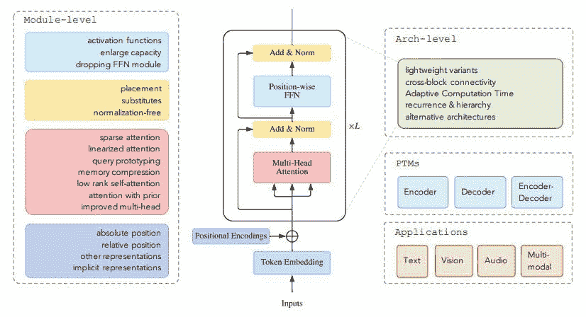
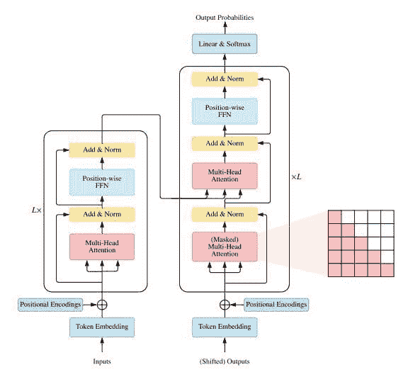

# 《变压器的基本指南：现代最先进人工智能的关键》

> 原文：[`www.kdnuggets.com/2021/06/essential-guide-transformers-key-modern-sota-ai.html`](https://www.kdnuggets.com/2021/06/essential-guide-transformers-key-modern-sota-ai.html)

评论

你是否被各种 X-formers 的浩繁数量所压倒？

不，它们不是像 X 战警、X 因素和 X 力量那样来自漫威的新变种团队。X-formers 是指各种变压器变体的名称，这些变体已经被实现或提议。你可能通过最近在自然语言处理、计算机视觉和其他人工智能领域的成功故事了解了变压器，但你是否熟悉所有的 X-formers？更重要的是，你知道它们之间的区别，以及为什么你可能会选择其中一个而不是另一个吗？

* * *

## 我们的前三名课程推荐

 1\. [谷歌网络安全证书](https://www.kdnuggets.com/google-cybersecurity) - 快速进入网络安全职业生涯。

 2\. [谷歌数据分析专业证书](https://www.kdnuggets.com/google-data-analytics) - 提升你的数据分析能力

 3\. [谷歌 IT 支持专业证书](https://www.kdnuggets.com/google-itsupport) - 支持你的组织在 IT 方面

* * *

**[变压器调查](https://arxiv.org/abs/2106.04554)**，由 Tianyang Lin, Yuxin Wang, Xiangyang Liu 和 Xipeng Qiu 编写，旨在帮助对此感兴趣的读者。

摘要：

> [A] 提出了各种各样的变压器变体（即 X-formers），然而，系统全面的文献综述仍然缺失。在这篇调查中，我们提供了各种 X-formers 的综合综述。我们首先简要介绍了原始变压器，然后提出了一种新的 X-formers 分类法。接下来，我们从三个方面介绍了各种 X-formers：架构修改、预训练和应用。最后，我们概述了一些未来研究的潜在方向。

这就是本调查论文所涵盖的三万英尺高度的视角；让我们更详细地看看。

图 1\. 变压器变体的分类（来源：[变压器调查](https://arxiv.org/abs/2106.04554)）

在介绍变压器之后，论文建立了许多后续变压器变体的概念，即上述的 X-formers，并指出这些不同的架构都试图从以下一个方面改进原始变压器：模型效率、模型泛化和模型适应。论文将继续讨论这些变化的观点，以及它们如何与随后提出的各种 X-formers 相关。

接下来，论文深入探讨了普通 Transformer 架构的技术细节（见图 2），包括其使用情况和性能分析。

在具体变体之前，作者对 Transformer 与其他架构进行了比较和对比。这一讨论包括对自注意力机制和归纳偏差的分析。在这里，Transformer 与以下架构进行比较：全连接深度神经网络、卷积网络和递归网络，比较了每层的复杂性、最小的序列操作数量和最大路径长度。

然后展示了一个 Transformer 的分类（见图 1），指出各种提出的模型试图从三个方面改进普通 Transformer：架构修改类型、预训练方法和应用。

图 2\. 普通 Transformer 架构（来源：[A Survey of Transformers](https://arxiv.org/abs/2106.04554)）

调查的核心内容出现在以下几节中，其中第一节专注于对注意力机制的改进，详细讨论了上述几个特定架构，并基于这些改进提出了 Transformer 的分类。为了促进改进，已经采取了几种不同的发展方向，并讨论了这些方向，包括：

+   稀疏注意力

+   线性化注意力

+   查询原型和记忆压缩

+   低秩自注意力

+   带有先验的注意力

+   改进的多头机制

作者随后转向其他 X-former 模块级的修改，与架构级的修改（在后续部分讨论）相对。这些修改包括位置表示、层归一化和位置-wise 前馈网络层。详细讨论了这些修改，阐明了它们为何对 Transformer 架构重要，以及各种改进的提案。

接下来是架构级的 X-former 变体，讨论了模块级之外的修改，包括：

+   使 Transformer 轻量化

+   强化跨块连接

+   自适应计算时间

+   具有分治策略的 Transformers

+   探索替代架构

最后一种修改类型，探索替代架构，提到“几项研究探索了 Transformer 的替代架构”，并讨论了这些研究可能的未来发展方向。

下一部分讨论了预训练的 Transformers，同时指出了 Transformers 的潜在问题：

> Transformer 不对数据结构做任何假设。一方面，这使得 Transformer 成为一种非常通用的架构，具有捕捉不同范围依赖关系的潜力。另一方面，这使得 Transformer 在数据有限时容易过拟合。缓解这一问题的一种方法是将归纳偏差引入模型中。

介绍了仅编码器（包括 BERT 系列）、仅解码器（包括 GPT 系列）和编码器-解码器（包括 BART，一种扩展的 BERT 方法）架构的简要概述，涉及归纳偏差。

论文接着总结了 Transformers 的应用——如果你已经看到这一步，你可能已经了解——包括它在 NLP、CV、音频和多模态应用中的使用。最后，作者总结了 X-former 相关研究的结论和未来方向，指出了这些方向的潜在进一步发展：

+   理论分析

+   超越注意力的更佳全局交互机制

+   多模态数据的统一框架

作者在论文中做得非常出色。如果你有兴趣理清各种 X-formers 之间的具体关系，我建议你阅读 Tianyang Lin、Yuxin Wang、Xiangyang Liu 和 Xipeng Qiu 的 [Transformers 调查](https://arxiv.org/abs/2106.04554)。

**相关**：

+   现在学习自然语言处理的神经网络

+   自然语言处理研究和应用的新资源

+   入门 5 个必备自然语言处理库

### 更多相关话题

+   [介绍 MetaGPT 的数据解释器：SOTA 开源 LLM 基于…](https://www.kdnuggets.com/metagpt-data-interpreter-open-source-llm-based-data-solutions)

+   [机器学习算法基础：初学者指南](https://www.kdnuggets.com/2021/05/essential-machine-learning-algorithms-beginners.html)

+   [数据科学家的探索性数据分析基本指南](https://www.kdnuggets.com/2023/06/data-scientist-essential-guide-exploratory-data-analysis.html)

+   [SQL 执行顺序的基本指南](https://www.kdnuggets.com/the-essential-guide-to-sql-execution-order)

+   [数据分析师必备工具的综合指南](https://www.kdnuggets.com/a-comprehensive-guide-to-essential-tools-for-data-analysts)

+   [10 种现代数据工程工具](https://www.kdnuggets.com/2022/07/10-modern-data-engineering-tools.html)
