# 数据科学和机器学习的基本线性代数

> 原文：[`www.kdnuggets.com/2021/05/essential-linear-algebra-data-science-machine-learning.html`](https://www.kdnuggets.com/2021/05/essential-linear-algebra-data-science-machine-learning.html)

评论

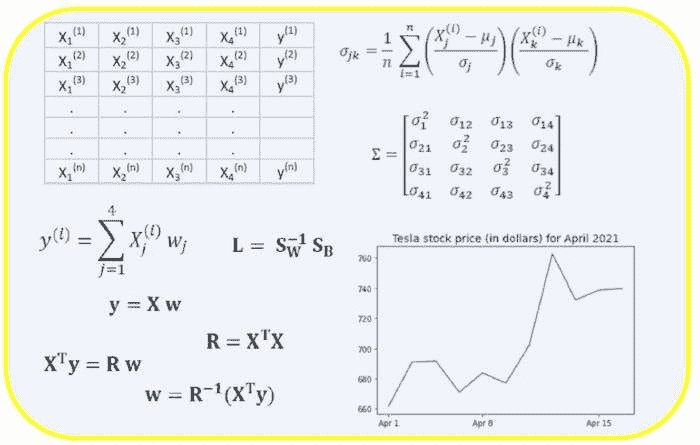

*图片来源：Benjamin O. Tayo.*

线性代数是数学的一个分支，在数据科学和机器学习中非常有用。线性代数是机器学习中最重要的数学技能。大多数机器学习模型可以用矩阵形式表示。数据集本身通常被表示为矩阵。线性代数用于数据预处理、数据转换和模型评估。你需要熟悉以下主题：

+   向量

+   矩阵

+   矩阵的转置

+   矩阵的逆

+   矩阵的行列式

+   矩阵的迹

+   点积

+   特征值

+   特征向量

在本文中，我们使用科技股票数据集来说明线性代数在数据科学和机器学习中的应用，数据集可以在 [这里](https://github.com/bot13956/datasets/blob/master/tech-stocks-04-2021.csv) 找到。

### 1\. 数据预处理中的线性代数

我们首先说明线性代数在数据预处理中的应用。

**1.1 导入线性代数所需的库**

```py
import numpy as np
import pandas as pd
import pylab
import matplotlib.pyplot as plt
import seaborn as sns

```

**1.2 读取数据集并显示特征**

```py
data = pd.read_csv("tech-stocks-04-2021.csv")
data.head()

```

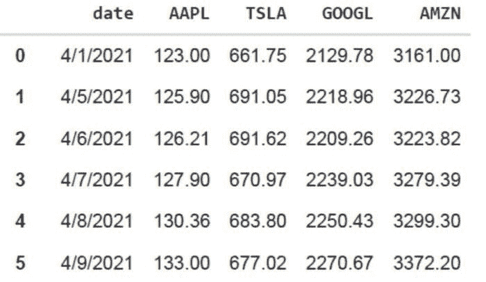

* **表 1**. 2021 年 4 月前 16 天的选定股票价格表.*

```py
print(data.shape)
output = (11,5) 

```

***data.shape*** 函数使我们能够知道数据集的大小。在这种情况下，数据集有 5 个特征（日期、AAPL、TSLA、GOOGL 和 AMZN），每个特征有 11 个观测值。*日期* 指的是 2021 年 4 月的交易日（截至 4 月 16 日）。AAPL、TSLA、GOOGL 和 AMZN 分别是苹果、特斯拉、谷歌和亚马逊的收盘股价。

**1.3 数据可视化**

为了进行数据可视化，我们需要定义 ***列矩阵*** 以便可视化特征：

```py
x = data['date']
y = data['TSLA']
plt.plot(x,y)
plt.xticks(np.array([0,4,9]), ['Apr 1','Apr 8','Apr 15'])
plt.title('Tesla stock price (in dollars) for April 2021',size=14)
plt.show()

```

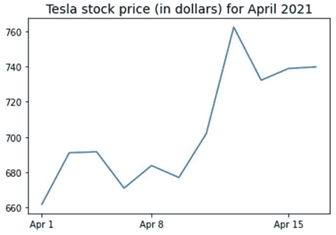

***图** **1**. 2021 年 4 月前 16 天的特斯拉股票价格.*

### 2\. 协方差矩阵

***协方差矩阵*** 是数据科学和机器学习中最重要的矩阵之一。它提供了特征之间共同运动（相关性）的信息。假设我们有一个特征矩阵，其中包含 *4* 个特征和 *n* 个观测值，如 **表 2** 所示：

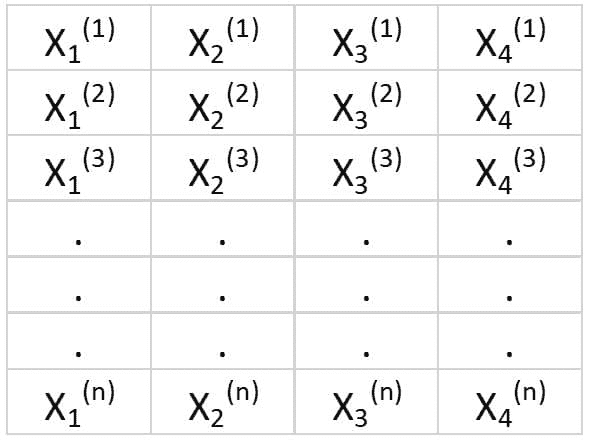

***表 2**. 具有 4 个变量和 n 个观测值的特征矩阵.*

为了可视化特征之间的相关性，我们可以生成散点对比图：

```py
cols=data.columns[1:5]
print(cols)
output = Index(['AAPL', 'TSLA', 'GOOGL', 'AMZN'], dtype='object')
sns.pairplot(data[cols], height=3.0)

```

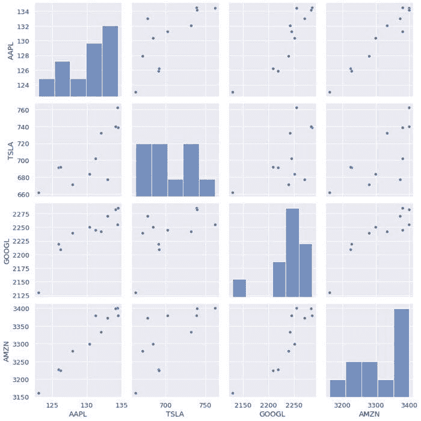

***图 2**. 选定科技股票的散点对比图.*

为了量化特征之间的相关程度（多重共线性），我们可以使用以下公式计算协方差矩阵：

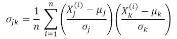

其中和分别是特征的均值和标准差。这个方程表明，当特征标准化时，协方差矩阵仅仅是特征之间的***点积***。

在线性形式下，协方差矩阵可以表示为一个 4 x 4 的实对称矩阵：

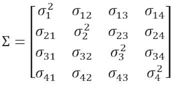

这个矩阵可以通过执行***单位 ary 变换***，也称为主成分分析（PCA）变换，来对角化，得到以下结果：

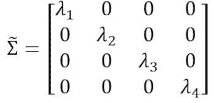

由于***矩阵的迹值***在单位 ary 变换下保持不变，我们观察到对角矩阵的特征值之和等于特征 X[1]、X[2]、X[3]和 X[4]中包含的总方差。

**2.1 计算技术股票的协方差矩阵**

```py
from sklearn.preprocessing import StandardScaler
stdsc = StandardScaler()
X_std = stdsc.fit_transform(data[cols].iloc[:,range(0,4)].values)
cov_mat = np.cov(X_std.T, bias= True)

```

请注意，这使用了标准化矩阵的***转置***。

**2.2 协方差矩阵的可视化**

```py
plt.figure(figsize=(8,8))
sns.set(font_scale=1.2)
hm = sns.heatmap(cov_mat,
                 cbar=True,
                 annot=True,
                 square=True,
                 fmt='.2f',
                 annot_kws={'size': 12},
                 yticklabels=cols,
                 xticklabels=cols)
plt.title('Covariance matrix showing correlation coefficients')
plt.tight_layout()
plt.show()

```

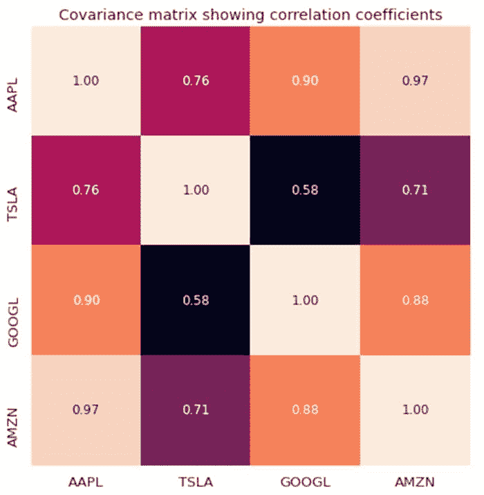

***图 3**。选定技术股票的协方差矩阵图。*

从图 3 中我们观察到，AAPL 与 GOOGL 和 AMZN 有较强的相关性，而与 TSLA 的相关性较弱。TSLA 一般与 AAPL、GOOGL 和 AMZN 的相关性较弱，而 AAPL、GOOGL 和 AMZN 之间的相关性较强。

**2.3 计算协方差矩阵的特征值**

```py
np.linalg.eigvals(cov_mat)
output = array([3.41582227, 0.4527295 , 0.02045092, 0.11099732])
np.sum(np.linalg.eigvals(cov_mat))
output = 4.000000000000006
np.trace(cov_mat)
output = 4.000000000000001 

```

我们观察到，协方差矩阵的迹值等于特征值的总和，这与预期一致。

**2.4 计算累积方差**

由于矩阵的迹值在单位 ary 变换下保持不变，我们观察到对角矩阵的特征值之和等于特征 X[1]、X[2]、X[3]和 X[4]中包含的总方差。因此，我们可以定义以下量：

**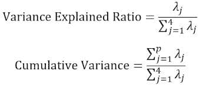**

注意，当*p*=4 时，累积方差如预期变为 1。

```py
eigen = np.linalg.eigvals(cov_mat)
cum_var = eigen/np.sum(eigen)
print(cum_var)
output = [0.85395557 0.11318237 0.00511273 0.02774933]

print(np.sum(cum_var))
output = 1.0

```

我们从累积方差（***cum_var***）中观察到，85%的方差包含在第一个特征值中，11%包含在第二个特征值中。这意味着当 PCA 实施时，只能使用前两个主成分，因为这两个主成分贡献了 97%的总方差。这实际上可以将特征空间的维度从 4 减少到 2。

### 3. 线性回归矩阵

假设我们有一个数据集，包含 4 个预测特征和*n*个观测值，如下所示。

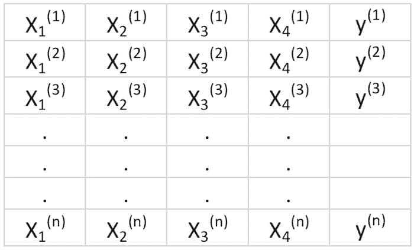

***表 3**。包含 4 个变量和 n 个观测值的特征矩阵。第 5 列是目标变量（y）。*

我们希望建立一个多重回归模型来预测*y*值（第 5 列）。因此，我们的模型可以表示为以下形式

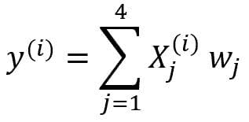

在线性形式下，这个方程可以写作

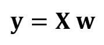

其中**X**是(n x 4)特征矩阵，**w**是(4 x 1)矩阵，表示待确定的回归系数，而**y**是(n x 1)矩阵，包含目标变量 y 的 n 个观测值。

注意**X**是一个矩形矩阵，因此我们不能通过取**X**的逆来解上述方程。

为了将**X**转换为方阵，我们将方程的左侧和右侧都乘以**X**的***转置***，即

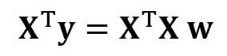

这个方程也可以表达为

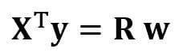

其中

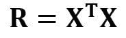

是(4×4)回归矩阵。显然，我们观察到**R**是一个实对称矩阵。注意，在线性代数中，两个矩阵的乘积的转置遵循以下关系

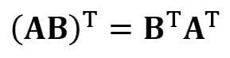

现在我们已经将回归问题简化，并将其表示为(4×4)实对称且可逆的回归矩阵**R**，很容易展示回归方程的精确解为

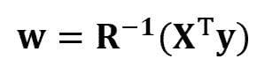

预测连续和离散变量的回归分析示例如下：

[绝对初学者的线性回归基础](https://pub.towardsai.net/linear-regression-basics-for-absolute-beginners-68ed9ff980ae)

[使用最小二乘法构建感知机分类器](https://github.com/bot13956/perceptron_classifier)

### 4\. 线性判别分析矩阵

数据科学中的另一个实对称矩阵示例是线性判别分析（LDA）矩阵。这个矩阵可以表示为：

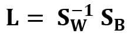

其中**S[W]**是特征内部散布矩阵，**S[B]**是特征间散布矩阵。由于矩阵**S[W]**和**S[B]**都是实对称的，因此**L**也是实对称的。对**L**的对角化产生了一个优化类别可分离性并减少维度的特征子空间。因此，LDA 是一个监督算法，而 PCA 不是。

关于 LDA 的实施的更多细节，请参见以下参考文献：

[机器学习：通过线性判别分析进行降维](https://medium.com/towards-artificial-intelligence/machine-learning-dimensionality-reduction-via-linear-discriminant-analysis-cc96b49d2757)

[使用鸢尾花数据集实现 LDA 的 GitHub 存储库](https://github.com/bot13956/linear-discriminant-analysis-iris-dataset)

[Sebastian Raschka 的《Python 机器学习》第三版（第五章）](https://github.com/rasbt/python-machine-learning-book-3rd-edition)

### 摘要

总结一下，我们讨论了线性代数在数据科学和机器学习中的几种应用。通过使用技术股票数据集，我们阐明了矩阵的大小、列矩阵、方阵、协方差矩阵、矩阵的转置、特征值、点积等重要概念。线性代数是数据科学和机器学习中的一个重要工具。因此，初学者如果对数据科学感兴趣，必须熟悉线性代数中的基本概念。

**相关：**

+   [如何克服对数学的恐惧并学习数据科学中的数学](https://www.kdnuggets.com/2021/03/overcome-fear-learn-math-data-science.html)

+   [数据科学的基本数学：矩阵和矩阵乘积简介](https://www.kdnuggets.com/2021/02/essential-math-data-science-matrices-matrix-product.html)

+   [矩阵分解解码](https://www.kdnuggets.com/2020/12/matrix-decomposition-decoded.html)

* * *

## 我们的前三个课程推荐

 1\. [Google 网络安全证书](https://www.kdnuggets.com/google-cybersecurity) - 快速进入网络安全职业轨道。

 2\. [Google 数据分析专业证书](https://www.kdnuggets.com/google-data-analytics) - 提升你的数据分析能力

 3\. [Google IT 支持专业证书](https://www.kdnuggets.com/google-itsupport) - 支持你所在组织的 IT 工作

* * *

### 了解更多相关内容

+   [建立一个稳固的数据团队](https://www.kdnuggets.com/2021/12/build-solid-data-team.html)

+   [使用管道编写干净的 Python 代码](https://www.kdnuggets.com/2021/12/write-clean-python-code-pipes.html)

+   [成为优秀数据科学家所需的 5 项关键技能](https://www.kdnuggets.com/2021/12/5-key-skills-needed-become-great-data-scientist.html)

+   [每个初学者数据科学家应掌握的 6 种预测模型](https://www.kdnuggets.com/2021/12/6-predictive-models-every-beginner-data-scientist-master.html)

+   [2021 年最佳 ETL 工具](https://www.kdnuggets.com/2021/12/mozart-best-etl-tools-2021.html)

+   [学习机器学习线性代数的 3 个免费资源](https://www.kdnuggets.com/2022/03/top-3-free-resources-learn-linear-algebra-machine-learning.html)
