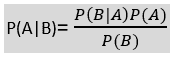

# 必要的机器学习算法：初学者指南

> 原文：[`www.kdnuggets.com/2021/05/essential-machine-learning-algorithms-beginners.html`](https://www.kdnuggets.com/2021/05/essential-machine-learning-algorithms-beginners.html)

当机器根据历史和数据模式做出类似人类的决策时，后台有几个[机器学习算法](https://www.kdnuggets.com/2016/08/10-algorithms-machine-learning-engineers.html)在执行这些功能。无论是根据用户数据历史搜索适当的用户选项的应用程序，还是在玩智力游戏如国际象棋中，机器决定每一步行动。

* * *

## 我们的前三大课程推荐

 1\. [谷歌网络安全证书](https://www.kdnuggets.com/google-cybersecurity) - 加速进入网络安全职业的快车道

 2\. [谷歌数据分析专业证书](https://www.kdnuggets.com/google-data-analytics) - 提升你的数据分析能力

 3\. [谷歌 IT 支持专业证书](https://www.kdnuggets.com/google-itsupport) - 支持你所在的组织的 IT 工作

* * *

## 机器学习算法的类型

目前，机器学习是一个快速发展的人工智能领域，机器通过实现类似于人脑的人工神经网络（ANN）来像人类一样思考和决策。它们帮助定制和分析用户内容和数据，以减少长期的整体需求和[应用维护成本](https://www.mobileappdaily.com/cost-to-maintain-an-app)。

人工神经网络（ANN）包括人工神经元和节点，这些节点形成了输入层、隐藏层以及输出层这三层。这些层共同形成了每个机器学习算法的功能。数据以各种输入节点的形式提供给输入层。每个节点携带特定的信息。输入节点与随机权重和其他必要变量相乘，最后通过加上偏差进行计算。最后，应用非线性函数，也称为激活函数，以确定哪个神经元被激活。由于有数百万个神经元和输入可供选择，这些算法通常涉及复杂的功能，需要一定的处理能力来实现平稳的输出。

这些是主要的机器学习算法类型：

### **监督学习算法**

当算法的结果类型已知于开发者，并且开发者明确标注了待分析的数据以得出结果时。监督学习主要扩大数据的范围，并帮助软件和硬件基于标记的样本数据对不可用、未来或未见过的数据进行预测。监督学习算法广泛用于对“输入”数据类型进行分类以及将其回归到最终提供输出的模式中。例如，价格预测和趋势预测等过程由监督学习算法处理。

### **无监督学习算法**

在无监督机器学习算法的范围内，没有定义的输出或输入类型或任何特别标记的数据供算法利用。它们的输出和学习不在开发者的直接控制下。它们的功能用于探索信息的结构、提取有价值的见解、检测模式，并将其实施到操作中以提高效率。数字营销和广告技术领域已知积极使用这些 ML 算法为用户提供定制服务。

### **半监督学习算法**

这些算法介于监督学习和无监督学习之间，其中使用指定数据集中的输出进一步“训练”算法以标记未标记的数据，然后将两者结合起来。许多法律和医疗行业成功使用半监督算法来管理其网络内容分类、图像和语音分析等。

### **强化学习算法**

当系统将先前分析的输出的学习强化到其新的分析中时，这是一种强化学习算法。它包括大多数基于 AI 的功能，其中算法自主学习并随着使用变得更加智能。在这里，开发者试图开发一个自我维持的系统，通过连续的尝试和失败，基于标记数据和与新数据的交互来改进自己。自动驾驶汽车和现代视频游戏都是基于强化学习的 ML 算法的例子。

## 你应该了解的 ML 算法

让我们现在分析一些被称为未来将会变得著名的特定 ML 算法的功能。

### 线性回归

线性回归算法由机器用于分析数据，并根据特定的输入变量形成特定的“视觉斜率”以进行准确预测。它们有监督学习算法，简单版本通常基于类似的方程式。

**y = ax + b**

其中，x 和 y 分别是输入和输出变量。在多变量场景中，方程如：

**f(x,y,z) = w[1]x + w[2]y + w[3]z**

其中 x、y 和 z 代表要分析和预测的函数属性。

### 逻辑回归

这些也是监督学习算法，利用预测分析的概念来分类问题以寻找解决方案。它被企业用来通过将数据拟合到逻辑函数中来预测事件的概率。因此，它也被称为逻辑回归，并基本上在基于线性回归的算法（上述提到的）中包含了一个复杂的“成本函数”效用（本质上在 0 和 1 之间）。它往往发展为“Sigmoid 函数”，根据概率有效地预测值。

### 朴素贝叶斯

这是一种快速工作的监督学习算法，假设某一特征的出现与其他特征的出现是独立的，并且这种函数的输出值可以使用[贝叶斯定理](https://www.mathsisfun.com/data/bayes-theorem.html)计算：

在垃圾邮件过滤、情感分析和分类文章相关算法中广泛使用；朴素贝叶斯是一种概率分类器，这意味着它基于对象的概率进行预测。

### K-最近邻（K-NN）

K-NN 算法分析新案例或数据与先前可用案例之间的相似性，并将新案例放入与现有类别最相似的类别中。在训练阶段，它仅存储先前可用的数据集，当获取到新数据时，它将这些数据分类到与新数据最相似的类别中。这是一种易于使用的监督学习算法，主要用于解决分类问题，包括图像搜索的图像分类等。

### K 均值聚类

K 均值聚类是一种简单的无监督机器学习算法，它有效地根据某些相似性（数据点）对数据进行聚类，并尝试分析所有数据模式。为实现这一目标，K 均值在数据集中寻找固定数量（k）的簇，而“均值”一词表示对可用数据集的平均值计算。

## 前路...

作为一项技术，机器学习已经逐渐成型，并塑造了其他技术；它们无处不在。除了上述提到的算法，还有其他一些算法也有助于满足这些标准和需求。但是，这些算法不能通过简单、广泛使用的 DIY 网站或平台纳入你的数字资产。为了实现这些功能，你需要聘请一位具有适当专业知识和经验的专职移动应用开发者！你还需要了解[机器学习项目的预计时间和成本](https://appinventiv.com/blog/machine-learning-app-project-estimate/)，以确保开发和交付过程的顺利进行。

**[Ria Katiyar](https://www.linkedin.com/in/ria-katiyar/)** 是一位内容贡献者，喜欢以简化和吸引人的方式撰写她的理解和知识。她是早期采用者，喜欢跟进最新的趋势和技术。

### 相关主题

+   [初学者的十大机器学习算法指南](https://www.kdnuggets.com/a-beginner-guide-to-the-top-10-machine-learning-algorithms)

+   [每个初学者都应该学习的 10 个基本 DevOps 工具](https://www.kdnuggets.com/10-essential-devops-tools-every-beginner-should-learn)

+   [初学者的端到端机器学习指南](https://www.kdnuggets.com/2021/12/beginner-guide-end-end-machine-learning.html)

+   [初学者的 Python 机器学习指南](https://www.kdnuggets.com/beginners-guide-to-machine-learning-with-python)

+   [初学者的深度检查机器学习测试指南](https://www.kdnuggets.com/beginners-guide-to-machine-learning-testing-with-deepchecks)

+   [初学者的 AI 和机器学习职业指南](https://www.kdnuggets.com/beginners-guide-to-careers-in-ai-and-machine-learning)
