# 数据科学中的基础数学：积分与曲线下的面积

> 原文：[`www.kdnuggets.com/2020/11/essential-math-data-science-integrals-area-under-curve.html`](https://www.kdnuggets.com/2020/11/essential-math-data-science-integrals-area-under-curve.html)

评论

微积分是数学的一个分支，提供了研究函数变化率的工具，通过两个主要领域：导数和积分。在机器学习和数据科学的背景下，你可能会使用积分来计算曲线下的面积（例如，用于评估模型的性能与 ROC 曲线，或从密度中计算概率）。

* * *

## 我们的前三个课程推荐

 1\. [谷歌网络安全证书](https://www.kdnuggets.com/google-cybersecurity) - 快速进入网络安全职业生涯。

 2\. [谷歌数据分析专业证书](https://www.kdnuggets.com/google-data-analytics) - 提升你的数据分析技能

 3\. [谷歌 IT 支持专业证书](https://www.kdnuggets.com/google-itsupport) - 支持你的组织的 IT

* * *

在这篇文章中，你将通过使用 ROC 曲线下的面积这一实际数据科学示例来学习积分和曲线下的面积。以此示例为基础，你将从数学角度了解曲线下的面积和积分（参考我的书《数据科学中的基础数学》）。

### 实践项目

假设你想根据红酒的各种化学属性预测其质量。你希望对质量进行二分类（区分非常好的酒和不是很好的酒）。你将开发方法来评估考虑到不平衡数据的模型，利用接收者操作特征（ROC）曲线下的面积。

**数据集**

为此，我们将使用一个数据集，展示红酒的各种化学性质及其质量评分。数据集来源于此：https://archive.ics.uci.edu/ml/datasets/wine+quality。相关论文为 Cortez, Paulo, et al. ”通过从物理化学性质中挖掘数据建模酒类偏好。” Decision Support Systems 47.4 (2009): 547-553。

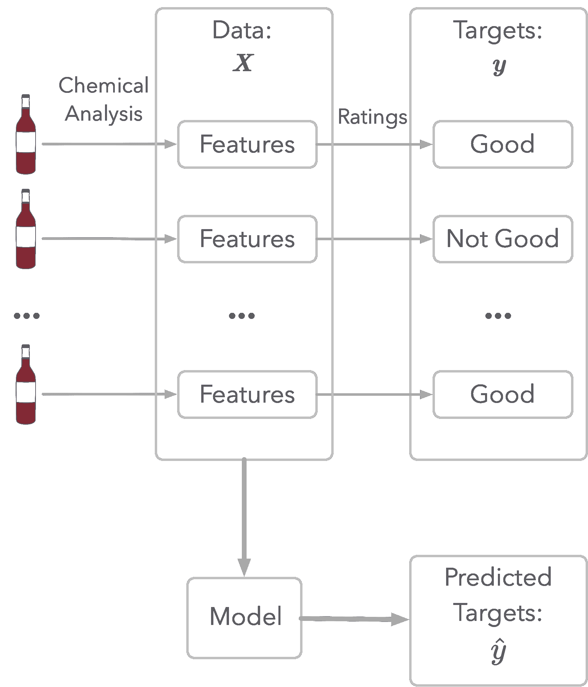

*图 1：酒质建模的示意图。*

如图 1 所示，数据集表示了酒的化学分析（特征）和质量评分。这个评分是目标：这是你将尝试估计的内容。

首先，让我们加载数据并查看特征：

```py
wine_quality = pd.read_csv("https://raw.githubusercontent.com/hadrienj/essential_math_for_data_science/master/data/winequality-red.csv",
                           sep=";")
wine_quality.columns 
```

```py
Index(['fixed acidity', 'volatile acidity', 'citric acid', 'residual sugar',
       'chlorides', 'free sulfur dioxide', 'total sulfur dioxide', 'density',
       'pH', 'sulphates', 'alcohol', 'quality'],
      dtype='object') 
```

最后一列`quality`很重要，因为你将把它作为分类的目标。质量通过从 3 到 8 的评级来描述：

```py
wine_quality["quality"].unique() 
```

```py
array([5, 6, 7, 4, 8, 3]) 
```

由于目标是对*非常好的*红酒进行分类，让我们决定当评分为 7 或 8 时葡萄酒是非常好的，否则不是非常好。

让我们创建一个数据集，其中`y`为质量（因变量，评分低于 7 为 0，评分大于或等于 7 为 1），`X`包含所有其他特征。

```py
X = wine_quality.drop("quality", axis=1).values
y = wine_quality["quality"] >= 7 
```

在查看数据之前，首先要做的事情是将数据分为训练集（用于训练算法）和测试集（用于测试算法）。这将允许你评估模型在训练过程中未见过的数据上的表现。

```py
from sklearn.model_selection import train_test_split
X_train, X_test, y_train, y_test = train_test_split(X, y, test_size=0.3, random_state=13) 
```

**预处理**

首先，让我们对数据进行标准化，以帮助算法的收敛。你可以使用 Sklearn 中的`StandardScaler`类。

请注意，你不想考虑测试集的数据来进行标准化。方法`fit_transform()`计算标准化所需的参数并同时应用它。然后，你可以将相同的标准化应用于测试集，而无需再次拟合。

```py
from sklearn.preprocessing import StandardScaler

scaler = StandardScaler()
X_train_stand = scaler.fit_transform(X_train)
X_test_stand = scaler.transform(X_test) 
```

**第一个模型**

作为第一个模型，让我们在训练集上训练一个逻辑回归模型，并计算测试集上的分类准确率（正确分类的百分比）：

```py
from sklearn.linear_model import LogisticRegression
from sklearn.metrics import accuracy_score

log_reg = LogisticRegression(random_state=123, penalty="none")
log_reg.fit(X_train_stand, y_train)
y_pred = log_reg.predict(X_test_stand)
accuracy_score(y_test, y_pred) 
```

```py
0.8729166666666667 
```

准确率约为 0.87，这意味着 87%的测试样本被正确分类。你应该对这个结果感到满意吗？

### 不平衡数据集的指标

**不平衡数据集**

由于我们将数据分为非常好的葡萄酒和不太好的葡萄酒，数据集是*不平衡的*：每个目标类别的数据量不同。

让我们检查一下负类（不太好的葡萄酒）和正类（非常好的葡萄酒）的观察数量：

```py
(y_train == 0).sum() / y_train.shape[0] 
```

```py
0.8650580875781948 
```

```py
(y_train == 1).sum() / y_train.shape[0] 
```

```py
0.13494191242180517 
```

这表明大约有 86.5%的样本对应于类别 0，13.5%对应于类别 1。

**简单模型**

为了说明关于准确率和不平衡数据集的这一点，让我们创建一个基线模型并查看其性能。这将帮助你看到使用其他指标而非准确率的优点。

一个非常简单的模型利用数据集不平衡的事实，会总是估计具有最多观察数量的类别。在你的案例中，这样的模型总是会估计所有葡萄酒都很差，并且得到不错的准确率。

让我们通过创建低于 0.5 的随机概率来模拟这个模型（例如，0.15 的概率表示类别为正的机会是 15%）。我们需要这些概率来计算准确率和其他指标。

```py
np.random.seed(1)
y_pred_random_proba = np.random.uniform(0, 0.5, y_test.shape[0])
y_pred_random_proba 
```

```py
array([2.08511002e-01, 3.60162247e-01, 5.71874087e-05, ...,
       4.45509477e-01, 1.36436118e-02, 2.61025624e-01]) 
```

假设如果概率高于 0.5，则类别被估计为正：

```py
def binarize(y_hat, threshold):
    return (y_hat > threshold).astype(int)

y_pred_random = binarize(y_pred_random_proba, threshold=0.5)
y_pred_random 
```

```py
array([0, 0, 0, ..., 0, 0, 0]) 
```

变量`y_pred_random`仅包含零。让我们评估这个随机模型的准确性：

```py
accuracy_score(y_test, y_pred_random) 
```

```py
0.8625 
```

这表明，即使使用随机模型，准确度也并不差：这并不意味着模型很好。

总结来说，拥有不同数量的每个类别的观察样本时，你不能仅依靠准确度来评估模型的性能。在我们的例子中，模型可能只输出零，你会得到大约 86%的准确度。

你需要其他指标来评估在不平衡数据集上的模型性能。

**ROC 曲线**

准确度的一个很好的替代指标是接收者操作特征（ROC）曲线。你可以查看 Aurélien Géron 对 ROC 曲线的非常好的解释，详见 Géron, Aurélien. *Hands-on machine learning with Scikit-Learn, Keras, and TensorFlow: Concepts, tools, and techniques to build intelligent systems*. O’Reilly Media, 2019。

主要思想是将模型的估计结果分成四类：

+   真正类（TP）：预测为 1 且真实类别为 1。

+   假阳性（FP）：预测为 1 但真实类别为 0。

+   真负类（TN）：预测为 0 且真实类别为 0。

+   假负类（FN）：预测为 0 但真实类别为 1。

让我们计算一下你第一个逻辑回归模型的这些值。你可以使用 Sklearn 中的函数`confusion_matrix`。它呈现的表格组织如下：

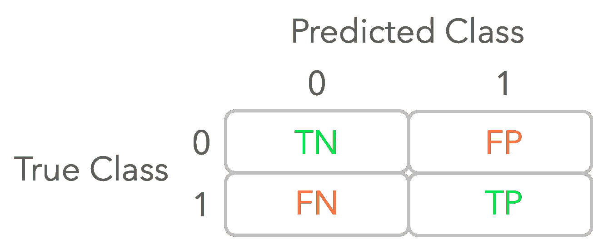

*图 2：混淆矩阵的示意图。*

```py
from sklearn.metrics import confusion_matrix
confusion_matrix(y_test, y_pred_random) 
```

```py
array([[414,   0],
       [ 66,   0]]) 
```

你可以看到，在随机模型下，没有正类观察被正确分类（TP）。

**决策阈值**

在分类任务中，你需要估计数据样本的类别。对于像逻辑回归这样的模型，它输出的是 0 到 1 之间的概率，你需要使用*决策阈值*或简称*阈值*将这个分数转换为类别 0 或 1。超过阈值的概率被视为正类。例如，使用默认的决策阈值 0.5 时，当模型输出的分数超过 0.5 时，你认为估计类别是 1。

然而，你可以选择其他阈值，你用来评估模型性能的指标将取决于这个阈值。

使用 ROC 曲线，你会考虑 0 到 1 之间的多个阈值，并计算每个阈值下的真正率与假阳性率的关系。

你可以使用 Sklearn 中的函数`roc_curve`来计算假阳性率（fpr）和真正率（tpr）。该函数还输出相应的阈值。让我们用我们模拟的随机模型尝试一下，其中输出值仅在 0.5 以下（`y_pred_random_proba`）。

```py
from sklearn.metrics import roc_curve
fpr_random, tpr_random, thresholds_random = roc_curve(y_test, y_pred_random_proba) 
```

让我们来看一下输出结果：

```py
fpr_random 
```

```py
array([0\.        , 0\.        , 0.07246377, ..., 0.96859903, 0.96859903,
       1\.        ]) 
```

```py
tpr_random 
```

```py
array([0\.        , 0.01515152, 0.01515152, ..., 0.98484848, 1\.        ,
       1\.        ]) 
```

```py
thresholds_random 
```

```py
array([1.49866143e+00, 4.98661425e-01, 4.69443239e-01, ...,
       9.68347894e-03, 9.32364469e-03, 5.71874087e-05]) 
```

现在，你可以根据这些值绘制 ROC 曲线：

```py
plt.plot(fpr_random, tpr_random)
# [...] Add axes, labels etc. 
```

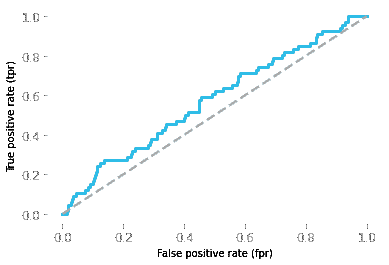

*图 3：对应于随机模型的 ROC 曲线。*

图 3 显示了对应于随机模型的 ROC 曲线。它给出了每个阈值下真正正例率作为假阳性率的函数。

但是，请注意，阈值范围从 1 到 0。例如，左下角的点对应于阈值为 1：此时没有真正的正例和假阳性，因为概率不可能超过 1，因此在阈值为 1 的情况下，没有观测值可以被分类为正例。在右上角，阈值为 0，因此所有观测值都被归类为正例，导致真正的正例和假阳性都达到 100%。

ROC 曲线接近对角线意味着模型不比随机模型好，这就是这里的情况。一个完美的模型应该与一个 ROC 曲线相关联，该曲线在所有假阳性率的值下的真正正例率为 1。

现在让我们来看一下你之前训练的逻辑回归模型对应的 ROC 曲线。你需要模型的概率，这可以通过使用`predict_proba()`而不是`predict`来获取：

```py
y_pred_proba = log_reg.predict_proba(X_test_stand)
y_pred_proba 
```

```py
array([[0.50649705, 0.49350295],
       [0.94461852, 0.05538148],
       [0.97427601, 0.02572399],
       ...,
       [0.82742897, 0.17257103],
       [0.48688505, 0.51311495],
       [0.8809794 , 0.1190206 ]]) 
```

第一列是类别 0 的分数，第二列是类别 1 的分数（因此每行的总和为 1），所以你可以只保留第二列。

```py
fpr, tpr, thresholds = roc_curve(y_test, y_pred_proba[:, 1])
plt.plot(fpr, tpr)
# [...] Add axes, labels etc. 
```

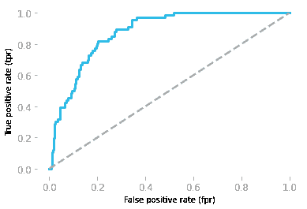

*图 4：对应于逻辑模型的 ROC 曲线。*

你可以在图 4 中看到你的模型实际上比随机模型要好，这不是你从模型准确率中能够得出的结论（它们是等效的：随机模型约为 0.86，你的模型约为 0.87）。

视觉检查是好的，但拥有一个单一的数值指标来比较你的模型也至关重要。这通常由 ROC 曲线下的面积提供。你将在接下来的章节中看到曲线下的面积是什么以及如何计算。

### 积分

*积分*是微分的逆操作。取一个函数*f(x)*并计算其导数*f′(x)*，*不定积分*（也称为*反导数*）的*f′(x)*会恢复*f(x)*（除了一个常数，如你将很快看到的那样）。

你可以使用积分来计算*曲线下的面积*，这就是由函数限定的形状的面积，如图 5 所示。

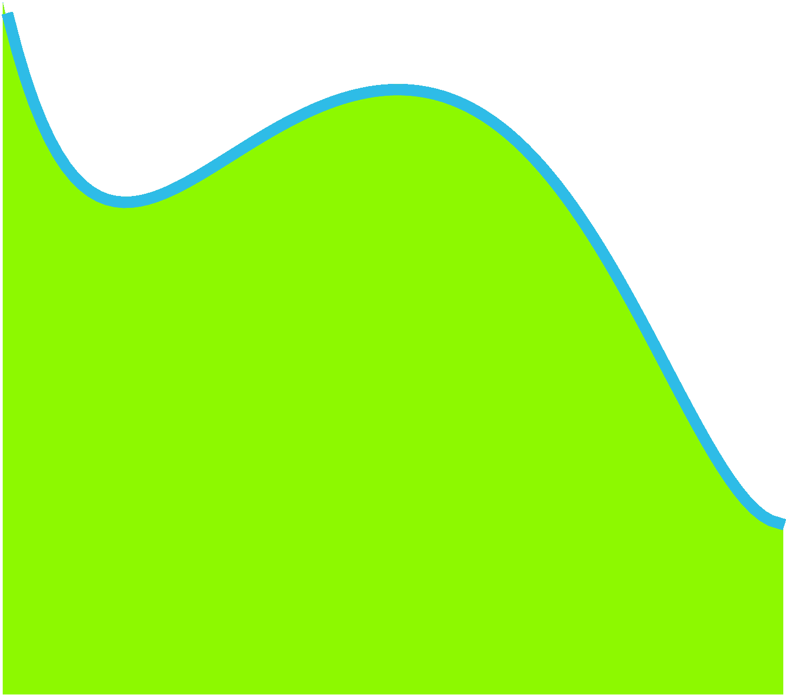

*图 5：曲线下的面积。*

*定积分*是特定区间上的积分。它对应于该区间内的曲线下的面积。

### 示例

通过这个示例，你将了解函数的积分与曲线下的面积之间的关系。为了说明这个过程，你将使用曲线下的面积的离散化来近似函数*g(x)=2x*的积分。

**示例描述**

再次以移动火车为例。你看到速度作为时间的函数是距离作为时间的函数的导数。这些函数在图 6 中表示。

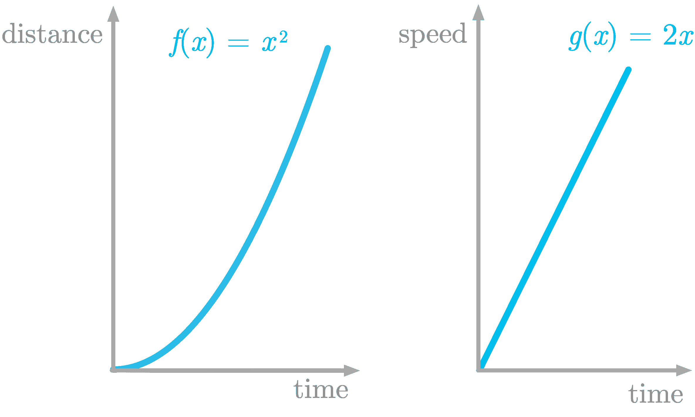

*图 6：左侧面板显示*f(x)*，它是时间函数的距离，右侧面板显示其导数*g(x)*，它是时间函数的速度。*

图 6 左侧面板中显示的函数定义为*f(x)=x²*。它的导数定义为*g(x)=2x*。

在这个例子中，你将学习如何找到*g(x)*曲线下方区域的近似值。

**函数切片**

要近似一个形状的面积，你可以使用切片方法：将形状切成小的矩形，计算这些矩形的面积并求和。

你将完全按照这种方法来找到*g(x)*曲线下方区域的近似值。

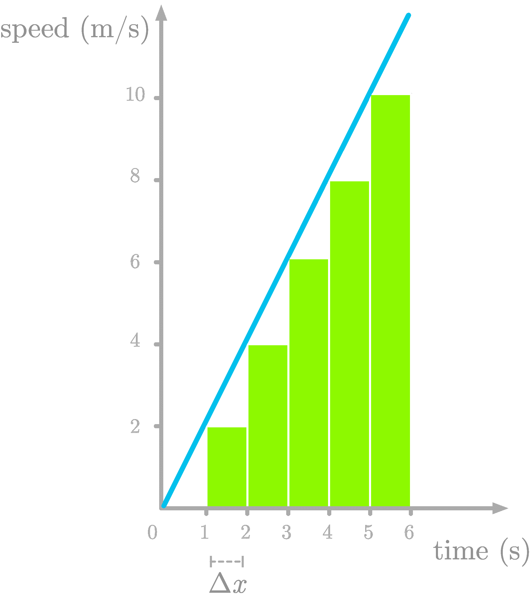

*图 7：通过将速度曲线下方的区域离散化来近似曲线下方的面积。*

图 7 显示了*f′(x)*曲线下方的区域被切成了一秒的矩形（我们称这种差异为*Δx*）。请注意，我们低估了该区域（查看缺失的三角形），但我们稍后会修正这个问题。

让我们尝试理解切片的含义。以第一个切片为例：它的面积定义为 2⋅12⋅1。切片的高度是一个秒钟内的速度（值为 2）。因此，第一个切片在单位时间内有两个速度单位。面积对应于速度和时间的乘积：这就是距离。

例如，如果你以每小时 50 英里的速度行驶两小时（时间），你 traveled *50⋅2=100 miles*（距离）。这是因为速度的单位对应于距离和时间之间的比率（如每小时英里）。你可以得到：

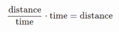

总结来说，距离对时间函数的导数是速度对时间函数，而速度对时间函数的曲线下方的面积（它的积分）给你一个距离。这就是导数和积分之间的关系。

**实现**

让我们使用切片来近似*g(x)=2x*的积分。首先，让我们定义函数*g(x)*：

```py
def g_2x(x):
    return 2 * x 
```

如图 7 所示，你将考虑函数是离散的，并取步长为*Δx=1*。你可以创建一个值从零到六的*x*轴，并对每一个这些值应用函数`g_2x()`。你可以使用 Numpy 方法`arange(start, stop, step)`来创建一个包含从`start`到`stop`（不包括）的值的数组：

```py
delta_x = 1
x = np.arange(0, 7, delta_x)
x 
```

```py
array([0, 1, 2, 3, 4, 5, 6]) 
```

```py
y = g_2x(x)
y 
```

```py
array([ 0,  2,  4,  6,  8, 10, 12]) 
```

然后你可以通过迭代计算切片的面积，将宽度（*Δx*）乘以高度（该点的*y*值）。如你所见，这个面积（`delta_x * y[i-1]`在下面的代码中）对应于距离（移动列车在第*i*个切片中行驶的距离）。最后，你可以将结果附加到一个数组中（`slice_area_all`在下面的代码中）。

请注意，`y`的索引是`i-1`，因为矩形在我们估计的*x*值的左侧。例如，*x=0*和*x=1*的面积为零。

```py
slice_area_all = np.zeros(y.shape[0])
for i in range(1, len(x)):
    slice_area_all[i] = delta_x * y[i-1]
slice_area_all 
```

```py
array([ 0.,  0.,  2.,  4.,  6.,  8., 10.]) 
```

这些值是切片的面积。

要计算从开始到相应时间点的行驶距离（而不是每个切片），可以使用 Numpy 函数`cumsum()`计算`slice_area_all`的累积和：

```py
slice_area_all = slice_area_all.cumsum()
slice_area_all 
```

```py
array([ 0.,  0.,  2.,  6., 12., 20., 30.]) 
```

这是*【g(x)】* 在*【x】*上的曲线下的面积的估计值。我们知道函数*【g(x)】* 是*f(x)=x²* 的导数，因此我们应该通过对*g(x)*的积分得到*f(x)*。

让我们绘制我们的估计和*f(x)*，我们称之为“真实函数”，以进行比较：

```py
plt.plot(x, x ** 2, label='True')
plt.plot(x, slice_area_all, label='Estimated') 
```

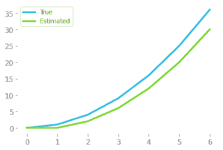

*图 8：估计函数与原始函数的比较。*

图 8 中所示的估计结果表明估计值还不错，但可以改进。这是因为我们遗漏了图中红色表示的所有这些三角形。

1.  减少误差的一种方法是取更小的*Δx*值，如图 9 右侧面板所示。

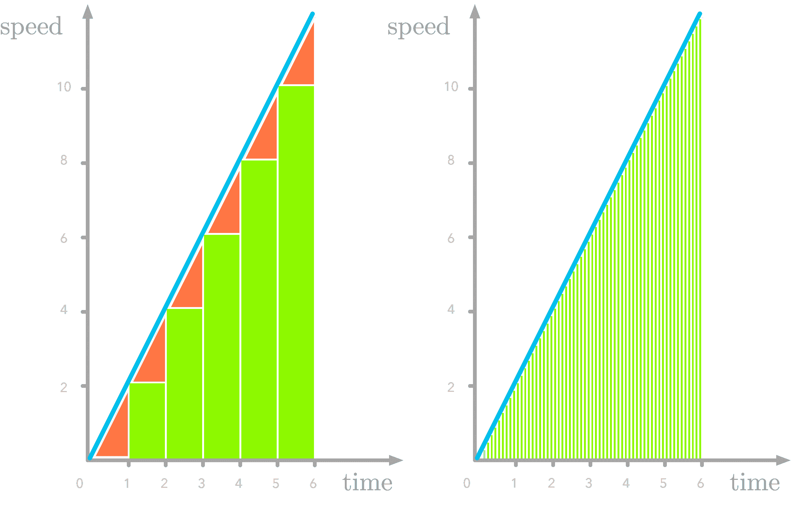

*图 9：速度函数切片中的缺失部分（红色标记）。误差随着*Δx*的减小而变小。*

让我们用*Δx=0.1*来估计积分函数：

```py
delta_x = 0.1
x = np.arange(0, 7, delta_x)
y = g_2x(x)
#  [...] Calculate and plot slice_area_all 
```

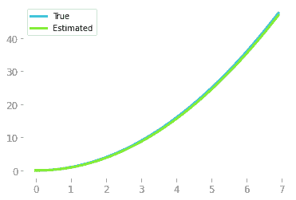

*图 10：较小的切片宽度导致对原始函数的更好估计。*

如图 10 所示，我们恢复了（至少，加上一个常数）我们积分的原始函数。

**扩展**

在我们之前的例子中，你对函数*2x*进行了积分，这是一个线性函数，但对任何连续函数原则是相同的（例如，见图 11）。

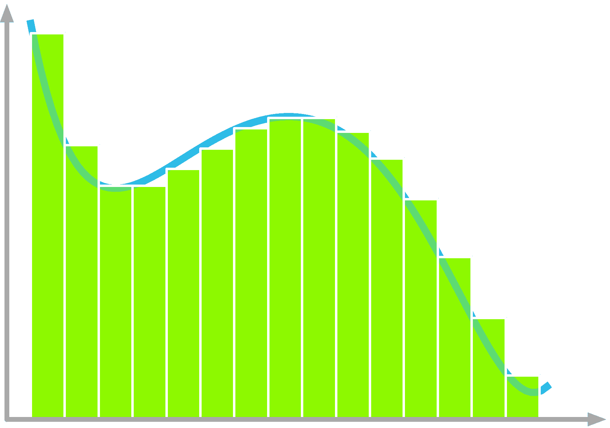

*图 11：切片方法可以用于许多线性或非线性函数，包括所有连续函数。*

### 黎曼和

使用这种切片方法来近似积分被称为*黎曼和*。黎曼和可以通过不同的方式计算，如图 12 所示。

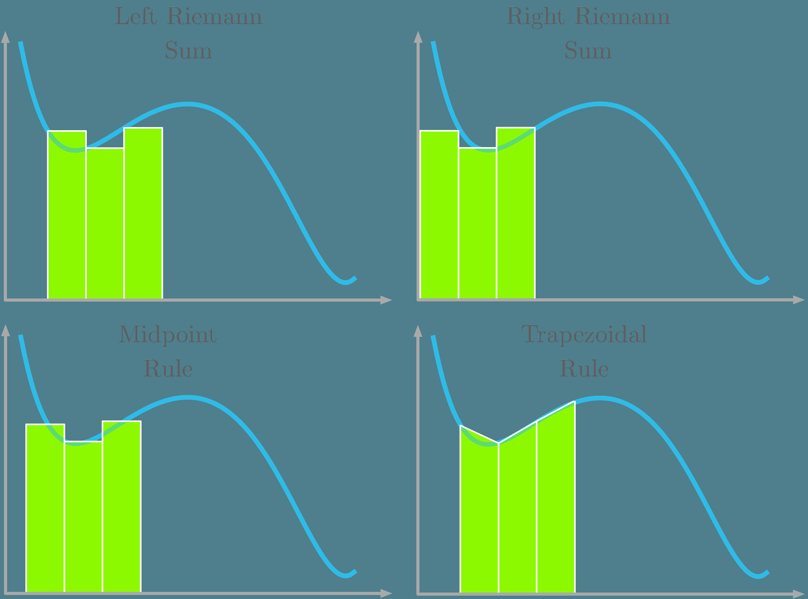

*图 12：四种用于积分逼近的黎曼和。*

如图 12 所示，左侧黎曼和中，曲线与矩形的左角对齐；右侧黎曼和中，曲线与矩形的右角对齐；中点规则中，曲线与矩形的中心对齐；梯形规则中，使用梯形代替矩形，曲线穿过梯形的两个上角。

### 数学定义

在上一节中，你看到了曲线下的面积与积分之间的关系（你通过导数恢复了原始函数）。现在我们来看一下积分的数学定义。

函数*f(x)* 相对于*x* 的积分表示为：

*∫f(x)dx*

符号*dx*称为*x*的*differential*，指的是*x*的一个微小变化。它是接近 0 的*x*的差异。积分的主要思想是对无限多个宽度极小的切片进行求和。

符号*∫*是积分符号，指的是对无限多个切片的和。

每个切片的高度是*f(x)*的值。*f(x)*与*dx*的乘积就是每个切片的面积。最后，*∫f(x):dx*是对无限多个切片（切片宽度趋近于零）的切片面积的和。这就是*曲线下的面积*。

你在上一部分中看到过如何近似函数积分。但如果你知道一个函数的导数，你可以通过知道它是反操作来检索积分。例如，如果你知道：

*d(x²)dx=2x*

你可以得出*2x*的积分是*x²*。然而，这里有一个问题。如果你在函数中加上一个常数，导数仍然相同，因为常数的导数为零。例如，

*d(x²+3)dx=2x*

常数的值是不可能知道的。因此，你需要在表达式中添加一个未知常数，如下所示：

*∫2xdx=x²+c*

其中 cc 是一个常数。

**定积分**

在*定积分*的情况下，你用积分符号下方和上方的数字来表示积分区间，如下：

*∫baf(x)dx*

它对应于图 13 中展示的在*x=a*和*x=b*之间的函数*f(x)*下的面积。

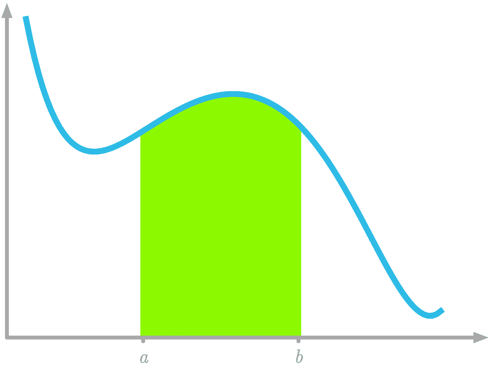*图 13：*x=a*和*x=b*之间的曲线下的面积。*

### ROC 曲线下的面积

既然你知道了曲线下的面积与积分的关系，让我们看看如何计算它以便对比你的模型。

记住你在图 14 中展示的 ROC 曲线：

```py
plt.plot(fpr_random, tpr_random, label="Random")
plt.plot(fpr, tpr, label="Logistic regression")
# [...] Add axes, labels etc. 
```


*图 14：随机模型（蓝色）和逻辑回归模型（绿色）的 ROC 曲线。*

让我们从随机模型开始。你需要将每个真实正率值与*x*轴上的宽度相乘，这个宽度是相应的假正率值与之前值之间的差异。你可以通过以下方法获得这些差异：

```py
fpr_random[1:] - fpr_random[:-1] 
```

```py
array([0.00241546, 0.01207729, 0\.        , ..., 0.01207729, 0\.        ,
       0.06038647]) 
```

所以随机模型的 ROC 曲线下的面积是：

```py
(tpr_random[1:] * (fpr_random[1:] - fpr_random[:-1])).sum() 
```

```py
0.5743302591128678 
```

或者你可以简单地使用 Sklearn 中的函数`roc_auc_score()`，通过真实目标值和概率作为输入：

```py
from sklearn.metrics import roc_auc_score

roc_auc_score(y_test, y_pred_random_proba) 
```

```py
0.5743302591128678 
```

ROC 曲线下的面积为 0.5 对应于一个不比随机更好的模型，而面积为 1 对应于完美的预测。

现在，让我们将这个值与模型的 ROC 曲线下的面积进行比较：

```py
roc_auc_score(y_test, y_pred_proba[:, 1]) 
```

```py
0.8752378861074513 
```

这表明你的模型实际上并不差，你对葡萄酒质量的预测并非随机。

在机器学习中，你可以用几行代码来训练复杂的算法。然而，正如你在这里看到的，掌握一些数学知识可以帮助你充分利用这些算法，并加快你的工作进度。它将使你在多个领域中更加得心应手，例如，理解像 Sklearn 这样的机器学习库的文档。

**简介：[哈德里安·让](https://hadrienj.github.io/)** 是一位机器学习科学家。他拥有巴黎高等师范学院的认知科学博士学位，研究领域包括使用行为和电生理数据进行听觉感知研究。他曾在工业界工作，构建了用于语音处理的深度学习管道。在数据科学与环境交汇的领域，他从事利用深度学习分析音频记录的生物多样性评估项目。他还定期在 Le Wagon（数据科学训练营）创建内容并授课，并在他的博客（[hadrienj.github.io](http://hadrienj.github.io)）上撰写文章。

[原文](https://hadrienj.github.io/posts/Essential-Math-Integrals/)。经授权转载。

**相关：**

+   提升你的数据科学技能。学习线性代数。

+   深度学习的预处理：从协方差矩阵到图像白化

+   数据科学的基础数学：‘为什么’和‘如何’

### 更多相关话题

+   [如何克服对数学的恐惧并学习数据科学中的数学](https://www.kdnuggets.com/2021/03/overcome-fear-learn-math-data-science.html)

+   [数据科学的基础数学：特征向量及其在 PCA 中的应用](https://www.kdnuggets.com/2022/06/essential-math-data-science-eigenvectors-application-pca.html)

+   [数据科学的基础数学：奇异值分解的可视化介绍](https://www.kdnuggets.com/2022/06/essential-math-data-science-visual-introduction-singular-value-decomposition.html)

+   [数据科学中你需要多少数学知识？](https://www.kdnuggets.com/2020/06/math-data-science.html)

+   [5 个免费课程掌握数据科学的数学](https://www.kdnuggets.com/5-free-courses-to-master-math-for-data-science)

+   [5 个免费 MIT 课程学习数据科学数学](https://www.kdnuggets.com/5-free-mit-courses-to-learn-math-for-data-science)
