# 数据科学的基础数学：矩阵及矩阵乘积简介

> 原文：[`www.kdnuggets.com/2021/02/essential-math-data-science-matrices-matrix-product.html`](https://www.kdnuggets.com/2021/02/essential-math-data-science-matrices-matrix-product.html)

评论

### 矩阵和张量

正如你在 [数据科学的基础数学](https://bit.ly/3mpb4F2) 中看到的，向量是存储和操作数据的有用方式。你可以将它们几何地表示为箭头，或作为数字数组（其结束点的坐标）。然而，创建更复杂的数据结构可能会很有帮助——这就是需要引入矩阵的地方。

* * *

## 我们的前三个课程推荐

 1\. [Google 网络安全证书](https://www.kdnuggets.com/google-cybersecurity) - 快速进入网络安全职业生涯。

 2\. [Google 数据分析专业证书](https://www.kdnuggets.com/google-data-analytics) - 提升你的数据分析能力

 3\. [Google IT 支持专业证书](https://www.kdnuggets.com/google-itsupport) - 支持你的组织在 IT 方面

* * *

### 介绍

作为向量，*矩阵* 是允许你组织数字的数据结构。它们是包含值的方阵或矩阵，这些值按两维组织：行和列。你可以把它们看作是一个电子表格。通常，你会在数学领域看到术语*矩阵*，而在 Numpy 中则会看到*二维数组*。

> **维度**
> 
> 在矩阵的上下文中，*维度* 这个术语与向量几何表示的维度（空间的维度）不同。当我们说矩阵是一个二维数组时，这意味着数组中有两个 *方向*：行和列。

### 矩阵表示法

在这里，我将用粗体字母和大写字母表示矩阵，例如 *A*：

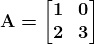

矩阵 ***A*** 有两行两列，但你可以想象任何形状的矩阵。更一般地，如果矩阵有 *m* 行和 *n* 列并包含实值，你可以用以下表示法来描述它：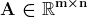

你可以通过矩阵的名称引用矩阵条目，名称中不使用粗体（因为条目是标量），后跟行索引和列索引，索引之间用逗号分隔并位于下标中。例如，***A[1,2]*** 表示第一行第二列的条目。

按惯例，第一个索引用于行，第二个用于列。例如，矩阵***A***中位置 2 的条目位于矩阵***A***的第二行和第一列，因此表示为***A[2,1]***（如[数据科学的基础数学](https://bit.ly/3mpb4F2)中所示，数学符号中通常使用基于一的索引）。

你可以按照如下方式写出矩阵的组件：

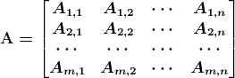

### 形状

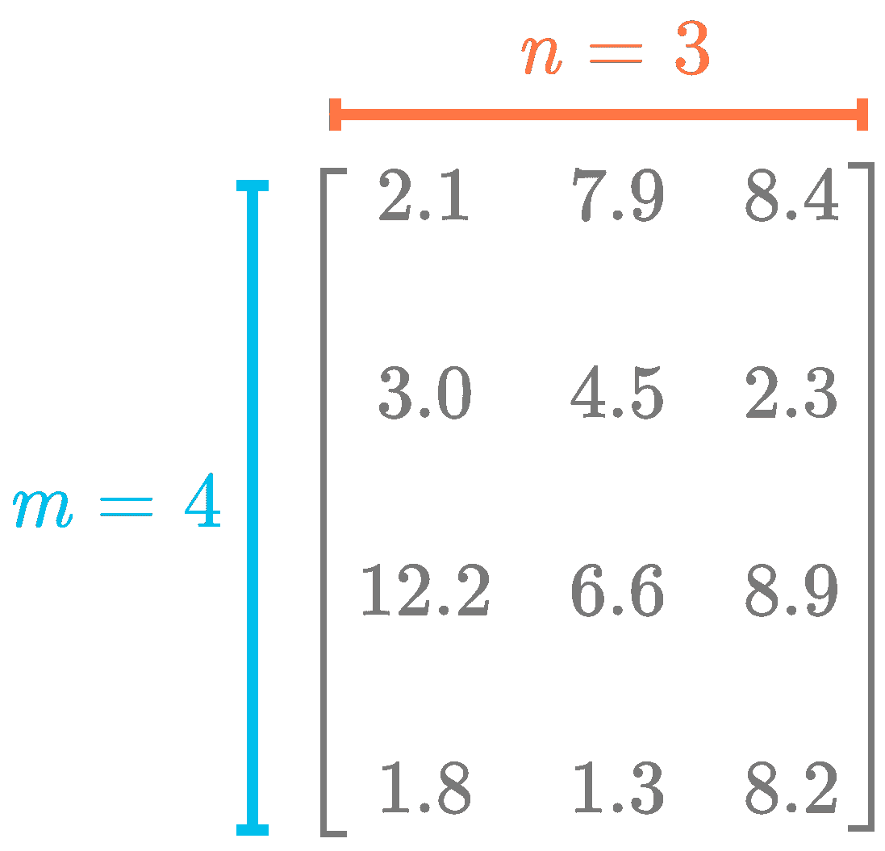

*图 1：矩阵是二维数组。行数通常表示为 mm，而列数表示为 nn。*

数组的*形状*告诉你每个维度的组件数量，如图 1 所示。由于这个矩阵是二维的（行和列），你需要两个值来描述形状（依次是行数和列数）。

让我们从使用方法`np.array()`创建一个二维 Numpy 数组开始：

```py
A = np.array([[2.1, 7.9, 8.4],
              [3.0, 4.5, 2.3],
              [12.2, 6.6, 8.9],
              [1.8, 1., 8.2]]) 
```

请注意，我们使用数组中的数组 (`[[]]`) 来创建二维数组。这与创建一维数组的方括号数量不同。

与向量一样，你也可以访问 Numpy 数组的形状属性：

```py
A.shape
```

```py
(4, 3)
```

你可以看到形状包含两个数字：它们分别对应于行数和列数。

### 索引

要获取矩阵的一个条目，你需要两个索引：一个用于行索引，一个用于列索引。

使用 Numpy，索引过程与向量相同。你只需要指定两个索引。让我们再次以矩阵***A***为例：

```py
A = np.array([[2.1, 7.9, 8.4],
              [3.0, 4.5, 2.3],
              [12.2, 6.6, 8.9],
              [1.8, 1.3, 8.2]]) 
```

可以使用以下语法获取特定条目：

```py
A[1, 2]
```

```py
2.3
```

`A[1, 2]` 返回具有行索引一和列索引二的组件（使用基于零的索引）。

要获取完整的列，可以使用冒号：

```py
A[:, 0]
```

```py
array([ 2.1,  3\. , 12.2,  1.8])
```

这会返回第一列（索引零），因为冒号表示我们想要从第一行到最后一行的组件。类似地，要获取特定的行，你可以这样做：

```py
A[1, :]
```

```py
array([3\. , 4.5, 2.3])
```

能够操作包含数据的矩阵是数据科学家的一项基本技能。检查数据的形状很重要，以确保它是按照你想要的方式组织的。了解你需要的数据显示形状对于使用像 Sklearn 或 Tensorflow 这样的库也很重要。

**默认索引**

请注意，如果你从二维数组中指定一个单一的索引，Numpy 认为这是针对第一维（行）的，而其他维度（列）的所有值都会被使用。例如：

```py
A[0]
```

```py
array([2.1, 7.9, 8.4])
```

这类似于：

```py
A[0, :]
```

```py
array([2.1, 7.9, 8.4])
```

**向量和矩阵**

对于 Numpy，如果数组是向量（一维 Numpy 数组），则形状是一个单一的数字：

```py
v = np.array([1, 2, 3])
v.shape
```

```py
(3,)
```

你可以看到*v*是一个向量。如果它是一个矩阵，形状有两个数字（分别是行数和列数）。例如：

```py
A = np.array([[2.1, 7.9, 8.4]])
A.shape
```

```py
(1, 3)
```

你可以看到矩阵只有一行：形状的第一个数字是 1。再次使用两个方括号`[[`和`]]`，可以创建一个二维数组（矩阵）。

### 矩阵乘积

你可以在[数据科学基础数学](https://bit.ly/3mpb4F2)中学习点积。矩阵的等效操作称为*矩阵乘积*，或*矩阵乘法*。它接收两个矩阵并返回另一个矩阵。这是线性代数中的核心操作。

### 矩阵与向量

矩阵乘积的更简单情况是矩阵与向量之间的乘积（你可以将其视为一个具有单列的矩阵乘积）。

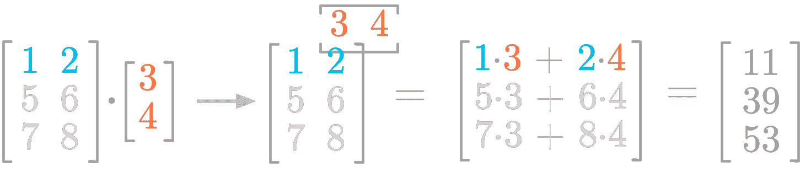

*图 2：矩阵与向量之间乘积的步骤。*

图 2 展示了矩阵与向量之间乘积的步骤。考虑矩阵的第一行。你将点积应用于向量（红色的值 3 和 4）和你考虑的行（蓝色的值 1 和 2）。你按对相乘：行中的第一个值与列向量中的第一个值（*1⋅3*），行中的第二个值与向量中的第二个值（*2⋅4*）。它给出了结果矩阵的第一个分量（*1⋅3+2⋅4=11*）。

你可以看到矩阵-向量乘积与点积相关。这就像将矩阵 AA 分成三行并应用点积（如在[数据科学基础数学](https://bit.ly/3mpb4F2)中）。

让我们看看如何使用 Numpy 来实现。

```py
A = np.array([
    [1, 2],
    [5, 6],
    [7, 8]
])
v = np.array([3, 4]).reshape(-1, 1)
A @ v
```

```py
array([[11],
       [39],
       [53]])
```

请注意，我们使用了`reshape()`函数将向量重塑为 2 乘 1 的矩阵（`-1`让 Numpy 猜测剩余的数字）。如果不这样做，你将得到一维数组而不是二维数组（具有单列的矩阵）。

**矩阵列的加权**

还有另一种思考矩阵乘积的方法。你可以认为向量包含对矩阵每一列的加权值。这清楚地表明，向量的长度需要等于应用向量的矩阵的列数。

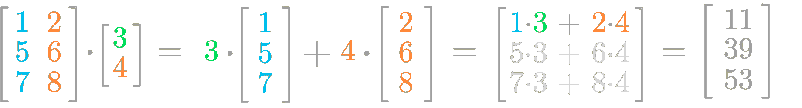

*图 3：向量的值对矩阵的列进行加权。*

图 3 可能有助于可视化这个概念。你可以将向量值（3 和 4）视为应用于矩阵列的权重。你之前看到的关于标量乘法的规则会得出与之前相同的结果。

使用最后一个例子，你可以将*A*和*v*之间的点积写作如下：

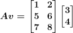

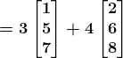

这很重要，因为正如你在[数据科学基础数学](https://bit.ly/3mpb4F2)中会看到的，它表明*Av*是*A*的列的线性组合，系数是*v*中的值。

**形状**

此外，你可以看到矩阵和向量的形状必须匹配，点积才可能进行。

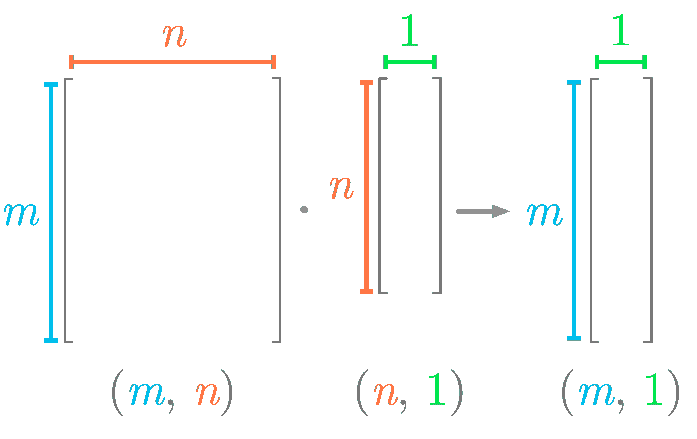

*图 4：矩阵与向量之间点积所需的形状。*

图 4 总结了矩阵-向量乘积中涉及的形状，并显示矩阵的列数必须等于向量的行数。

### 矩阵乘积

*矩阵乘积*是两个矩阵的点积操作的等效操作。正如你将看到的，它类似于矩阵-向量乘积，但应用于第二个矩阵的每一列。

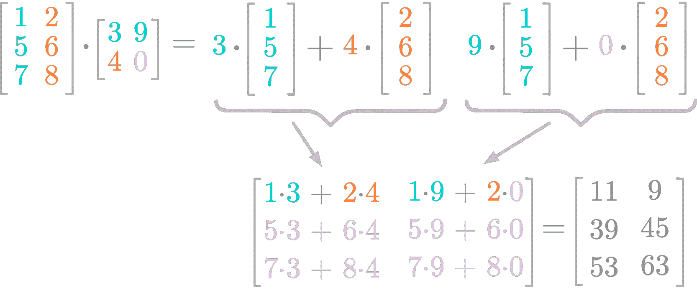

*图 5：矩阵乘积。*

图 5 展示了矩阵乘积的一个例子。你可以看到结果矩阵有两列，与第二个矩阵一样。第二个矩阵第一列的值（3 和 4）加权这两列，结果填充了结果矩阵的第一列。类似地，第二个矩阵第二列的值（9 和 0）加权这两列，结果填充了结果矩阵的第二列。

使用 Numpy，你可以像计算点积一样精确地计算矩阵乘积：

```py
A = np.array([
    [1, 2],
    [5, 6],
    [7, 8],
])
B = np.array([
    [3, 9],
    [4, 0]
])

A @ B
```

```py
array([[11,  9],
       [39, 45],
       [53, 63]])
```

**形状**

就像矩阵-向量乘积一样，如图 6 所示，第一个矩阵的列数必须与第二个矩阵的行数匹配。

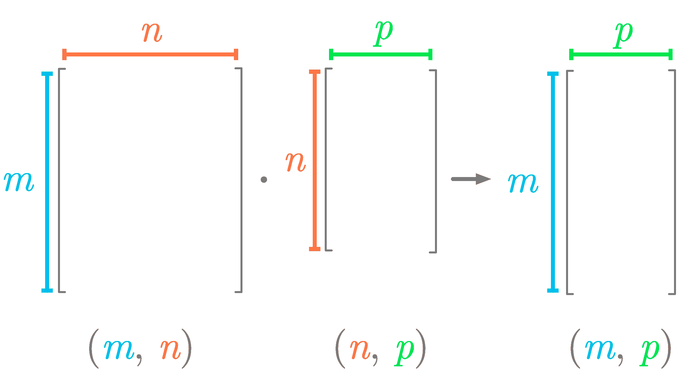

*图 6：矩阵点积要求形状匹配。*

结果矩阵的行数与第一个矩阵相同，列数与第二个矩阵相同。

让我们尝试一下。

```py
A = np.array([
    [1, 4],
    [2, 5],
    [3, 6],
])
```

```py
B = np.array([
    [1, 4, 7],
    [2, 5, 2],
])
```

矩阵*A*和*B*有不同的形状。让我们计算它们的点积：

```py
A @ B
```

```py
array([[ 9, 24, 15],
       [12, 33, 24],
       [15, 42, 33]])
```

你可以看到*A⋅B*的结果是一个 3x3 的矩阵。这个形状来自于*A*的行数（3）和*B*的列数（3）。

**计算协方差矩阵的矩阵乘积**

你可以通过计算包含变量的矩阵与其转置之间的乘积来得到数据集的协方差矩阵（有关协方差矩阵的更多细节请参见[数据科学基础数学](https://bit.ly/3mpb4F2)）。然后，你需要除以观察次数（或者除以这个数字减去 1 用于贝塞尔校正）。你需要确保变量在计算前已经围绕零进行中心化（可以通过减去均值来完成）。

让我们模拟以下变量*x*、*y*和*z*：

```py
x = np.random.normal(10, 2, 100)
y = x * 1.5 + np.random.normal(25, 5, 100)
z = x * 2 + np.random.normal(0, 1, 100)
```

使用 Numpy，协方差矩阵为：

```py
np.cov([x, y, z])
```

```py
array([[ 4.0387007 ,  4.7760502 ,  8.03240398],
       [ 4.7760502 , 32.90550824,  9.14610037],
       [ 8.03240398,  9.14610037, 16.99386265]])
```

现在，使用矩阵乘积，你首先需要将变量堆叠为矩阵的列：

```py
X = np.vstack([x, y, z]).T
X.shape
```

```py
(100, 3)
```

你可以看到变量`X`是一个 100x3 的矩阵：100 行对应观察次数，3 列对应特征。然后，你需要将这个矩阵围绕零进行中心化：

```py
X = X - X.mean(axis=0)
```

最后，你计算协方差矩阵：

```py
(X.T @ X) / (X.shape[0] - 1)
```

```py
array([[ 4.0387007 ,  4.7760502 ,  8.03240398],
       [ 4.7760502 , 32.90550824,  9.14610037],
       [ 8.03240398,  9.14610037, 16.99386265]])
```

你得到的协方差矩阵类似于函数`np.cov()`的结果。重要的是要记住，矩阵与其转置的点积对应于协方差矩阵。

### 矩阵乘积的转置

两个矩阵点积的转置定义如下：

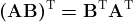

例如，取以下矩阵 *A* 和 *B*：

```py
A = np.array([
    [1, 4],
    [2, 5],
    [3, 6],
])
B = np.array([
    [1, 4, 7],
    [2, 5, 2],
])
```

你可以检查 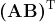 和 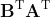的结果：

```py
(A @ B).T
```

```py
array([[ 9, 12, 15],
       [24, 33, 42],
       [15, 24, 33]])
```

```py
B.T @ A.T
```

```py
array([[ 9, 12, 15],
       [24, 33, 42],
       [15, 24, 33]])
```

起初，这可能令人惊讶，因为括号中两个向量或矩阵的顺序必须改变才能满足等价关系。让我们详细了解一下这个操作。

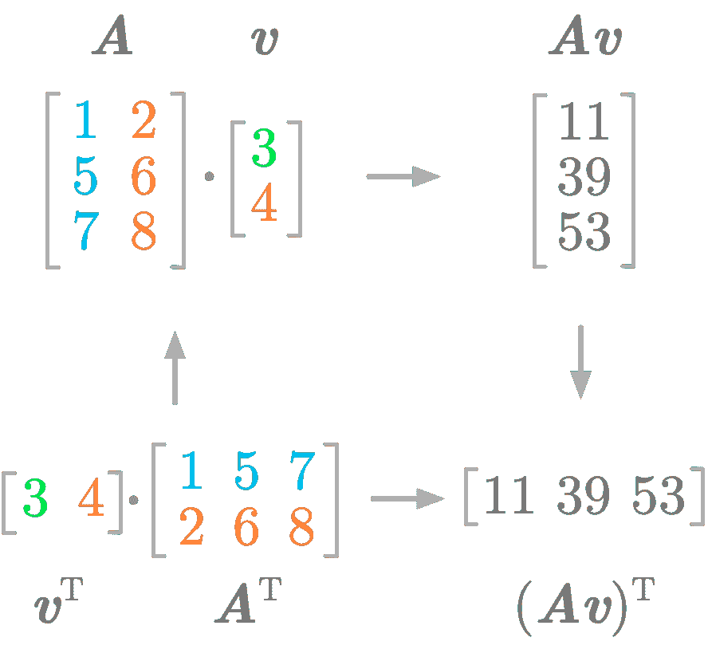

*图 7：你必须改变向量和矩阵的顺序才能获得矩阵乘积的转置。*

图 7 显示了，如果改变向量和矩阵的顺序，矩阵乘积的转置等于转置的乘积。

**超过两个矩阵或向量**

你可以将这个性质应用于多个矩阵或向量。例如，

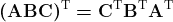

记住这个性质，它解释了许多在处理矩阵和向量时可能遇到的“外观上的调整”。用代码尝试这些操作是一个很好的学习方式。

总结来说，矩阵乘积是线性代数的关键概念，你将在 [数据科学中的基本数学](https://bit.ly/3mpb4F2) 中看到它如何与空间变换相关。

**个人简介：[Hadrien Jean](https://hadrienj.github.io/)** 是一位机器学习科学家。他拥有巴黎高等师范学院的认知科学博士学位，在那里他利用行为学和电生理数据研究听觉感知。他之前在工业界工作，建立了用于语音处理的深度学习管道。在数据科学和环境交汇处，他从事利用深度学习处理音频录音的生物多样性评估项目。他还定期在 Le Wagon（数据科学训练营）创建内容和授课，并在他的博客（[hadrienj.github.io](http://hadrienj.github.io)）上撰写文章。

[原文](https://hadrienj.github.io/posts/Essential-Math-for-Data-Science-Introduction_to_matrices_and_matrix_product/)。经授权转载。

**相关：**

+   数据科学中的基本数学：概率密度和概率质量函数

+   矩阵分解解读

+   数据科学中的基本数学：信息理论

### 更多相关内容

+   [停止学习数据科学以寻找目的，并寻找目的……](https://www.kdnuggets.com/2021/12/stop-learning-data-science-find-purpose.html)

+   [学习数据科学统计学的顶级资源](https://www.kdnuggets.com/2021/12/springboard-top-resources-learn-data-science-statistics.html)

+   [成功数据科学家的 5 个特征](https://www.kdnuggets.com/2021/12/5-characteristics-successful-data-scientist.html)

+   [每位数据科学家都应了解的三个 R 语言库（即使你使用 Python）](https://www.kdnuggets.com/2021/12/three-r-libraries-every-data-scientist-know-even-python.html)

+   [一个 90 亿美元的 AI 失败案例分析](https://www.kdnuggets.com/2021/12/9b-ai-failure-examined.html)

+   [是什么让 Python 成为初创企业理想的编程语言](https://www.kdnuggets.com/2021/12/makes-python-ideal-programming-language-startups.html)
