# 数据科学的基础数学：概率密度函数和概率质量函数

> 原文：[`www.kdnuggets.com/2020/12/essential-math-data-science-probability-density-probability-mass-functions.html`](https://www.kdnuggets.com/2020/12/essential-math-data-science-probability-density-probability-mass-functions.html)

评论

在《[数据科学的基础数学](https://www.essentialmathfordatascience.com/)》的第二章中，你可以学习基本的描述统计和概率理论。在这个样本中，我们将讨论概率质量函数和概率密度函数。你将看到如何理解和表示这些分布函数及其与直方图的关系。

* * *

## 我们的前三个课程推荐

 1\. [谷歌网络安全证书](https://www.kdnuggets.com/google-cybersecurity) - 快速入门网络安全职业。

 2\. [谷歌数据分析专业证书](https://www.kdnuggets.com/google-data-analytics) - 提升你的数据分析技能

 3\. [谷歌 IT 支持专业证书](https://www.kdnuggets.com/google-itsupport) - 支持你所在组织的 IT 工作

* * *

*确定性* 过程在重复多次时会产生相同的结果。这与描述*随机* 事件的随机变量不同，在这些事件中，随机性特征化了过程。

这意味着随机变量可以取各种值。你如何描述和比较这些值？一种好的方法是使用每个结果发生的概率。随机变量的概率分布是一个函数，它将样本空间作为输入，并返回概率：换句话说，它将可能的结果映射到它们的概率。

在本节中，你将学习离散和连续变量的概率分布。

### 概率质量函数

离散随机变量的概率函数称为*概率质量函数*（或 PMF）。例如，假设你正在进行一个掷骰子实验。你把*X* 叫做与这个实验相关的随机变量。假设骰子是公平的，每个结果都是*等概率的*：如果你进行大量实验，你会得到每个结果的大致次数相同。在这里，有六种可能的结果，因此你有六分之一的机会得到每个数字。

因此，描述*X* 的概率质量函数为每个可能的结果返回 1616，其他情况下返回 0（因为你不能得到 1、2、3、4、5 或 6 以外的结果）。

你可以写出 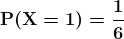，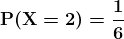 等。

**概率质量函数的属性**

并非每个函数都可以被视为概率质量函数。概率质量函数必须满足以下两个条件：

+   该函数必须返回每个可能结果的 0 到 1 之间的值：

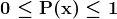

+   对应所有可能结果的概率之和必须等于 1：

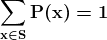

*x*的值可以是任何实数，因为样本空间之外的值与概率 0 相关。数学上，对于样本空间*S*之外的任何值*x*，*P(x)=0*。

**骰子实验的模拟**

让我们使用 Numpy 中的函数`np.random.randint(low, high, size)`来模拟骰子实验，该函数在`low`和`high`（不包括）之间抽取*n*（`size`）个随机整数。让我们模拟 20 次掷骰子：

```py
 rolls = np.random.randint(1, 7, 20)
rolls 
```

```py
array([6, 3, 5, ..., 6, 5, 1]) 
```

这个数组包含了实验的 20 个结果。让我们称*X*为对应于掷骰子实验的离散随机变量。*X*的概率质量函数仅在可能的结果上定义，并为每个结果提供概率。

假设骰子是公平的，你应该得到一个*均匀分布*，即每个结果的概率相同。

让我们可视化随机实验中每个结果的数量。你可以通过试验次数来计算概率。我们使用 Matplotlib 中的`plt.stem()`来可视化这些概率：

```py
val, counts = np.unique(rolls, return_counts=True)
plt.stem(val, counts/len(rolls), basefmt="C2-", use_line_collection=True) 
```

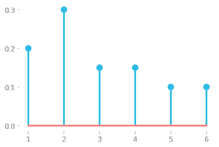

*图 1：随机变量*X*的概率质量函数，基于 20 次掷骰子的估计。*

在均匀分布下，图形每个结果的高度应该相同（因为高度对应于概率，而每次掷骰子的结果概率是相同的）。然而，图 1 中显示的分布看起来并不均匀。这是因为你没有足够多地重复实验：当你重复实验很多次（理论上是无限次）时，概率将会稳定下来。

让我们增加试验次数：

```py
throws = np.random.randint(1, 7, 100000)
val, counts = np.unique(throws, return_counts=True)
plt.stem(val, counts/len(throws), basefmt="C2-", use_line_collection=True)
```

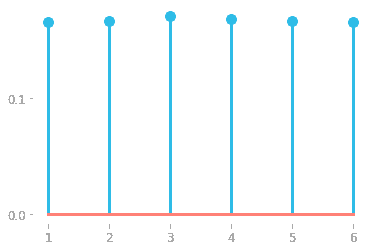

*图 2：随机变量*X*的概率质量函数，基于 100,000 次掷骰子实验的估计。*

在足够多的试验中，图 2 中显示的概率质量函数看起来是均匀的。这强调了从频率主义概率角度来看试验次数的重要性。

### 概率密度函数

对于连续变量，可能的结果数量是无限的（受限于你使用的小数位数）。例如，如果你抽取一个 0 到 1 之间的数字，你可能得到一个如 0.413949834 的结果。抽取每个数字的概率趋近于零：如果你将某物除以一个非常大的数字（可能的结果数量），结果将非常小，接近于零。这对于描述随机变量并不太有帮助。

更好的做法是考虑在一系列值中获得特定数字的概率。概率密度函数的*y*轴不是概率。它被称为*概率密度*或简称为*density*。因此，连续变量的概率分布被称为*概率密度函数*（或 PDF）。

概率密度函数在特定区间上的积分给出了随机变量在该区间内取值的概率。因此，这个概率由该区间下的曲线所围成的面积表示（如你在[数据科学基础数学](https://www.essentialmathfordatascience.com/)中所见）。

**符号**

在这里，我将用小写*p*表示概率密度函数。例如，函数*p(x)*给出与值*x*对应的密度。

**示例**

让我们检查一个概率密度函数的例子。你可以使用 Numpy 函数`np.random.normal`从正态分布中随机抽取数据（你可以在[数据科学基础数学](https://www.essentialmathfordatascience.com/)中找到关于正态分布的更多细节）。

你可以选择正态分布的参数（均值和标准差）以及样本数量。我们来创建一个变量`data`，其包含 1,000 个从均值为 0.3 和标准差为 0.1 的正态分布中随机抽取的值。

```py
np.random.seed(123)
data = np.random.normal(0.3, 0.1, 1000) 
```

让我们通过直方图查看分布的形状。函数`plt.hist()`返回直方图的*x*轴和*y*轴坐标的确切值。我们将这些值存储在一个名为`hist`的变量中以备后用：

```py
hist = plt.hist(data, bins=13, range=(-0.3, 1)) 
```

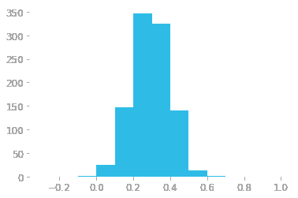

*图 3：从正态分布生成的数据的直方图。*x*轴是向量中元素的值，*y*轴是位于相应范围内的元素数量（计数）。*

**直方图**

直方图显示了值的分布情况。这是一种使用从分布中抽取的有限数量的值来建模概率分布的方法。由于我们处理的是连续分布，这个直方图对应于特定区间的值的数量（这些区间取决于函数`hist()`中的参数`bins`）。

例如，图 3 显示区间 (0.2, 0.3) 内大约有 347 个元素。每个条形对应的宽度为 0.1，因为我们使用了 13 个条形来表示范围从 -0.3 到 1 的数据。

让我们更仔细地查看具有更多条形的分布。你可以使用参数 `density` 来使 *y* 轴对应于概率密度，而不是每个条形中的值计数：

```py
hist = plt.hist(data, bins=24, range=(-0.2, 1), density=True)
```

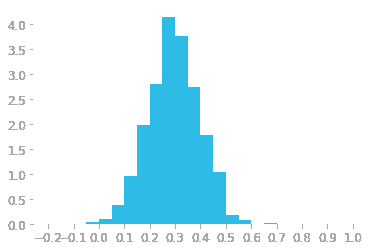

*Figure 4: Histogram using 30 bins and density instead of counts.*

你可以在图 4 中看到，这个直方图有更多的条形（24 个而不是 13 个）。这意味着每个条形现在有更小的宽度。*y* 轴也使用了不同的刻度：它对应于密度，而不是之前的值计数。

要从密度中计算在某个范围内抽取值的概率，你需要使用曲线下方的面积。在直方图的情况下，这就是条形的面积。

让我们以一个从 0.2 到 0.25 的条形为例，关联的密度如下：

```py
print(f"Density: {hist[0][8].round(4)}")
print(f"Range x: from {hist[1][8].round(4)} to {hist[1][9].round(4)}")
```

```py
Density: 2.8
Range x: from 0.2 to 0.25
```

由于有 24 个条形，且可能的结果范围是从 -0.2 到 1，每个条形对应的范围是 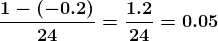。在我们的例子中，条形的高度（从 0.2 到 0.25）约为 2.8，因此该条形的面积是 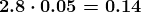。这意味着获取一个介于 0.2 和 0.25 之间的值的概率约为 0.14 或 14%。

你看到概率的总和必须等于一，因此条形的面积总和也应该等于一。让我们检查一下：你可以取包含密度的向量（`hist[0]`），并将其乘以条形宽度（0.05）：

```py
(hist[0] * 0.05).sum().round(4)
```

```py
1.0
```

一切正常：概率的总和等于一。

**从直方图到连续概率密度函数**

直方图表示的是概率密度函数的分箱版本。图 5 显示了真实概率密度函数的表示。图中的蓝色阴影区域对应于获得一个介于 0 和 0.2 之间的数字的概率（0 和 0.2 之间曲线下方的区域）。

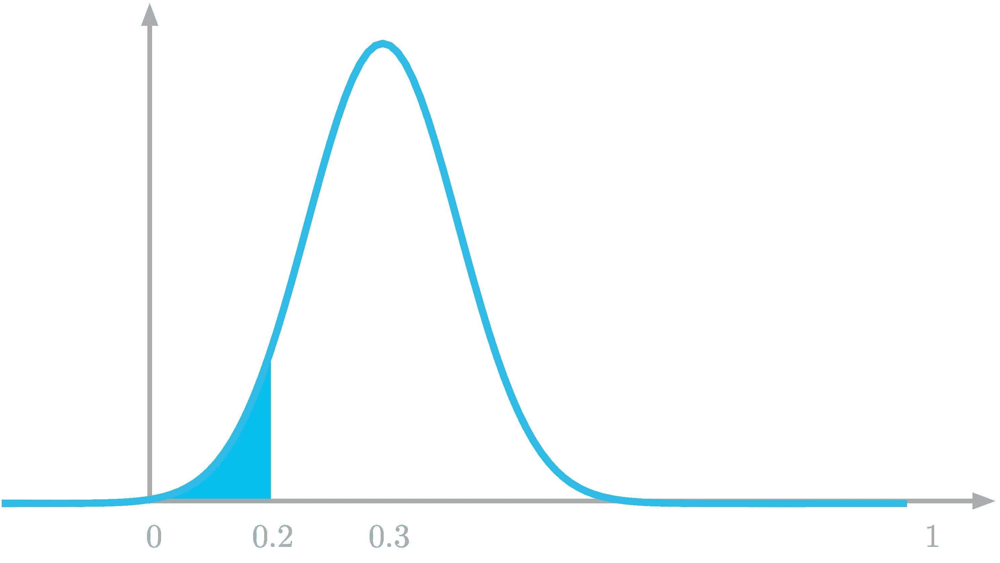

*图 5：抽取一个介于 0 和 0.2 之间的数字的概率是曲线下方高亮区域。*

**概率密度函数的性质**

与概率质量函数类似，概率密度函数必须满足一些要求。第一个要求是它必须返回非负值。数学表示为：

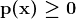

第二个要求是概率密度函数的曲线下方的总面积必须等于 1：

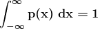

在关于概率分布的部分，你看到概率质量函数用于离散变量，而概率密度函数用于连续变量。请记住，概率质量函数的*y*轴上的值是概率，而概率密度函数则不是。查看密度值（例如在图 4 中）：它们可以大于 1，这表明它们不是概率。

**简介：[Hadrien Jean](https://hadrienj.github.io/)** 是一位机器学习科学家。他拥有巴黎高等师范学校的认知科学博士学位，曾在该校进行基于行为和电生理数据的听觉感知研究。他之前在工业界工作，构建了用于语音处理的深度学习管道。在数据科学与环境的交汇处，他从事利用应用于音频录音的深度学习进行生物多样性评估的项目。他还定期在 Le Wagon（数据科学训练营）创建内容并教授课程，并在他的博客中撰写文章 ([hadrienj.github.io](http://hadrienj.github.io))。

[原文](https://hadrienj.github.io/posts/Essential-Math-probability-distributions/)。经许可转载。

**相关：**

+   数据科学必备数学：积分与曲线下面积

+   提升你的数据科学技能。学习线性代数。

+   数据科学必备数学：‘为什么’和‘如何’

### 更多相关主题

+   [如何克服数学恐惧并学习数据科学中的数学](https://www.kdnuggets.com/2021/03/overcome-fear-learn-math-data-science.html)

+   [KDnuggets 新闻，7 月 6 日：12 个 Essential 数据科学 VSCode…](https://www.kdnuggets.com/2022/n27.html)

+   [数据科学必备数学：特征值及其在 PCA 中的应用](https://www.kdnuggets.com/2022/06/essential-math-data-science-eigenvectors-application-pca.html)

+   [数据科学必备数学：奇异值分解的视觉导论…](https://www.kdnuggets.com/2022/06/essential-math-data-science-visual-introduction-singular-value-decomposition.html)

+   [每位数据科学家都应知道的 10 个 Essential Pandas 函数](https://www.kdnuggets.com/10-essential-pandas-functions-every-data-scientist-should-know)

+   [功能数据中的异常值检测：密度核深度](https://www.kdnuggets.com/density-kernel-depth-for-outlier-detection-in-functional-data)
