# 数据科学的基本数学：标量和向量

> 原文：[`www.kdnuggets.com/2021/02/essential-math-data-science-scalars-vectors.html`](https://www.kdnuggets.com/2021/02/essential-math-data-science-scalars-vectors.html)

评论

机器只理解数字。例如，如果你想创建一个垃圾邮件检测器，你必须先将文本数据转换为数字（例如，通过*词嵌入*）。数据随后可以存储在向量、矩阵和张量中。例如，图像被表示为值在 0 到 255 之间的矩阵，代表每个像素每种颜色的亮度。可以利用线性代数领域的工具和概念来操作这些向量、矩阵和张量。

* * *

## 我们的前三个课程推荐

 1\. [谷歌网络安全证书](https://www.kdnuggets.com/google-cybersecurity) - 快速进入网络安全职业的快车道。

 2\. [谷歌数据分析专业证书](https://www.kdnuggets.com/google-data-analytics) - 提升你的数据分析水平

 3\. [谷歌 IT 支持专业证书](https://www.kdnuggets.com/google-itsupport) - 支持你的组织的 IT

* * *

线性代数是研究*向量空间*的数学分支。你将看到向量如何构成向量空间，以及线性代数如何将线性变换应用于这些空间。你还将了解线性方程组与向量方程之间的强大关系，这与*最小二乘近似*等重要数据科学概念相关。最后，你将学习重要的矩阵分解方法：*特征分解*和*奇异值分解*（SVD），这些对理解*主成分分析*（PCA）等无监督学习方法非常重要。

### 标量和向量

### 什么是向量？

线性代数处理*向量*。该领域的其他数学实体可以通过它们与向量的关系来定义：例如，*标量*是单一的数字，当它们与向量相乘时，会*缩放*这些向量（拉伸或收缩）。

然而，向量根据其使用领域指代不同的概念。在数据科学的背景下，它们是一种存储数据值的方式。例如，考虑人的身高和体重：由于这些是具有不同含义的独立值，你需要将它们分别存储，例如使用两个向量。然后，你可以对向量进行操作，以操控这些特征，同时不会丧失这些值对应于不同属性的事实。

你还可以使用向量来存储数据样本，例如，将十个人的身高存储为包含十个值的向量。

**符号表示法**

我们将使用小写粗体字母来命名向量（如 vv）。如常规，请参阅 [数据科学基础数学](https://bit.ly/3gB7p5Z) 中的附录，以获得本书中使用的符号总结。

### 几何向量和坐标向量

词汇 *向量* 可以指多个概念。让我们更多地了解几何向量和坐标向量。

*坐标* 是描述位置的数值。例如，地球上任何位置都可以通过地理坐标（纬度、经度和高度）来指定。

**几何向量**

*几何向量*，也称为 *欧几里得向量*，是由其大小（长度）和方向定义的数学对象。这些属性使你能够描述从一个位置到另一个位置的位移。


*图 1: 从 *A* 到 *B* 的几何向量。*

例如，图 1 显示了点 *A* 的坐标为 (1, 1)，点 *B* 的坐标为 (3, 2)。几何向量 *v* 描述了从 *A* 到 *B* 的位移，但由于向量由其大小和方向定义，你也可以将 *v* 表示为从原点开始。

> **笛卡尔平面**
> 
> 在图 1 中，我们使用了一个叫做 *笛卡尔平面* 的坐标系统。水平线和垂直线是 *坐标轴*，通常分别标记为 *x* 和 *y*。两个坐标轴的交点称为 *原点*，对应于每个轴的坐标 0。
> 
> 在笛卡尔平面中，任何位置都可以通过 *x* 和 *y* 坐标来指定。笛卡尔坐标系统可以扩展到更多维度：在 *n* 维空间中，点的位置由 nn 个坐标指定。实际的 *n* 维坐标空间，包含 *n* 元组的实数，被称为 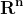。例如，空间 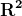 是包含实数对（坐标）的二维空间。在三维空间 (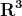) 中，空间中的一点由三个实数表示。

**坐标向量**

*坐标向量* 是与向量坐标对应的有序数字列表。由于向量的初始点位于原点，你只需要编码终点的坐标。

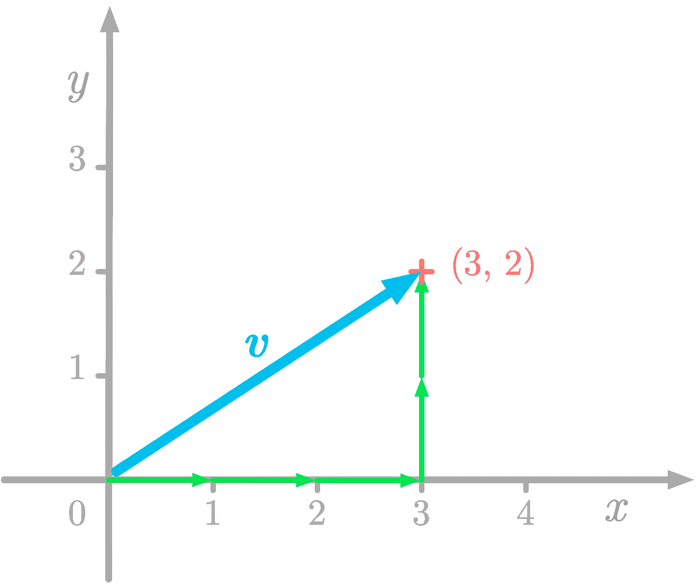

*图 2: 向量 vv 的坐标为 (3, 2)，对应于从原点在 *x* 轴上三单位和在 *y* 轴上两单位。*

例如，我们来看看图 2 中表示的向量 *v*。相应的坐标向量如下：


每个值与一个方向相关联：在这种情况下，第一个值对应于 xx 轴方向，第二个数对应于*y*轴。


*图 3：坐标向量的分量。*

如图 3 所示，这些值被称为*分量*或*条目*。

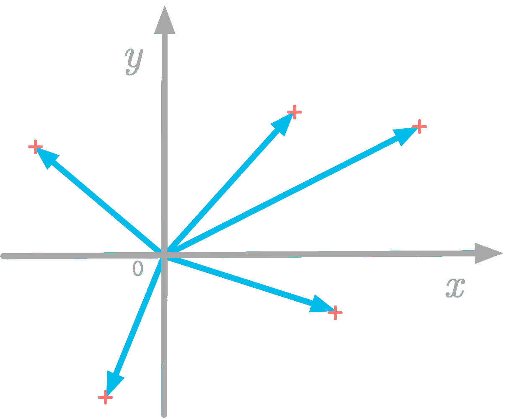

*图 4：向量可以表示为笛卡尔平面上的点。*

此外，如图 4 所示，你可以简单地表示箭头的终点：这就是散点图。

**索引**

*索引*指的是使用位置（即索引）获取向量分量（向量中的一个值）的过程。

Python 使用零基索引，意味着第一个索引是零。然而，从数学上讲，约定是使用一基索引。我将用下标表示向量*v*的分量*i*，即*v[i]*，不使用粗体，因为向量的分量是标量。

**Numpy**

在 Numpy 中，向量被称为*一维数组*。你可以使用函数`np.array()`来创建一个：

```py
v = np.array([3, 2])
v
```

```py
array([3, 2])
```

**更多分量**

让我们以*v*为例，定义为三维向量如下：

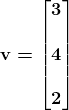

如图 5 所示，你可以通过在 xx 轴上移动 3 个单位，在 yy 轴上移动 4 个单位，以及在 zz 轴上移动 2 个单位来到达向量的终点。

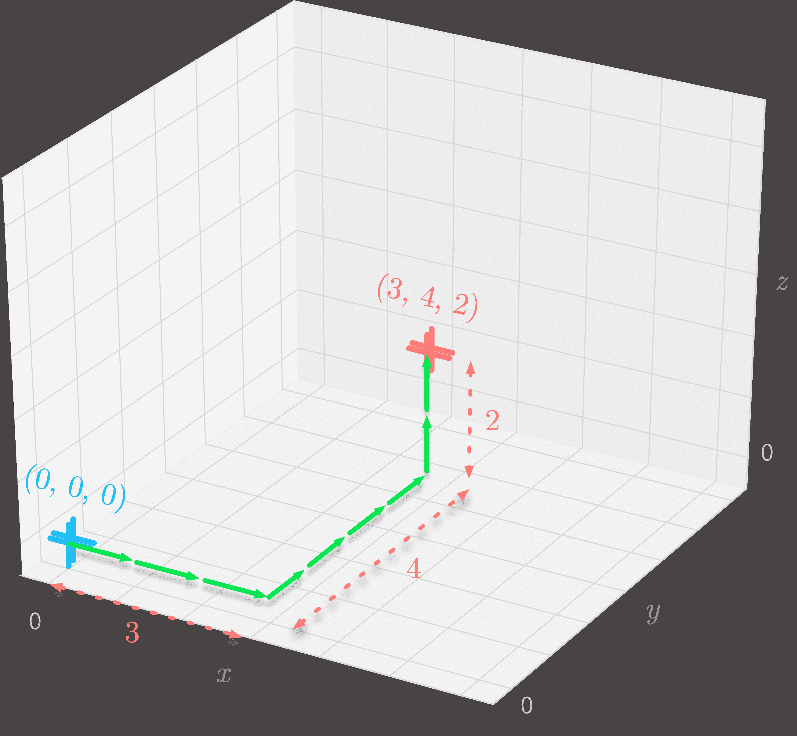

*图 5：原点在(0, 0, 0)和点在(3, 4, 2)的三维表示。*

更一般地，在一个*n*维空间中，终点的位置由*n*个分量描述。

**维度**

你可以使用*集合*符号表示向量的维度。它表示*实际坐标空间*：这是一个具有实数作为坐标值的 nn 维空间。

例如，向量在中具有三个分量，如下例中的向量*v*：

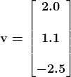

**数据科学中的向量**

在数据科学的背景下，你可以使用坐标向量来表示你的数据。

你可以将数据样本表示为向量，每个分量对应一个特征。例如，在一个房地产数据集中，你可以有一个向量表示一个公寓，其特征作为不同的分量（如房间数、位置等）。

另一种方法是为每个特征创建一个向量，每个向量包含所有观测值。

将数据存储在向量中允许你利用线性代数工具。请注意，即使你不能可视化具有大量分量的向量，你仍然可以对它们应用相同的操作。这意味着你可以使用二维或三维来获取线性代数的见解，然后将所学应用于更高维度。

### 点积

*点积*（指用于描述此操作的点符号），也称为 *标量积*，是一种对向量进行的操作。它接受两个向量，但与加法和标量乘法不同，它返回一个单一的数字（一个标量，因此得名）。它是更一般的操作 *内积* 的一个例子。

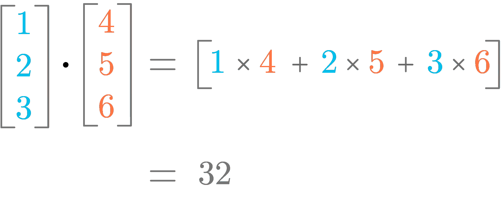

*图 6：点积的示意图。*

图 6 显示了点积的工作原理。你可以看到它对应于具有相同索引的分量的乘积之和。

### 定义

向量 *u* 和 *v* 之间的点积，用符号 ⋅ 表示，定义为每对分量乘积的和。更正式地，它表示为：

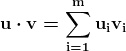

其中 *m* 是向量 *u* 和 *v* 的分量数量（它们必须具有相同数量的分量），*i* 是当前向量分量的索引。

> **点符号**
> 
> 请注意，点积的符号与用于标量之间乘法的点相同。上下文（元素是标量还是向量）告诉你它指的是哪一个。

让我们举一个例子。你有以下向量：

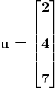

和

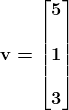

这两个向量的点积定义为：

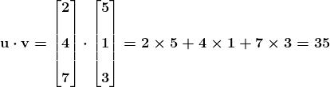

向量 *u* 和 *v* 之间的点积是 35。这将两个向量 *u* 和 *v* 转换为一个标量。

让我们使用 Numpy 来计算这些向量的点积。你可以使用 Numpy 数组的 `dot()` 方法：

```py
u = np.array([2, 4, 7])
v = np.array([5, 1, 3])
u.dot(v)
```

```py
35
```

还可以使用以下等效语法：

```py
np.dot(u, v)
```

```py
35
```

或者，在 Python 3.5+ 中，也可以使用 `@` 运算符：

```py
u @ v
```

```py
35
```

> **向量乘法**
> 
> 请注意，点积不同于 *逐元素* 乘法，也称为 *Hadamard 积*，它返回另一个向量。符号 ⊙⊙ 通常用于描述此操作。例如：
> 
> 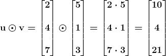

**点积与向量长度**

平方 *L²* 范数可以通过向量与自身的点积（*u ⋅ u*）来计算：

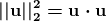

这是机器学习中的一个重要属性，如你在 [数据科学的基础数学](https://bit.ly/3gB7p5Z) 中所看到的。

**特殊情况**

两个正交向量之间的点积等于 0。此外，单位向量与自身的点积等于 1。

### 几何解释：投影

你如何解释几何向量的点积操作。你在[数据科学的基础数学](https://bit.ly/3gB7p5Z)中见过向量的加法和标量乘法的几何解释，那么点积呢？

让我们来看以下两个向量：

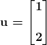

和

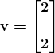

首先，让我们计算*u*和*v*的点积：

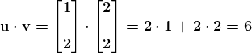

这个标量的意义是什么？嗯，它与将*u*投影到*v*上的想法有关。

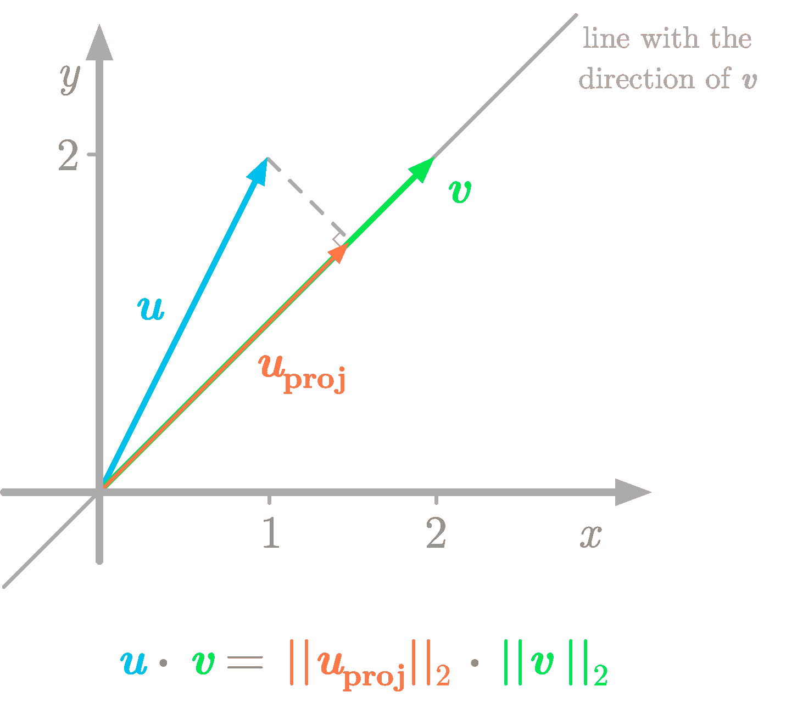

*图 7：点积可以看作是 vv 的长度与投影的长度（向量 uprojuproj）的乘积。*

如图 7 所示，将*u*投影到*v*方向的直线上的投影就像是向量*u*在这条直线上的影子。点积的值（在我们的例子中为 6）对应于*v*的长度（*L²*范数∥*v*∥）和*u*在*v*上的投影的长度（L²范数∥*u[proj]*∥）的乘积。你要计算：

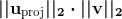

请注意，这些元素是标量，因此点号指的是这些值的乘法。你有：

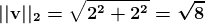

将*u*投影到*v*上的定义如下（你可以参考[数据科学的基础数学](https://bit.ly/3gB7p5Z)查看有关向量投影到直线上的数学细节）：

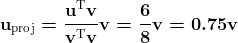

所以*u[proj]*的*L²*范数是 0.75 倍*v*的*L²*范数：

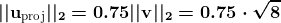

最后，*v*的长度与投影的长度的乘积是：

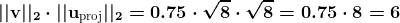

这表明你可以将几何向量上的点积看作是一种投影。使用投影给出的结果与你使用点积公式得到的结果相同。

此外，你通过点积得到的值告诉你两个向量之间的关系。如果这个值是正的，向量之间的角度小于 90 度；如果是负的，角度大于 90 度；如果是零，则向量正交，角度为 90 度。

### 属性

让我们回顾点积的一些属性。

**分配律**

点积是*分配律*的。这意味着，例如，对于三个向量*u*、*v*和*w*，你有：

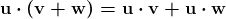

**结合律**

点积不是*结合律*的，这意味着操作的顺序很重要。例如：

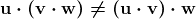

点积不是一个二元操作符：两个向量的点积结果不是另一个向量（而是一个标量）。

**交换律**

向量之间的点积被称为*交换律*。这意味着点积中向量的顺序并不重要。你有：

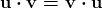

然而，要小心，因为这对矩阵不一定适用。

**简介： [哈德里安·让](https://hadrienj.github.io/)** 是一名机器学习科学家。他拥有巴黎高等师范学院的认知科学博士学位，曾利用行为学和电生理数据研究听觉感知。他曾在工业界工作，构建了用于语音处理的深度学习管道。在数据科学与环境交汇处，他从事关于利用深度学习分析音频记录进行生物多样性评估的项目。他还定期在 Le Wagon（数据科学训练营）创建内容和教学，并在他的博客（[hadrienj.github.io](http://hadrienj.github.io)）上撰写文章。

[原文](https://hadrienj.github.io/posts/Essential-Math-for-Data-Science-Scalars-Vectors-and-the-Dot-Product/)。经许可转载。

**相关：**

+   数据科学的基础数学：概率密度函数和概率质量函数

+   数据科学的基础数学：矩阵与矩阵乘积的介绍

+   数据科学的基础数学：积分和曲线下的面积

### 更多相关话题

+   [如何克服对数学的恐惧并学习数据科学的数学](https://www.kdnuggets.com/2021/03/overcome-fear-learn-math-data-science.html)

+   [数据科学的基础数学：特征向量及其在 PCA 中的应用](https://www.kdnuggets.com/2022/06/essential-math-data-science-eigenvectors-application-pca.html)

+   [数据科学的基础数学：奇异值分解的可视化介绍…](https://www.kdnuggets.com/2022/06/essential-math-data-science-visual-introduction-singular-value-decomposition.html)

+   [数据科学中需要多少数学？](https://www.kdnuggets.com/2020/06/math-data-science.html)

+   [5 门免费课程，掌握数据科学的数学](https://www.kdnuggets.com/5-free-courses-to-master-math-for-data-science)

+   [5 门免费麻省理工课程，学习数据科学的数学](https://www.kdnuggets.com/5-free-mit-courses-to-learn-math-for-data-science)
