# 数据科学的基础数学：奇异值分解的视觉介绍

> 原文：[`www.kdnuggets.com/2022/06/essential-math-data-science-visual-introduction-singular-value-decomposition.html`](https://www.kdnuggets.com/2022/06/essential-math-data-science-visual-introduction-singular-value-decomposition.html)

在这篇文章中，你将了解奇异值分解（SVD），这是线性代数、数据科学和机器学习的一个主要主题。例如，它用于计算主成分分析（PCA）。你需要了解一些线性代数基础（可以查看前一篇文章和书籍 [数据科学的基础数学](https://bit.ly/3alObze)）。

你只能对方阵应用特征分解，因为它使用了一个单一的基变换矩阵，这意味着初始向量和变换后的向量相对于同一个基。你用 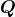 转到另一个基进行变换，然后用  回到初始基。

* * *

## 我们的前 3 个课程推荐

 1\. [谷歌网络安全证书](https://www.kdnuggets.com/google-cybersecurity) - 快速进入网络安全职业生涯。

 2\. [谷歌数据分析专业证书](https://www.kdnuggets.com/google-data-analytics) - 提升你的数据分析技能

 3\. [谷歌 IT 支持专业证书](https://www.kdnuggets.com/google-itsupport) - 支持你的组织进行 IT 工作

* * *

与特征分解一样，奇异值分解（SVD）的目标是将矩阵分解为更简单的组件：正交矩阵和对角矩阵。

你还可以看到矩阵可以被视为线性变换。矩阵的分解对应于将变换分解为多个子变换。在奇异值分解（SVD）的情况下，变换被转换为三个更简单的变换。

在这里，你将看到三个示例：一个是二维的，一个是比较 SVD 和特征分解的变换，另一个是三维的。

# 二维示例

你将使用自定义函数 `matrix_2d_effect()` 观察这些变换的作用。该函数绘制单位圆（有关单位圆的更多细节可以在 [数据科学的基础数学](https://bit.ly/3alObze) 第五章找到），以及被矩阵变换后的基向量。

你可以在 [这里](https://gist.github.com/hadrienj/a70c476826cb9ea2489a773d6e84bc6c) 找到这个函数。

为了表示变换前的单位圆和基向量，我们使用这个函数，使用单位矩阵：

```py
I = np.array([
   [1, 0],
   [0, 1]
])

matrix_2d_effect(I)

# [...] Add labels
```

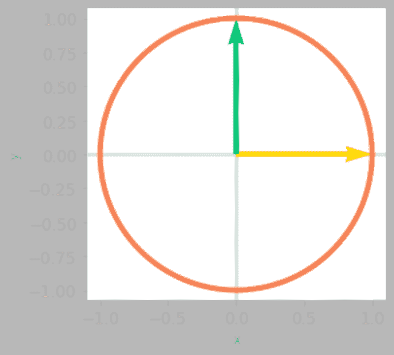

图 0：单位圆和基向量

现在我们使用该函数查看矩阵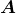的效果。

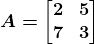

这将绘制单位圆和被矩阵变换的基向量：

```py
A = np.array([
   [2, 5],
   [7, 3]
])

matrix_2d_effect(A)

# [...] Add labels
```

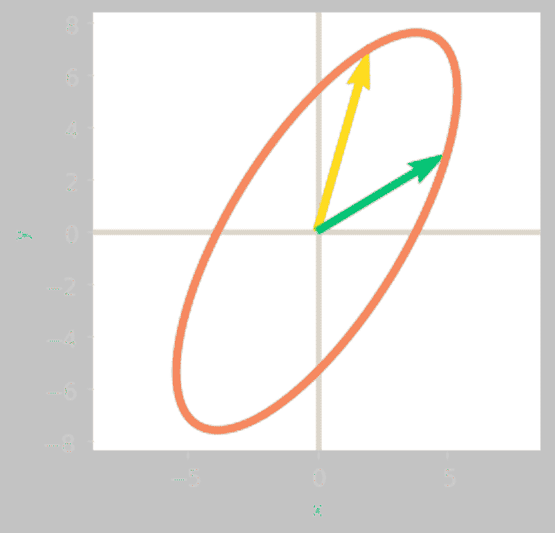

图 1：矩阵 AA 对单位圆和基向量的影响。

图 1 展示了对你二维空间的影响。我们将其与 SVD 矩阵相关的子变换进行比较。

你可以使用 Numpy 计算的 SVD：

```py
U, Sigma, V_transpose = np.linalg.svd(A)
```

记住，矩阵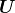、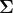和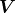分别包含左奇异向量、奇异值和右奇异向量。你可以将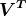视为第一次基变换矩阵，为新基中的线性变换（由于是对角矩阵，因此该变换应为简单的缩放），而 UU 为另一次基变换矩阵。你可以在[数据科学中的基本数学](https://bit.ly/3alObze)第十章中看到，SVD 限制了两个基变换矩阵和必须是正交的，这意味着这些变换将是简单的旋转。

总结一下，对应矩阵的变换被分解为旋转（或反射，或旋转反射）、缩放和另一种旋转（或反射，或旋转反射）。

让我们依次查看每个矩阵的效果：

```py
matrix_2d_effect(V_transpose)
```


图 2：矩阵对单位圆和基向量的影响。

你可以在图 2 中看到单位圆和基向量已被矩阵旋转。

```py
matrix_2d_effect(np.diag(Sigma) @ V_transpose)
```

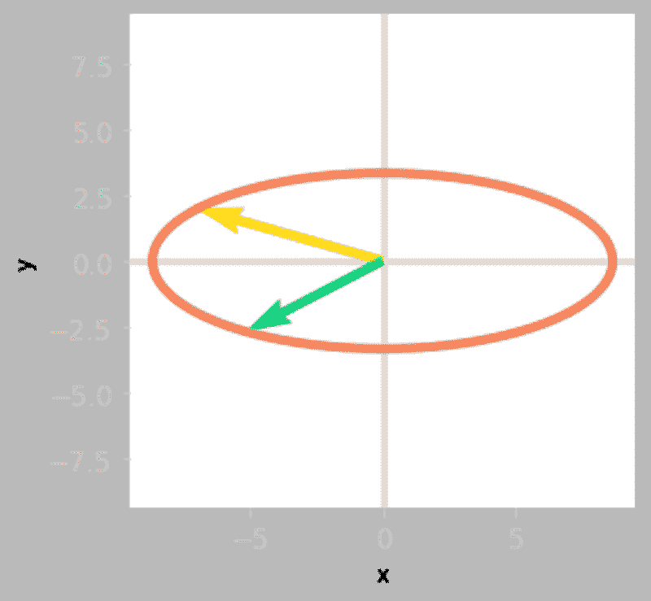

图 3：矩阵的效果  和 。

然后，图 3 显示了  的效果是单位圆和基向量的缩放。

```py
matrix_2d_effect(U @ np.diag(Sigma) @ V_transpose)
```


图 4：矩阵的效果 、  和 

最后，通过  应用第三次旋转。你可以在图 4 中看到，这个变换与矩阵  相关的变换是相同的。你已经将变换分解为旋转、缩放和旋转反射（查看基向量：已经进行了反射，因为黄色向量位于绿色向量的左侧，而这在最初并不是这样）。

# 与特征分解的比较

由于矩阵  是方阵，你可以将此分解与特征分解进行比较，并使用相同类型的可视化。你将获得有关两种方法之间差异的见解。

记住来自[数据科学的基本数学](https://bit.ly/3alObze)第九章的内容，矩阵 AA 的特征分解是：

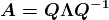

让我们用 Numpy 计算矩阵  和 （读作“资本 Lambda”）：

```py
lambd, Q = np.linalg.eig(A)
```

注意，由于矩阵  不是对称的，它的特征向量不是正交的（它们的点积不等于零）：

```py
Q[:, 0] @ Q[:, 1]
```

```py
-0.16609095970747995
```

让我们看看 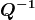 对基向量和单位圆的效果：

```py
ax = matrix_2d_effect(np.linalg.inv(Q))
```

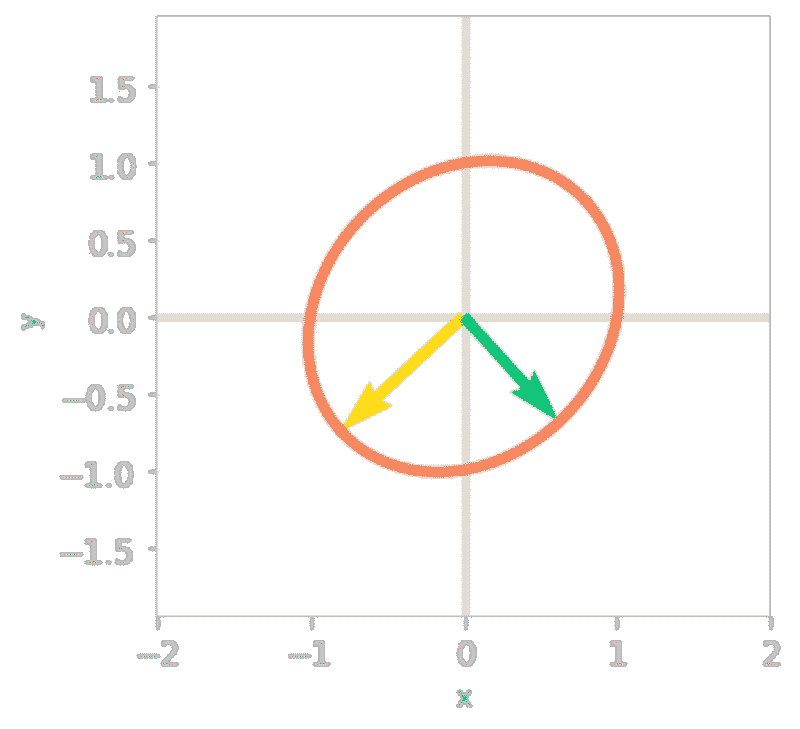

图 5：矩阵的效果 。

你可以在图 5 中看到，  旋转并缩放了单位圆和基向量。非正交矩阵的变换不是简单的旋转。

下一步是应用 。

```py
ax = matrix_2d_effect(np.diag(lambd) @ np.linalg.inv(Q))
```

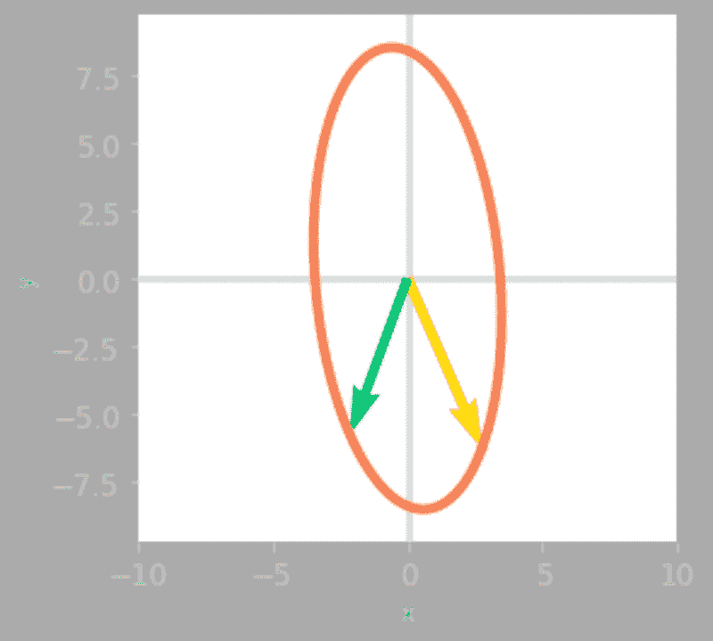

图 6：矩阵的效果  和 

如图 6 所示， 的效果是沿 y 轴的拉伸和反射（黄色向量现在在绿色向量的右侧）。

```py
ax = matrix_2d_effect(Q @ np.diag(lambd) @ np.linalg.inv(Q))
```

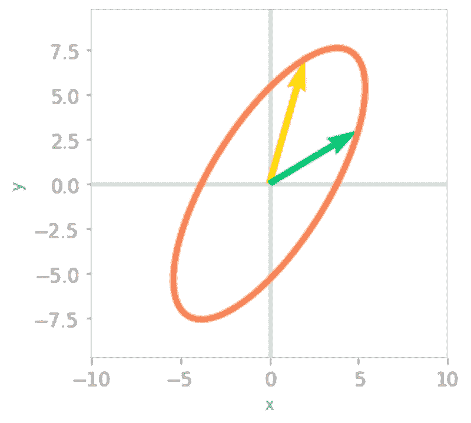

图 7：矩阵 、 和  的效果。

图 7 中显示的最后一个变换对应于将基转换回初始基。可以看到，这会导致与变换相关的结果相同，即：两个矩阵 和 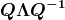 是相似的：它们对应于不同基中的相同变换。

这突出了特征分解和 SVD 之间的差异。使用 SVD，你有三种不同的变换，但其中两种仅为旋转。使用特征分解，只有两种不同的矩阵，但与 相关的变换不一定是简单的旋转（仅当是对称的时才是）。

# 三维示例

由于 SVD 可以用于非方阵，因此观察这些情况下变换的分解方式非常有趣。

首先，非方阵映射两个维度数量不同的空间。请记住，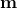 通过 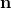 矩阵映射一个 nn 维空间到一个  维空间。

以一个 3x2 矩阵为例，它将二维空间映射到三维空间。这意味着输入向量是二维的，输出向量是三维的。考虑矩阵 ：

```py
A = np.array([
   [2, 5],
   [1, 6],
   [7, 3]
])
```

为了可视化的效果，你将再次使用二维单位圆，并计算一些圆上点的变换输出。每个点被视为输入向量，你可以观察 对这些向量的影响。函数`matrix_3_by_2_effect()`可以在[这里](https://gist.github.com/hadrienj/a70c476826cb9ea2489a773d6e84bc6c)找到。

```py
ax = matrix_3_by_2_effect(A)

# [...] Add styles axes, limits etc.
```

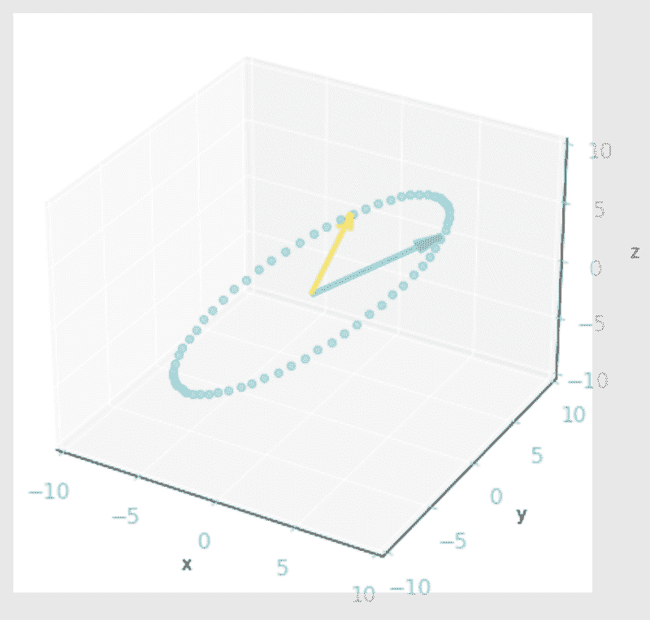

图 8：矩阵的效果 ：它将单位圆上的向量以及基向量从二维空间转换为三维空间。

如图 8 所示，二维单位圆被变换为三维椭圆。

你可以注意到输出向量都落在一个二维平面上。这是因为  的秩是二（有关矩阵秩的更多细节请参见 [数据科学中的基本数学](https://bit.ly/3alObze) 第 7.6 节）。

现在你知道了通过  变换的输出，让我们计算  的 SVD，并观察不同矩阵的效果，就像你在二维示例中做的那样。

```py
U, Sigma, V_transpose = np.linalg.svd(A)
```

左奇异向量的形状 () 是 mm 乘 mm，右奇异向量的形状 (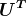) 是  乘 。矩阵  中有两个奇异值。

与  相关的变换被分解为：首先是 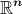 中的旋转（与  相关，在示例中是 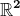），然后是从  到 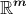 的缩放（在示例中，从  到 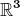），以及输出空间 IRmIRm 中的旋转（在示例中是 ）。

让我们开始检查  对单位圆的影响。你在这一步仍然处于二维空间：

```py
matrix_2d_effect(V_transpose)
```

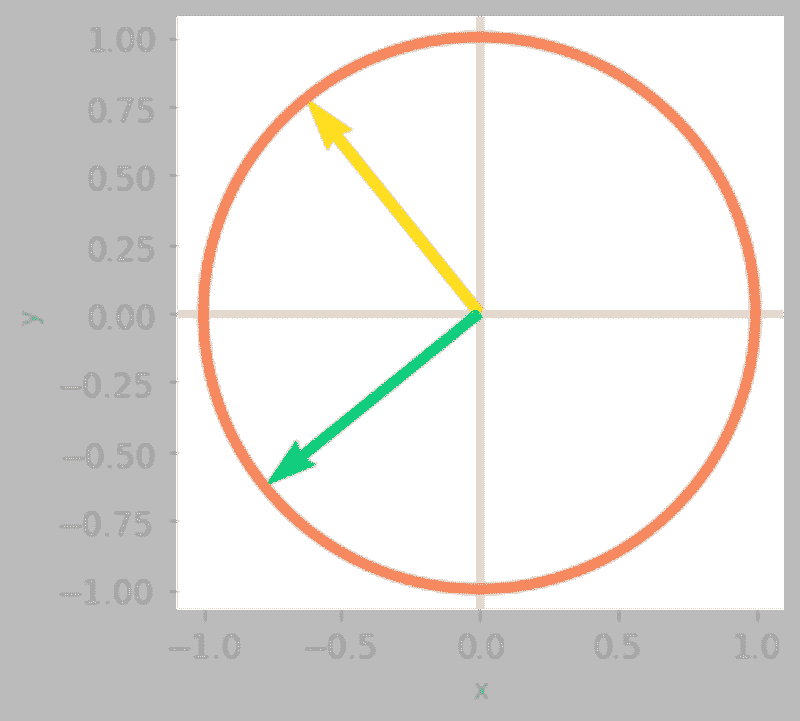

图 9：矩阵的效果 ：在这一步，你仍处于二维空间中。

然后，你需要重新塑形 ，因为函数 `np.linalg.svd()` 会给出一个包含奇异值的一维数组。你需要一个与  相同形状的矩阵：一个 3 乘 2 的矩阵，以便从二维到三维。这个矩阵将奇异值作为对角线，其余值为零。

让我们创建这个矩阵：

```py
Sigma_full = np.zeros((A.shape[0], A.shape[1]))

Sigma_full[:A.shape[1], :A.shape[1]] = np.diag(Sigma)

Sigma_full
```

```py
array([[9.99274669, 0\.        ],
       [0\.        , 4.91375758],
       [0\.        , 0\.        ]])
```

现在你可以添加的变换，以便在图 10 中查看三维结果：

```py
ax = matrix_3_by_2_effect(Sigma_full @ V_transpose)

# [...] Add styles axes, limits etc.
```

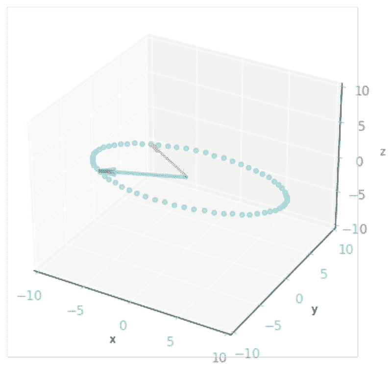

图 10：矩阵的效果和：由于是一个 3x2 矩阵，它将二维向量转换为三维向量。

最后，你需要进行最后的基变换。由于矩阵是一个 3x3 矩阵，所以你停留在三维空间中。

```py
ax = matrix_3_by_2_effect(U @ Sigma_full @ V_transpose)

# [...] Add styles axes, limits etc.
```


图 11：三个矩阵的效果、和：变换是从三维空间到三维空间。

你可以在图 11 中看到，结果与矩阵相关的变换相同。

# 摘要

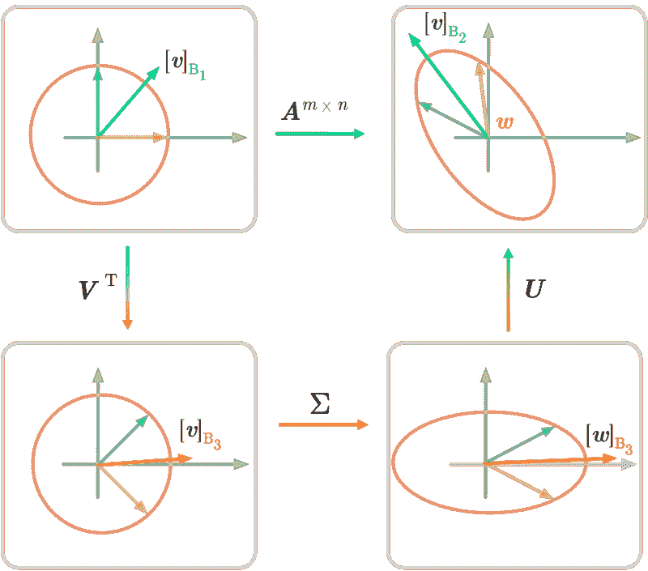

图 12：二维中的奇异值分解（SVD）。

图 12 总结了将矩阵 AA 分解为三个矩阵的 SVD 分解。与相关的变换由三个子变换完成。符号与图 12 中相同，说明了 SVD 的几何视角。

奇异值分解可以用来找到近似矩阵的变换（见[数据科学基础数学](https://bit.ly/3alObze)第 10.4 节的低秩矩阵近似）。

[原文。](https://hadrienj.github.io/posts/Essential-Math-for-Data-Science-SVD/) 经许可转载。

**[Hadrien Jean](https://hadrienj.github.io/)** 是一名机器学习科学家。他拥有巴黎高等师范学院的认知科学博士学位，曾使用行为和电生理数据研究听觉感知。他曾在工业界工作，构建了用于语音处理的深度学习管道。在数据科学与环境交汇处，他致力于使用深度学习应用于音频录音的生物多样性评估项目。他还定期在 Le Wagon（数据科学训练营）创建内容和教学，并在他的博客中撰写文章（[hadrienj.github.io](http://hadrienj.github.io)）。

### 主题更多

+   [如何克服对数学的恐惧并学习数据科学中的数学](https://www.kdnuggets.com/2021/03/overcome-fear-learn-math-data-science.html)

+   [数据科学的基本数学：特征向量及其在 PCA 中的应用](https://www.kdnuggets.com/2022/06/essential-math-data-science-eigenvectors-application-pca.html)

+   [构建视觉搜索引擎 - 第一部分：数据探索](https://www.kdnuggets.com/2022/02/building-visual-search-engine-part-1.html)

+   [Visual ChatGPT：微软结合 ChatGPT 与 VFMs](https://www.kdnuggets.com/2023/03/visual-chatgpt-microsoft-combine-chatgpt-vfms.html)

+   [AI: 大型语言与视觉模型](https://www.kdnuggets.com/2023/06/ai-large-language-visual-models.html)

+   [构建视觉搜索引擎 - 第二部分：搜索引擎](https://www.kdnuggets.com/2022/02/building-visual-search-engine-part-2.html)
