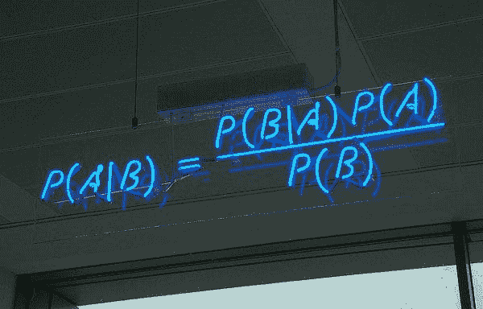
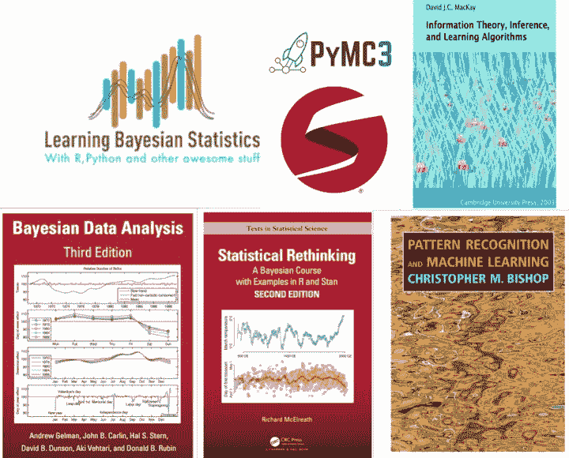

# 学习贝叶斯统计的关键资源

> 原文：[`www.kdnuggets.com/2020/07/essential-resources-learn-bayesian-statistics.html`](https://www.kdnuggets.com/2020/07/essential-resources-learn-bayesian-statistics.html)

评论

在这篇文章中，我总结了一系列入门贝叶斯统计的资源。我根据自己的经验和对什么是良好介绍及下一步的看法编制了这些参考资料。这不是学术课程或特别严谨的内容，但这是一个全面的列表，必定会帮助你开始重温/开始你的统计学之旅。以下许多参考资料是在我参加的几个研讨会上推荐给我的，我希望与那些想提高统计学和机器学习（ML）技能的人分享。

* * *

## 我们的前三大课程推荐

 1\. [谷歌网络安全证书](https://www.kdnuggets.com/google-cybersecurity) - 快速进入网络安全职业生涯。

 2\. [谷歌数据分析专业证书](https://www.kdnuggets.com/google-data-analytics) - 提升你的数据分析技能

 3\. [谷歌 IT 支持专业证书](https://www.kdnuggets.com/google-itsupport) - 支持你所在组织的 IT 需求

* * *

我能想到的初学者入门贝叶斯统计和建模的第一个资源是理查德·麦克艾瑞斯的 [《统计学的重新思考》](https://xcelab.net/rm/statistical-rethinking/)。在这里，你将学习从在简单问题中应用贝叶斯规则到复杂的多层/层级模型的所有内容。由于这不仅是一本书，还有一个完整的课程，你绝对应该在阅读过程中跟随 [YouTube 上的视频讲座](https://www.youtube.com/playlist?list=PLDcUM9US4XdNM4Edgs7weiyIguLSToZRI)。我建议你完成每章末尾的代码和练习，因为这是获得实际操作经验的最佳方式。另一个好处是，书中的 R 包 [rethinking](https://github.com/rmcelreath/rethinking) 和所有示例代码已经被翻译成多种编程语言，因此你可以自由选择你喜欢的语言进行阅读。

对于那些想通过真实世界的例子来复习统计知识的人来说，Andrew Gelman 和 Jennifer Hill 的 [数据分析：回归与多层次/分层模型](http://www.stat.columbia.edu/~gelman/arm/) 是一本很棒的书，适合那些对社会科学应用统计有更多兴趣的人。该书的更新版名为 [回归与其他故事](https://avehtari.github.io/ROS-Examples/)（Andrew Gelman, Jennifer Hill, Aki Vehtari），预计今年晚些时候发布。如果你想深入学习贝叶斯统计的更高级课程，我建议你访问 [Aki Vehtari 的教学页面](https://github.com/avehtari/BDA_course_Aalto)。虽然这比 McElreath 的课程更具挑战性，但值得一看。课程材料在 R 和 Python 中均有提供。

现在，你已经复习了基础统计，并阅读了大部分 McElreath 的书，但你也想了解机器学习。你可能会问，接下来应该去哪里？做些什么？挑战自己阅读 Christopher Bishop 的 [模式识别与机器学习](https://www.amazon.com/Pattern-Recognition-Learning-Information-Statistics/dp/0387310738)。Bishop 的书通过隐含的贝叶斯视角介绍了从回归和分类到神经网络的所有知名机器学习概念。可以说，我仅通过阅读前几章就深刻加强了我在机器学习和贝叶斯统计方面的知识。尽管我强烈推荐这本书，但请记住，这本书较为高级，需要时间来理解其概念。

与 Bishop 的书籍处于同一水平，你还可以在 [David MacKay 的信息理论、推理与学习算法](http://www.inference.org.uk/mackay/itila/book.html) 中找到严谨且详细的贝叶斯统计和建模解释。我很幸运在大学时使用了这本书，它仍然在我重新审视一些概率概念、贝叶斯统计和机器学习时至关重要。该书网页还提供了软件资源和示例，供你在阅读文本时进行实验和探索。

每当你对基础知识感到足够舒适，准备深入了解概率建模、概率计算和应用贝叶斯统计背后的数学和理论概念时，我强烈建议你按顺序阅读 [Michael Betancourt 的所有案例研究](https://betanalpha.github.io/writing/)。这在开始时可能很难掌握，但随着你回顾内容并投入时间理解这些概念，最终的回报是巨大的。

现在，很少听到贝叶斯方法在工业界的成功故事，特别是在机器学习和人工智能备受关注的今天。对于喜欢通过播客了解从业者和应用贝叶斯统计的人的故事的人，我强烈建议你去听亚历山大·安多拉的播客《学习贝叶斯统计》。亚历克斯在采访来自各种领域的专业人士时做得非常出色，介绍了贝叶斯统计的广阔应用宇宙。

最后一点是上述参考资料和资源的共同点，那就是马尔可夫链蒙特卡罗（MCMC）。要全面探索概率空间和分布，你需要像 MCMC 及其高级变体这样的高效且可靠的计算方法。如今，许多编程语言可以实现这种先进的估计算法，但最受欢迎的是 1) [Stan](https://mc-stan.org)，它基于 C++，并具有多个接口到 R ([rstanarm](http://mc-stan.org/rstanarm/)、[brms](https://paul-buerkner.github.io/brms/))、Python ([PyStan](https://pystan.readthedocs.io/en/latest/))、Julia 等，以及 2) [PyMC3](https://docs.pymc.io)。如果你有兴趣学习基础知识，可以访问他们的网页查看代码示例。

总结一下，我想分享一下我在贝叶斯统计方面的个人经历。这个话题并不简单，你应该投入一些时间以看到进展。上述参考资料是一个很好的起点，我通过尝试将贝叶斯方法应用于我的工作中，发现了学习路径中的重要一步。对我来说，它的基础更直观和透明，总体上也更易于理解（至少在概念上），但应用起来却相当困难。

**相关链接：**

+   [实用的马尔可夫链蒙特卡罗方法](https://www.kdnuggets.com/2020/06/practical-markov-chain-monte-carlo.html)

+   [如果你必须重新开始统计学，你会从哪里开始？](https://www.kdnuggets.com/2020/06/start-statistics-all-over-again.html)

+   [高斯过程中的贝叶斯优化直觉](https://www.kdnuggets.com/2018/10/intuitions-behind-bayesian-optimization-gaussian-processes.html)

### 更多相关内容

+   [学习数据科学统计的顶级资源](https://www.kdnuggets.com/2021/12/springboard-top-resources-learn-data-science-statistics.html)

+   [停止学习数据科学以寻找目标，并找到目标…](https://www.kdnuggets.com/2021/12/stop-learning-data-science-find-purpose.html)

+   [一个 $9B AI 失败的分析](https://www.kdnuggets.com/2021/12/9b-ai-failure-examined.html)

+   [成功数据科学家的 5 个特征](https://www.kdnuggets.com/2021/12/5-characteristics-successful-data-scientist.html)

+   [是什么让 Python 成为初创公司的理想编程语言](https://www.kdnuggets.com/2021/12/makes-python-ideal-programming-language-startups.html)

+   [每个数据科学家都应该知道的三个 R 库（即使你使用 Python）](https://www.kdnuggets.com/2021/12/three-r-libraries-every-data-scientist-know-even-python.html)
