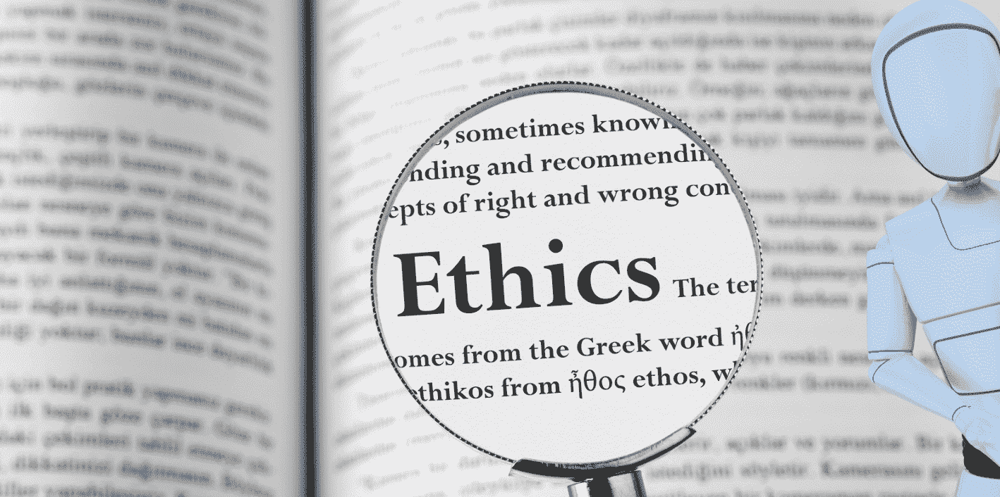

# 人工智能的伦理：导航智能机器的未来

> 原文：[`www.kdnuggets.com/2023/04/ethics-ai-navigating-future-intelligent-machines.html`](https://www.kdnuggets.com/2023/04/ethics-ai-navigating-future-intelligent-machines.html)

作者提供的图片

根据你的生活背景，每个人对人工智能及其未来有不同的看法。一些人认为这只是一个即将消退的潮流，而另一些人则认为将其应用于我们的日常生活中有巨大的潜力。

到目前为止，很明显，人工智能对我们的生活产生了重大影响，并且它将长期存在。

随着 ChatGPT 等 AI 技术的最新进展，以及 Baby AGI 等自主系统的出现，我们可以期待人工智能在未来的持续进步。这并不新鲜。这与计算机、互联网和智能手机的到来带来的剧变是一样的。

几年前，进行了一项[调查](https://www.pega.com/about/news/press-releases/new-research-reveals-deep-confusion-about-artificial-intelligence)，在六个国家的 6000 名客户中，仅有 36%的消费者对企业使用人工智能感到舒适，而 72%的人表示对人工智能的使用感到担忧。

尽管这非常有趣，但也可能令人担忧。虽然我们期待未来人工智能有更多的发展，但最大的问题是‘它的伦理是什么？’。

人工智能发展的最主要领域是机器学习。这使得模型能够利用过去的经验，通过探索数据和识别模式来学习和改进，几乎无需人工干预。机器学习被应用于不同的领域，从金融到医疗保健。我们有了像 Alexa 这样的虚拟助手，现在还有像 ChatGPT 这样的巨大语言模型。

那么，我们如何确定这些人工智能应用的伦理标准，它将如何影响经济和社会呢？

# 人工智能的伦理关注

关于人工智能存在一些伦理问题：

**1\. 偏见与歧视**

尽管数据被称为新石油，并且我们拥有大量的数据，但关于人工智能是否会对其拥有的数据产生偏见和歧视仍然存在担忧。例如，面部识别应用被证明对某些族群，尤其是肤色较深的人群，存在严重的偏见和歧视。

尽管一些面部识别应用存在严重的种族和性别偏见，但像亚马逊这样的公司在 2018 年拒绝停止向政府销售该产品。

**2\. 隐私**

另一个关于人工智能应用的担忧是隐私。这些应用需要大量数据以产生准确的输出并保持高性能。然而，关于数据收集、存储和使用的问题仍然存在。

**3\. 透明度**

尽管人工智能应用程序输入了数据，但对这些人工智能应用程序如何做出决策的透明度存在很高的担忧。这些人工智能应用程序的创作者面临着透明度不足的问题，提出了谁应对结果负责的疑问。

**4\. 自主应用程序**

我们已经看到 Baby AGI 的诞生，这是一个自主任务管理器。自主应用程序能够在人工的帮助下做出决策。这自然引起公众对将决策权交给技术的关注，这在社会眼中可能被视为伦理或道德上不正确。

**5\. 职业安全**

自人工智能诞生以来，这一担忧一直存在。随着越来越多的人看到技术能够完成他们的工作，比如 ChatGPT 生成内容并可能取代内容创作者——将人工智能应用到我们日常生活中会带来哪些社会和经济后果？

# 伦理人工智能的未来

在 2021 年 4 月，欧盟委员会发布了关于[人工智能使用法案](https://artificialintelligenceact.eu/)的立法。该法案旨在确保人工智能系统符合基本权利，并为用户和社会提供信任。它包含了一个框架，将人工智能系统分为 4 个风险领域：不可接受的风险、高风险、有限风险以及最小或无风险。你可以在这里了解更多：欧洲人工智能法案：简化解析。

巴西等其他国家在 2021 年也通过了一项法律，创建了关于人工智能使用的法律框架。因此，我们可以看到全球各国和大陆正在进一步探讨人工智能的使用以及如何伦理地使用它。

人工智能的快速发展必须与提议的框架和标准对齐。构建或实施人工智能系统的公司必须遵循伦理标准，并对应用程序进行评估，以确保透明度、隐私，同时防范偏见和歧视。

这些框架和标准将需要关注数据治理、文档记录、透明度、人类监督以及强大、准确和网络安全的人工智能系统。如果公司未能遵守，他们将不得不面对罚款和处罚。

# 总结一下

ChatGPT 的推出和通用人工智能应用程序的发展促使科学家和政治家建立法律和伦理框架，以避免人工智能应用程序可能带来的任何潜在危害或影响。

仅今年就发布了许多关于人工智能及其伦理的论文。例如，[通过比较视角评估跨大西洋人工智能驱动决策制定的竞赛](https://papers.ssrn.com/sol3/papers.cfm?abstract_id=4337517)。我们将继续看到越来越多的论文发布，直到政府进行并发布清晰而简洁的框架供公司实施。

**[Nisha Arya](https://www.linkedin.com/in/nisha-arya-ahmed/)** 是一位数据科学家、自由技术作家以及 KDnuggets 的社区经理。她特别关注提供数据科学职业建议或教程，以及围绕数据科学的理论知识。她还希望探索人工智能如何/可以促进人类生命的长寿。作为一个热心的学习者，她寻求拓宽自己的技术知识和写作技能，同时帮助指导他人。

### 更多相关主题

+   [让智能文档处理更聪明：第一部分](https://www.kdnuggets.com/2023/02/making-intelligent-document-processing-smarter-part-1.html)

+   [数据成熟度金字塔：从报告到主动…](https://www.kdnuggets.com/the-data-maturity-pyramid-from-reporting-to-a-proactive-intelligent-data-platform)

+   [支持向量机：直观的方法](https://www.kdnuggets.com/2022/08/support-vector-machines-intuitive-approach.html)

+   [支持向量机的温和介绍](https://www.kdnuggets.com/2023/07/gentle-introduction-support-vector-machines.html)

+   [提升数学效率：掌握 Numpy 数组操作](https://www.kdnuggets.com/elevate-math-efficiency-navigating-numpy-array-operations)

+   [成功应对初级数据科学职位面试的技巧](https://www.kdnuggets.com/tips-for-successfully-navigating-beginner-data-science-job-interviews)
