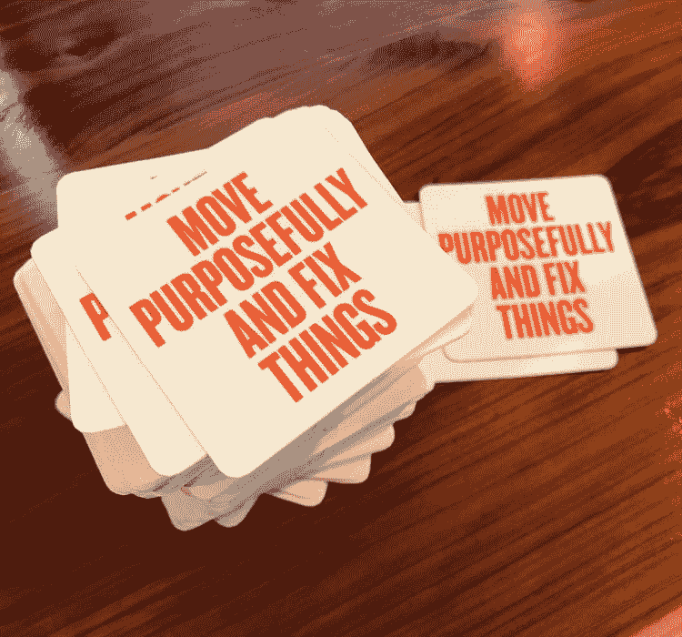
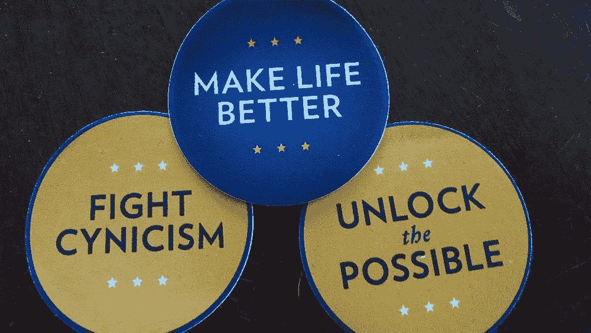
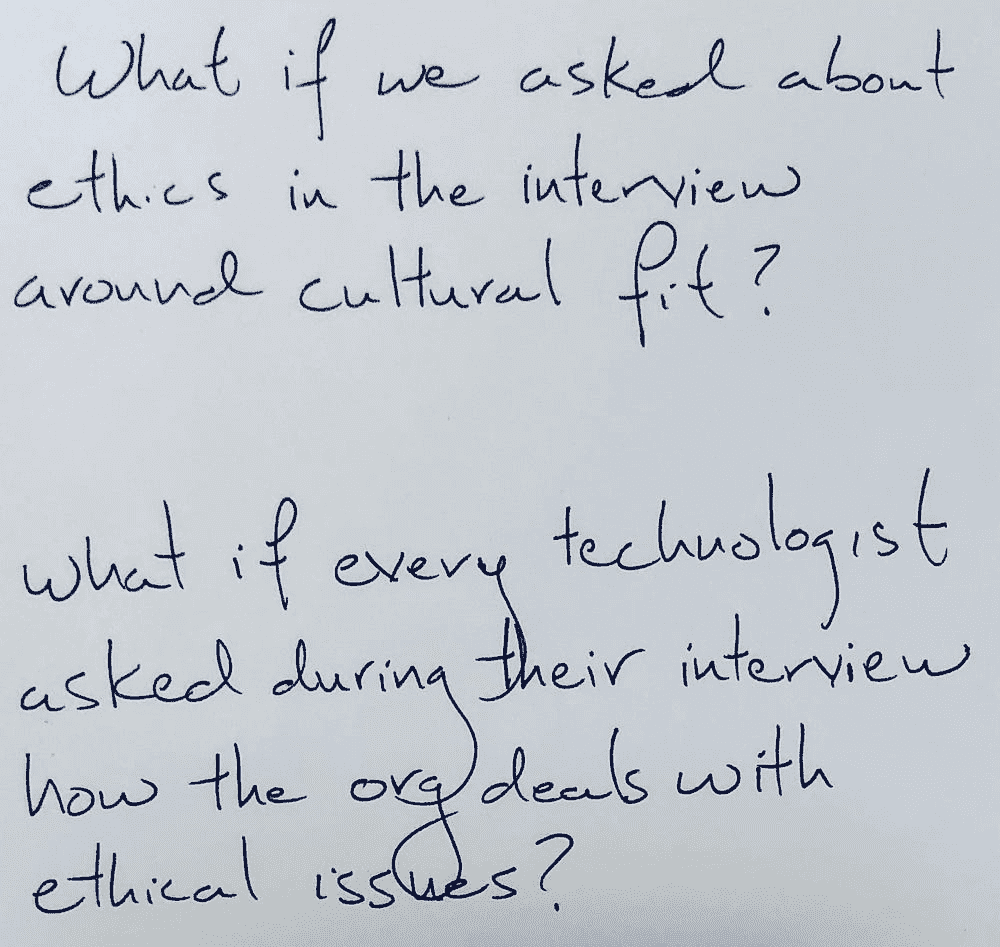
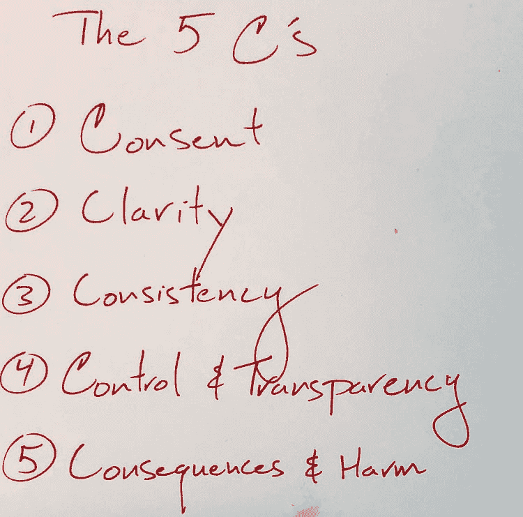

# 伦理学 + 数据科学：由前美国首席数据科学家 DJ Patil 的观点

> 原文：[`www.kdnuggets.com/2018/09/ethics-data-science.html`](https://www.kdnuggets.com/2018/09/ethics-data-science.html)

 评论

**由 [DJ Patil](https://twitter.com/dpatil)，前美国首席数据科学家**。

* * *

## 我们的前三大课程推荐

 1\. [谷歌网络安全证书](https://www.kdnuggets.com/google-cybersecurity) - 快速入门网络安全职业生涯

 2\. [谷歌数据分析专业证书](https://www.kdnuggets.com/google-data-analytics) - 提升你的数据分析技能

 3\. [谷歌 IT 支持专业证书](https://www.kdnuggets.com/google-itsupport) - 支持你的组织进行 IT 管理

* * *

数据在过去十年中改变了我们的生活多少？就在十多年前，iPhone 刚刚发布。那时候，我们的手机只能拍出模糊的照片，视频仅仅是个幻想。那时在互联网上购买鞋子还是很奇怪的，我们还得在访问新城市时携带一叠地图。Netflix 还只是一个 DVD 公司。

现在，你的手机可以拍照和录像，每秒钟有超过 4,000 张照片上传到 Facebook，每分钟有超过 400 小时的视频上传到 YouTube。我们比起确保我们有地图，更担心是否能保持连接。我们的地图应用提供实时交通情况和通过交通的导航选项。不想开车？没问题，使用一个利用数万亿数据点的共享出行应用。这种剧烈变化的根本转变是计算能力、存储和数据的巨大增长组合。当然，还有那些让这些想法成为现实的数据科学家、设计师和其他技术专家。

数据带来的变革才刚刚开始。我们即将从测序人类基因组过渡到实现个性化医疗（精准医疗）。自主车辆已开始出现在我们的道路上，我们将看到努力建造货船和飞机的尝试。而人工智能也展示了思考游戏的新方式，因为它们击败了最优秀的人类。

与此同时，我们也看到数据被用来造成伤害，通过疏忽、天真和复杂的攻击。无论是美国选举、英国脱欧、自动驾驶汽车事故，还是种族歧视算法；我们必须预计到数据带来的伤害会增加。我们才刚刚开始应对由于自动化带来的工作岗位流失的社会影响。

我们需要解决的问题是，我们能做些什么来确保数据和技术为我们服务，而不是对我们不利？

白宫幕僚长团队将分发的贴纸

有来自欧盟的监管方法（[GDPR](https://eugdpr.org/)）和加州的（[CCPA](https://www.wired.com/story/california-unanimously-passes-historic-privacy-bill/)）。以及美国国会的听证会（没有行动）。也有一些书籍强调了未来的风险，例如[《数学武器的毁灭》](https://weaponsofmathdestructionbook.com/)和[《自动化的不平等》](https://virginia-eubanks.com/books/)。还有一些新的智库，如[人工智能合作伙伴关系](https://www.partnershiponai.org/)、[AI Now 研究所](https://ainowinstitute.org/)和[人文技术中心](http://humanetech.com/)，它们开始研究对社会的更广泛影响。

我是这些努力的粉丝。它们非常必要。我想问的问题是：负责构建这些技术的数据科学家和其他团队成员的角色是什么？他们在实施“良好”数据科学方面的作用是什么？（[在这篇文章中也讨论过。](https://www.linkedin.com/pulse/code-ethics-data-science-dj-patil/)）

当希拉里·梅森和我出版了[《数据驱动：创建数据文化》](https://www.amazon.com/Data-Driven-DJ-Patil-ebook/dp/B00SXHFTAS)时，我们意识到很少有措施来赋权那些想要做正确事情的人。这些技术专家、设计师和产品经理可能有正确的自然直觉，但由于商业压力或不理想的实践，常常被边缘化。而在其他情况下，他们甚至不知道要问什么问题。

我们与希拉里·梅森和迈克·卢基德斯（他一直是我们每本书的编辑，我们最终说服他成为合著者）一起查看了我们在数据科学家中看到的最佳实践，并发布了一本新电子书：[伦理与数据科学](http://a.co/d/4czWEvW)。

鉴于我们对这个话题的期望改变如此之大，我们将这本书视为一个开源项目，这里是 0.1 版本。我们也确保它将始终**免费**并采用[创意共享许可证](https://en.wikipedia.org/wiki/Creative_Commons_license)（所以你可以拿它并与自己的努力结合）。我们也希望其他人考虑贡献，我们会在[O'Reilly Radar 的伦理系列](https://www.oreilly.com/tags/data-ethics)上发布这些更新。我们也故意保持它尽可能简短，希望你能与其他团队分享。（[你可以在这里免费获取我们所有的电子书](https://www.amazon.com/s/ref=dp_byline_sr_ebooks_1?ie=UTF8&text=DJ+Patil&search-alias=digital-text&field-author=DJ+Patil&sort=relevancerank)。）

你可以在书中期待找到什么？我们涵盖了一个模型清单（借鉴了[Atul Gawande 的《清单宣言》](https://en.wikipedia.org/wiki/The_Checklist_Manifesto)），用于构建数据产品（如果你正在做类似的事情，我们非常希望听到你的成功经验和失败教训）。关于如何在产品开发过程中实施更道德的行为，包括如果你不同意团队意见的异议渠道。如何开始面试以评估文化适配和道德适配。还包括我们所谓的 5C——五个框架指南帮助我们思考构建数据产品（同意、清晰、一致、控制与透明度，以及后果与伤害）。最后，我们包含了普林斯顿大学 Ed Felten 团队的一组案例研究，供你和你的团队参考。

我们最希望听到的是**你的**声音。数据的影响力正在显现，我们需要赶在它之前。这从我们开始。那些正在构建这些技术的人。[在这里获取电子书](http://a.co/d/4czWEvW)。

开始行动吧。没有人会来救我们，一切都靠我们自己。

**简介：[DJ Patil](https://www.linkedin.com/in/dpatil/)** 旨在改变我们的医疗保健系统。前美国首席数据科学家。

[原始](https://medium.com/@dpatil/ethics-data-science-ff21d0c29346)。经许可转载。

**相关：**

+   [2018 数据科学家报告发布](https://www.kdnuggets.com/2018/08/figure-eight-2018-data-scientist-report.html)

+   [数据科学备忘单](https://www.kdnuggets.com/2018/09/meverick-lin-data-science-cheat-sheet.html)

+   [数据科学的基本数学：‘为什么’和‘如何’](https://www.kdnuggets.com/2018/09/essential-math-data-science.html)

### 更多相关话题

+   [AI 伦理：导航智能机器的未来](https://www.kdnuggets.com/2023/04/ethics-ai-navigating-future-intelligent-machines.html)

+   [首席 AI 官的崛起](https://www.kdnuggets.com/the-rise-of-chief-ai-officer)

+   [导航数据科学职位头衔：数据分析师 vs. 数据科学家…](https://www.kdnuggets.com/navigating-data-science-job-titles-data-analyst-vs-data-scientist-vs-data-engineer)

+   [KDnuggets™ 新闻 22:n03, 1 月 19 日：深入探讨 13 种数据…](https://www.kdnuggets.com/2022/n03.html)

+   [KDnuggets 新闻，3 月 16 日，2022：学习数据科学基础及 5 种…](https://www.kdnuggets.com/2022/n11.html)

+   [KDnuggets 新闻，5 月 25 日：每个人都需要的 6 种 Python 机器学习工具…](https://www.kdnuggets.com/2022/n21.html)
