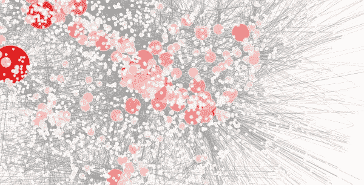
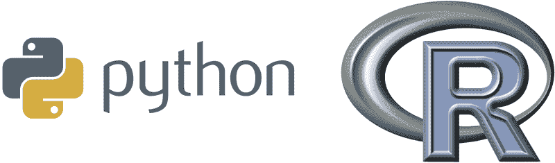
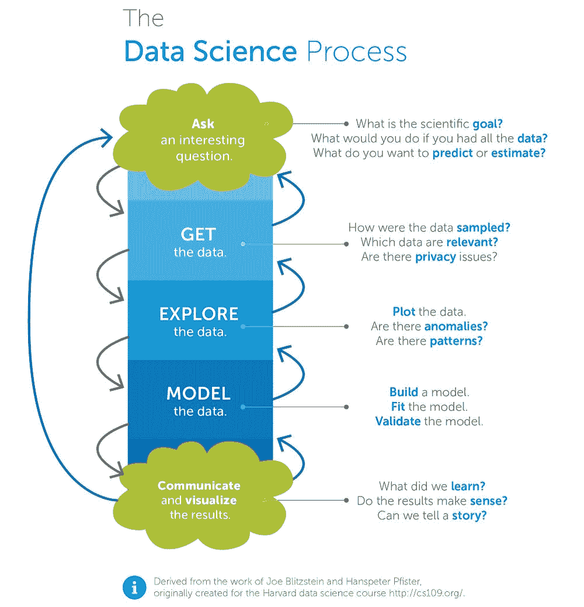
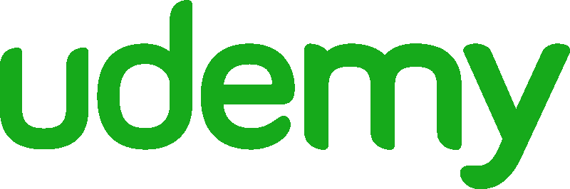
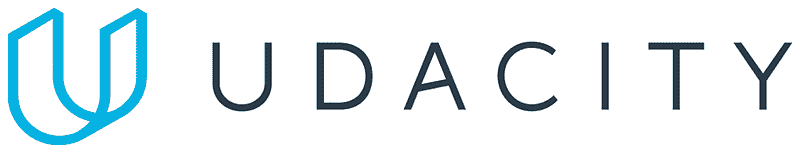
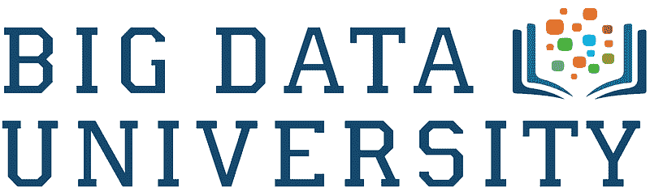
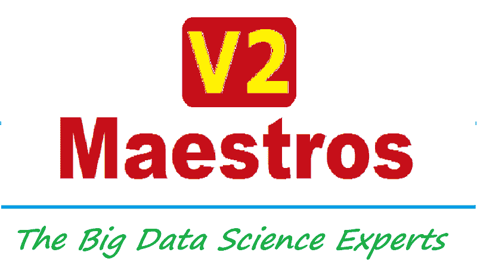
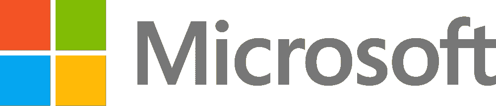
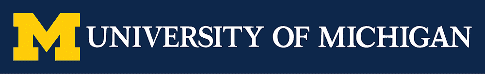
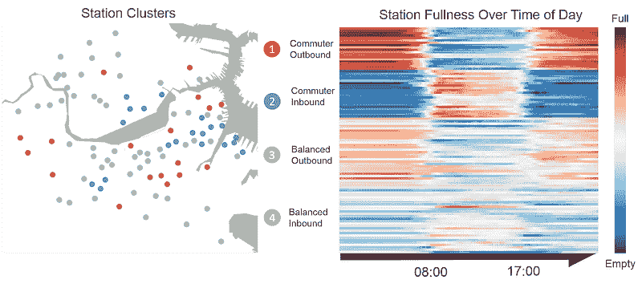

# 互联网上每个数据科学入门课程的排名

> 原文：[`www.kdnuggets.com/2017/03/every-intro-data-science-course-ranked.html`](https://www.kdnuggets.com/2017/03/every-intro-data-science-course-ranked.html)

**作者：David Venturi，[有志数据科学家](http://davidventuri.com/)。**

数据可视化由[Alanah Ryding](http://alanahryding.me/blog/?p=618)提供。

* * *

## 我们的前三个课程推荐

 1\. [谷歌网络安全证书](https://www.kdnuggets.com/google-cybersecurity) - 快速进入网络安全职业生涯。

 2\. [谷歌数据分析专业证书](https://www.kdnuggets.com/google-data-analytics) - 提升你的数据分析技能

 3\. [谷歌 IT 支持专业证书](https://www.kdnuggets.com/google-itsupport) - 支持你的组织的 IT

* * *

一年前，我退出了加拿大最好的计算机科学项目之一。我开始利用在线资源创建自己的[数据科学硕士课程](https://medium.com/@davidventuri/i-dropped-out-of-school-to-create-my-own-data-science-master-s-here-s-my-curriculum-1b400dcee412#.5fwwphdqd)。我意识到，通过 edX、Coursera 和 Udacity，我可以学到所需的一切。而且，我可以更快、更高效地学习，而且成本仅是原来的一个小部分。

我现在快完成了。我已经参加了许多与数据科学相关的课程，并审核了更多课程的部分内容。我了解目前的选择，以及为数据分析师或数据科学家角色准备所需的技能。**几个月前，我开始创建一份以评论为驱动的指南，推荐数据科学每个主题的最佳课程。**

在系列的第一份指南中，我推荐了一些[编程课程](https://medium.freecodecamp.com/if-you-want-to-learn-data-science-start-with-one-of-these-programming-classes-fb694ffe780c#.42hhzxopw)给初学者数据科学家。接着是[统计学和概率课程](https://medium.freecodecamp.com/if-you-want-to-learn-data-science-take-a-few-of-these-statistics-classes-9bbabab098b9#.p7pac546r)。

### 现在开始介绍数据科学。

*(如果你不确定数据科学入门课程的内容，不用担心。我会很快解释的。)*

在这份指南中，我花费了 10 多个小时试图识别 2017 年 1 月提供的所有在线数据科学入门课程，从它们的课程大纲和评论中提取关键信息，并汇总它们的评分。为此，我依赖了开源的 Class Central 社区及其数千个课程评分和评论的数据库。

自 2011 年以来，[Class Central](https://www.class-central.com/)的创始人[Dhawal Shah](https://www.class-central.com/@dhawal)比世界上几乎任何人都更加关注在线课程。Dhawal 亲自帮助我整理了这份资源列表。

### 我们如何挑选考虑的课程

每门课程必须符合三个标准：

1.  **必须教授数据科学过程。** 详细内容将在稍后提供。

1.  **必须是按需提供或每隔几个月开设一次。**

1.  **必须是互动的在线课程，不接受书籍或只读的教程**。虽然这些也是学习的可行方法，但本指南专注于课程。

我们相信我们涵盖了符合上述标准的所有显著课程。由于[Udemy](https://www.udemy.com/)上似乎有数百门课程，我们选择仅考虑评价最多和评分最高的课程。不过，我们仍有可能遗漏了某些课程。如果我们遗漏了好的课程，请在评论区告诉我们。

### 我们如何评估课程

我们从 Class Central 和其他评论网站汇总了平均评分和评论数量，以计算每门课程的加权平均评分。我们阅读了文本评论，并利用这些反馈来补充数字评分。

我们基于两个因素做出了主观的课程大纲判断：

1.  **数据科学过程的覆盖范围。** 课程是否略过或跳过某些主题？是否对某些主题讲解过于详细？有关这一过程的具体内容请参见下一部分。

1.  **常见数据科学工具的使用情况。** 课程是否使用 Python 和/或 R 等流行编程语言教授？虽然这些不是必要的，但在大多数情况下很有帮助，因此对这些课程稍有偏好。

Python 和 R 是数据科学中最受欢迎的两种编程语言。

### 数据科学过程是什么？

*什么是数据科学？数据科学家做什么？* 这些是数据科学入门课程应回答的基本问题。以下来自哈佛教授 Joe Blitzstein 和 Hanspeter Pfister 的图表概述了典型的**数据科学过程**，这将帮助我们回答这些问题。

来自[Opera Solutions](http://blog.operasolutions.com/bid/384900/what-is-data-science)的可视化图。

我们的目标是通过这门数据科学入门课程来熟悉数据科学过程。我们不希望深入覆盖过程的具体方面，因此标题中有“入门”一词。

对于每个方面，理想的课程应在过程框架内解释关键概念，介绍常见工具，并提供一些示例（最好是动手操作）。

我们只寻找一个入门课程。因此，本指南不会包括像约翰霍普金斯大学的[数据科学专业化](http://click.linksynergy.com/fs-bin/click?id=SAyYsTvLiGQ&subid=&offerid=479491.1&type=10&tmpid=18061&u1=cc-medium-career-guide-intro-to-data-science%20&RD_PARM1=https%3A%2F%2Fwww.coursera.org%2Fspecializations%2Fjhu-data-science%2F)在 Coursera 上或 Udacity 的[数据分析师纳米学位](https://www.udacity.com/course/data-analyst-nanodegree--nd002?utm_medium=referral&utm_campaign=api)这样的完整专业化或项目。这些课程的汇编超出了本系列的目的：寻找每个学科的最佳**单独**课程，以组成数据科学教育。本系列文章中的最后三篇指南将详细介绍数据科学过程的各个方面。

### 需要基本的编码、统计和概率经验。

下列几个课程需要基本的编程、统计和概率经验。考虑到新内容相对高级，而这些学科通常有几门专门的课程，这一要求是可以理解的。

可以通过我们在前两篇文章中的推荐（[编程](https://medium.freecodecamp.com/if-you-want-to-learn-data-science-start-with-one-of-these-programming-classes-fb694ffe780c#.ld31z08y5)，[统计](https://medium.freecodecamp.com/if-you-want-to-learn-data-science-take-a-few-of-these-statistics-classes-9bbabab098b9)）来获得这些经验，这些文章是《数据科学职业指南》的一部分。

### 我们推荐的最佳数据科学入门课程是...

**[数据科学 A-Z™：包括真实数据科学练习](http://click.linksynergy.com/fs-bin/click?id=SAyYsTvLiGQ&subid=&offerid=323058.1&type=10&tmpid=14538&RD_PARM1=https%3A%2F%2Fwww.udemy.com%2Fdatascience%2F%26u1%3Dcc-medium-career-guide-intro-to-data-science)（Kirill Eremenko/Udemy）**

Kirill Eremenko 的[数据科学 A-Z™](http://click.linksynergy.com/fs-bin/click?id=SAyYsTvLiGQ&subid=&offerid=323058.1&type=10&tmpid=14538&RD_PARM1=https%3A%2F%2Fwww.udemy.com%2Fdatascience%2F%26u1%3Dcc-medium-career-guide-intro-to-data-science)在 Udemy 上在覆盖数据科学过程的广度和深度方面显然是胜出的。它在 3,071 条评论中获得了 4.5 星的加权平均评分，这使它在所有考虑的课程中排名最高。

该课程概述了完整的过程，并提供了实际的例子。内容长达 21 小时，时长适中。评论者喜欢讲师的授课方式和内容的组织。价格根据 Udemy 的折扣而有所不同，折扣频繁，因此你可能只需$10 即可购买。

尽管它没有检查我们“使用常见数据科学工具”的选项，但非 Python/R 工具选择（gretl、Tableau、Excel）在上下文中被有效使用。Eremenko 在解释 gretl 选择时提到（gretl 是一个统计软件包），尽管它适用于他使用的所有工具（重点是我的）：

> 在 gretl 中，我们可以像在 R 和 Python 中一样进行建模，但无需编写代码。这就是关键所在。你们中的一些人可能已经很熟悉 R，但有些人可能完全不知情。我的目标是展示如何建立一个强大的模型，并**提供一个可以在任何你选择的工具中应用的框架**。gretl 将帮助我们避免陷入编程的困境。

一位著名的评论员指出：

> Kirill 是我在网上找到的最好的老师。他使用现实生活中的例子，并解释常见问题，以便你能更深入地理解课程内容。他还提供了大量关于从处理不足的数据到向 C 级管理层展示工作的数据科学家的见解。我强烈推荐这门课程给初学者和中级数据分析师！

[数据科学 A-Z™](http://click.linksynergy.com/fs-bin/click?id=SAyYsTvLiGQ&subid=&offerid=323058.1&type=10&tmpid=14538&RD_PARM1=https%3A%2F%2Fwww.udemy.com%2Fdatascience%2F%26u1%3Dcc-medium-career-guide-intro-to-data-science)的预览视频。

### 这是一个以 Python 为重点的绝佳入门课程。

**[数据分析入门](https://www.class-central.com/mooc/4937/udacity-intro-to-data-analysis) (Udacity)**

Udacity 的 [数据分析入门](https://www.class-central.com/mooc/4937/udacity-intro-to-data-analysis) 是 Udacity 流行的 [数据分析师纳米学位](https://medium.com/@davidventuri/review-udacity-data-analyst-nanodegree-1e16ae2b6d12#.8uvi6hlpv) 的一部分，相对较新。它使用 Python 清晰而有条理地覆盖了数据科学过程，但在建模方面略有不足。预计时间为 36 小时（每周六小时，共六周），但根据我的经验时间较短。它在一条评论中获得了 5 星评价。课程免费。

视频制作精良，讲师（Caroline Buckey）清晰而亲切。大量编程测验巩固了视频中学习的概念。学生将在课程结束后对他们的新技能或改进的 NumPy 和 Pandas 技能充满信心（这些是流行的 Python 库）。最终项目——在纳米学位中评分和评审，但在免费的单独课程中没有——可以为个人作品集增添亮点。

Udacity 的讲师 Caroline Buckey 讲解了数据分析过程（也称为数据科学过程）。

### 这是一项令人印象深刻的课程，虽然没有评论数据。

**[数据科学基础](https://bigdatauniversity.com/learn/data-science/) (Big Data University)**

数据科学基础是由 IBM 的 Big Data University 提供的四门课程系列。它包括名为[数据科学 101](https://bigdatauniversity.com/courses/data-science-101/)、[数据科学方法论](https://bigdatauniversity.com/courses/data-science-methodology-2/)、[开源工具实践数据科学](https://bigdatauniversity.com/courses/data-science-hands-open-source-tools/)和[R 101](https://bigdatauniversity.com/courses/r-101/)的课程。

它涵盖了完整的数据科学过程，并介绍了 Python、R 以及其他几种开源工具。课程制作质量极高。预计需要 13 到 18 小时，取决于是否参加最后的“R 101”课程，这对本指南的目的并非必要。不幸的是，它在我们用于此分析的主要评价网站上没有评价数据，因此我们暂时不能推荐它作为上述两个选项的替代品。它是免费的。

来自 Big Data University 的[数据科学 101](https://bigdatauniversity.com/courses/data-science-101/)（这是[数据科学基础](https://bigdatauniversity.com/learn/data-science/)系列的第一门课程）的一个视频。

### 竞争情况

我们的首选具有 3,068 条评论的加权平均评分 4.5 星。接下来我们来看看其他替代选项，按评分降序排列。下面你会找到一些以 R 为重点的课程，如果你坚定地想要在该语言中入门。

+   [数据科学与机器学习 Python 全栈训练营](http://click.linksynergy.com/fs-bin/click?id=SAyYsTvLiGQ&subid=&offerid=323058.1&type=10&tmpid=14538&RD_PARM1=https%3A%2F%2Fwww.udemy.com%2Fpython-for-data-science-and-machine-learning-bootcamp%2F%26u1%3Dcc-medium-career-guide-intro-to-data-science)（Jose Portilla/Udemy）：全面覆盖过程，侧重于工具（Python）。流程驱动较少，更详细地介绍了 Python。虽然这个课程很棒，但不适合本指南的范围。它和 Jose 的 R 课程一样，可以同时作为 Python/R 和数据科学的入门课程。内容长达 21.5 小时。它的**4.7**星加权平均评分来自 1,644 条评论。费用根据 Udemy 的折扣而异，折扣频繁。

+   [Data Science and Machine Learning Bootcamp with R](http://click.linksynergy.com/fs-bin/click?id=SAyYsTvLiGQ&subid=&offerid=323058.1&type=10&tmpid=14538&RD_PARM1=https%3A%2F%2Fwww.udemy.com%2Fdata-science-and-machine-learning-bootcamp-with-r%2F%26u1%3Dcc-medium-career-guide-intro-to-data-science)（Jose Portilla/Udemy）：涵盖整个过程，重点是工具使用（R）。过程驱动较少，更侧重于 R 的详细介绍。尽管如此，这门课程非常出色，但对于本指南的范围可能不太适合。它和上面提到的 Jose 的 Python 课程一样，可以作为 Python/R 和数据科学的入门课程。内容长达 18 小时，基于 847 条评价，平均评分为 **4.6** 星。费用根据 Udemy 的折扣而异，折扣频繁。

Jose Portilla 在 Udemy 上有两个数据科学和机器学习的速成课程：一个是 [Python](http://click.linksynergy.com/fs-bin/click?id=SAyYsTvLiGQ&subid=&offerid=323058.1&type=10&tmpid=14538&RD_PARM1=https%3A%2F%2Fwww.udemy.com%2Fpython-for-data-science-and-machine-learning-bootcamp%2F%26u1%3Dcc-medium-career-guide-intro-to-data-science)，另一个是 [R](http://click.linksynergy.com/fs-bin/click?id=SAyYsTvLiGQ&subid=&offerid=323058.1&type=10&tmpid=14538&RD_PARM1=https%3A%2F%2Fwww.udemy.com%2Fdata-science-and-machine-learning-bootcamp-with-r%2F%26u1%3Dcc-medium-career-guide-intro-to-data-science)。

+   [Data Science and Machine Learning with Python — Hands On!](http://click.linksynergy.com/fs-bin/click?id=SAyYsTvLiGQ&subid=&offerid=323058.1&type=10&tmpid=14538&RD_PARM1=https%3A%2F%2Fwww.udemy.com%2Fdata-science-and-machine-learning-with-python-hands-on%2F%26u1%3Dcc-medium-career-guide-intro-to-data-science)（Frank Kane/Udemy）：部分过程覆盖。重点在于统计和机器学习。内容适中（九小时）。使用 Python。基于 3,104 条评价，平均评分为 **4.5** 星。费用根据 Udemy 的折扣而异，折扣频繁。

+   [Introduction to Data Science](http://click.linksynergy.com/fs-bin/click?id=SAyYsTvLiGQ&subid=&offerid=323058.1&type=10&tmpid=14538&RD_PARM1=https%3A%2F%2Fwww.udemy.com%2Flearn-data-science%2F%26u1%3Dcc-medium-career-guide-intro-to-data-science)（Data Hawk Tech/Udemy）：覆盖整个过程，但深度有限。内容较短（三小时）。简要覆盖 R 和 Python。基于 62 条评价，平均评分为 **4.4** 星。费用根据 Udemy 的折扣而异，折扣频繁。

+   [应用数据科学：入门](https://www.class-central.com/mooc/1806/open-education-by-blackboard-applied-data-science-an-introduction)（雪城大学/Blackboard 开放教育）：覆盖整个过程，但分布不均。重点关注基础统计学和 R 语言。过于应用，过程关注不够，无法满足本指南的目的。在线课程体验感到断断续续。具有**4.33**星的加权平均评分，共 6 条评论。免费。

+   [数据科学导论](http://click.linksynergy.com/fs-bin/click?id=SAyYsTvLiGQ&subid=&offerid=323058.1&type=10&tmpid=14538&RD_PARM1=https%3A%2F%2Fwww.udemy.com%2Fintroduction-to-data-science%2F%26u1%3Dcc-medium-career-guide-intro-to-data-science)（Nina Zumel & John Mount/Udemy）：仅覆盖部分过程，但在数据准备和建模方面深度不错。长度适中（六小时内容）。使用 R 语言。具有**4.3**星的加权平均评分，共 101 条评论。费用因 Udemy 折扣而异，折扣频繁。

+   [使用 Python 的应用数据科学](http://click.linksynergy.com/fs-bin/click?id=SAyYsTvLiGQ&subid=&offerid=323058.1&type=10&tmpid=14538&RD_PARM1=https%3A%2F%2Fwww.udemy.com%2Fapplied-data-science-with-python%2F%26u1%3Dcc-medium-career-guide-intro-to-data-science)（V2 Maestros/Udemy）：全面覆盖过程，并且每个过程的深度都很好。长度适中（8.5 小时内容）。使用 Python。具有**4.3**星的加权平均评分，共 92 条评论。费用因 Udemy 折扣而异，折扣频繁。

V2 Maestros 的“*应用数据科学*”课程有两个版本：一个是针对[Python](http://click.linksynergy.com/fs-bin/click?id=SAyYsTvLiGQ&subid=&offerid=323058.1&type=10&tmpid=14538&RD_PARM1=https%3A%2F%2Fwww.udemy.com%2Fapplied-data-science-with-python%2F%26u1%3Dcc-medium-career-guide-intro-to-data-science)，另一个是针对[R](http://click.linksynergy.com/fs-bin/click?id=SAyYsTvLiGQ&subid=&offerid=323058.1&type=10&tmpid=14538&RD_PARM1=https%3A%2F%2Fwww.udemy.com%2Fapplied-data-science-with-r%2F%26u1%3Dcc-medium-career-guide-intro-to-data-science)。

+   [想成为数据科学家吗？](http://click.linksynergy.com/fs-bin/click?id=SAyYsTvLiGQ&subid=&offerid=323058.1&type=10&tmpid=14538&RD_PARM1=https%3A%2F%2Fwww.udemy.com%2Fwant-to-be-a-data-scientist%2F%26u1%3Dcc-medium-career-guide-intro-to-data-science)（V2 Maestros/Udemy）：覆盖整个过程，但深度有限。内容较短（3 小时）。工具覆盖有限。具有**4.3**星的加权平均评分，共 790 条评论。费用因 Udemy 折扣而异，折扣频繁。

+   [数据到洞察：数据分析简介](https://www.class-central.com/mooc/2129/futurelearn-data-to-insight-an-introduction-to-data-analysis)（奥克兰大学/FutureLearn）：覆盖范围不明确。声称专注于数据探索、发现和可视化。不可随时提供。内容时长为 24 小时（每周三小时，共八周）。它有 **4** 星的加权平均评分，基于 2 条评论。免费，提供付费证书。

+   [数据科学导论](https://www.class-central.com/mooc/6405/edx-data-science-orientation)（Microsoft/edX）：部分过程覆盖（缺乏建模方面）。使用 Excel，这一点很合理，因为这是微软品牌的课程。内容时长为 12-24 小时（每周两到四小时，共六周）。它有 **3.95** 星的加权平均评分，基于 40 条评论。免费，提供 $25 的认证证书。

+   [数据科学基础](https://www.class-central.com/mooc/3954/edx-dat203x-data-science-and-machine-learning-essentials)（Microsoft/edX）：全面的过程覆盖，每个方面的深度都很好。涵盖 R、Python 和 Azure ML（微软的机器学习平台）。有几个 1 星评论提到工具选择（Azure ML）和讲师的表现不佳。内容时长为 18-24 小时（每周三到四小时，共六周）。它有 **3.81** 星的加权平均评分，基于 67 条评论。免费，提供 $49 的认证证书。

上述两个课程来自 Microsoft 的 [数据科学专业证书](http://www.awin1.com/awclick.php?gid=295463&mid=6798&awinaffid=301045&linkid=599979&clickref=&p=https%3A%2F%2Fwww.edx.org%2Fmicrosoft-professional-program-certficate-data-science) 在 edX 上。

+   [应用数据科学与 R](http://click.linksynergy.com/fs-bin/click?id=SAyYsTvLiGQ&subid=&offerid=323058.1&type=10&tmpid=14538&RD_PARM1=https%3A%2F%2Fwww.udemy.com%2Fapplied-data-science-with-r%2F%26u1%3Dcc-medium-career-guide-intro-to-data-science)（V2 Maestros/Udemy）：V2 Maestros 的 Python 课程的 R 伴侣。全面的过程覆盖，每个方面的深度都很好。时长适中（11 小时内容）。使用 R。它有 **3.8** 星的加权平均评分，基于 212 条评论。价格因 Udemy 的折扣而异，折扣频繁。

+   [数据科学导论](https://www.class-central.com/mooc/1480/udacity-intro-to-data-science)（Udacity）：部分过程覆盖，虽然对所涉及主题的深度很好。缺乏探索方面，尽管 Udacity 有一门完整的 [课程](https://www.class-central.com/mooc/1478/udacity-data-analysis-with-r) 讲解探索性数据分析（EDA）。声称时长为 48 小时（每周六小时，共八周），但根据我的经验更短。一些评论认为高级内容的设置不足。感觉组织较差。使用 Python。它有 **3.61** 星的加权平均评分，基于 18 条评论。免费。

+   [Python 中的数据科学入门](http://click.linksynergy.com/fs-bin/click?id=SAyYsTvLiGQ&subid=&offerid=451430.1&type=10&u1=cc-medium-career-guide-intro-to-data-science&tmpid=18061&RD_PARM1=https%3A%2F%2Fwww.coursera.org%2Flearn%2Fpython-data-analysis)（密歇根大学/Coursera）：部分过程覆盖。不包括建模和可视化，尽管课程#2 和#3 在[应用数据科学与 Python 专项](http://click.linksynergy.com/fs-bin/click?id=SAyYsTvLiGQ&subid=&offerid=451430.1&type=10&tmpid=18061&u1=cc-medium-career-guide-intro-to-data-science&RD_PARM1=https%3A%2F%2Fwww.coursera.org%2Fspecializations%2Fdata-science-python)中涵盖这些方面。完成这三门课程对于本指南而言过于深入。使用 Python。时长四周。其**3.6**星的加权平均评分基于 15 条评论。提供免费和付费选项。

密歇根大学在 Coursera 上教授[应用数据科学与 Python 专项](http://click.linksynergy.com/fs-bin/click?id=SAyYsTvLiGQ&subid=&offerid=451430.1&type=10&tmpid=18061&u1=cc-medium-career-guide-intro-to-data-science&RD_PARM1=https%3A%2F%2Fwww.coursera.org%2Fspecializations%2Fdata-science-python)。

+   [数据驱动的决策制定](http://click.linksynergy.com/fs-bin/click?id=SAyYsTvLiGQ&subid=&offerid=451430.1&type=10&tmpid=18061&u1=cc-medium-career-guide-intro-to-data-science&RD_PARM1=https%3A%2F%2Fwww.coursera.org%2Flearn%2Fdecision-making)（普华永道/Coursera）：部分覆盖（缺乏建模），重点在商业应用。介绍了许多工具，包括 R、Python、Excel、SAS 和 Tableau。时长四周。其**3.5**星的加权平均评分基于 2 条评论。提供免费和付费选项。

+   [数据科学速成课程](http://click.linksynergy.com/fs-bin/click?id=SAyYsTvLiGQ&subid=&offerid=451430.1&type=10&u1=cc-medium-career-guide-intro-to-data-science&tmpid=18061&RD_PARM1=https%3A%2F%2Fwww.coursera.org%2Flearn%2Fdata-science-course)（约翰霍普金斯大学/Coursera）：对完整过程的极简概述。对本系列来说过于简略。时长两小时。其**3.4**星的加权平均评分基于 19 条评论。提供免费和付费选项。

+   [数据科学家的工具箱](http://click.linksynergy.com/fs-bin/click?id=SAyYsTvLiGQ&subid=&offerid=451430.1&u1=cc-medium-career-guide-intro-to-data-science%20&type=10&tmpid=18061&RD_PARM1=https%3A%2F%2Fwww.coursera.org%2Flearn%2Fdata-scientists-tools)（约翰霍普金斯大学/Coursera）：对整个过程的极简概述。更多是约翰霍普金斯大学的[数据科学专业化](http://click.linksynergy.com/fs-bin/click?id=SAyYsTvLiGQ&subid=&offerid=479491.1&type=10&tmpid=18061&u1=cc-medium-career-guide-intro-to-data-science%20&RD_PARM1=https%3A%2F%2Fwww.coursera.org%2Fspecializations%2Fjhu-data-science%2F)的准备课程。声称有 4-16 小时内容（每周一到四小时，持续四周），尽管一位评论者指出可以在两小时内完成。其**3.22**星的加权平均评分基于 182 条评论。提供免费和付费选项。

+   [数据管理与可视化](http://click.linksynergy.com/fs-bin/click?id=SAyYsTvLiGQ&subid=&offerid=451430.1&type=10&tmpid=18061&u1=cc-medium-career-guide-intro-to-data-science%20&RD_PARM1=https%3A%2F%2Fwww.coursera.org%2Flearn%2Fdata-visualization)（卫斯理大学/Coursera）：部分过程覆盖（缺乏建模）。为期四周。制作质量良好。使用 Python 和 SAS。其**2.67**星的加权平均评分基于 6 条评论。提供免费和付费选项。

以下课程在 2017 年 1 月时没有评论。

+   [CS109 数据科学](http://cs109.github.io/2015/)（哈佛大学）：对整个过程进行了深入的全面覆盖（可能对于本系列来说过于深入）。一个完整的 12 周本科课程。由于课程未设计为在线学习，导航较为困难。实际的哈佛讲座被录制。上述数据科学过程信息图源自该课程。使用 Python。没有评论数据。免费。

哈佛 CS109 的[主页](http://cs109.github.io/2015/)上的特色可视化。

+   [面向商业的数据分析导论](http://click.linksynergy.com/fs-bin/click?id=SAyYsTvLiGQ&subid=&offerid=451430.1&type=10&tmpid=18061&u1=cc-medium-career-guide-intro-to-data-science&RD_PARM1=https%3A%2F%2Fwww.coursera.org%2Flearn%2Fdata-analytics-business)（科罗拉多大学博尔德分校/Coursera）：部分过程覆盖（缺乏建模和可视化方面），重点在于商业。数据科学过程在其讲座中伪装成“信息-行动价值链”。为期四周。描述了几种工具，但只有 SQL 有深入覆盖。没有评论数据。提供免费和付费选项。

+   [数据科学导论](https://www.lynda.com/Big-Data-tutorials/Introduction-Data-Science/420305-2.html)（Lynda）：全面覆盖过程，但覆盖深度有限。相当短（内容三小时）。介绍了 R 和 Python。没有评论数据。费用取决于 Lynda 订阅。

### 总结

这是涵盖进入数据科学领域最佳在线课程的六篇系列文章中的第三篇。我们在[第一篇文章](https://medium.freecodecamp.com/if-you-want-to-learn-data-science-start-with-one-of-these-programming-classes-fb694ffe780c#.fhrn45v3c)中讨论了编程，在[第二篇文章](https://medium.freecodecamp.com/if-you-want-to-learn-data-science-take-a-few-of-these-statistics-classes-9bbabab098b9#.p7pac546r)中讨论了统计学和概率。系列的其余部分将涵盖数据科学的其他核心能力：数据可视化和机器学习。

+   **[如果你想学习数据科学，从这些编程课程开始](https://medium.freecodecamp.com/if-you-want-to-learn-data-science-start-with-one-of-these-programming-classes-fb694ffe780c#.ch1f0ye8f)**

+   **[如果你想学习数据科学，先上几节这些统计学课程](https://medium.freecodecamp.com/if-you-want-to-learn-data-science-take-a-few-of-these-statistics-classes-9bbabab098b9#.bglsuokxm)**

最终的部分将总结这些文章，并推荐其他关键主题如数据处理、数据库甚至软件工程的最佳在线课程。

如果你在寻找完整的数据科学在线课程列表，可以在 Class Central 的[数据科学和大数据](https://www.class-central.com/subject/data-science)主题页面找到它们。

如果你喜欢阅读这篇文章，看看[Class Central](https://www.class-central.com/)的其他文章：

+   **[这里有 250 门你现在可以免费在线学习的常春藤联盟课程](https://medium.freecodecamp.com/ivy-league-free-online-courses-a0d7ae675869#.mjrtzevam)**

+   **[根据数据的 50 门最佳免费在线大学课程](https://medium.freecodecamp.com/the-data-dont-lie-here-are-the-50-best-free-online-university-courses-of-all-time-b2d9a64edfac#.58v8k2o9f)**

这是我在**[Class Central](https://www.class-central.com/report/best-intro-data-science-courses/)** 上发布的[原始文章的精简版](https://www.class-central.com/report/best-intro-data-science-courses/)，其中包含了进一步的课程描述、大纲和多个评论。

**[David Venturi](http://davidventuri.com/)** 使用 MOOCs 为自己创建了一个个性化的数据科学硕士课程。他拥有化学工程和经济学的双学位。结合他对体育和数据的热爱，他喜欢阅读和写作关于最新的冰球和棒球分析的内容。

作为在线课程和 MOOCs 的首选平台，**[Class Central](https://www.class-central.com/)** 提供经过策划和学生评论的高质量课程，帮助学习者做出明智的学习决策。

[原文](https://medium.freecodecamp.com/i-ranked-all-the-best-data-science-intro-courses-based-on-thousands-of-data-points-db5dc7e3eb8e#.jp051trl5)。经许可转载。

**相关内容：**

+   顶级机器学习 MOOCs 和在线讲座：全面调查

+   顶级 Coursera 数据科学专业：比较与独家见解

+   15 门数据科学数学 MOOCs

### 更多相关话题

+   [每个初学者数据科学家都应掌握的 6 种预测模型](https://www.kdnuggets.com/2021/12/6-predictive-models-every-beginner-data-scientist-master.html)

+   [每个数据科学家都应了解的三个 R 库（即使你使用 Python）](https://www.kdnuggets.com/2021/12/three-r-libraries-every-data-scientist-know-even-python.html)

+   [KDnuggets 新闻 3 月 30 日：最受欢迎的编程入门…](https://www.kdnuggets.com/2022/n13.html)

+   [停止学习数据科学以寻找目的，并通过找到目的…](https://www.kdnuggets.com/2021/12/stop-learning-data-science-find-purpose.html)

+   [学习数据科学的顶级统计资源](https://www.kdnuggets.com/2021/12/springboard-top-resources-learn-data-science-statistics.html)

+   [成为优秀数据科学家所需的 5 项关键技能](https://www.kdnuggets.com/2021/12/5-key-skills-needed-become-great-data-scientist.html)
