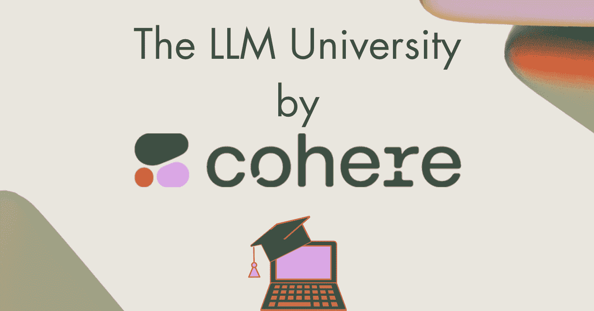

# 你需要了解的 Cohere LLM 大学的一切

> 原文：[`www.kdnuggets.com/2023/07/everything-need-llm-university-cohere.html`](https://www.kdnuggets.com/2023/07/everything-need-llm-university-cohere.html)

作者提供的图像

你可能听到很多关于大型语言模型（LLMs）的信息。你们中的一些人对未来充满兴趣。也有一些人想知道“我怎么参与其中？”。无论你对 LLMs 的看法如何——最终的目标是想要更多了解它。如果你想学习 LLMs 以便转行到技术行业的其他职业——Cohere 的 LLM 大学可以帮助你实现这一目标！

* * *

## 我们的前三大课程推荐

 1\. [Google 网络安全证书](https://www.kdnuggets.com/google-cybersecurity) - 快速进入网络安全领域的职业生涯。

 2\. [Google 数据分析专业证书](https://www.kdnuggets.com/google-data-analytics) - 提升你的数据分析技能。

 3\. [Google IT 支持专业证书](https://www.kdnuggets.com/google-itsupport) - 支持你的组织在 IT 方面。

* * *

我们看到越来越多的开发者希望将他们的职业生涯提升到一个新的水平。自然语言处理（NLP）是一个很多开发者本来不打算深入的领域。但随着大型语言模型（LLMs）的发展以及像 Cohere 这样的组织提供教育内容——这使得过渡变得更加容易。

# 什么是 LLM 大学？

[Cohere](https://cohere.com/)旨在通过赋能开发者和企业，构建语言 AI 的未来，使他们能够利用语言 AI 捕获重要的商业价值。为了实现这一目标，他们为希望了解更多关于 NLP 和 LLMs 的开发者创建了[LLM 大学](https://docs.cohere.com/docs/llmu#:~:text=It%20is%20a%20one%2Dsize,put%20their%20skills%20into%20practice.)。

他们提供了一个全面的课程，旨在为学生和开发者提供扎实的 NLP 基础知识，并在此基础上开发自己的应用程序。

听到这是为开发者准备的，不要感到紧张——因为他们面向各类背景的人群。你将学习 NLP 和 LLMs 的基础知识，并将你的知识提升到更高级的水平，比如构建和使用文本表示和文本生成模型。

理论部分有明确的解释和例子来支持，而实践部分则有代码示例以巩固你的知识。一旦你对该领域有了较好的理解，你将通过实际操作来检验你的技能，然后你将能够构建和部署你自己的模型。

## 学习路线

那么这如何运作呢？初学者和中级者一起？不。所以有两种学习方式：

***   顺序**

**如果你是新手机器学习工程师，你可能更愿意从 NLP 和 LLM 的基础开始。通过顺序路线，你将学习 NLP 和 LLM 的基础知识及其架构。

尽管这条路线需要的背景知识很少，但你仍然可以通过以下资料来巩固你的机器学习和 NLP 知识：[附录 1](https://docs.cohere.com/docs/intro-nlp)。

***   非顺序**

**如果你对 NLP 和 LLM 的基础知识感到比较自信，你可能不想从基础开始。你可以跳过这些基础模块，转而学习适合你需求的特定模块，或帮助你完成某个特定项目的模块。你可以通过查看以下资料了解这包含了什么：[附录 2](https://docs.cohere.com/docs/intro-building-apps)。

## LLM 大学课程

想知道你将学习什么吗？让我们深入了解…

在接下来的主要模块中，你将学习 LLM 的工作原理，并进行实践实验室以构建自己的语言应用程序。第一个模块完全以理论为主，然后在模块 2、3 和 4 中，你将结合理论和带代码实验室的实践。

这些是模块：

***   [模块 1：大型语言模型是什么？](https://docs.cohere.com/docs/intro-large-language-models)**

**在这个模块中，你将学习 LLM 的基础知识，还将学习更多关于嵌入、注意力、变换器模型架构、语义搜索的内容，以及实际示例和动手练习。

***   [模块 2：使用 Cohere 端点进行文本表示](https://docs.cohere.com/docs/intro-text-representation)**

**在第二个模块中，你将学习理论和实际实验室，在那里你将学习如何使用 Cohere 的端点进行[分类](https://docs.cohere.com/docs/how-to-build-a-classifier)、[嵌入](https://docs.cohere.com/docs/text-embeddings)和[语义搜索](https://docs.cohere.com/docs/what-is-semantic-search)。在本模块结束时，你将学习如何编写代码调用 Cohere API 的多个不同端点。

***   [模块 3：使用 Cohere 端点进行文本生成](https://docs.cohere.com/docs/intro-text-generation)**

**在第三个模块中，你将学习如何使用生成式学习生成文本。你将从一个教你如何使用生成的端点的代码实验室开始，然后掌握提示工程。

***   [模块 4：部署](https://docs.cohere.com/docs/intro-deployment)**

**最后但同样重要的是，部署！当你构建应用程序时，你将学习如何使用平台和框架进行部署，如 [AWS SageMaker](https://aws.amazon.com/pm/sagemaker/)、[Streamlit](https://streamlit.io/) 和 [FastAPI](https://fastapi.tiangolo.com/)。

一旦完成这些模块，你将掌握 NLP 的领域，并开启语言技术不断增长的新机遇。

# 总结

为了获得所需的帮助，Cohere 正在招收第一批学习者，并一同指导他们完成课程材料。他们还设有阅读小组，并将举办独家活动。你可以注册他们的 Discord 社区：[Cohere 的 Discord 社区](https://discord.gg/co-mmunity)，在那里你可以与其他学习者联系，互相帮助，分享想法，共同进步。

**[妮莎·阿雅](https://www.linkedin.com/in/nisha-arya-ahmed/)** 是一名数据科学家、自由技术写作人以及 KDnuggets 的社区经理。她特别感兴趣于提供数据科学职业建议或教程，并围绕数据科学进行理论知识的传授。她还希望探索人工智能在延续人类生命方面的不同益处。作为一个热衷学习者，她寻求拓宽自己的技术知识和写作技能，同时帮助指导他人。

### 相关主题

+   [朴素贝叶斯算法：你需要知道的一切](https://www.kdnuggets.com/2020/06/naive-bayes-algorithm-everything.html)

+   [关于张量的所有你需要知道的事情](https://www.kdnuggets.com/2022/05/everything-need-know-tensors.html)

+   [关于数据湖屋的所有你需要知道的事情](https://www.kdnuggets.com/2022/09/everything-need-know-data-lakehouses.html)

+   [关于 MLOps 的所有你需要知道的事情：KDnuggets 技术简报](https://www.kdnuggets.com/tech-brief-everything-you-need-to-know-about-mlops)

+   [KDnuggets 新闻，4 月 13 日：数据科学家应该关注的 Python 库…](https://www.kdnuggets.com/2022/n15.html)

+   [ChatGPT：你需要知道的一切](https://www.kdnuggets.com/2023/01/chatgpt-everything-need-know.html)************
