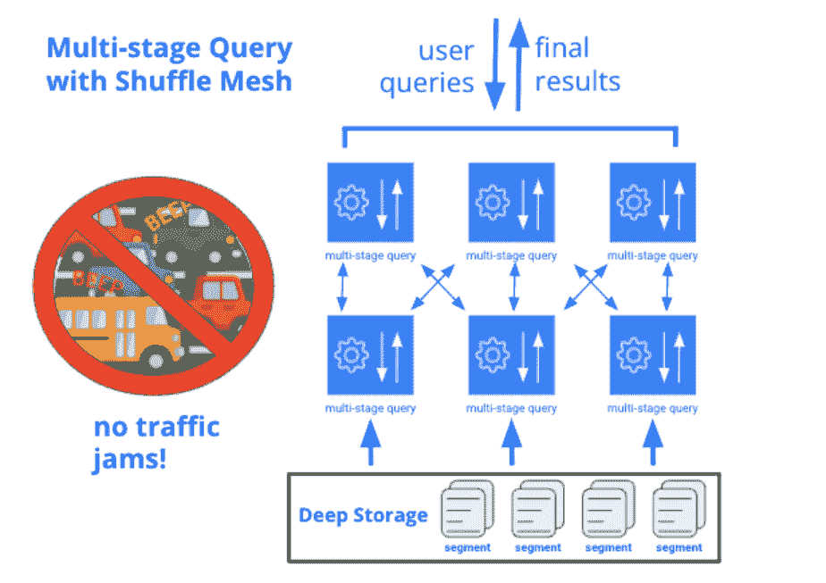

# Apache Druid 的演变

> 原文：[`www.kdnuggets.com/2022/07/evolution-apache-druid.html`](https://www.kdnuggets.com/2022/07/evolution-apache-druid.html)

近年来，包括 Netflix、Confluent、Target 和 Salesforce 在内的数千家公司的软件开发人员都转向 Apache Druid 以推动他们的分析应用程序。Druid 因其能够提供交互式数据体验而成为首选数据库，且没有数据量或并发要求的限制。

Apache Druid 在任何规模下对多维、高基数数据进行交互式切片和切块方面表现卓越。它被设计来支持快速移动、大量数据，适用于任何数量的用户，并且可以在灵活的分布式架构中从单个节点轻松扩展到数千个节点。最大的 Druid 安装可以扩展到数 PB 的数据，由数千台数据服务器提供服务，并能够在不到一秒的时间内返回数十亿行的数据查询结果。

* * *

## 我们的前三个课程推荐

 1\. [Google 网络安全证书](https://www.kdnuggets.com/google-cybersecurity) - 快速进入网络安全职业生涯。

 2\. [Google 数据分析专业证书](https://www.kdnuggets.com/google-data-analytics) - 提升你的数据分析技能

 3\. [Google IT 支持专业证书](https://www.kdnuggets.com/google-itsupport) - 支持你的组织在 IT 领域

* * *

但根据我的经验，尽管 Druid 非常适合交互式切片和切块，这并不是现代分析应用的全部故事。分析应用程序越来越需要其他面向用户的功能，如数据导出和报告，这些功能依赖于运行时间较长或更复杂的查询，这些查询对于 Druid 来说并不理想。今天，开发者通过在 Druid 旁边使用其他系统来处理这些工作负载。但这会增加成本和复杂性：相同的数据必须加载两次，并且必须管理两个独立的数据管道。

贴合其名称起源的事实，Apache Druid 正在不断变革——新增了一个多阶段查询引擎。但在深入了解新引擎之前，让我们看看 Druid 的核心查询引擎如何执行查询，以比较其差异。

# Druid 查询执行现状

性能是交互性的关键，在 Druid 中，“不要做”是性能的关键。这意味着要专注于效率，并减少计算机需要做的工作。

Druid 擅长这一点，因为它从一开始就被设计为高效。Druid 拥有紧密集成的查询引擎和存储格式，二者协同设计，以最小化每台数据服务器需要执行的工作量。

Druid 的查询引擎使用“散布/聚合”技术来执行查询：它迅速识别出哪些分段与查询相关，将计算推送到各个数据服务器，然后通过我们称之为 Broker 的组件收集过滤和聚合后的结果，Broker 然后执行最终合并并将结果返回给用户。

每个数据服务器可能处理数十亿行数据，但由于下推的过滤器、聚合和限制，返回给 Broker 的部分结果集要小得多。因此，Broker 通常处理相对较少的数据。这种设计意味着单个 Broker 可以处理跨越数千个数据服务器和万亿行的数据的查询。

散布/聚合对分析应用中使用的查询类型非常高效且性能卓越。但是，该技术有一个 Achilles’ heel：当查询结果非常庞大，或查询结构需要对数据进行多次访问时，Broker 可能成为瓶颈。

# 新的多阶段查询引擎

当我们重新考虑长期运行的查询在 Druid 中如何工作的时，我们知道保持所有好的方面是很重要的：即，与存储格式的紧密集成，以及出色的数据服务器性能。我们还知道，我们需要保留使用轻量级、高并发的散布/聚合方法的能力，用于在数据服务器上完成大部分处理的查询。但我们还需要*支持*数据服务器之间的数据交换，而不是要求每个查询都使用散布/聚合。

为了实现这一点，我们正在构建一个多阶段查询引擎，它接入了 Druid 标准查询引擎的现有数据处理流程，因此它将拥有所有相同的查询能力和数据服务器性能。除此之外，我们还在其上添加了一个系统，将查询拆分成多个阶段，并使数据能够在阶段之间通过洗牌网格进行交换。每个阶段都被并行化，以便同时在多个数据服务器上运行。不需要任何调优：Druid 将能够使用抗偏斜的洗牌和协作调度自动运行这一过程。

通过允许多阶段查询的每个阶段在整个集群上分布式运行，我们可以有效地处理所有阶段中的任何数量的数据，而不需要在底层处理大部分数据。

# 分析数据库的新标准

一旦我们开始深入思考，我们意识到我们可以做的远不止处理复杂查询。我们可以通过一个系统和一个 SQL 语言来实现查询和摄取的功能。我们可以摆脱对分开操作模型的需求。我们可以支持外部数据查询，并启用分离存储和计算的部署模式。

通过这项工作，我们正在建立一个平台，将实时分析数据库的性能与传统 SQL 关系数据库管理系统相关的功能和能力相结合。我对这个项目的方向感到非常兴奋。如今，Druid 是最具吸引力的大规模实时分析数据库。随着 Druid 逐渐获得这些新功能，它将成为最具吸引力的分析数据库*绝对*。 

**[贾恩·梅尔利诺](https://www.linkedin.com/in/gianmerlino/)** 是开源 Apache Druid 项目的联合作者，并且是 Imply 的共同创始人和 CTO。贾恩还担任 Apache Druid 委员会（PMC）主席。之前，贾恩曾在 Metamarkets 领导数据摄取团队，并在 Yahoo 担任高级工程职位。他拥有加州理工学院计算机科学学士学位。

### 更多相关内容

+   [从 Oracle 到 AI 数据库：数据存储的演变](https://www.kdnuggets.com/2022/02/oracle-databases-ai-evolution-data-storage.html)

+   [分析未来成功概率与智能…](https://www.kdnuggets.com/2022/02/analyzing-probability-future-success-intelligence-node-attributes-evolution-model.html)

+   [从人工智能到机器学习再到……](https://www.kdnuggets.com/2022/08/evolution-artificial-intelligence-machine-learning-data-science.html)

+   [语音识别指标的演变](https://www.kdnuggets.com/2022/10/evolution-speech-recognition-metrics.html)

+   [深入探讨 GPT 模型：演变与性能比较](https://www.kdnuggets.com/2023/05/deep-dive-gpt-models.html)

+   [数据领域的演变](https://www.kdnuggets.com/2023/06/evolution-data-landscape.html)
