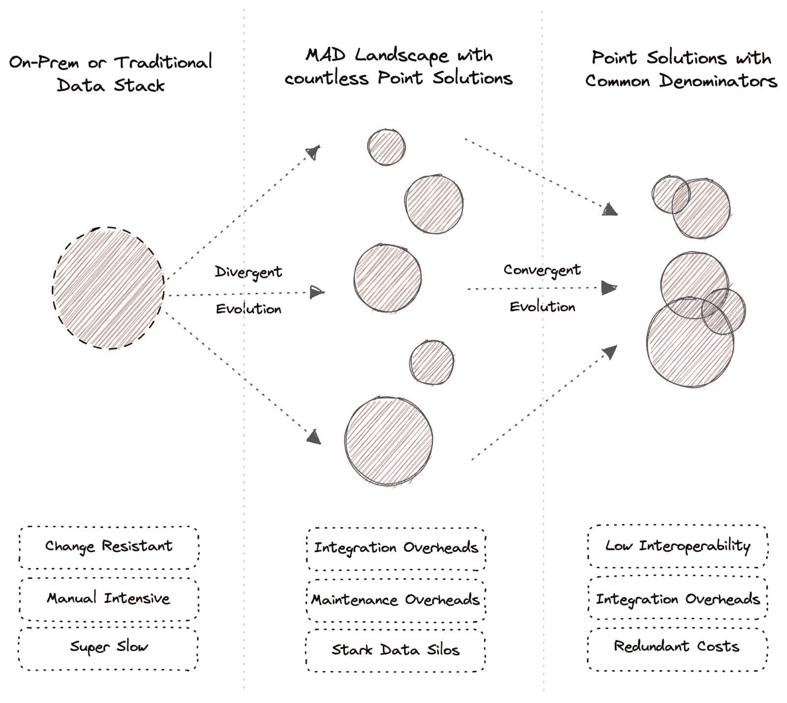
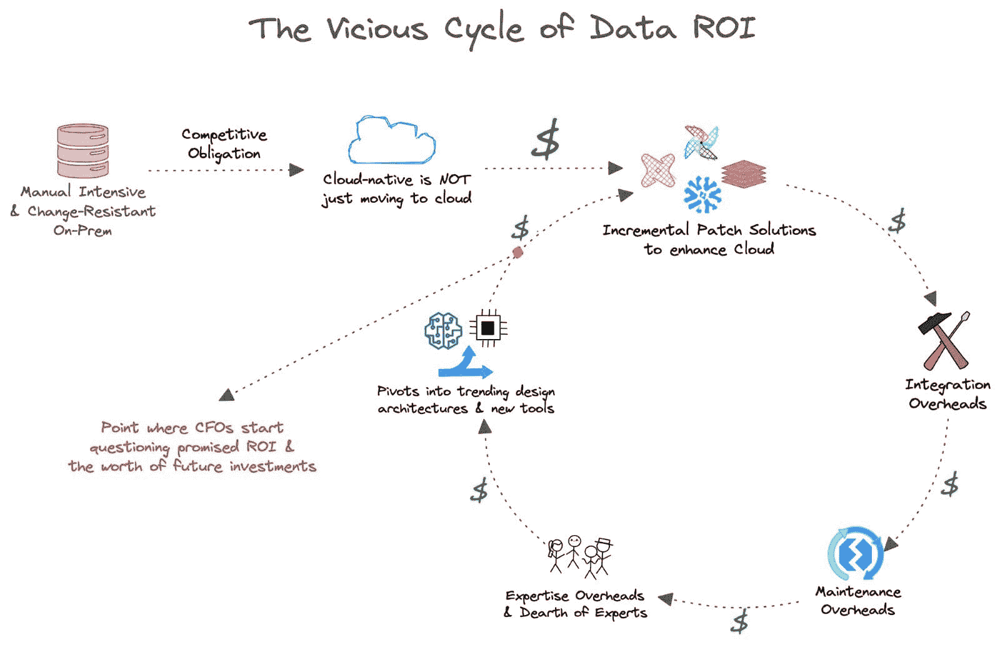
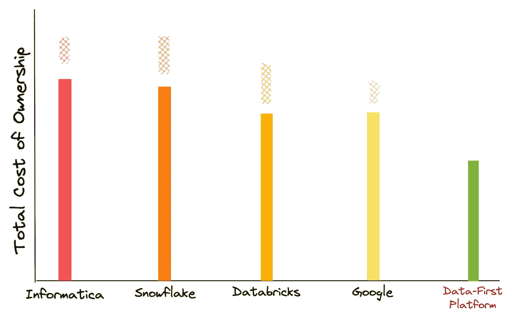
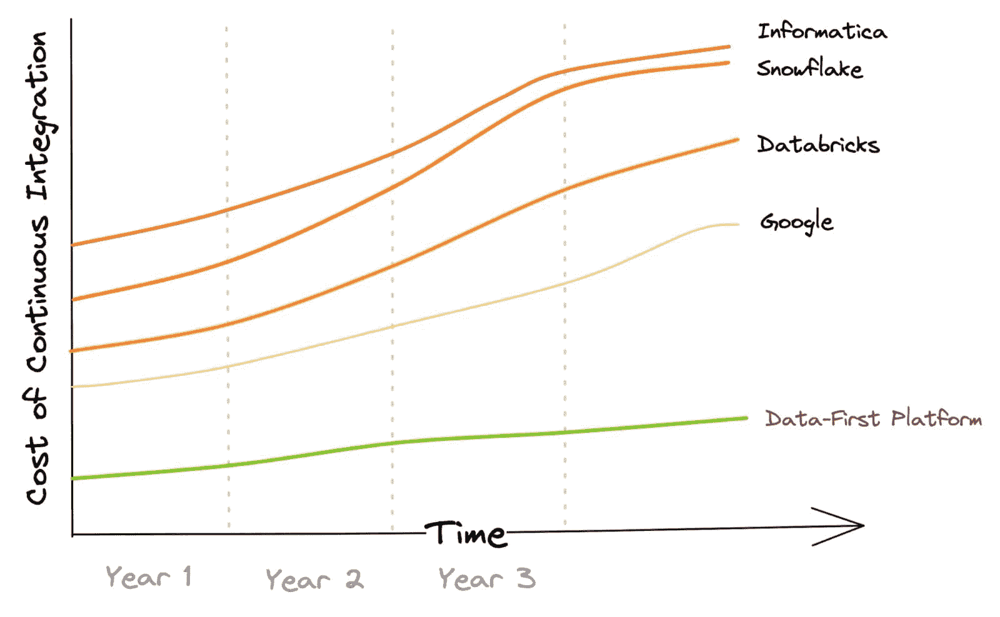
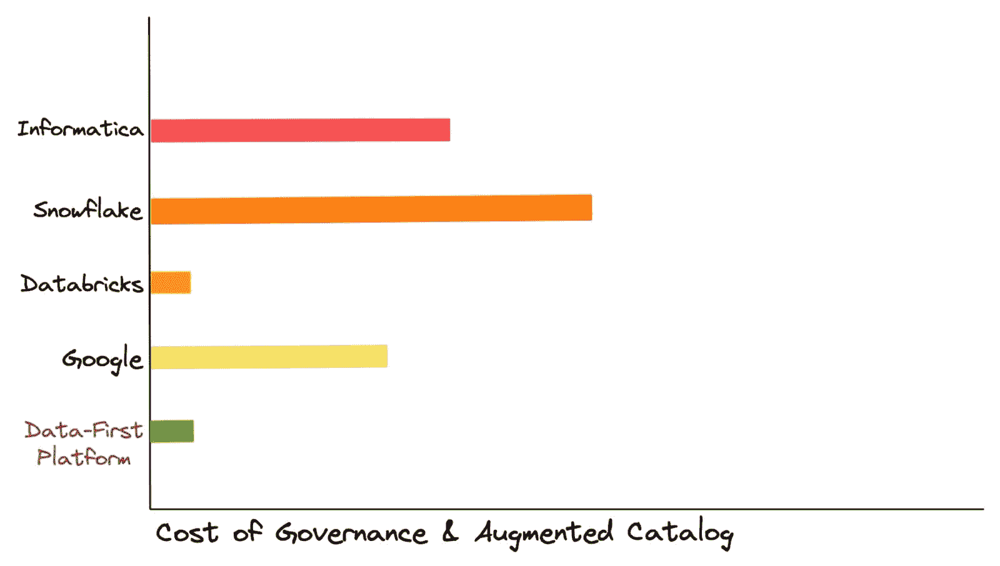
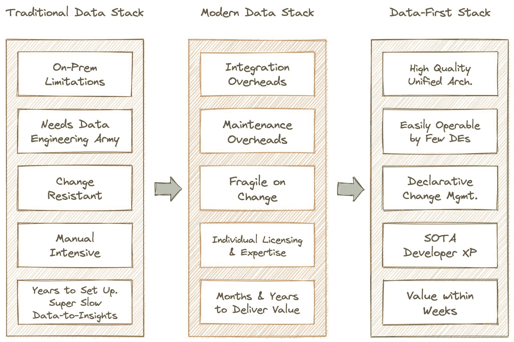
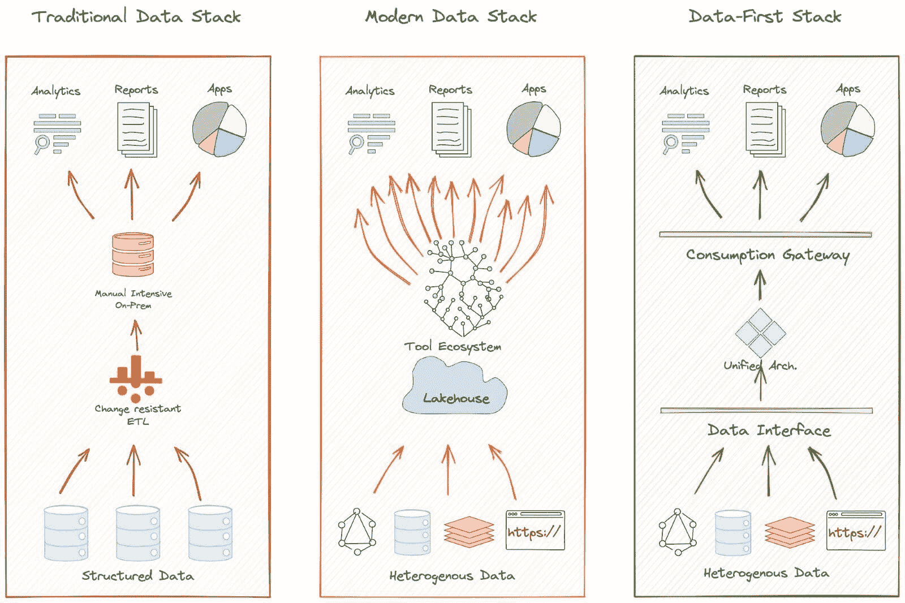
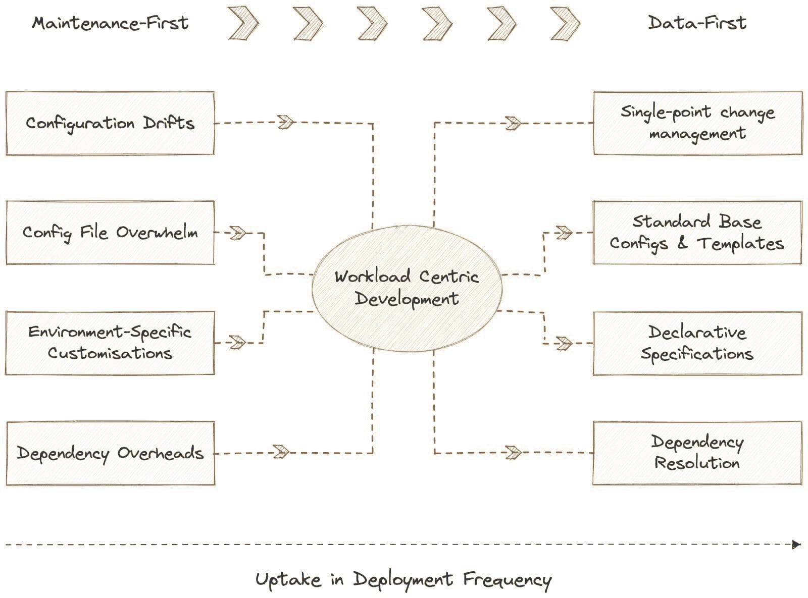
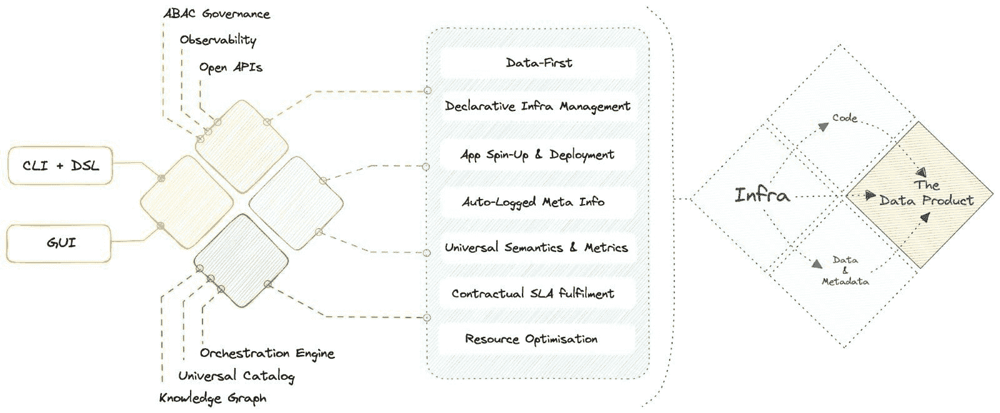

# 数据领域的进化

> 原文：[`www.kdnuggets.com/2023/06/evolution-data-landscape.html`](https://www.kdnuggets.com/2023/06/evolution-data-landscape.html)

**共同作者 [Srujan](https://www.linkedin.com/in/srujanakula/) 和 [Travis Thompson](https://www.linkedin.com/in/travis-w-thompson)**

数据领域已经成熟，并从地下的厚重文件时代走过了漫长的道路。这段旅程既迷人又激动人心，不亚于软件革命。幸运的是，我们正处于数据革命的中心，并有机会亲身见证这一过程。

* * *

## 我们的前三个课程推荐

 1\. [谷歌网络安全证书](https://www.kdnuggets.com/google-cybersecurity) - 快速进入网络安全职业生涯。

 2\. [谷歌数据分析专业证书](https://www.kdnuggets.com/google-data-analytics) - 提升你的数据分析技能

 3\. [谷歌 IT 支持专业证书](https://www.kdnuggets.com/google-itsupport) - 支持你的组织的 IT

* * *

我们五到十年前关注的是完全不同的问题，而今天我们面对的是全新的问题。有些是数据的寒武纪大爆炸的结果，有些则出乎意料地源于解决初始问题所制定的解决方案。

这导致了大量数据堆栈和架构的过渡。然而，突出的却是三种简单但根本性的关键堆栈：传统数据堆栈、现代数据堆栈和数据优先堆栈。让我们看看这些是如何发展的。

# 进化基础：触发数据领域变革的模式

进化有两种广泛的模式：发散型和汇聚型。这些广泛的模式同样适用于数据领域。

地球上的物种多样性源于发散型进化。类似地，发散型进化在数据行业中产生了种类繁多的工具和服务，今天被称为[疯狂数据景观](https://mattturck.com/mad2023/)。汇聚型进化则随着时间的推移创造出具有共同特征的工具变种。例如，老鼠和老虎虽然是截然不同的动物，但它们都有类似的特征，如胡须、皮毛、四肢和尾巴。

汇聚型进化导致工具解决方案中的共同特征，意味着用户为冗余的功能付费。发散型进化则导致更高的集成成本，需要专家理解和维护每个工具的独特理念。

请注意，常见的共同点并不意味着这些点解决方案正在朝着统一的解决方案收敛。相反，每个点正在开发与其他点的解决方案相交的解决方案，这些交集是基于需求的。这些共同能力有各自的语言和哲学，需要专业的专家。

例如，Immuta 和 Atlan 分别是数据治理和目录解决方案。然而，Immuta 也在开发数据目录，而 Atlan 正在添加治理功能。客户倾向于用专门的工具替代次要功能。这导致了：

+   投入时间去理解每个产品的语言和哲学

+   引入两个具有类似功能的工具的冗余成本

+   专业人才的高资源成本；尤其困难的是人才短缺

现在我们对演变模式有了高层次的理解，让我们来看一下它们在数据领域中的表现。为了简洁起见，我们不会回顾太远。

# 回溯几年

我们今天作为数据行业面临的问题与 5-6 年前截然不同。当时组织面临的主要挑战是从本地系统向云的巨大的过渡。本地大数据生态系统和 SQL 数据仓库（即传统数据堆栈或 TDS）不仅维护困难且正常运行时间极低，而且在数据到洞察的过程中极其缓慢。简而言之，规模和效率远远无法实现，尤其是由于以下障碍：

## 数据工程师的数量

任何数量的数据工程师都不足以维持内部系统。从数据仓库和 ETL 到仪表板和 BI 工作流程的所有内容都必须在内部工程化，导致组织的大部分资源用于建设和维护，而不是产生收入的活动。

## 管道的压倒性

数据管道复杂且互相交织，许多是为了应对新的业务需求而创建的。有时，一个[新管道是为了回答一个问题](https://www.linkedin.com/posts/eczachly_dataengineering-activity-7037193178428436480-peDw?utm_source=share&utm_medium=member_android)或从较少的源表中创建[大量的数据仓库表](https://medium.com/kyligence/stop-the-madness-a412ac23d1a8)。这种复杂性可能让人感到不知所措，难以管理。

## **零容错性**

数据没有备份、恢复或根本原因分析时既不安全也不可靠。数据质量和治理往往被忽视，有时甚至超出了工程师的工作描述，这些工程师在繁重的管道活动下辛勤工作。

## 数据迁移成本

传统系统间的大规模数据迁移是另一个警示，耗费了大量资源和时间。此外，数据还常常出现损坏和格式问题，这需要几个月时间解决，或者直接被抛弃。

## 变更抵触

本地系统中的数据管道非常脆弱，因此对频繁的变化或任何变化都很抵触，这对于动态且易变的数据操作来说是一场灾难，并使实验成本高昂。

## 紧张的节奏

部署新的管道以回答通用业务问题花费了数月和数年时间。动态的业务请求更是不在考虑之中。更不用说在频繁的停机期间业务损失的情况了。

## 技能缺口

高债务或陈旧的系统导致项目交接时的抵触，因为存在关键的依赖关系。市场上缺乏合适的技能并没有改善这种情况，往往导致关键管道的重复工作长达数月。

# 当时的解决方案及其结果问题

## 云计算的出现与成为云原生的义务

十年前，数据并不像今天这样被视为资产。尤其是因为组织没有足够的数据来作为资产利用，并且必须解决无数问题才能生成一个可用的仪表盘。但随着时间的推移，随着流程和组织变得更加数字化和数据友好，数据生成和捕获出现了突然的指数增长。

组织意识到，通过了解超出其处理能力的历史模式，他们可以改进自己的流程。为了解决 TDS 的持续问题并增强数据应用，多种点解决方案出现并集成到一个中央数据湖中。我们称这种组合为现代数据堆栈（MDS）。在当时的数据行业中，它无疑是几乎完美的解决方案。

### ➡️ 过渡到现代数据堆栈（MDS）

MDS 解决了一些当时数据领域的持续问题。它最大的成就也许是对云的革命性转变，这不仅使数据更易获取，而且还可恢复。像 Snowflake、Databricks 和 Redshift 这样的解决方案帮助大型组织将数据迁移到云端，提高了可靠性和容错性。

一些由于预算限制而支持 TDS 的数据领导者，在看到其他组织成功过渡后，感到有义务转向云端并保持竞争力。这需要说服 CFO 优先考虑并投资于过渡，通过承诺近期内实现价值来完成。

但成为云原生不仅仅是迁移到云端，这本身就是一笔巨大的开销。真正的云原生还意味着整合一系列解决方案来操作云中的数据。计划看起来不错，但最终 MDS 将所有数据都倾倒到一个中央湖中，导致各行业出现了无法管理的数据沼泽。

### ???? 虚幻承诺的投资

+   将大量数据资产迁移到云端的成本

+   保持云端运行的成本

+   为操作云所需的点解决方案的个人许可证成本

+   点解决方案中常见或冗余因素的成本

+   理解每个工具不同理念的认知负担和专业知识成本

+   每当新工具加入生态系统时，持续集成的成本

+   持续维护集成的成本，从而导致管道洪水

+   为了操作点解决方案而设置数据设计基础设施的成本

+   维持基础设施运行的专门平台团队的成本

+   在数据沼泽中存储、移动和计算 100%数据的成本

+   每个暴露点或集成点的孤立治理成本

+   由于多个暴露点造成的频繁数据风险的成本

+   频繁项目交接时去复杂化依赖的成本

正如你所猜测的，这个列表远非详尽。

### ???? 数据投资回报的恶性循环

数据领导者，包括 CDO 和 CTO，迅速感受到了未实现的投资承诺的负担，这些投资规模达到数百万美元。增量的补丁解决方案解决了很多问题，却也带来了同样多的问题，数据团队又回到了无法使用他们拥有的丰富数据的根本问题上。

缺乏未来保障对领导者来说是一个严重的风险，他们在组织中的任期被缩短到不到 24 个月。为了确保 CFO 看到回报，他们抓住了流行的数据设计架构和新工具创新，这些都提出了新的承诺。

此时，首席财务官办公室不可避免地开始质疑承诺结果的可信度。更危险的是，他们开始质疑投资于数据驱动的垂直领域本身的价值。是否花费数百万美元用于其他操作会在五年内带来更好的影响？

如果我们稍微深入一些，并接近我们上面讨论的实际解决方案，就会更加清楚数据投资如何在这些年里生锈，尤其是由于隐藏和意外的成本。

TCO 的估算基于小众专家、迁移、设置、管理固定工作负载的计算、存储、许可费用以及治理、目录和 BI 工具等点解决方案的累计成本。根据客户与这些供应商的经验，我们在顶部添加了格状条，因为在使用这些平台时，往往会遇到意外的成本跳跃。

由于这些成本的多样性，如工作负载增加或背景查询的变化，甚至定价模型本身，它们最好被归类为‘神秘成本’。另一方面，采用数据优先的方法来抽象工具复杂性，可以避免意外的总拥有成本（TCO）跳跃。对于每个工作负载和使用的存储，有完全的控制权。

### ???? 工具的大量扩散使得每个堆栈都变成了维护优先、数据最后。

如 MAD Landscape 或 MDS 所示，丰富的工具使得组织越来越难以专注于实际带来业务成果的解决方案开发，因为维护票据不断吸引注意力。

可怜的数据工程师陷入了维护优先、集成其次、数据最后的经济模式。这涉及大量时间用于解决基础设施缺陷和维护数据管道。托管和集成多个工具所需的基础设施同样令人痛苦。

数据工程师被大量配置文件、频繁的配置漂移、每个文件的环境特定自定义以及无数的依赖开销所压倒。简而言之，数据工程师为了确保数据基础设施符合正常运行时间 SLOs 而熬夜。

工具的过度使用不仅在时间和精力上成本高昂，而且集成和维护的开销直接影响工程团队的投资回报率（ROI），同时对推动业务的数据应用没有任何直接改善。

这里是传统 ETL 和 ELT 方法下企业数据移动的表现。它包括集成批处理和流数据源的成本以及数据工作流的编排。

成本的逐年增加基于这样的假设，即随着时间的推移，企业将增加平台的使用量，包括集成的源系统数量和随后的数据处理。

这在大多数客户中被发现是正确的。在数据优先的方法中，由于其对智能数据移动的总体信念和抽象的集成管理，数据集成成本为零到最低，因为它允许在最小的数据移动下进行数据处理。

### ???? 组织被迫服从工具的理念。

管理一系列不同的解决方案并不是终点。组织必须遵循这些单独工具的预定义方向和哲学。例如，如果引入了一个治理工具，数据开发人员需要学习如何操作该工具，学习它与其他工具的具体交互方式，并重新安排其他工具以匹配新组件的规格。

每个工具在设计架构中都有发言权，作为其自身哲学的结果，使得互操作性变得更加复杂和选择性强。缺乏灵活性也是转向新的和创新的基础设施设计（如网格和织物）高成本的原因，这些设计可能会提升承诺的投资回报率。

大量具有独特哲学的工具也需要丰富的专业知识。在实际操作中，招聘、培训、维护和协作如此多的数据工程师是不可能的。特别是在这个领域内缺乏熟练和经验丰富的专业人员时更是如此。

### ???? 无法捕捉和操作原子见解

由于大量工具和集成，僵化的基础设施意味着低灵活性，无法在正确的时刻将原子数据字节传递到正确的面向客户的端点。缺乏原子性也是低互操作性和孤立子系统的结果，这些子系统没有建立良好的沟通路线。

一个很好的例子是每个工具点维护其独立的元数据引擎以操作元数据。这些元数据引擎有不同的语言和传输渠道，除非专门设计，否则几乎无法相互通信。这些新设计的渠道还增加了维护费用。使用数据在转换中丢失，平行垂直领域无法利用从彼此中得出的见解。

此外，由于无法在混乱的 MDS 传播中强制执行类似软件的实践，MDS 中的数据操作通常是批量开发、提交和部署的。实际上，除非数据，作为数据栈中唯一的不确定组件，能够接入一个统一层，这个层能够强制执行原子提交、沿着变更路线进行纵向测试和 CI/CD 原则，以消除不仅是数据孤岛还有数据代码孤岛，否则 DataOps 是不可行的。

## 解决 MDS 所带来的后续问题的解决方案

从传统数据栈到现代数据栈，再到最终的数据优先栈（DFS）的过渡在很大程度上是不可避免的。DFS 的需求主要是由于数据工程领域内技术债务的累积。DFS 提出了一种统一的方法或整体解决方案，针对 TDS 和 MDS 的薄弱环节，而不是倡导它们的拼凑哲学。

DFS 将自助服务能力带给了业务团队。他们可以带来自己的计算资源，而不是争夺 IT 资源（这在许多企业中严重限制了业务团队对数据的访问）。与合作伙伴共享数据并以合规的方式货币化变得更容易了。用户不再需要整合数百个分散的解决方案，而是可以将数据放在首位，专注于核心目标：构建直接提升业务结果的数据应用程序。

降低资源成本是当前市场上组织的优先事项之一，但由于合规成本在治理和目录化分散的多点解决方案时非常高，这几乎是不可能的。DFS 的统一基础设施通过将这些点能力组合成基本构建块并集中治理这些块，迅速提高了发现性和透明度。

DFS 的目录解决方案是全面的，因为它的 数据发现与可观测性 特性嵌入了本地治理和丰富的语义知识，允许进行积极的元数据管理。此外，它实现了对数据基础设施所有应用程序和服务的完整访问控制。

数据优先栈本质上是一个操作系统（OS），它是一个管理所有程序的程序，使最终用户能够专注于结果驱动的体验，而不是弄清楚如何运行这些程序。我们大多数人都在笔记本电脑、手机以及任何界面驱动的设备上体验过操作系统。我们依赖这些系统，因为它们将启动、维护和运行日常应用程序的低级细节抽象化。相反，我们直接使用这些应用程序以驱动结果。

数据操作系统（DataOS）因此与数据精通和数据陌生的组织都相关。总之，它通过将用户从应用程序的程序复杂性中抽象出来，提供自助服务的数据基础设施，并以声明式方式提供结果。

### ???? 从维护优先到数据优先的过渡

数据操作系统（DataOS）是一个以数据为先的数据栈，它理解组织必须成为数据的用户，而不是数据基础设施的建设者。DataOS 抽象了所有低级数据管理的细节，否则这些细节会耗尽大多数数据开发人员的活跃时间。

声明式管理系统大大消除了脆弱性的范围，并按需呈现根本原因分析（RCA）视角，从而优化资源和投资回报率。这使得工程人才能够将时间和资源专注于数据及构建直接影响业务的数据应用程序。

数据开发者可以通过标准基础配置快速部署工作负载，从而消除配置漂移和大量配置文件，这些配置不需要特定环境变量。系统自动生成应用的清单文件，实现 CRUD 操作、执行和元存储。简而言之，DataOS 提供了以工作负载为中心的开发方式，在这种方式下，数据开发者声明工作负载要求，DataOS 提供资源并解决依赖关系。影响是立即显现的，部署频率显著增加。

### ???? 向统一架构的融合

### ???? 从拼凑的解决方案过渡到原始构建块

通过高度内聚的可组合数据操作系统架构，数周内实现数据优先是可能的：通过模块化实现统一。模块化是通过一组有限的原语来实现的，这些原语被唯一识别为数据堆栈最基本形式的关键元素。这些原语可以被特定排列以构建高阶组件和应用。

它们可以被视为可以使用版本控制系统进行源控制和管理的工件。每个原语可以被视为一种抽象，允许你以声明的方式列举具体目标和结果，而不是繁琐地定义‘如何实现这些结果’。

### ???? 统一现有工具以实现声明性管理

作为首要工件与开放标准，DataOS 作为任何现有数据基础设施之上的架构层使用。它使其能够与 DataOS 本地和外部的异构组件进行交互。因此，组织可以将现有的数据基础设施与新技术进行集成，而无需完全重构现有系统。

这是一个完整的自服务接口，供开发人员通过 API 和 CLI 以声明性方式管理资源。业务用户通过直观的 GUI 实现自服务，直接将业务逻辑集成到数据模型中。GUI 界面还允许开发人员可视化资源分配并简化资源管理。这节省了大量时间，提高了生产力，开发人员可以在没有广泛技术知识的情况下轻松管理资源。

### ☀️ 中央治理、编排和元数据管理

DataOS 在双平面概念架构下运行，其中控制分为一个用于核心全球组件的中央平面和一个或多个用于本地操作的数据平面。控制平面帮助管理员通过对垂直组件的集中管理和控制来治理数据生态系统。

用户可以在云原生环境中集中管理基于策略和目的的访问控制，优先考虑本地所有权，协调数据工作负载、计算集群生命周期管理、DataOS 资源版本控制，并管理不同类型的数据资产的元数据。

### ⚛️ 体验用例的原子级洞察

行业正在迅速从事务性用例转向体验性用例。从大量数据中提取的重大洞察现在已成为次要需求。即时数据点中提取的原子级或字节级洞察才是新的游戏规则，客户愿意为此付费。

共同的底层原语层确保数据在统一架构中的所有接触点上可见，并能够通过语义抽象在业务用例要求时随时在任何渠道中实现。

**[Animesh Kumar](https://www.linkedin.com/in/anismiles/)** 是 Modern 的首席技术官兼联合创始人，也是数据操作系统基础设施规范的共同创作者。在数据工程领域有超过 30 年的经验，他为包括 NFL、GAP、Verizon、Rediff、Reliance、SGWS、Gensler、TOI 等在内的广泛 A 类玩家设计了工程解决方案。

**[Srujan](https://www.linkedin.com/in/srujanakula/)** 是 Modern 的首席执行官兼联合创始人。在数据和工程领域拥有 30 年的经验，Srujan 作为企业家、产品高管和业务领袖，积极参与社区，并在摩托罗拉、TeleNav、Doot 和 Personagraph 等组织中推出了多个获奖产品。

**[Travis Thompson](https://www.linkedin.com/in/travis-w-thompson)**（合著者）：Travis 是[数据操作系统](http://data-operating-system.com/)基础设施规范的首席架构师。在数据和工程领域拥有 30 年的经验，他为顶级组织如 GAP、Iterative、MuleSoft、HP 等设计了最先进的架构和解决方案。

### 更多相关话题

+   [AI 驱动世界中的数据工程格局](https://www.kdnuggets.com/2023/05/data-engineering-landscape-aidriven-world.html)

+   [8 篇改变 NLP 格局的创新 BERT 知识蒸馏论文](https://www.kdnuggets.com/2022/09/eight-innovative-bert-knowledge-distillation-papers-changed-nlp-landscape.html)

+   [如何利用 AIOps 管理复杂的 IT 环境](https://www.kdnuggets.com/2022/05/manage-complex-landscape-aiops.html)

+   [首个 ML 价值链格局](https://www.kdnuggets.com/2022/10/first-ml-value-chain-landscape-sequence.html)

+   [工作的未来：AI 如何改变工作格局](https://www.kdnuggets.com/2023/04/future-work-ai-changing-job-landscape.html)

+   [关于 AI 监管格局的一切](https://www.kdnuggets.com/all-about-the-ai-regulatory-landscape)
