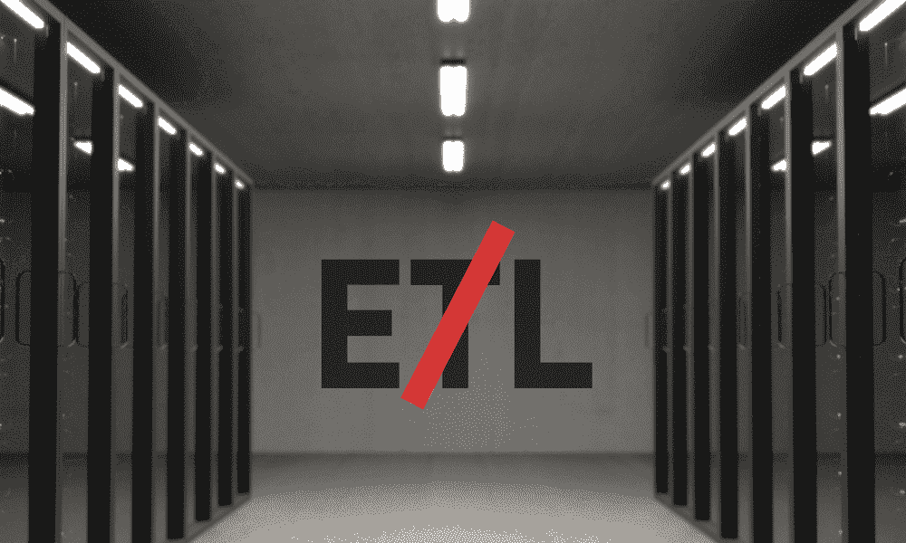

# ETL 演变：跳过转换如何增强数据管理

> 原文：[`www.kdnuggets.com/evolution-in-etl-how-skipping-transformation-enhances-data-management`](https://www.kdnuggets.com/evolution-in-etl-how-skipping-transformation-enhances-data-management)

编辑提供的图片

几种数据概念比 ETL（提取-转换-加载）更具争议，ETL 是几十年来主导企业操作的准备技术。ETL 于 1970 年代开发，在大型数据仓库和存储库的时代表现突出。企业数据团队集中数据，构建报告系统和数据科学模型，并提供自助服务的商业智能（BI）工具访问。然而，在云服务、数据模型和数字化流程的时代，ETL 已显得有些陈旧。

* * *

## 我们的前三个课程推荐

 1\. [谷歌网络安全证书](https://www.kdnuggets.com/google-cybersecurity) - 快速进入网络安全职业。

 2\. [谷歌数据分析专业证书](https://www.kdnuggets.com/google-data-analytics) - 提升你的数据分析能力

 3\. [谷歌 IT 支持专业证书](https://www.kdnuggets.com/google-itsupport) - 支持组织的 IT

* * *

搜索如“ETL 是否仍然相关/有需求/过时/已死？”在谷歌上结果层出不穷。原因在于企业数据团队在为员工角色和业务功能广泛使用数据做准备时感到吃力。ETL 难以处理云中存储的大量历史数据，也无法提供快速决策所需的实时数据。此外，构建自定义 API 以向应用程序提供数据会造成显著的管理复杂性。现代企业常常有 500 到 1000 个管道，以寻求转换数据并为用户提供自助服务的 BI 工具访问。然而，这些 API 处于不断的演变状态，因为当拉取的数据发生变化时，它们必须重新编程。显然，这一过程对于许多现代数据需求，如边缘用例，过于脆弱。

此外，应用程序能力也有所演变。源系统提供业务逻辑和工具以执行数据质量控制，而消费型应用程序则实现数据转换并提供强大的语义层。因此，团队不再有足够的动力去构建点对点接口以大规模移动数据、进行转换，并将数据加载到数据仓库中。

两种创新技术为实现数据民主化指明了方向，同时最小化转换负担。Zero ETL 使数据在不移动的情况下可用，而逆向 ETL 则在数据可用时立即将数据推送到需要它的应用程序。

# Zero ETL 减少了数据移动和转换需求

Zero ETL 优化了较小数据集的移动。通过数据复制，数据以当前状态被移动到云中，用于数据查询或实验。

但如果团队完全不想移动数据怎么办？

数据虚拟化将服务器与终端用户隔离。当用户从单一来源查询数据时，结果会被推送回用户。而且通过查询联邦，用户可以查询多个数据源。该工具将结果组合起来，向用户呈现集成的数据结果。

这些技术被称为零 ETL，因为不需要构建管道或转换数据。用户可以实时处理数据质量和聚合需求。

Zero ETL 特别适用于临时分析近期数据，因为在历史数据上执行大型查询可能会影响操作性能并增加数据存储成本。例如，许多零售和消费品行业高管使用零 ETL 查询每日交易数据，以便在需求高峰期（如假日）期间调整市场营销和销售策略。

Google Cortex 提供加速器，使 [SAP 企业资源规划](https://cloud.google.com/blog/products/sap-google-cloud/google-cloud-cortex-framework-for-procure-to-pay) 系统数据实现零 ETL。其他公司，如全球最大零售商之一和一家全球食品饮料公司，也已采用零 ETL 过程。

Zero ETL 的收益包括：

+   **提供访问速度：** 使用零 ETL 过程来为自助查询提供数据，节省了 40-50% 的时间，因为不需要构建管道。

+   **减少数据存储需求：** 数据虚拟化或查询联邦不会移动数据。用户只需存储查询结果，从而减少存储需求。

+   **降低成本：** 使用零 ETL 过程的团队在数据准备和存储成本上节省了 30-40% 的费用，相比传统 ETL。

+   **提高数据性能：** 由于用户只查询所需的数据，结果交付速度提高了 25%。

要开始使用零 ETL，团队应评估哪些用例最适合这种技术，并确定他们需要执行的数据信息。他们还应配置零 ETL 工具以指向所需的数据源。团队接着提取数据，创建数据资产，并将其提供给下游用户。

# 使用逆向 ETL 按需向应用程序提供数据

逆向 ETL 技术简化了数据流向下游应用程序。团队利用逆向 ETL 工具将数据按时、完整地推送到业务流程中，而不是使用 REST API 或端点并编写脚本来提取数据。

使用反向 ETL 具有以下好处：

+   **减少时间和精力：** 使用反向 ETL 处理关键用例将访问数据所需的时间和精力减少了 20-25%。一家领先的邮轮公司利用反向 ETL 进行数字营销计划。

+   **提高数据可用性：** 团队对关键计划所需数据的访问有更大的确定性，因为 90-95%的目标数据按时交付。

+   **降低成本：** 反向 ETL 过程减少了对 API 的需求，而 API 需要专门的编程技能并增加管理复杂性。因此，团队将数据成本降低了 20-25%。

要开始使用反向 ETL，数据团队应评估需要按需数据的用例。接下来，他们确定数据传递的频率和量，并选择适当的工具来处理这些数据量。然后，他们将数据仓库中的数据资产指向其目标消费系统。团队应使用一个数据加载进行原型测试，以测量效率并扩展流程。

# 成功处理数据，需要使用多种准备技术。

零 ETL 和反向 ETL 工具为团队提供了服务数据给用户和应用的新选项。他们可以分析用例要求、数据量、交付时间框架和成本驱动因素，选择最适合的数据交付选项，无论是传统 ETL、零 ETL 还是反向 ETL。

合作伙伴通过提供有关最佳技术和工具的见解来支持这些努力，满足功能和非功能需求，提供加权评分卡，使用获胜工具进行价值证明（POV），然后将工具投入实际使用以适应更多用例。

使用零 ETL 和反向 ETL，数据团队能够实现他们赋能用户和应用的目标，让数据在需要的时间和地点可用，同时推动成本和性能的提升，避免了转换的麻烦。

**[Arnab Sen](https://www.linkedin.com/in/arnab-sen-60b92624/)**是一位拥有超过 16 年技术和决策科学行业经验的专业人士。他目前担任 Tredence 的数据工程副总裁，该公司是一家著名的数据分析公司，他帮助组织设计其 AI-ML/云/大数据战略。凭借在数据货币化方面的专长，Arnab 发掘数据的潜在价值，推动 B2B 和 B2C 客户的业务转型，涵盖各种行业。Arnab 对团队建设的热情以及扩展人员、流程和技能的能力使他成功管理了多个百万美元的投资组合，涉及电信、零售和金融服务等多个领域。他曾在 Mu Sigma 和 IGate 任职，在解决客户问题方面发挥了关键作用，通过开发创新解决方案取得了显著成绩。Arnab 卓越的领导才能和深厚的领域知识使他获得了《福布斯》技术委员会的席位。

### 更多相关内容

+   [云计算如何提升数据科学工作流程](https://www.kdnuggets.com/2023/08/cloud-computing-enhances-data-science-workflows.html)

+   [从 Oracle 到 AI 数据库：数据存储的演变](https://www.kdnuggets.com/2022/02/oracle-databases-ai-evolution-data-storage.html)

+   [从人工智能到机器学习的演变及更多…](https://www.kdnuggets.com/2022/08/evolution-artificial-intelligence-machine-learning-data-science.html)

+   [数据景观的演变](https://www.kdnuggets.com/2023/06/evolution-data-landscape.html)

+   [利用智能分析未来成功的可能性…](https://www.kdnuggets.com/2022/02/analyzing-probability-future-success-intelligence-node-attributes-evolution-model.html)

+   [语音识别指标的演变](https://www.kdnuggets.com/2022/10/evolution-speech-recognition-metrics.html)
