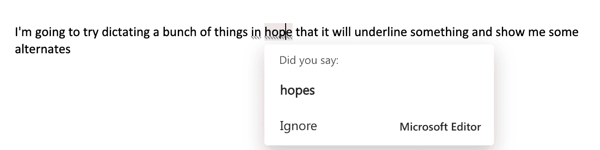

# 语音识别指标的发展

> 原文：[`www.kdnuggets.com/2022/10/evolution-speech-recognition-metrics.html`](https://www.kdnuggets.com/2022/10/evolution-speech-recognition-metrics.html)

[图片由 pch.vector 提供](https://www.freepik.com/free-vector/tiny-people-near-phone-with-voice-assistant-screen-man-woman-using-ai-speaking-into-speaker-recording-voice-messages-digital-devices-flat-vector-illustration-technology-software-concept_28480879.htm#query=speech%20recognition&position=19&from_view=search&track=sph) 自 Freepik

随着深度学习的广泛应用，自动语音识别（ASR）准确率在过去几年中得到了加速进展。研究人员迅速宣称在特定测量上达到了人类平等。然而，语音识别今天真的已经解决了吗？如果没有，我们目前关注的测量指标将会影响 ASR 未来的发展方向。

* * *

## 我们的前三大课程推荐

 1\. [谷歌网络安全证书](https://www.kdnuggets.com/google-cybersecurity) - 快速入门网络安全职业。

 2\. [谷歌数据分析专业证书](https://www.kdnuggets.com/google-data-analytics) - 提升你的数据分析水平

 3\. [谷歌 IT 支持专业证书](https://www.kdnuggets.com/google-itsupport) - 支持你的组织在 IT 方面

* * *

# 人类平等曾是最终目标，但现在我们要移动目标！

ASR 系统长期以来一直专注于 [词错率（WER）](https://en.wikipedia.org/wiki/Word_error_rate) 来衡量准确性。这个指标是有意义的。WER 衡量系统每识别一百个词中出错多少个词。由于系统性能可能因场景、音质、口音等因素显著变化，因此很难给出一个单一的最终目标（当然，0% 是理想的）。因此，我们通常使用 WER 来比较两个系统。当系统开始变得越来越好时，我们开始将其 WER 与人类的 WER 进行比较。人类平等最初被认为是一个遥远的目标，但深度学习加速了进程，我们“实现”得要早得多。

# 如果我们在比较机器与人类，那我们又在比较人类与什么呢？

人工评审首先被要求转录音频。为了生成转录参考，不同的评审会多次听取音频并编辑以获得更准确的转录。当多个评审达成一致时，转录被认为是干净的。通过将新评审的转录与参考转录进行比较来测量人类基准 WER。与参考相比，一个评审有时仍可能出错，实际上，通常会有每二十个单词中有一个单词出错。这相当于 5%的 WER。

要声称达到人类水平，我们通常将系统与一个评审进行比较。有趣的一点是，ASR 系统确实尝试自己做多次处理。那么，将系统与一个人进行比较是否公平？确实公平，因为我们假设该人也有足够的时间在转录时重复播放音频，实际上也做了多次处理。

一旦 ASR 在某些语音识别任务中达到了人类水平（美式英语），很快就显现出对于正式书写文本而言，每二十个单词中有一个单词出错仍然是糟糕的体验。一种解决这个问题的方法是尝试找出识别的单词中哪些是低置信度的，并为它们提供可行的替代选项。我们可以在许多商业产品中观察到这种‘修正’体验，包括微软 Office Dictation 和 Google Docs（图 1 和图 2）。然而，WER 还有另一个显而易见的问题。

图 1：Microsoft Word Dictation 展示了为听写文本提供的替代选项

图 2：Google Docs 展示了为听写文本提供的替代选项

为了简化问题，传统上 WER 并没有计算最终书面形式的文本。可以说，ASR 系统的主要任务只是正确识别单词，而不是正确格式化日期、时间、货币、电子邮件等实体。因此，WER 计算使用的是口语形式版本，而不是正确格式化的文本。这消除了任何特定的格式差异、标点符号、大写等，只专注于口语单词。如果使用场景是语音搜索，这种假设是可以接受的，因为任务完成比文本格式更重要。通过语音搜索可以只使用‘口语形式’来进行。然而，对于像语音助手这样的不同使用场景，情况开始发生变化。现在，口语形式“wake me up at eight thirty-seven am”比书面形式“wake me up at 8:37 am”更难处理。书面形式在这里更容易被助手解析并转化为动作。

语音搜索和语音助手是我们所说的“一次性听写”用例的例子。随着 ASR 系统在一次性听写用例中变得更加可靠，注意力转向了听写和对话场景。这些都是长篇语音识别任务。对于语音搜索或语音助手，忽略标点符号很容易，但对于任何长篇听写或对话，无法标点是一个障碍。由于自动标点模型尚未足够好，听写采用的一条途径是支持“明确标点”。你可以明确说“句号”或“问号”，系统会做出正确的处理。这使用户能够控制并“解锁”他们使用听写来写电子邮件或文档。大小写或流畅性处理等其他方面也开始在听写场景中变得重要。如果我们继续依赖 WER 作为主要指标，我们会错误地描绘出我们的系统已经解决了这个问题。我们的指标需要随着语音识别用例的发展而演变。

Token Error Rate (TER) 是 Word Error Rate (WER) 的明显继任者。对于 TER，我们尝试考虑书面形式的所有方面，如大小写、标点符号、语言流畅性等，并尝试像 WER 一样计算一个单一指标（见表 1）。在 ASR 在 WER 上达到人类平等的同一数据集上，当用 TER 重新评估时，ASR 再次失去了人类平等。我们的目标已发生变化，但这次感觉像一个真正的目标，因为结果将更接近广泛使用的书面形式。

|  | 识别 | 参考 | 指标 |
| --- | --- | --- | --- |
| 口语形式 | wake me pat eight thirty five a m | wake me up at eight twenty five a m | WER = 3/9 = 33.3% |
| 书面形式 | 叫我在 8:35 AM 起床。 | 叫我在 8:25 AM 起床。 | TER = 3/7 = 42.9%*(标点符号单独计算)* |

表 1：口语形式与书面形式如何影响指标计算？

# 这些综合指标的问题

TER 是一个很好的总体度量标准，但它掩盖了所有关键细节。现在有许多类别影响这个数字，这不仅仅是关于准确获得单词。因此，这个度量标准本身的可操作性较差。为了提高可操作性，我们需要弄清楚哪些类别对它的影响最大，并决定专注于改进那些类别。同时也存在类别不平衡的问题。不到 2%的所有标记包含任何数字以及相关格式，如时间、货币、日期等。即使我们完全搞错了这一类别，它对 TER 的影响也会有限，具体取决于 TER 的基准。但即使是这 2%的错误出现一半的时间，也会给用户带来糟糕的体验。因此，单靠 TER 度量标准无法指导我们的研究投资。我认为，我们需要找出对用户重要的类别，并测量和改进更具针对性的度量标准，如类别-[F1](https://en.wikipedia.org/wiki/F-score)。

# 如何确定对我们的用户来说什么是重要的？

啊哈！这是 ASR（自动语音识别）中最重要的问题。词错误率（WER）、翻译错误率（TER）或类别-F1 都是科学家用来验证进展的度量标准，但仍可能与用户真正关心的内容相距甚远。那么，什么才是重要的呢？为了回答这个问题，我们需要回到用户最初需要 ASR 系统的原因。这当然取决于具体场景。首先以听写为例。听写的唯一目的是替代打字。我们难道没有一个衡量这个的标准吗？每分钟字数（WPM）已经是一个衡量打字效率的成熟标准。我认为这是听写的完美标准。如果听写用户能够通过听写实现比打字更高的 WPM，那么 ASR 系统就完成了它的任务。当然，这里的 WPM 充分考虑了用户需要回头纠正错误的情况，这可能会拖慢他们的速度。某些错误是用户必须修复的，而有些错误是可以接受的。这自然赋予了重要内容更高的权重，甚至可能与 TER 对所有错误赋予相等权重的做法有所不同。太棒了！

# 我们能否将相同的逻辑应用于对话或会议记录？

会议记录与听写在目标上有很大不同。听写是人机交互的用例，而会议记录则是人际间的用例。每分钟字数（WPM）不再是合适的度量标准。然而，如果生成记录有其目的，那么合适的度量标准就是围绕这个目的而来的。例如，广播会议的目标可能是在最后生成可读的记录，因此人工标注员需要对机器生成的记录进行多少次编辑就成为了一个度量标准。这类似于 TER，只是部分内容是否被误识别并不重要，重要的是结果是否连贯且流畅。

另一个目的可能是从转录中提取可操作的见解或生成摘要。这些更难以衡量与识别准确率的关系。然而，人类交互仍然可以被衡量，任务完成或参与度类型的指标更为合适。

我们到目前为止讨论的指标可以被归类为“在线”指标和“离线”指标，如表 2 所总结的那样。在理想的世界中，它们应该是同步的。我认为，虽然离线指标可能是潜在改进的良好指示，但“在线”指标才是真正的成功衡量标准。当改进的 ASR 模型准备好时，首先测量正确的离线指标非常重要。发布这些模型只是完成了一半的工作。真正的考验是这些模型是否能改善客户的“在线”指标。

|  | 离线指标 | 在线指标 |
| --- | --- | --- |
| 语音搜索 | 口语形式的单词错误率（WER） | 成功点击相关搜索结果 |
| 语音助手 | 令牌错误率（TER），时间、日期、电话号码等的格式化 F1 | 任务完成率 |
| 语音输入（听写） | 令牌错误率（TER），标点符号 F1，大小写 F1 | 每分钟单词数（WPM），编辑率，用户保留/参与度 |
| 会议（对话） | 令牌错误率（TER），标点符号 F1，大小写 F1，流畅性 F1 | 转录编辑率，用户与转录 UI 的互动 |

表 2：语音识别的离线和在线指标

## 参考文献

1.  “实现对话语音识别中的人类水平 - arXiv。” 2016 年 10 月 17 日，[`arxiv.org/abs/1610.05256`](https://arxiv.org/abs/1610.05256).

1.  单词错误率 [`en.wikipedia.org/wiki/Word_error_rate`](https://en.wikipedia.org/wiki/Word_error_rate)

1.  F1 分数 [`en.wikipedia.org/wiki/F-score`](https://en.wikipedia.org/wiki/F-score)

1.  每分钟单词数（WPM） [`en.wikipedia.org/wiki/Words_per_minute`](https://en.wikipedia.org/wiki/Words_per_minute)

**[Piyush Behre](https://www.linkedin.com/in/piyushbehre/)** 是微软的首席应用科学家，专注于语音识别/自然语言处理。他获得了印度理工学院鲁尔基分校的计算机科学与工程学士学位。

### 了解更多相关信息

+   [用 Python 在 5 分钟内构建一个文本转语音转换器](https://www.kdnuggets.com/2022/09/build-texttospeech-converter-python-5-minutes.html)

+   [用于图像识别和自然语言处理的迁移学习](https://www.kdnuggets.com/2022/01/transfer-learning-image-recognition-natural-language-processing.html)

+   [5 个需求量大但未得到足够认可的 IT 职位](https://www.kdnuggets.com/5-it-jobs-that-are-high-in-demand-but-dont-get-enough-recognition)

+   [从 Oracle 到 AI 数据库：数据存储的演变](https://www.kdnuggets.com/2022/02/oracle-databases-ai-evolution-data-storage.html)

+   [分析未来成功的概率与智能…](https://www.kdnuggets.com/2022/02/analyzing-probability-future-success-intelligence-node-attributes-evolution-model.html)

+   [从人工智能到机器学习再到…](https://www.kdnuggets.com/2022/08/evolution-artificial-intelligence-machine-learning-data-science.html)
