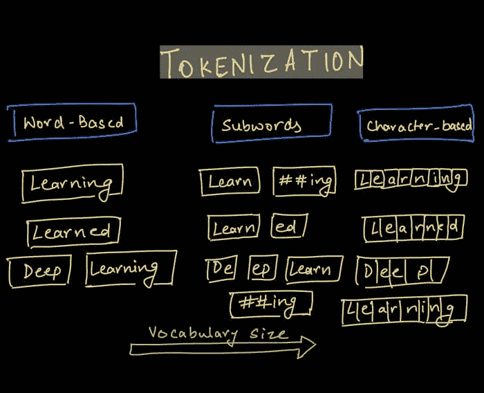

# 分词的演变 - NLP 中的字节对编码

> 原文：[`www.kdnuggets.com/2021/10/evolution-tokenization-byte-pair-encoding-nlp.html`](https://www.kdnuggets.com/2021/10/evolution-tokenization-byte-pair-encoding-nlp.html)

评论

**由 [Harshit Tyagi](https://www.linkedin.com/in/tyagiharshit/), 数据科学讲师 | 导师 | YouTuber**



虽然 NLP 在 AI 的启示上可能有些晚，但它在 Google、OpenAI 等组织中表现卓越，推出了如 BERT 和 GPT-2/3 等最先进的（SOTA）语言模型。

GitHub Copilot 和 OpenAI Codex 是当前新闻中的一些非常受欢迎的应用程序。作为一个对 NLP 了解有限的人，我决定将 NLP 作为研究领域，接下来的几篇博客/视频将是我分享在分析 NLP 的一些重要组件后所学到的内容。

NLP 系统有三个主要组件，帮助机器理解自然语言：

1.  分词

1.  嵌入

1.  模型架构

顶级深度学习模型如 BERT、GPT-2 或 GPT-3 都共享相同的组件，但具有不同的架构，使每个模型有所区别。

在本期通讯中（以及 [笔记本](https://colab.research.google.com/drive/1QLlQx_EjlZzBPsuj_ClrEDC0l8G-JuTn?usp=sharing)），我们将专注于 NLP 管道中第一个组件的基础知识，即**分词**。这是一个经常被忽视的概念，但它本身就是一个研究领域。我们已经远远超越了传统的 NLTK 分词过程。

尽管我们有最先进的分词算法，但了解其演变过程并学习我们如何达到现在的状态始终是一个好习惯。

所以，我们将覆盖以下内容：

+   什么是分词？

+   我们为什么需要分词器？

+   分词的类型 - 词级、字符级和子词级。

+   字节对编码算法 - 现在大多数 NLP 模型都使用的一个版本。

本教程的下一部分将深入探讨更先进（或增强版 BPE）的算法：

+   **Unigram 算法**

+   **WordPiece - BERT 变压器**

+   **SentencePiece - 端到端分词器系统**

## 什么是分词？

分词是将原始文本表示为称为“tokens”的较小单位的过程。这些 tokens 可以被映射为数字，以便进一步输入到 NLP 模型中。

这是一个过于简化的分词器功能示例：

```py
## read the text and enumerate the tokens in the text
text = open('example.txt', 'r').read(). # read a text file

words = text.split(" ") # split the text on spaces

tokens = {v: k for k, v in enumerate(words)} # generate a word to index mapping
```


在这里，我们只是简单地将文本中的每个词映射到一个数字索引。显然，这是一个非常简单的示例，我们没有考虑语法、标点符号、复合词（如 test, test-ify, test-ing 等）。

因此，我们需要一个更技术化且准确的令牌化定义。为了考虑每一个标点符号和相关词汇，我们需要从字符级别开始工作。

令牌化有多种应用。其中一个用例来源于编译器设计，我们需要解析计算机程序，将原始字符转换为编程语言的关键字。

**在深度学习中，** 令牌化是将字符序列转换为令牌序列的过程，之后还需将其转换为可以由神经网络处理的数值向量序列。

## 为什么我们需要令牌化器？

对令牌化器的需求源于“我们如何让机器阅读？”这个问题。

处理文本数据的常见方法之一是定义一个规则字典，然后查找那个固定的规则字典。但这种方法只能走到一定程度，我们希望机器从阅读的文本中学习这些规则。

现在，机器不懂任何语言，也不理解声音或语音学。它们需要从头开始学习，以便能够阅读任何可能的语言。

这可是一项大任务，对吧？

人类通过将声音与意义联系起来来学习语言，然后我们学习用这种语言阅读和写作。机器无法做到这一点，因此它们需要从最基本的文本单元开始处理。

这就是令牌化的作用。将文本分解成称为“令牌”的更小单元。

还有不同的文本令牌化方法，这就是我们现在要学习的内容。

## 令牌化策略 - 简单的令牌化方法

为了让深度学习模型从文本中学习，我们需要一个两步过程：


1.  令牌化 - 决定使用什么算法来生成令牌。

1.  将令牌编码为向量

正如第一步所示，我们需要决定如何将文本转换为小的令牌。大多数人提出的简单直接的方法是基于词的令牌，通过空格分割文本。

### 字词令牌化器的问题

+   **训练数据中缺词的风险：** 使用词元时，你的模型无法识别训练数据中未包含的词的变体。因此，如果你的模型在训练数据中看到了`foot`和`ball`，但最终文本中有`football`，模型将无法识别该词，并将其视为`<UNK>`标记。类似地，标点符号也会带来问题，`let`或`let's`需要单独的标记，这是一个低效的解决方案。这将**需要一个庞大的词汇表**以确保你拥有每个词的所有变体。即使你添加了**词形还原器**来解决这个问题，你也增加了处理流程中的一个额外步骤。

+   **处理俚语和缩写：** 另一个问题是现在文本中使用的俚语和缩写，例如 "FOMO"、"LOL"、"tl;dr" 等。我们该如何处理这些词？

+   **如果语言不使用空格进行分隔怎么办：** 对于像中文这样不使用空格进行单词分隔的语言，这种分词器将完全失败。

在遇到这些问题后，研究人员开始研究另一种方法，即逐字符分词。

## 基于字符的分词

为了解决与基于词的分词相关的问题，尝试了一种逐字符分词的替代方法。

这确实解决了缺词的问题，因为现在我们处理的是可以使用 ASCII 或 Unicode 编码的字符，并且现在可以为任何单词生成嵌入。

每个字符，无论是空格、撇号还是冒号，现在都可以分配一个符号来生成向量序列。

但这种方法也有其缺点。

### 基于字符的模型的缺点

+   **计算需求更多：** 基于字符的模型将每个字符视为词元，更多的词元意味着更多的输入计算以处理每个词元，从而需要更多的计算资源。对于一个 5 词长的句子，你可能需要处理 30 个词元，而不是 5 个基于词的词元。

+   **缩小 NLP 任务和应用的数量：** 对于长字符序列，只有某种类型的神经网络架构可以使用。这限制了我们可以执行的 NLP 任务类型。对于像实体识别或文本分类这样的应用，基于字符的编码可能会变得低效。

+   **学习错误语义的风险：** 与字符一起工作可能会产生单词的错误拼写。此外，由于没有固有的意义，使用字符学习就像在没有有意义语义的情况下学习。

> 有趣的是，对于这样一个看似简单的任务，已经编写了多个算法来寻找最佳的分词策略。

在理解了这些分词方法的优缺点之后，寻找一种提供中间路径的方法是有意义的，即保留语义的同时使用有限的词汇表，以便在合并时生成文本中的所有单词。

## 子词分词

使用基于字符的模型，我们有丢失词语的语义特征的风险，而使用基于词的分词，我们需要一个非常大的词汇表来包含每个单词的所有可能变体。

所以，目标是开发一个算法，能够：

1.  保留标记的语义特征，即每个标记的信息。

1.  在不需要非常大词汇表的情况下进行分词，使用有限的词汇表。

为了解决这个问题，我们可以考虑根据一组前缀和后缀来拆分单词。例如，我们可以编写基于规则的系统来识别子词，如`"##s"`、`"##ing"`、`"##ify"`、`"un##"`等，其中双哈希的位置表示前缀和后缀。

所以，像`"unhappily"`这样的词通过子词`"un##"`、`"happ"`和`"##ily"`进行分词。

模型只学习一些子词，然后将它们组合起来创建其他词。这解决了创建大型词汇表所需的内存要求和工作量。

### 该算法的问题：

+   根据定义的规则创建的一些子词可能从未出现在你的文本中进行分词，并且可能占用额外的内存。

+   此外，对于每种语言，我们需要定义不同的规则集来创建子词。

为了缓解这个问题，在实践中，大多数现代分词器都有一个训练阶段，识别输入语料库中出现的文本并创建新的子词标记。对于稀有模式，我们坚持使用基于词的标记。

在这个过程中另一个重要因素是由用户设置的词汇表的大小。较大的词汇表允许更多常见单词被分词，而较小的词汇表则需要创建更多子词来构造文本中的每个单词，而不使用`<UNK>`标记。

在这里，平衡你的应用程序是关键。

## 字节对编码（BPE）

BPE 最初是一种数据压缩算法，用于通过识别常见字节对找到表示数据的最佳方式。现在它被用于自然语言处理（NLP），以使用最少的标记找到文本的最佳表示。

工作原理如下：

1.  在每个单词的末尾添加一个标识符（`</w>`）以标识单词的结束，然后计算文本中的单词频率。

1.  将单词拆分为字符，然后计算字符频率。

1.  从字符标记开始，进行预定义次数的迭代，计算连续字节对的频率，并合并出现频率最高的字节对。

1.  持续迭代，直到你达到迭代限制（由你设置）或达到标记限制。

让我们逐步（在代码中）处理一个示例文本。为此编写代码，我借鉴了[Lei Mao 的 BPE 极简博客](https://leimao.github.io/blog/Byte-Pair-Encoding/)。我鼓励你去看看！

这是我们的示例文本：

```py
"There is an 80% chance of rainfall today. We are pretty sure it is going to rain."

## define the text first
text = "There is an 80% chance of rainfall today. We are pretty sure it is going to rain."

## get the word frequency and add the end of word () token ## at the end of each word
words = text.strip().split(" ")

print(f"Vocabulary size: {len(words)}")
```


## 第二步：将单词拆分为字符，然后计算字符频率。

```py
char_freq_dict = collections.defaultdict(int)
for word, freq in word_freq_dict.items():
    chars = word.split()
    for char in chars:
        char_freq_dict[char] += freq

char_freq_dict
```


## 第三步：合并最频繁出现的连续字节对。

```py
import re

## create all possible consecutive pairs
pairs = collections.defaultdict(int)
for word, freq in word_freq_dict.items():
    chars = word.split()
    for i in range(len(chars)-1):
        pairs[chars[i], chars[i+1]] += freq
```


## 第四步 - 迭代多次以找到最佳（就频率而言）对进行编码，然后将它们连接以查找子词。

在此阶段，最好将我们的代码结构化为函数。这将要求我们执行以下步骤：

1.  在每次迭代中，找到最频繁出现的字节对。

1.  合并这些标记。

1.  重新计算字符标记的频率，添加新的对编码。

1.  继续进行，直到没有更多对或者你到达循环的结束。

要查看详细代码，你可以**查看我的 [Colab 笔记本](https://colab.research.google.com/drive/1QLlQx_EjlZzBPsuj_ClrEDC0l8G-JuTn?usp=sharing)。**

这是这四个步骤的精简输出：


当我们迭代每个最佳对时，我们合并（连接）该对，你可以看到，当我们重新计算频率时，原始字符标记频率减少，新配对的标记频率在标记字典中出现。

如果你查看创建的标记数量，最初会增加，因为我们创建了新的配对，但在经过若干次迭代后，数量开始减少。

在这里，我们从 25 个标记开始，在第 14 次迭代中增加到 31 个标记，然后在第 50 次迭代中减少到 16 个标记。很有趣，对吧？

## BPE 算法的改进空间

BPE 算法是一种贪婪算法，即它在每次迭代中尝试寻找最佳对。这个贪婪方法有一些局限性。

因此，BPE 算法也有优缺点。

最终标记将根据你运行的迭代次数而有所不同，这也带来了另一个问题。现在，我们可以对同一文本拥有不同的标记，从而得到不同的嵌入。

为了解决这个问题，提出了多种解决方案，但最突出的是一种添加了[subword regularization（子词正则化，一种新的子词分割方法）](https://arxiv.org/pdf/1804.10959.pdf)训练的单语语言模型，该模型通过使用损失函数计算每个子词令牌的概率，以选择最佳选项。更多内容将在即将到来的博客中介绍。

## 他们在 BERTs 或 GPTs 中使用 BPE 吗？

像 BERT 或 GPT-2 这样的模型使用某种版本的 BPE 或单语模型来对输入文本进行标记化。

BERT 包含了一种新的算法，叫做 WordPiece，这与 BPE 类似，但增加了一个概率计算层，以决定合并的令牌是否会被最终采纳。

## 总结

你在这篇博客中学到了什么（如果有的话），即机器如何通过将文本分解为非常小的单元来开始理解语言。

现在，有很多方法可以将文本分解，因此比较不同方法变得重要。

我们从通过空格分割英文文本来理解标记化开始，但并非所有语言都是以相同的方式书写（即使用空格来表示分割），因此我们研究了通过字符分割来生成字符令牌。

使用字符的问题在于令牌的语义特征丧失，可能导致创建不正确的词汇表示或嵌入。

为了兼顾两全，推出了更有前景的子词标记化方法，然后我们研究了 BPE 算法来实现子词标记化。

下一周将详细介绍 WordPiece、SentencePiece 等高级标记化器的下一步，以及如何使用 HuggingFace 标记化器。

## 参考文献和注释

我的文章实际上是以下论文和博客的汇总，我鼓励你阅读：

1.  [稀有词汇的神经机器翻译与子词单元](https://arxiv.org/pdf/1508.07909.pdf) - 讨论基于 BPE 压缩算法的不同分割技术的研究论文。

1.  [关于子词 NMT（神经机器翻译）的 GitHub 代码库](https://github.com/rsennrich/subword-nmt) - 支持上述论文的代码。

1.  [Lei Mao 的 Byte Pair Encoding 博客](https://leimao.github.io/blog/Byte-Pair-Encoding/) - 我使用了他博客中的代码来实现和理解 BPE。

1.  [机器如何阅读](https://blog.floydhub.com/tokenization-nlp/) - Cathal Horan 的博客。

如果你想开始学习数据科学或机器学习领域，可以查看我的课程 [数据科学与机器学习基础](https://www.wiplane.com/p/foundations-for-data-science-ml)。

如果你想看到更多类似内容而你还不是订阅者，可以考虑使用下面的按钮订阅我的新闻通讯。

**简介: [Harshit Tyagi](https://www.linkedin.com/in/tyagiharshit/)** 是一位在网页技术和数据科学（即全栈数据科学）方面拥有丰富经验的工程师。他已经辅导了超过 1000 名人工智能/网页/数据科学的求职者，并正在设计数据科学和机器学习工程学习路径。此前，Harshit 与耶鲁大学、麻省理工学院和加州大学洛杉矶分校的研究科学家一起开发了数据处理算法。

[原文](https://dswharshit.substack.com/p/the-evolution-of-tokenization-byte)。经授权转载。

**相关：**

+   深度学习的文本预处理方法

+   15 个必须了解的 Python 字符串方法

+   学习数据科学和机器学习：路线图后的第一步

* * *

## 我们的前三大课程推荐

 1\. [谷歌网络安全证书](https://www.kdnuggets.com/google-cybersecurity) - 快速进入网络安全职业的捷径。

 2\. [谷歌数据分析专业证书](https://www.kdnuggets.com/google-data-analytics) - 提升你的数据分析技能

 3\. [谷歌 IT 支持专业证书](https://www.kdnuggets.com/google-itsupport) - 支持组织的 IT 工作

* * *

### 更多相关主题

+   [使用 MultiLabelBinarizer 对类别特征进行编码](https://www.kdnuggets.com/2023/01/encoding-categorical-features-multilabelbinarizer.html)

+   [从甲骨文到人工智能数据库：数据存储的演变](https://www.kdnuggets.com/2022/02/oracle-databases-ai-evolution-data-storage.html)

+   [利用智能分析未来成功的概率……](https://www.kdnuggets.com/2022/02/analyzing-probability-future-success-intelligence-node-attributes-evolution-model.html)

+   [从人工智能到机器学习的演变……](https://www.kdnuggets.com/2022/08/evolution-artificial-intelligence-machine-learning-data-science.html)

+   [语音识别指标的演变](https://www.kdnuggets.com/2022/10/evolution-speech-recognition-metrics.html)

+   [深入探讨 GPT 模型：演变与性能比较](https://www.kdnuggets.com/2023/05/deep-dive-gpt-models.html)
