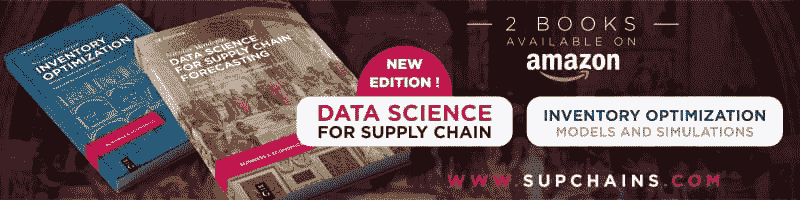

# 你用 Python 读取 Excel 文件吗？有一种 1000 倍更快的方法

> 原文：[`www.kdnuggets.com/2021/09/excel-files-python-1000x-faster-way.html`](https://www.kdnuggets.com/2021/09/excel-files-python-1000x-faster-way.html)

评论

**作者：[Nicolas Vandeput](https://www.linkedin.com/in/vandeputnicolas/)，供应链数据科学家**


来源：[`www.hippopx.com/`](https://www.hippopx.com/)，公有领域

* * *

## 我们的 3 个最佳课程推荐

 1\. [Google 网络安全证书](https://www.kdnuggets.com/google-cybersecurity) - 快速开启网络安全职业生涯。

 2\. [Google 数据分析专业证书](https://www.kdnuggets.com/google-data-analytics) - 提升你的数据分析技能

 3\. [Google IT 支持专业证书](https://www.kdnuggets.com/google-itsupport) - 在 IT 领域支持你的组织

* * *

作为 Python 用户，我使用 Excel 文件来加载/存储数据，因为商务人士喜欢以 Excel 或 csv 格式共享数据。不幸的是，Python 处理 Excel 文件特别慢。

在这篇文章中，我将向你展示在 Python 中加载数据的五种方法。最后，我们将实现 3 个数量级的加速，速度将非常快。

> *编辑 (18/07/2021)：我找到了使过程****快 5 倍****（实现 5000 倍加速）的方法。我把它作为文章末尾的一个附加内容。*

## 实验设置

让我们假设我们要加载 10 个包含 20000 行和 25 列的 Excel 文件（总共约 70MB）。这是一个代表性的案例，假设你要将 ERP（SAP）中的事务数据加载到 Python 中进行一些分析。

让我们填充这些虚拟数据并导入所需的库（稍后在文章中我们会讨论 pickle 和 joblib）。

```py
import pandas as pd
import numpy as np
from joblib import Parallel, delayed
import timefor file_number in range(10):
 values = np.random.uniform(size=(20000,25))
 pd.DataFrame(values).to_csv(f”Dummy {file_number}.csv”)
 pd.DataFrame(values).to_excel(f”Dummy {file_number}.xlsx”)
 pd.DataFrame(values).to_pickle(f”Dummy {file_number}.pickle”)
```

## 在 Python 中加载数据的 5 种方法

### 想法 #1：在 Python 中加载 Excel 文件

让我们从一种简单的方法开始加载这些文件。我们将创建第一个 Pandas Dataframe，然后将每个 Excel 文件附加到它上面。

```py
start = time.time()
df = pd.read_excel(“Dummy 0.xlsx”)
for file_number in range(1,10):
 df.append(pd.read_excel(f”Dummy {file_number}.xlsx”))
end = time.time()
print(“Excel:”, end — start)>> Excel: 53.4
```

在 Python 中导入 Excel 文件的简单方法。

运行时间约为 50 秒。相当慢。

### 想法 #2：使用 CSV 而不是 Excel 文件

现在我们假设我们将这些文件从 ERP/System/SAP 保存为 .csv（而不是 .xlsx）。

```py
start = time.time()
df = pd.read_csv(“Dummy 0.csv”)
for file_number in range(1,10):
 df.append(pd.read_csv(f”Dummy {file_number}.csv”))
end = time.time()
print(“CSV:”, end — start)>> CSV: 0.632
```

在 Python 中导入 csv 文件的速度比 Excel 文件快 100 倍。

我们现在可以在 0.63 秒内加载这些文件。这几乎快了 10 倍！

**Python 加载 CSV 文件的速度是 Excel 文件的 100 倍。使用 CSV 文件。**

**缺点**：csv 文件通常比 .xlsx 文件大。在这个例子中，.csv 文件为 9.5MB，而 .xlsx 文件为 6.4MB。

### 想法 #3：更智能的 Pandas DataFrames 创建

我们可以通过改变创建 pandas DataFrames 的方式来加快我们的进程。与其将每个文件附加到现有的 DataFrame，

1.  不如将每个 DataFrame 独立地加载到一个列表中。

1.  然后将整个列表连接成一个 DataFrame。

```py
start = time.time()
df = []
for file_number in range(10):
 temp = pd.read_csv(f”Dummy {file_number}.csv”)
 df.append(temp)
df = pd.concat(df, ignore_index=True)
end = time.time()
print(“CSV2:”, end — start)>> CSV2: 0.619
```

更聪明的 CSV 文件导入方式

我们减少了几个百分点的时间。根据我的经验，这个技巧在处理更大的数据框（df >> 100MB）时会非常有用。

### 想法#4：使用 Joblib 并行化 CSV 导入

我们想在 Python 中加载 10 个文件。与其一个一个加载，为什么不一次性并行加载所有文件呢？

我们可以使用[joblib](https://joblib.readthedocs.io/en/latest/parallel.html)轻松实现这一点。

```py
start = time.time()
def loop(file_number):
 return pd.read_csv(f”Dummy {file_number}.csv”)
df = Parallel(n_jobs=-1, verbose=10)(delayed(loop)(file_number) for file_number in range(10))
df = pd.concat(df, ignore_index=True)
end = time.time()
print(“CSV//:”, end — start)>> CSV//: 0.386
```

使用 Joblib 在 Python 中并行导入 CSV 文件。

这几乎是单核版本速度的两倍。然而，作为一般规则，不要指望通过使用 8 核来将你的过程加速八倍（在这里，我在使用新 M1 芯片的 Mac Air 上，通过使用 8 核实现了 x2 的速度提升）。

**Python 中使用 Joblib 进行简单的并行化**

[Joblib](https://joblib.readthedocs.io/en/latest/parallel.html)是一个简单的 Python 库，允许你在//中运行函数。实际上，joblib 的工作方式类似于列表推导式，只不过每次迭代由不同的线程执行。以下是一个例子。

```py
def loop(file_number):
 return pd.read_csv(f”Dummy {file_number}.csv”)
df = Parallel(n_jobs=-1, verbose=10)(delayed(loop)(file_number) for file_number in range(10))#equivalent to
df = [loop(file_number) for file_number in range(10)]
```

将 joblib 看作是一个智能的列表推导式。

### 想法#5：使用 Pickle 文件

通过将数据存储在 pickle 文件中——Python 使用的一种特定格式——而不是.csv 文件，你可以（大大）加快速度。

**缺点**：你不能手动打开 pickle 文件查看其中的内容。

```py
start = time.time()
def loop(file_number):
 return pd.read_pickle(f”Dummy {file_number}.pickle”)
df = Parallel(n_jobs=-1, verbose=10)(delayed(loop)(file_number) for file_number in range(10))
df = pd.concat(df, ignore_index=True)
end = time.time()
print(“Pickle//:”, end — start)>> Pickle//: 0.072
```

我们刚刚将运行时间缩短了 80%！

一般来说，处理 pickle 文件比处理 csv 文件要快得多。不过，另一方面，pickle 文件通常会占用更多的磁盘空间（在这个具体的例子中除外）。

实际上，你可能无法直接从系统中提取数据到 pickle 文件中。

我建议在以下两种情况下使用 pickle 文件：

1.  如果你想保存来自 Python 进程的数据（并且不打算在 Excel 中打开），以便以后/在其他进程中使用。将你的数据框保存为 pickle 文件，而不是.csv。

1.  你需要多次重新加载相同的文件。第一次打开文件时，将其保存为 pickle 文件，以便下次能够直接加载 pickle 版本。

    示例：假设你使用的是交易性月度数据（每个月你加载一个新的数据月）。你可以将所有历史数据保存为.pickle，每次收到新文件时，你可以先将其作为.csv 加载，然后保留为.pickle 以备下次使用。

## 奖励：并行加载 Excel 文件

假设你收到的是 Excel 文件，你别无选择，只能按原样加载它们。你也可以使用 joblib 来并行化这个过程。相比我们上面提到的 pickle 代码，我们**只需**更新循环函数。

```py
start = time.time()
def loop(file_number):
    return pd.read_excel(f"Dummy {file_number}.xlsx")
df = Parallel(n_jobs=-1, verbose=10)(delayed(loop)(file_number) for file_number in range(10))
df = pd.concat(df, ignore_index=True)
end = time.time()
print("Excel//:", end - start)>> 13.45
```

如何使用 Python 中的并行化加载 Excel 文件。

我们可以将加载时间减少 70%（从 50 秒降到 13 秒）。

你也可以使用这个循环来动态创建 pickle 文件。这样，下次你加载这些文件时，你将能够实现闪电般的加载速度。

```py
def loop(file_number):
    temp = pd.read_excel(f"Dummy {file_number}.xlsx")
    temp.to_pickle(f"Dummy {file_number}.pickle")
    return temp
```

## 回顾

通过并行加载 pickle 文件，我们将加载时间从 50 秒减少到不到十分之一秒。

+   Excel：50 秒

+   CSV：0.63 秒

+   更智能的 CSV：0.62 秒

+   CSV in //：0.34 秒

+   Pickle in //：0.07 秒

+   Excel in //：13.5 秒

## 奖励#2：4 倍更快的并行化

Joblib 允许更改并行化后台以减少一些开销。你可以通过将*prefer=”threads”* 传递给*Parallel*来做到这一点。

使用 prefer=”threads” 将使你的过程运行得更快。

我们获得了大约 0.0096 秒的速度（在 2021 年款 MacBook Air 上进行 50 次测试）。

使用 prefer=”threads” 进行 CSV 和 Excel 并行化的结果如下。


如你所见，使用“线程”后台在读取 Excel 文件时得分更差。但在使用 pickle 时表现惊人（逐个加载 Excel 文件需要 50 秒，而在//中读取 pickle 文件仅需 0.01 秒）。

### ???? [让我们在 LinkedIn 上连接吧！](https://www.linkedin.com/in/vandeputnicolas/)

**简介：[尼古拉斯·万德普特](https://www.linkedin.com/in/vandeputnicolas/)**是一名供应链数据科学家，专注于需求预测和库存优化。他于 2016 年创办了自己的咨询公司[SupChains](http://www.supchains.com/)，并于 2018 年共同创办了[SKU Science](https://bit.ly/3ozydFN)——一个快速、简单且经济实惠的需求预测平台。对教育充满热情的尼古拉斯既是一名积极的学习者，也享受在大学授课：自 2014 年以来，他在比利时布鲁塞尔教授预测和库存优化课程。自 2020 年以来，他还在法国巴黎的 CentraleSupelec 教授这两个学科。他于 2018 年出版了[*供应链预测的数据科学*](https://www.amazon.com/Data-Science-Supply-Chain-Forecasting/dp/3110671107)（2021 年出版了第 2 版），并于 2020 年出版了[*库存优化：模型与模拟*](https://www.amazon.com/Inventory-Optimization-Simulations-Nicolas-Vandeput/dp/3110673916)。



[原文](https://towardsdatascience.com/read-excel-files-with-python-1000x-faster-407d07ad0ed8)。经许可转载。

**相关：**

+   Vaex: Pandas 但快 1000 倍

+   如何查询你的 Pandas 数据框

+   使用 PyPolars 使 Pandas 快 3 倍

### 更多相关话题

+   [使用管道编写干净的 Python 代码](https://www.kdnuggets.com/2021/12/write-clean-python-code-pipes.html)

+   [建立一个强大的数据团队](https://www.kdnuggets.com/2021/12/build-solid-data-team.html)

+   [有没有办法弥合 MLOps 工具的差距？](https://www.kdnuggets.com/2022/08/way-bridge-mlops-tools-gap.html)

+   [用 AI 和分析引擎准备时间序列数据的更快方法](https://www.kdnuggets.com/2021/12/piexchange-faster-way-prepare-timeseries-data-ai-analytics-engine.html)

+   [每个数据科学家都应该了解的三个 R 库（即使你使用 Python）](https://www.kdnuggets.com/2021/12/three-r-libraries-every-data-scientist-know-even-python.html)

+   [《往返之旅… 一个 RAPIDS 故事》](https://www.kdnuggets.com/2023/06/back-again-rapids-tale.html)
