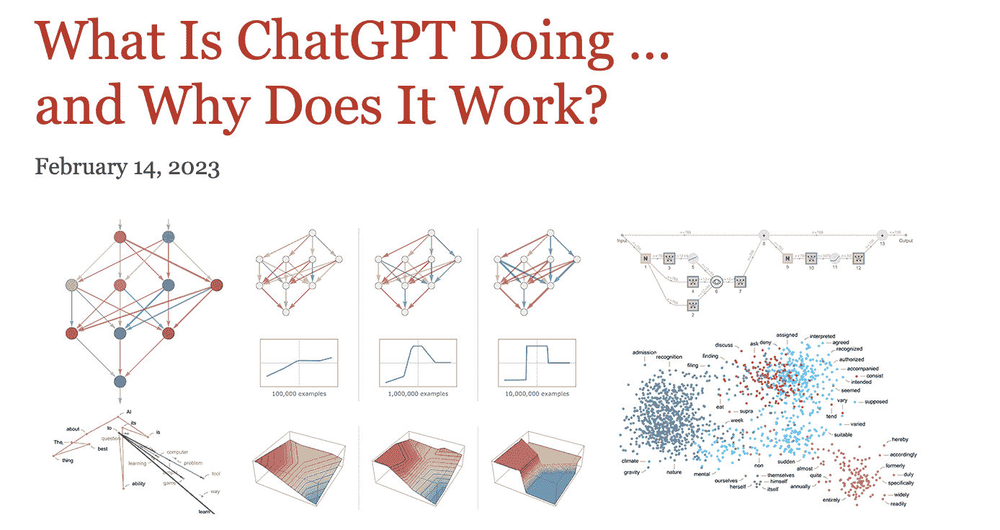
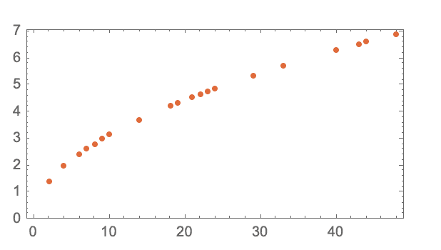
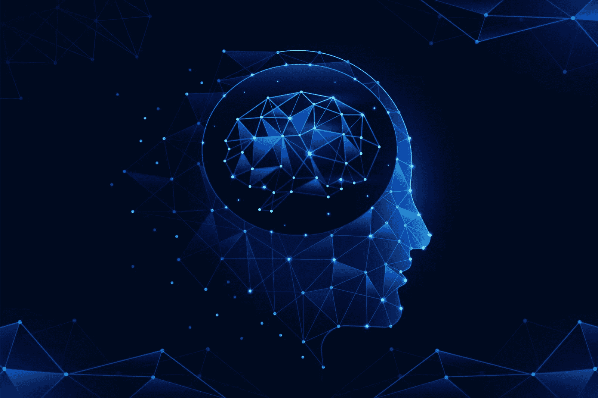

# 一个学习 ChatGPT 背后所有基础的优秀资源

> 原文：[`www.kdnuggets.com/023/08/excellent-resource-learn-foundations-everything-underneath-chatgpt.html`](https://www.kdnuggets.com/023/08/excellent-resource-learn-foundations-everything-underneath-chatgpt.html)

图片来自 [Freepik](https://www.freepik.com/free-photo/opened-ai-chat-laptop_38259334.htm#query=chatgpt&position=0&from_view=search&track=sph)

OpenAI、ChatGPT、GPT 系列以及大型语言模型（LLMs） – 如果你与 AI 行业或技术行业有任何联系，那么你很可能会在几乎所有的商务对话中听到这些词汇。

* * *

## 我们的前三个课程推荐

 1\. [Google 网络安全证书](https://www.kdnuggets.com/google-cybersecurity) - 快速通道进入网络安全职业。

 2\. [Google 数据分析专业证书](https://www.kdnuggets.com/google-data-analytics) - 提升你的数据分析技能

 3\. [Google IT 支持专业证书](https://www.kdnuggets.com/google-itsupport) - 支持你的组织的 IT 需求

* * *

而且这种炒作是真的。我们不能再称其为泡沫。毕竟，这次，炒作确实兑现了它的承诺。

谁会想到机器能够理解并以类人智能作出回应，并执行几乎所有以前被认为是人类特长的任务，包括音乐创作、诗歌写作，甚至编程应用？

大型语言模型在我们生活中的普及让我们都对这一强大技术背后的内容充满好奇。

因此，如果你因为算法的复杂细节和 AI 领域的复杂性而感到退缩，我强烈推荐这个资源来了解“[ChatGPT 在做什么……以及它为何有效？](https://writings.stephenwolfram.com/2023/02/what-is-chatgpt-doing-and-why-does-it-work/)”

图片来自 [Stephen Wolfram Writings](https://writings.stephenwolfram.com/2023/02/what-is-chatgpt-doing-and-why-does-it-work/)

是的，这是 Wolfram 文章的标题。

为什么推荐这个？因为在学习 Transformers、LLMs 或者生成型 AI 之前，理解机器学习的基本要素以及深度神经网络如何与人脑相关是至关重要的。

这看起来像一本迷你书，独立成章，但请花时间阅读这篇资源。

在这篇文章中，我将分享如何开始阅读这些内容，以便更容易掌握概念。

# 理解‘模型’至关重要

其主要亮点是关注“大型语言模型”中的‘模型’部分，通过一个例子说明了球从每一层到达地面的时间。

图片来源：[斯蒂芬·沃尔弗拉姆的写作](https://writings.stephenwolfram.com/2023/02/what-is-chatgpt-doing-and-why-does-it-work/)

有两种方法可以实现这一点 – 从每一层重复这个过程，或建立一个可以计算它的模型。

在这个例子中，存在一个基本的数学公式，使得计算变得更容易，但如何使用“模型”来估计这种现象呢？

最佳做法是拟合一条直线来估计感兴趣的变量，在这个例子中就是时间。

对这一部分更深入的阅读会解释没有“无模型的模型”，这将自然引导你了解各种深度学习概念。

# 深度学习的核心

你将了解到，模型是一个复杂的函数，它接受某些变量作为输入，并生成输出，比如在数字识别任务中的一个数字。

文章从数字识别到典型的猫与狗分类器，清楚地解释了每一层所提取的特征，从猫的轮廓开始。值得注意的是，神经网络的前几层会提取图像的某些方面，如物体的边缘。

图片来源：[Freepik](https://www.freepik.com/free-vector/gradient-brain-background_44416640.htm#query=deep%20learning&position=6&from_view=search&track=ais)

## 关键术语

除了说明多个层的作用外，还解释了深度学习算法的多个方面，例如：

### 神经网络的架构

文章称这是一种艺术与科学的结合 – “但大多数情况是通过反复试验发现的，添加了想法和技巧，逐步积累了关于如何处理神经网络的丰富经验”。

### 轮次

轮次是一种有效的方法，可以提醒模型特定的示例，让它“记住这个示例”

由于重复相同的例子多次并不足够，因此向神经网络展示不同的示例变体非常重要。

### 权重（参数）

你一定听说过某个大型语言模型拥有惊人的 1750 亿个参数。嗯，这说明了模型的结构如何根据旋钮的调整而变化。

本质上，参数是“你可以调节的旋钮”，用于拟合数据。文章强调，神经网络的实际学习过程就是寻找正确的权重 – *“最终，这一切都是关于确定哪些权重能够最好地捕捉给定的训练示例”*

### 泛化

神经网络学会了以“合理的方式在展示的示例之间进行插值”。

这种泛化有助于通过学习多个输入-输出示例来预测未见过的记录。

### 损失函数

那么，我们如何知道什么是合理的呢？它由输出值与期望值之间的距离定义，这些期望值被封装在损失函数中。

它为我们提供了“我们得到的值与真实值之间的距离”。为了减少这种距离，权重会被反复调整，但必须有一种系统化的方法来将权重调整到最短路径的方向。

### 梯度下降

在权重景观中找到最陡下降路径称为梯度下降。

一切都在于通过在权重景观中导航来找到最佳的权重，以最准确地表示真实情况。

### 反向传播

继续阅读关于反向传播的概念，它利用损失函数向后工作，逐步找到最小化相关损失的权重。

### 超参数

除了权重（即参数），还有超参数，包括不同的损失函数选择、损失最小化，甚至选择“批次”大小。

### 复杂问题中的神经网络

神经网络在复杂问题中的使用被广泛讨论。然而，直到这篇文章解释了高维空间中的多个权重变量如何提供通向最小值的各种方向，这种假设的逻辑才变得清晰。

现在，将此与较少的变量进行比较，这意味着可能会陷入局部最小值而没有方向离开。

# 结论

通过这次阅读，我们涵盖了许多内容，从理解模型及人脑如何工作到将其应用于神经网络、它们的设计及相关术语。

请关注后续文章，了解如何在此基础上深入理解 chatgpt 的工作原理。

**[Vidhi Chugh](https://vidhi-chugh.medium.com/)** 是一位 AI 策略专家和数字化转型领导者，专注于产品、科学和工程的交汇点，以构建可扩展的机器学习系统。她是一位获奖的创新领导者、作者和国际演讲者。她的使命是使机器学习民主化，并打破术语，使每个人都能参与这场转型。

### 更多相关主题

+   [ChatGPT 能否作为教育资源被信任？](https://www.kdnuggets.com/2023/05/chatgpt-trusted-educational-resource.html)

+   [基础回顾第 1 周：Python 编程与数据科学基础](https://www.kdnuggets.com/back-to-basics-week-1-python-programming-data-science-foundations)

+   [ChatGPT 插件：你需要了解的一切](https://www.kdnuggets.com/2023/06/chatgpt-plugins-everything-need-know.html)

+   [ChatGPT：你需要了解的一切](https://www.kdnuggets.com/2023/01/chatgpt-everything-need-know.html)

+   [Visual ChatGPT: 微软将 ChatGPT 和 VFM 结合](https://www.kdnuggets.com/2023/03/visual-chatgpt-microsoft-combine-chatgpt-vfms.html)

+   [ChatGPT CLI: 将你的命令行界面转变为 ChatGPT](https://www.kdnuggets.com/2023/07/chatgpt-cli-transform-commandline-interface-chatgpt.html)
