# 使用机器学习寻找系外行星

> 原文：[`www.kdnuggets.com/2020/01/exoplanet-hunting-machine-learning.html`](https://www.kdnuggets.com/2020/01/exoplanet-hunting-machine-learning.html)

评论 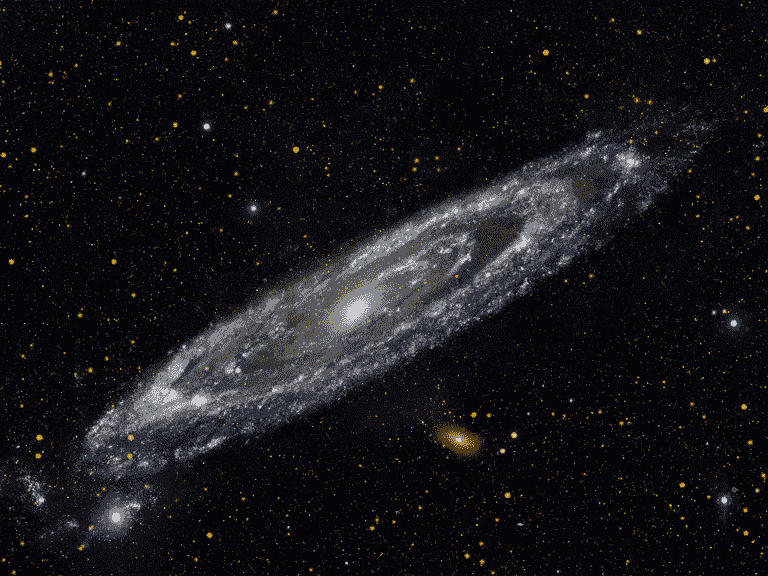

来源: [`weheartit.com/entry/298477443`](https://weheartit.com/entry/298477443)

* * *

## 我们的三大推荐课程

 1. [谷歌网络安全证书](https://www.kdnuggets.com/google-cybersecurity) - 快速进入网络安全职业轨道。

 2. [谷歌数据分析专业证书](https://www.kdnuggets.com/google-data-analytics) - 提升你的数据分析技能

 3. [谷歌 IT 支持专业证书](https://www.kdnuggets.com/google-itsupport) - 支持你所在组织的 IT 工作。

* * *

我们的太阳系大约在 46 亿年前形成。我们从陨石和放射性研究中得知这一点。一切始于一团气体和尘埃的云。附近的一次超新星爆炸可能扰动了这团平静的云，云开始因引力收缩，形成了一个扁平的旋转盘，大部分物质集中在中心：[**原恒星**](https://en.wikipedia.org/wiki/Protostar)。随后，引力将其余的物质拉成块，并使其中一些块变圆，形成了行星和矮行星。剩余的物质形成了彗星、小行星和流星体。

**但什么是系外行星？**

系外行星是指在我们太阳系之外的行星。在过去的二十年里，已经发现了成千上万颗系外行星，主要是通过[**NASA 的开普勒太空望远镜**](https://en.wikipedia.org/wiki/Kepler_space_telescope)。

这些系外行星有各种各样的大小和轨道。有些是巨大的行星，紧靠着它们的母星；有些是冰冷的，有些是岩石的。NASA 和其他机构正在寻找一种特殊的行星：一种与地球大小相同，围绕类似太阳的恒星在适居带内运行的行星。

**适居带**是指恒星周围的区域，在这个区域内，环境既不太热也不太冷，以至于液态水可以存在于周围行星的表面。想象一下，如果地球在冥王星的位置，太阳几乎看不见（大约只有豌豆的大小），地球的海洋和大部分大气将会冻结。

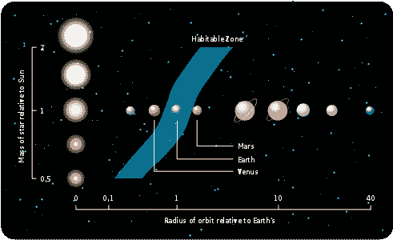

适居带。来源: [`www.e-education.psu.edu/astro801/content/l12_p4.html`](https://www.e-education.psu.edu/astro801/content/l12_p4.html)

[**系外行星：超越我们太阳系的世界**](https://www.space.com/17738-exoplanets.html?jwsource=cl)

系外行星是指在我们太阳系之外的行星。在过去的二十年里，已经发现了成千上万颗系外行星，主要是通过……

**为什么要寻找系外行星？**

我们银河系中大约有**100,000,000,000**颗恒星。我们预计会有多少外行星——太阳系之外的行星——存在？为什么有些恒星被行星环绕？行星系统有多种多样？这种多样性是否告诉我们一些关于行星形成过程的信息？这些都是驱动外行星研究的许多问题之一。一些外行星可能具备存在复杂有机化学的必要物理条件（恒星的光照强度和质量、温度、气氛组成），或许还适合生命的存在（这种生命可能与地球上的生命大相径庭）。

然而，检测外行星并非易事。尽管我们在书籍和电影中想象了其他行星上的生命几个世纪，但检测实际的外行星仍然是一个较新的现象。行星本身发出的光非常微弱，如果有的话。我们之所以能在夜空中看到木星或金星，是因为它们反射了太阳的光。如果我们观察一个外行星（最近的一个距离超过 4 光年），它将非常靠近一颗明亮的恒星，使得行星几乎无法被看见。

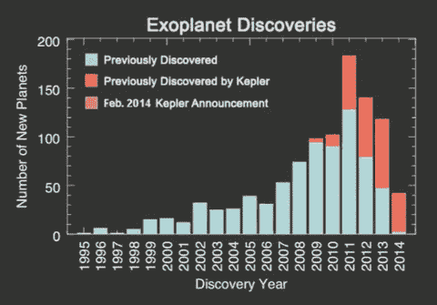

来源：[`media.giphy.com/media/YA2bZh31eFXi0/giphy.gif`](https://media.giphy.com/media/YA2bZh31eFXi0/giphy.gif)

科学家们发现了一种非常有效的研究这些现象的方法；行星本身不会发光，但围绕它们运行的恒星会发光。考虑到这一事实，NASA 的科学家们开发了一种被称为过境法（Transit method）的方法，其中使用类似数字相机的技术来检测和测量行星经过恒星前方时恒星亮度的微小下降。通过对过境行星的观察，天文学家可以计算出行星半径与恒星半径的比率——实际上是行星阴影的大小——通过这个比率，他们可以计算出行星的大小。

开普勒太空望远镜寻找行星的主要方法是“[**过境法**](https://en.wikipedia.org/wiki/Methods_of_detecting_exoplanets)”。

> **过境法：在下面的图示中，一颗恒星被一颗行星围绕。从图表中可以看出，由于行星在我们的位置上部分遮挡了恒星，恒星的光强度下降。当行星从恒星前方经过时，恒星的光强度会恢复到原来的值。**

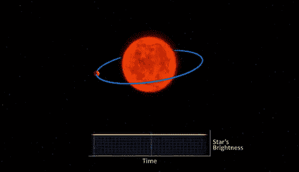

来源：[`gfycat.com/viciousthaticelandichorse`](https://gfycat.com/viciousthaticelandichorse)

直到几年前，天文学家们只确认了不到一千个系外行星的存在。随后，开普勒任务启动了，系外行星的数量激增。开普勒任务于 2018 年遗憾地结束，但[**TESS**](https://exoplanets.nasa.gov/tess/)**任务** **或称过境系外行星勘测卫星**已经接替了它，并定期在夜空中发现新的系外行星。TESS 监测恒星的亮度，以检测因行星过境造成的周期性亮度下降。TESS 任务发现了从小型岩石世界到巨型行星的各种行星，展示了银河系中行星的多样性。

我想查看是否可以利用现有的系外行星数据来预测哪些行星可能适合生命。NASA 公开的数据非常美丽，因为它包含许多有用的特征。目标是创建一个模型，该模型可以利用来自 3198 颗不同恒星的通量（光强度）读数，预测系外行星的存在。

数据集可以从[这里](https://www.kaggle.com/keplersmachines/kepler-labelled-time-series-data)下载。

让我们开始导入所有库：

```py
import os
import warnings
import math
warnings.filterwarnings('ignore')
import numpy as np
import pandas as pd
import matplotlib.pyplot as plt
plt.style.use('fivethirtyeight')
from pylab import rcParams
rcParams['figure.figsize'] = 10, 6
from sklearn.metrics import mean_squared_error, mean_absolute_error
from imblearn.over_sampling import SMOTE
from sklearn.model_selection import train_test_split 
from sklearn import linear_model
from sklearn.model_selection import cross_val_score
from sklearn.metrics import precision_score, recall_score,roc_curve,auc, f1_score, roc_auc_score,confusion_matrix, accuracy_score, classification_report
from sklearn.preprocessing import StandardScaler, normalize
from scipy import ndimage
import seaborn as sns
```

加载训练数据和测试数据。

```py
test_data = pd.read_csv('/Users/nageshsinghchauhan/Downloads/ML/kaggle/exoplanet/exoTest.csv').fillna(0)
train_data = pd.read_csv('/Users/nageshsinghchauhan/Downloads/ML/kaggle/exoplanet/exoTrain.csv').fillna(0)train_data.head()
```

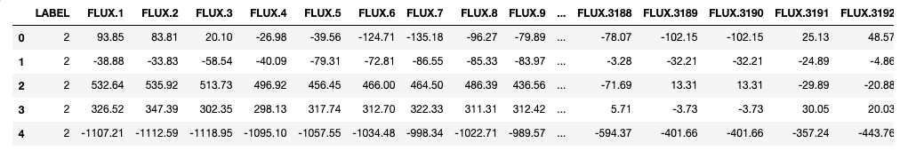

数据集

现在目标列`LABEL`包含两个类别**1**（不代表系外行星）和**2**（代表系外行星的存在）。因此，将它们转换为二进制值，以便于数据处理。

```py
categ = {2: 1,1: 0}
train_data.LABEL = [categ[item] for item in train_data.LABEL]
test_data.LABEL = [categ[item] for item in test_data.LABEL]
```

在继续之前，让我们减少测试和训练数据帧所使用的内存。

```py
#Reduce memory
def reduce_memory(df):
    """ iterate through all the columns of a dataframe and modify the data type
        to reduce memory usage.        
    """
    start_mem = df.memory_usage().sum() / 1024**2
    print('Memory usage of dataframe is {:.2f} MB'.format(start_mem))

    for col in df.columns:
        col_type = df[col].dtype

        if col_type != object:
            c_min = df[col].min()
            c_max = df[col].max()
            if str(col_type)[:3] == 'int':
                if c_min > np.iinfo(np.int8).min and c_max < np.iinfo(np.int8).max:
                    df[col] = df[col].astype(np.int8)
                elif c_min > np.iinfo(np.int16).min and c_max < np.iinfo(np.int16).max:
                    df[col] = df[col].astype(np.int16)
                elif c_min > np.iinfo(np.int32).min and c_max < np.iinfo(np.int32).max:
                    df[col] = df[col].astype(np.int32)
                elif c_min > np.iinfo(np.int64).min and c_max < np.iinfo(np.int64).max:
                    df[col] = df[col].astype(np.int64)  
            else:
                if c_min > np.finfo(np.float16).min and c_max < np.finfo(np.float16).max:
                    df[col] = df[col].astype(np.float16)
                elif c_min > np.finfo(np.float32).min and c_max < np.finfo(np.float32).max:
                    df[col] = df[col].astype(np.float32)
                else:
                    df[col] = df[col].astype(np.float64)
        else:
            df[col] = df[col].astype('category')end_mem = df.memory_usage().sum() / 1024**2
    print('Memory usage after optimization is: {:.2f} MB'.format(end_mem))
    print('Decreased by {:.1f}%'.format(100 * (start_mem - end_mem) / start_mem))
    return dftest_data = reduce_memory(test_data)#Output
Memory usage of dataframe is 13.91 MB
Memory usage after optimization is: 6.25 MB
Decreased by 55.1%
```

这一步是为了内存优化，已将`test_data`数据帧的内存使用减少了 55.1%，你也可以对`train_data`数据帧进行相同的操作。

现在可视化训练数据集中的目标列，并了解类别分布情况。

```py
plt.figure(figsize=(6,4))
colors = ["0", "1"]
sns.countplot('LABEL', data=train_data, palette=colors)
plt.title('Class Distributions \n (0: Not Exoplanet || 1: Exoplanet)', fontsize=14)
```

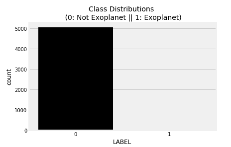

目标变量的类别分布。

结果显示数据严重不平衡。因此，让我们首先从数据预处理技术开始。

让我们绘制训练数据的前 4 行并观察通量值的强度。

```py
from pylab import rcParams
rcParams['figure.figsize'] = 13, 8
plt.title('Distribution of flux values', fontsize=10)
plt.xlabel('Flux values')
plt.ylabel('Flux intensity')
plt.plot(train_data.iloc[0,])
plt.plot(train_data.iloc[1,])
plt.plot(train_data.iloc[2,])
plt.plot(train_data.iloc[3,])
plt.show()
```

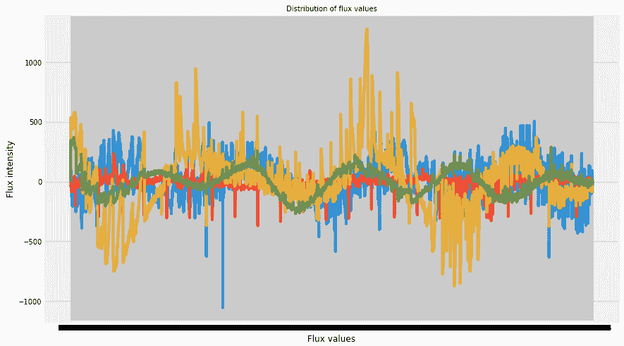

我们的数据很干净，但尚未归一化。让我们绘制非系外行星数据的高斯直方图。

```py
labels_1=[100,200,300]
for i in labels_1:
    plt.hist(train_data.iloc[i,:], bins=200)
    plt.title("Gaussian Histogram")
    plt.xlabel("Flux values")
    plt.show()
```

  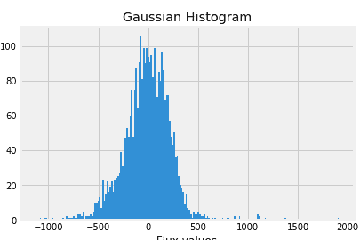  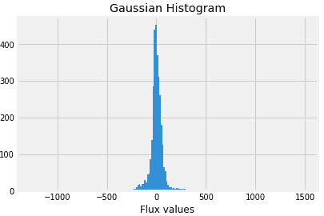

系外行星缺失

现在绘制系外行星存在时的数据的高斯直方图。

```py
labels_1=[16,21,25]
for i in labels_1:
    plt.hist(train_data.iloc[i,:], bins=200)
    plt.title("Gaussian Histogram")
    plt.xlabel("Flux values")
    plt.show()
```

  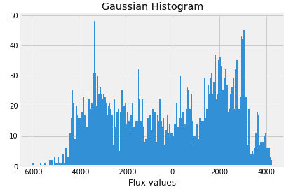  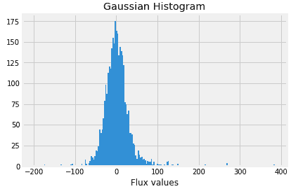

系外行星存在

因此，让我们首先拆分数据集并对其进行归一化。

```py
x_train = train_data.drop(["LABEL"],axis=1)
y_train = train_data["LABEL"]   
x_test = test_data.drop(["LABEL"],axis=1)
y_test = test_data["LABEL"]
```

**数据标准化**是一种在机器学习中常用于数据准备的技术。标准化的目标是将数据集中数值列的值调整到一个共同的尺度上，而不会扭曲值的范围之间的差异。

```py
x_train = normalized = normalize(x_train)
x_test = normalize(x_test)
```

下一步是对测试集和训练集应用高斯滤波器。

在[概率论](https://en.m.wikipedia.org/wiki/Probability_theory)中，**正态**（或**高斯**或**高斯**或**拉普拉斯–高斯**）**分布**是一种非常常见的[连续概率分布](https://en.m.wikipedia.org/wiki/Continuous_probability_distribution)。正态分布在统计学中很重要，通常用于自然科学和社会科学中表示分布未知的实值随机变量。

> 正态分布之所以有用，是因为[中心极限定理](https://en.m.wikipedia.org/wiki/Central_limit_theorem)。在其最一般的形式下，在一些条件下（包括有限[方差](https://en.m.wikipedia.org/wiki/Variance)），它表明，独立从同一分布中抽取的随机变量的观察值的样本平均值在分布上收敛于正态分布，即当观察值数量足够大时，它们变成正态分布。预计是许多独立过程之和的物理量通常具有近似正态的分布。

```py
x_train = filtered = ndimage.filters.gaussian_filter(x_train, sigma=10)
x_test = ndimage.filters.gaussian_filter(x_test, sigma=10)
```

我们使用特征缩放，以便所有值保持在可比较的范围内。

```py
#Feature scaling
std_scaler = StandardScaler()
x_train = scaled = std_scaler.fit_transform(x_train)
x_test = std_scaler.fit_transform(x_test)
```

我们处理的列/特征数量庞大。我们的训练数据集中有 5087 行和 3198 列。基本上，我们需要减少特征数量（维度减少），以去除[**维度诅咒**](https://en.wikipedia.org/wiki/Curse_of_dimensionality)的可能性。

为了减少维度/特征，我们将使用最流行的维度减少算法，即**PCA（主成分分析）**。

要执行 PCA，我们必须选择数据中希望保留的特征/维度数量。

```py
#Dimentioanlity reduction
from sklearn.decomposition import PCA
pca = PCA() 
X_train = pca.fit_transform(X_train)
X_test = pca.transform(X_test)
total=sum(pca.explained_variance_)
k=0
current_variance=0
while current_variance/total < 0.90:
    current_variance += pca.explained_variance_[k]
    k=k+1
```

上述代码给出**k=37**。

现在让我们取 k=37，并对我们的自变量应用 PCA。

```py
#Apply PCA with n_componenets
pca = PCA(n_components=37)
x_train = pca.fit_transform(x_train)
x_test = pca.transform(x_test)
plt.figure()
plt.plot(np.cumsum(pca.explained_variance_ratio_))
plt.xlabel('Number of Components')
plt.ylabel('Variance (%)') #for each component
plt.title('Exoplanet Dataset Explained Variance')
plt.show()
```


上述图表告诉我们，选择 37 个组件可以保留数据总方差的约 98.8%或 99%。这是有道理的，我们不会使用 100%的方差，因为它表示所有组件，我们只需要主要的几个。

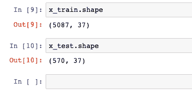

列数在测试集和训练集中都减少到 37。

现在进入下一步，我们知道目标类分布不均，一类主导另一类。因此，我们需要对数据进行重采样，以使目标类均匀分布。

解决这种类不平衡问题有 4 种方法：

+   合成新的少数类实例

+   对少数类进行过采样

+   对多数类进行欠采样

+   调整成本函数，使得对少数类实例的误分类比对多数类实例的误分类更重要。

```py
#Resampling
print("Before OverSampling, counts of label '1': {}".format(sum(y_train==1)))
print("Before OverSampling, counts of label '0': {} \n".format(sum(y_train==0)))sm = SMOTE(random_state=27, ratio = 1.0)
x_train_res, y_train_res = sm.fit_sample(x_train, y_train.ravel())print("After OverSampling, counts of label '1': {}".format(sum(y_train_res==1)))
print("After OverSampling, counts of label '0': {}".format(sum(y_train_res==0)))
```

我们使用了**SMOTE**（合成少数类过采样技术）重采样方法。这是一种过采样方法。它的作用是创建少数类的合成（而非重复）样本，从而使少数类与多数类平衡。SMOTE 通过选择相似的记录并逐列随机调整该记录，以差异范围内的随机量来实现。

```py
Before OverSampling, counts of label '1': 37
Before OverSampling, counts of label '0': 5050 

After OverSampling, counts of label '1': 5050
After OverSampling, counts of label '0': 5050
```

现在我们要构建一个模型，能够在测试数据上对系外行星进行分类。

所以我将创建一个函数`model`，它将：

1.  拟合模型

1.  执行交叉验证

1.  检查我们模型的准确性

1.  生成分类报告

1.  生成混淆矩阵

```py
def model(classifier,dtrain_x,dtrain_y,dtest_x,dtest_y):
    #fit the model
    classifier.fit(dtrain_x,dtrain_y)
    predictions = classifier.predict(dtest_x)

    #Cross validation
    accuracies = cross_val_score(estimator = classifier, X = x_train_res, y = y_train_res, cv = 5, n_jobs = -1)
    mean = accuracies.mean()
    variance = accuracies.std()
    print("Accuracy mean: "+ str(mean))
    print("Accuracy variance: "+ str(variance))

    #Accuracy
    print ("\naccuracy_score :",accuracy_score(dtest_y,predictions))

    #Classification report
    print ("\nclassification report :\n",(classification_report(dtest_y,predictions)))

    #Confusion matrix
    plt.figure(figsize=(13,10))
    plt.subplot(221)
    sns.heatmap(confusion_matrix(dtest_y,predictions),annot=True,cmap="viridis",fmt = "d",linecolor="k",linewidths=3)
    plt.title("CONFUSION MATRIX",fontsize=20)
```

始终需要验证机器学习模型的稳定性。我是说，你不能仅仅将模型拟合到训练数据上，然后希望它在从未见过的真实数据上也能准确工作。***你需要某种保证，确保模型从数据中提取了大部分模式，而且不会过多地受到噪声的影响，换句话说，它在偏差和方差上都很低。***

现在将支持向量机（SVM）算法拟合到训练集，并进行预测。

```py
from sklearn.svm import SVC
SVM_model=SVC()
model(SVM_model,x_train_res,y_train_res,x_test,y_test)
```

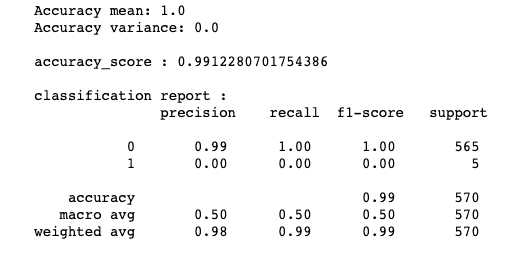

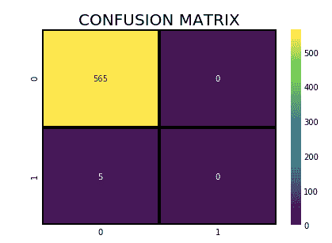

另外，尝试随机森林模型并获取特征重要性，但在此之前请在函数模型中包含以下代码。

```py
#Display feature importance   
    df1 = pd.DataFrame.from_records(dtrain_x)     
    tmp = pd.DataFrame({'Feature': df1.columns, 'Feature importance': classifier.feature_importances_})
    tmp = tmp.sort_values(by='Feature importance',ascending=False)
    plt.figure(figsize = (7,4))
    plt.title('Features importance',fontsize=14)
    s = sns.barplot(x='Feature',y='Feature importance',data=tmp)
    s.set_xticklabels(s.get_xticklabels(),rotation=90)
    plt.show()
```

并调用随机森林分类算法。

```py
from sklearn.ensemble import RandomForestClassifier
rf_classifier = RandomForestClassifier()
model(rf_classifier,x_train_res,y_train_res,x_test,y_test)
```

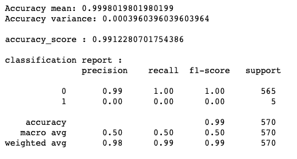

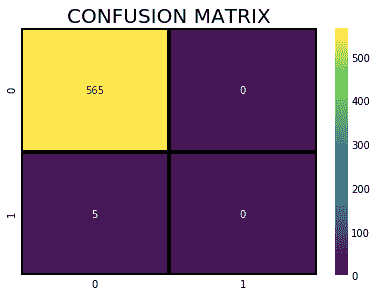

通常，**特征重要性**提供一个分数，表明每个**特征**在模型构建中的有用性或价值。属性在决策树中用于做关键决策的次数越多，它的相对**重要性**就越高。

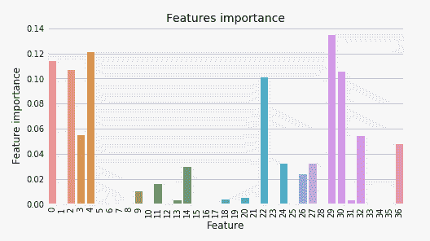

我们可以看到，我们从 SVM 和随机森林算法中得到了相当不错的结果。不过，你可以继续调整参数，并尝试其他算法，查看准确性的差异。

现在让我们尝试使用 Keras Python 库中的神经网络（ANN）解决相同的问题。

```py
from tensorflow import set_random_seed
set_random_seed(101)
from sklearn.model_selection import cross_val_score
from keras.wrappers.scikit_learn import KerasClassifier
from keras.models import Sequential # initialize neural network library
from keras.layers import Dense # build our layers library
def build_classifier():
    classifier = Sequential() # initialize neural network
    classifier.add(Dense(units = 4, kernel_initializer = 'uniform', activation = 'relu', input_dim = x_train_res.shape[1]))
    classifier.add(Dense(units = 4, kernel_initializer = 'uniform', activation = 'relu'))
    classifier.add(Dense(units = 1, kernel_initializer = 'uniform', activation = 'sigmoid'))
    classifier.compile(optimizer = 'adam', loss = 'binary_crossentropy', metrics = ['accuracy'])
    return classifierclassifier = KerasClassifier(build_fn = build_classifier, epochs = 40)
accuracies = cross_val_score(estimator = classifier, X = x_train_res, y = y_train_res, cv = 5, n_jobs = -1)
mean = accuracies.mean()
variance = accuracies.std()
print("Accuracy mean: "+ str(mean))
print("Accuracy variance: "+ str(variance))#Accuracy mean: 0.9186138613861387
#Accuracy variance: 0.07308084375906461
```

神经网络模型的准确率均值为 91.86%

在交叉验证后，准确性方差为 7.30%，这是一个相当不错的结果。

### 结论：未来

我们能够收集来自遥远星星的光，研究这些光，这些光已经旅行了数千年，并对这些星星可能拥有的潜在世界做出结论，这真是令人惊叹。

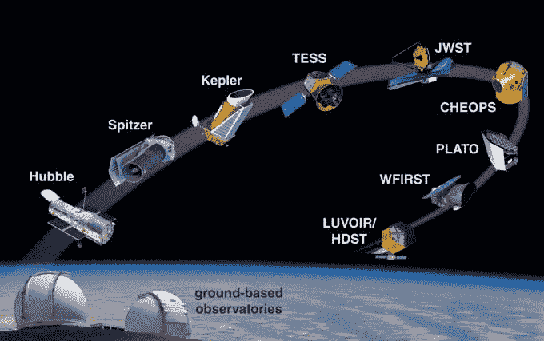

来源：[`astrobiology.nasa.gov/news/the-just-approved-european-ariel-mission-will-be-first-dedicated-to-probing-exoplanet-atmospheres/`](https://astrobiology.nasa.gov/news/the-just-approved-european-ariel-mission-will-be-first-dedicated-to-probing-exoplanet-atmospheres/)

在接下来的 10 年内，将有 30 到 40 米直径的望远镜从地球上运作，通过成像和恒星的速度变化来探测系外行星。包括 Cheops、[JWST](https://www.jwst.nasa.gov/)、Plato 和 Ariel 在内的卫星望远镜将通过凌日法探测行星。JWST 还将进行直接成像。NASA 正在设计直径为 8 到 18 米的大型空间望远镜（LUVOIR、Habex），计划在 2050 年前探测系外行星上的生命迹象。

在更远的未来，巨大的[干涉仪](https://en.wikipedia.org/wiki/Interferometry)将制作行星的详细地图。而且，可能会发射星际探测器前往最近的系外行星拍摄近距离图像。工程师们已经在研究推进技术，以达到这些遥远的目标。

所以在这篇文章中，我们使用机器学习模型和神经网络预测了系外行星的存在。

好了，以上就是这篇文章的所有内容，希望你们阅读愉快。如果这篇文章对你有所帮助，我会很高兴。欢迎在评论区分享你的意见/想法/反馈。

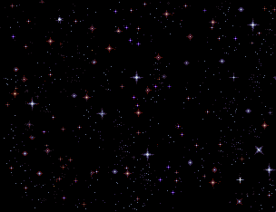

来源：[`imgur.com/gallery/qcU0h`](https://imgur.com/gallery/qcU0h)

你可以在我的[Github 仓库](https://github.com/nageshsinghc4/Exoplanet-exploration)中找到代码：

感谢阅读!!!

**个人简介：[纳戈什·辛格·乔汉](https://www.linkedin.com/in/nagesh-singh-chauhan-6936bb13b/)** 是一位数据科学爱好者。对大数据、Python、机器学习感兴趣。

[原文](https://towardsdatascience.com/exoplanet-hunting-using-machine-learning-d615958e1787)。经许可转载。

**相关内容：**

+   通过时间序列分析进行股票市场预测

+   使用 5 种机器学习算法分类稀有事件

+   利用开放数据进行地理可视化

### 更多相关内容

+   [为什么越来越多的开发者在机器学习项目中使用 Python？](https://www.kdnuggets.com/2022/01/developers-python-machine-learning-projects.html)

+   [使用 SHAP 值进行机器学习模型可解释性](https://www.kdnuggets.com/2023/08/shap-values-model-interpretability-machine-learning.html)

+   [使用基本和现代算法解决计算机科学问题](https://www.kdnuggets.com/2023/11/packt-tackle-computer-science-problems-fundamental-modern-algorithms-machine-learning)

+   [构建 GPU 机器与使用 GPU 云服务](https://www.kdnuggets.com/building-a-gpu-machine-vs-using-the-gpu-cloud)

+   [每位机器学习工程师都应该具备的 5 种机器学习技能](https://www.kdnuggets.com/2023/03/5-machine-learning-skills-every-machine-learning-engineer-know-2023.html)

+   [KDnuggets 新闻，12 月 14 日：3 门免费的机器学习课程](https://www.kdnuggets.com/2022/n48.html)
