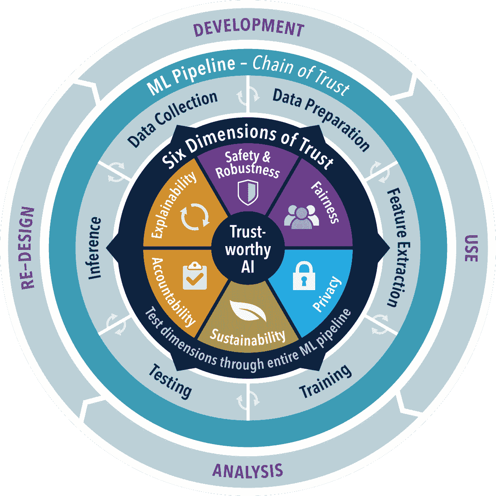
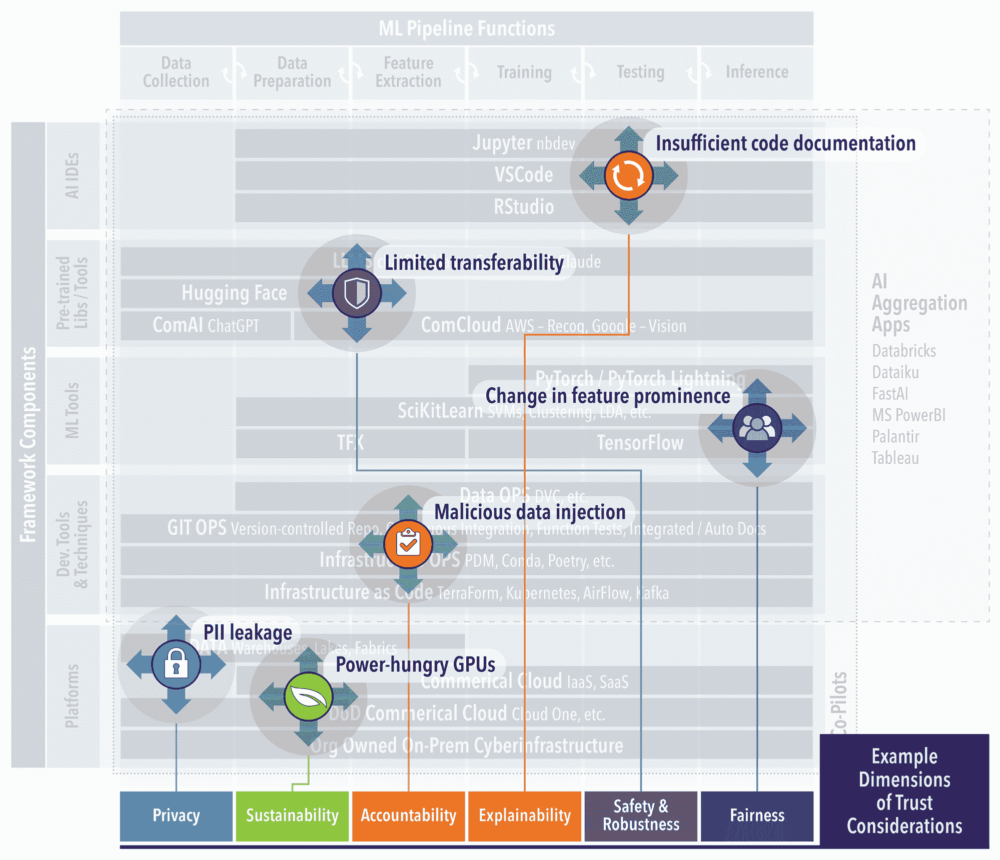

# 关于开发安全、可靠和值得信赖的 AI 框架的专家见解

> 原文：[`www.kdnuggets.com/expert-insights-on-developing-safe-secure-and-trustworthy-ai-frameworks`](https://www.kdnuggets.com/expert-insights-on-developing-safe-secure-and-trustworthy-ai-frameworks)

**作者：查尔斯·瓦德曼博士、克里斯托弗·斯威特博士和保罗·布伦纳博士**

与拜登总统最近发布的 [行政命令](https://www.whitehouse.gov/briefing-room/presidential-actions/2023/10/30/executive-order-on-the-safe-secure-and-trustworthy-development-and-use-of-artificial-intelligence/) 强调安全、可靠和值得信赖的 AI 一致，我们分享了两年研究项目中的 [可信 AI](https://la3d.github.io/nuggets/posts/frameworks-reflection/) (TAI) 经验教训。这个研究计划，如下图所示，专注于使 AI 符合严格的伦理和性能标准。这与行业日益增长的透明度和责任趋势相一致，尤其是在国家安全等敏感领域。本文反映了从传统软件工程到信任至关重要的 AI 方法的转变。

# TAI 维度应用于 ML 流水线和 AI 开发周期

# 从软件工程过渡到 AI 工程

从“软件 1.0 到 [2.0](https://karpathy.medium.com/software-2-0-a64152b37c35) 以及 3.0 的概念”的过渡需要一个可靠的基础设施，这不仅能够概念化，还能实际执行对 AI 的信任。即使是下图所示的简单 ML 组件集，也展示了必须理解的重大复杂性，以解决每个层级的信任问题。我们的 TAI 框架子项目通过提供软件和 TAI 研究产品的最佳实践的集成点，来满足这一需求。像这样的框架降低了 TAI 实施的障碍。通过自动化设置，开发人员和决策者可以将精力集中在创新和战略上，而不是处理初步复杂性。这确保了信任不是事后的考虑，而是先决条件，每个阶段从数据管理到模型部署都与伦理和操作标准本质上对齐。最终结果是一个简化的路径，能够部署在技术上先进但在战略上可靠的高风险环境中的 AI 系统。TAI 框架项目调查和利用现有的软件工具和最佳实践，这些工具和最佳实践具有开源、可持续的社区，并且可以直接在现有操作环境中利用。

# 示例 AI 框架组件及其利用

# GitOps 和 CI/CD

GitOps 已经成为 AI 工程中不可或缺的一部分，特别是在 TAI 框架下。它代表了软件开发和运维工作流管理的一种进化，提供了一种声明式的方法来进行基础设施和应用生命周期管理。这种方法对于确保持续的质量和将伦理责任融入 AI 系统至关重要。TAI 框架项目利用 GitOps 作为自动化和简化开发管道的基础组件，从代码到部署。这种方法确保了软件工程的最佳实践能够自动遵循，从而实现不可变的审计跟踪、版本控制的环境和无缝的回滚能力。它简化了复杂的部署过程。此外，GitOps 通过提供一个可以将伦理检查自动化作为 CI/CD 管道一部分的结构，促进了伦理考虑的整合。CI/CD 在 AI 开发中的采用不仅仅是为了保持代码质量；它还确保 AI 系统的可靠性、安全性以及符合预期的性能。TAI 推广了自动化测试协议，以应对 AI 的独特挑战，特别是当我们进入生成 AI 和基于提示的系统时代时。测试不再仅仅局限于静态代码分析和单元测试。它扩展到 AI 行为的动态验证，包括生成模型的输出和提示的有效性。自动化测试套件现在必须能够评估响应的准确性、相关性和安全性。

# 数据驱动和文档化

在追求 TAI 的过程中，数据驱动的方法是基础，因为它优先考虑数据的质量和清晰度，而不是算法的复杂性，从而从根本上建立信任和可解释性。在这个框架下，有一系列工具可用于维护数据完整性和可追溯性。[dvc](https://dvc.org/)（数据版本控制）因其与 GitOps 框架的契合而受到特别青睐，增强了 Git 以涵盖数据和实验管理（更多替代方案见[这里](https://neptune.ai/blog/best-data-version-control-tools)）。它为数据集和模型提供了精确的版本控制，就像 Git 对代码所做的那样，这对有效的 CI/CD 实践至关重要。这确保了为 AI 系统提供动力的数据引擎始终接收准确且可审计的数据，这是值得信赖的 AI 的先决条件。我们利用 [nbdev](https://nbdev.fast.ai/)，它通过将 Jupyter Notebooks 转变为一种文献编程和探索编程的媒介，来补充 dvc，简化了从探索性分析到良好文档化代码的过渡。软件开发的性质正在演变为这种“编程”风格，并且 AI “副驾驶”的发展加速了这种演变，帮助文档编制和 AI 应用程序的构建。[软件材料清单](https://www.cisa.gov/sbom)（SBoMs）和 AI BoMs，由像 [SPDX](https://spdx.dev/) 这样的开放标准倡导，是这一生态系统的核心部分。它们作为详细记录，补充 dvc 和 nbdev，涵盖了 AI 模型的来源、组成和合规性。SBoMs 提供了组件的全面清单，确保 AI 系统中的每个元素都被记录和验证。AI BoMs 扩展了这一概念，包括数据来源和转换过程，为 AI 应用程序中的模型和数据提供了透明度。它们共同构成了 AI 系统的完整谱系，促进了信任并帮助利益相关者理解。

# TAI 命令

以伦理和数据为中心的方法对 TAI 至关重要，确保 AI 系统既有效又可靠。我们的 TAI 框架项目利用 dvc 进行数据版本控制，利用 nbdev 进行文献编程，反映了软件工程中适应 AI 细微差别的转变。这些工具象征着一种更大的趋势，即从 AI 开发过程的开始就整合数据质量、透明度和伦理考虑。在民用和国防领域，TAI 的原则保持不变：一个系统的可靠性取决于其建立的数据和所遵循的伦理框架。随着 AI 复杂性的增加，对能够透明和伦理地处理这种复杂性的稳健框架的需求也在增加。AI 的未来，特别是在关键任务应用中，将依赖于这些以数据为中心和伦理的方法，从而巩固各领域对 AI 系统的信任。

## 关于作者

Charles Vardeman、Christopher Sweet 和 Paul Brenner 是 [圣母大学研究计算中心](https://crc.nd.edu/) 的研究科学家。他们在科学软件和算法开发方面拥有数十年的经验，专注于将技术转移到产品操作中的应用研究。他们在数据科学和网络基础设施领域拥有大量的技术论文、专利和资助的研究活动。与学生研究项目对齐的每周 TAI 知识点可以在 [这里](https://la3d.github.io/nuggets/slideindex.html) 找到。

****[Charles Vardeman 博士](https://www.linkedin.com/in/charles-vardeman-7897759)**** 是圣母大学研究计算中心的研究科学家。

### 了解更多相关主题

+   [了解如何设计、测量和实施可信的 A/B 测试……](https://www.kdnuggets.com/2023/01/sphere-design-measure-implement-trustworthy-ab-tests-ronny-kohavi.html)

+   [关于可信赖图神经网络的综合调查：……](https://www.kdnuggets.com/2022/05/comprehensive-survey-trustworthy-graph-neural-networks-privacy-robustness-fairness-explainability.html)

+   [开发分析跟踪的开放标准](https://www.kdnuggets.com/2022/07/developing-open-standard-analytics-tracking.html)

+   [一个社区正在为客户数据建模开发 Hugging Face](https://www.kdnuggets.com/2022/08/objectiv-community-developing-hugging-face-customer-data-modeling.html)

+   [为加拿大排名第一的数据 AI 会议保留座位](https://www.kdnuggets.com/2023/10/bdait-secure-your-seat-for-canadas-1-data-ai-conference)

+   [Chip Huyen 分享实施 ML 系统的框架和案例研究](https://www.kdnuggets.com/2023/02/sphere-chip-huyen-shares-frameworks-case-studies-implementing-ml-systems.html)
