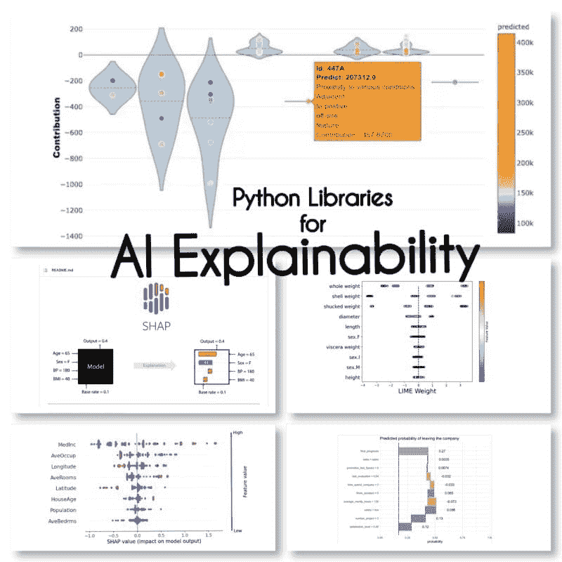

# 可解释人工智能：10 个 Python 库解密您的模型决策

> 原文：[`www.kdnuggets.com/2023/01/explainable-ai-10-python-libraries-demystifying-decisions.html`](https://www.kdnuggets.com/2023/01/explainable-ai-10-python-libraries-demystifying-decisions.html)

作者提供的图片

XAI 是一种人工智能，允许人类理解模型或系统的结果和决策过程。

* * *

## 我们的前三个课程推荐

 1\. [谷歌网络安全证书](https://www.kdnuggets.com/google-cybersecurity) - 快速进入网络安全职业生涯。

 2\. [谷歌数据分析专业证书](https://www.kdnuggets.com/google-data-analytics) - 提升您的数据分析技能

 3\. [谷歌 IT 支持专业证书](https://www.kdnuggets.com/google-itsupport) - 支持您的组织的 IT

* * *

# 解释的 3 个阶段

## 模型前解释性

可解释人工智能从可解释的数据和清晰、可解释的特征工程开始。

## 模型解释性

当选择适用于特定问题的模型时，通常最好使用最具可解释性的模型，同时仍能实现良好的预测结果。

## 模型后解释性

这包括像扰动这样的技术，即分析单个变量对模型输出的影响，如训练后的 SHAP 值。

# 人工智能解释性的 Python 库

我找到这 10 个用于人工智能解释性的 Python 库：

## SHAP (SHapley Additive exPlanations)

SHAP 是一种模型无关的方法，通过分解每个特征的贡献并为每个特征分配分数来工作。

## LIME (Local Interpretable Model-agnostic Explanations)

LIME 是另一种模型无关的方法，通过局部近似模型的行为来工作，围绕特定的预测。

## ELi5

Eli5 是一个用于调试和解释分类器的库。它提供特征重要性分数，以及 scikit-learn、Keras、xgboost、LightGBM、CatBoost 的“原因代码”。

## Shapash

Shapash 是一个 Python 库，旨在使机器学习对所有人都可解释和易于理解。 Shapash 提供几种类型的可视化，具有明确的标签。

## Anchors

Anchors 是一种生成可供人类理解的规则的方法，可以用来解释机器学习模型的预测。

## XAI (eXplainable AI)

XAI 是一个用于解释和可视化机器学习模型预测的库，包括特征重要性分数。

## BreakDown

BreakDown 是一个可以用来解释线性模型预测的工具。它通过将模型输出分解为每个输入特征的贡献来工作。

## interpret-text

interpret-text 是一个用于解释自然语言处理模型预测的库。

## iml（可解释的机器学习）

iml 目前包含 Shap 项目的接口和 IO 代码，并且可能也会为 Lime 项目提供相同的功能。

## aix360（AI Explainability 360）

aix360 包含一套全面的算法，涵盖不同的维度

## OmniXAI

OmniXAI（全称为 Omni eXplainable AI）解决了实践中解释机器学习模型所产生判断的若干问题。

我是否遗漏了任何库？

**来源**

+   [2022 年顶级可解释 AI（XAI）Python 框架](https://lnkd.in/dzvgSe24)

**[玛丽亚姆·米拉迪](https://www.linkedin.com/in/maryammiradi/)** 是一位人工智能和数据科学专家，拥有机器学习和深度学习的博士学位，专注于自然语言处理和计算机视觉。她拥有 15 年以上的经验，成功开发了超过 40 个项目。她曾为 12 家不同的组织工作，涉及金融犯罪检测、能源、银行、零售、电子商务和政府等多个行业。

### 更多相关主题

+   [更好的商业决策](https://www.kdnuggets.com/2022/04/informs-driving-better-business-decisions.html)

+   [强化学习：教计算机做出最佳决策](https://www.kdnuggets.com/2023/07/reinforcement-learning-teaching-computers-make-optimal-decisions.html)

+   [最先进的深度学习技术在可解释的预测和现在预测中的应用](https://www.kdnuggets.com/2021/12/sota-explainable-forecasting-and-nowcasting.html)

+   [揭开坏科学的面纱](https://www.kdnuggets.com/2022/01/demystifying-bad-science.html)

+   [揭开机器学习的面纱](https://www.kdnuggets.com/demystifying-machine-learning)

+   [揭开决策树在现实世界中的面纱](https://www.kdnuggets.com/demystifying-decision-trees-for-the-real-world)
