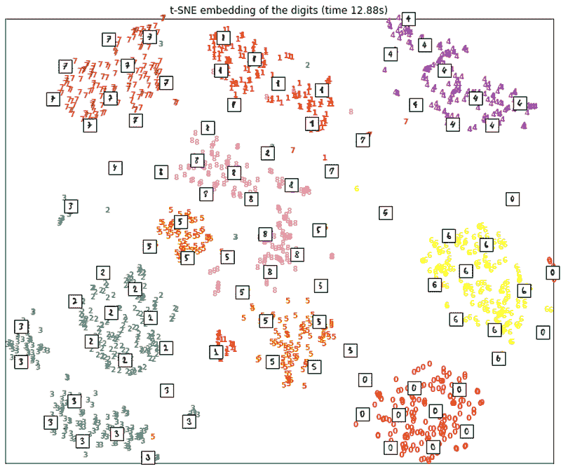
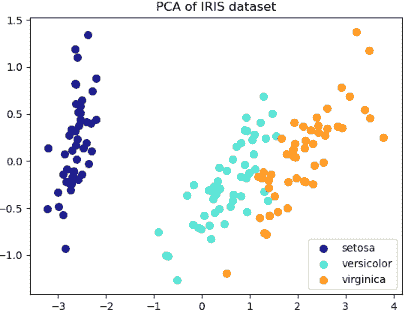
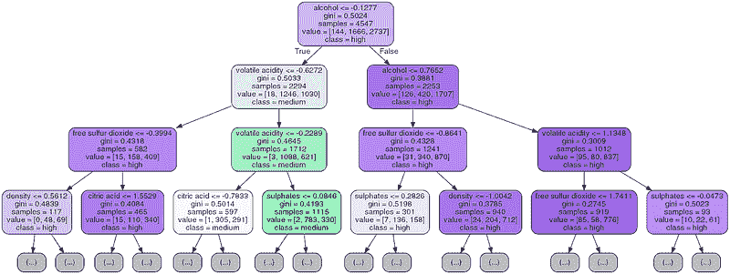
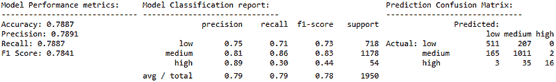
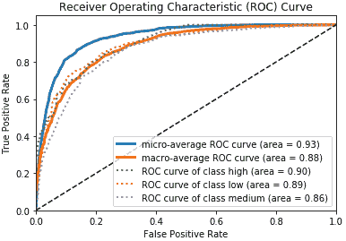
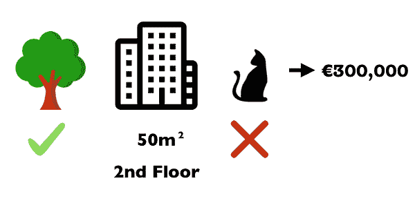
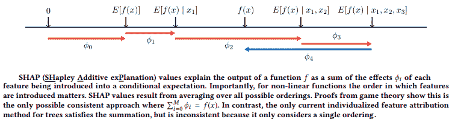
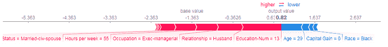

# 可解释人工智能（第二部分）——模型解释策略

> 原文：[`www.kdnuggets.com/2018/12/explainable-ai-model-interpretation-strategies.html`](https://www.kdnuggets.com/2018/12/explainable-ai-model-interpretation-strategies.html)

 评论

来源：Pixabay

### 介绍

本文是我系列文章的延续，旨在探讨 ***‘可解释人工智能（XAI）’***。如果你还没有查看第一篇文章，我强烈建议你快速浏览一下 [***‘第 I 部分——人类可解释的机器学习的重要性’***](https://towardsdatascience.com/human-interpretable-machine-learning-part-1-the-need-and-importance-of-model-interpretation-2ed758f5f476)，其中涵盖了人类可解释的机器学习的定义和重要性，以及模型解释的需求和重要性，以及其范围和标准。在本文中，我们将从中断的地方继续，并进一步扩展机器学习模型解释方法的标准，探索基于范围的解释技术。本文的目的是让你对现有的传统模型解释方法、它们的局限性和挑战有一个良好的理解。我们还将讨论经典的模型准确性与模型可解释性权衡，最后了解主要的模型解释策略。

简而言之，我们将在本文中涵盖以下几个方面。

+   传统模型解释技术

+   传统技术的挑战与局限

+   准确性与可解释性权衡

+   模型解释技术

这将为我们即将到来的详细实践指南《模型解释》第三部分做好准备，敬请关注！

### 传统模型解释技术

模型解释的核心在于找到更好理解模型决策制定政策的方法。这是为了实现公平性、问责制和透明度，使人们对在现实世界中使用这些模型充满信心，这对商业和社会有很大影响。因此，已经存在许多技术，可以用来更好地理解和解释模型。这些技术可以分为以下两个主要类别。

+   **探索性分析和可视化技术** 如 *聚类* 和 *降维*。

+   **模型性能评估指标** 如[*精确度、召回率、准确率*](https://en.wikipedia.org/wiki/Confusion_matrix)*，*[*ROC 曲线和 AUC*](https://en.wikipedia.org/wiki/Receiver_operating_characteristic)（用于分类模型）和[*决定系数（R 平方）*](https://en.wikipedia.org/wiki/Coefficient_of_determination)*，*[*均方根误差、平均绝对误差*](https://medium.com/human-in-a-machine-world/mae-and-rmse-which-metric-is-better-e60ac3bde13d)（用于回归模型）

让我们简要详细了解这些技术。

**探索性分析和可视化**

探索性分析的理念并非全新。多年来，数据可视化一直是从数据中获取潜在洞察的最有效工具之一。这些技术中的一些可以帮助我们识别数据中的关键特征和有意义的表示，这可能指示模型在决策时哪些因素对人类可解释形式的模型影响较大。

降维技术在这里非常有用，因为我们通常处理的是非常大的特征空间（维度诅咒），减少特征空间有助于我们可视化并查看哪些因素可能影响模型做出特定决策。以下是一些这些技术。

+   **降维：** [主成分分析（PCA）](https://en.wikipedia.org/wiki/Principal_component_analysis)，[自组织映射（SOM）](https://en.wikipedia.org/wiki/Self-organizing_map)，[潜在语义索引](https://nlp.stanford.edu/IR-book/html/htmledition/latent-semantic-indexing-1.html)

+   [**流形学习**](https://en.wikipedia.org/wiki/Nonlinear_dimensionality_reduction)**：** t-分布随机邻居嵌入（[t-SNE](https://distill.pub/2016/misread-tsne/)）

+   **变分自编码器：** 一种使用[变分自编码器](https://arxiv.org/pdf/1606.05908.pdf)（VAE）的自动生成方法

+   **聚类：** [层次聚类](https://en.wikipedia.org/wiki/Hierarchical_clustering)

现实问题中的一个例子可能是通过检查文本特征的语义相似性来可视化哪些特征可能对模型有影响，并使用 t-SNE 进行可视化，如下图所示。

使用 t-SNE 可视化词嵌入（来源：[*理解特征工程（第四部分）— 深度学习方法用于文本数据 — 数据科学*](https://towardsdatascience.com/understanding-feature-engineering-part-4-deep-learning-methods-for-text-data-96c44370bbfa)）

你还可以使用 t-SNE 来可视化著名的 MNIST 手写数字数据集，如下图所示。

使用 sklearn 的 t-SNE 可视化 MNIST 数据。图片由 Pramit Choudhary 和 Datascience.com 团队提供。

另一个示例是通过 PCA 进行维度缩减来可视化著名的 IRIS 数据集，如下图所示。

[主成分分析在 IRIS 数据集上的应用](http://scikit-learn.org/stable/modules/decomposition.html)

除了数据和特征的可视化外，一些更直观和可解释的模型，如决策树，帮助我们可视化它是如何做出特定决策的。下图展示了一个示例树，帮助我们以人类可解释的方式可视化具体规则。

可视化决策树模型的人类可解释规则（来源：[*Python 实用机器学习，Apress 2018*](https://github.com/dipanjanS/practical-machine-learning-with-python)）

然而，正如我们讨论的，我们可能无法为那些不像树模型那样可解释的其他模型获得这些规则。此外，巨大的决策树总是变得非常难以可视化和解释。

**模型性能评估指标**

[***模型性能评估***](https://www.cs.cornell.edu/courses/cs578/2003fa/performance_measures.pdf) 是数据科学生命周期中的关键步骤，用于选择最佳模型。这使我们能够查看模型的表现，比较各种模型的性能指标并选择最佳模型。这也使我们能够 [***调整和优化超参数***](https://en.wikipedia.org/wiki/Hyperparameter_optimization) 以获得在我们处理的数据上表现最佳的模型。通常，基于我们所处理问题的类型存在某些标准评估指标。

+   **监督学习——分类：** 对于分类问题，我们的主要目标是预测一个离散的分类响应变量。混淆矩阵在这里非常有用，我们可以从中推导出一整套有用的指标，包括准确率、精确率、召回率、F1 分数，如下例所示。

分类模型性能指标（来源：[*Python 实用机器学习，Apress 2018*](https://github.com/dipanjanS/practical-machine-learning-with-python)）

除了这些指标外，我们还可以使用一些其他技术，如 ROC 曲线和 AUC 分数，如下图中的葡萄酒质量预测系统所示。

ROC 曲线和 AUC 分数（来源：[*Python 实用机器学习，Apress 2018*](https://github.com/dipanjanS/practical-machine-learning-with-python)）

ROC 曲线下的面积是一个非常流行的技术，用于客观评估分类器的性能。在这里，我们通常尝试平衡真实正例率（TPR）和假正例率（FPR）。上述图表告诉我们，对于类别`**‘高’**`的葡萄酒，AUC 分数为`**0.9**`，这意味着模型将更高的分数分配给类别`**‘高’**`（正类）的概率为 90%，而不是类别`**非‘高’**`（负类），该类别可能是`**‘中’**`或`**‘低’**`。有时，如果 ROC 曲线交叉，结果可能会误导并难以解释（来源：[*测量分类器性能：ROC 曲线下的面积的连贯替代方法*](https://link.springer.com/article/10.1007%2Fs10994-009-5119-5)）。

+   **监督学习 — 回归：** 对于回归问题，我们可以使用标准指标，如[决定系数（R 平方）](https://en.wikipedia.org/wiki/Coefficient_of_determination)、[均方根误差（RMSE）](https://medium.com/human-in-a-machine-world/mae-and-rmse-which-metric-is-better-e60ac3bde13d)和[平均绝对误差（MAE）](https://medium.com/human-in-a-machine-world/mae-and-rmse-which-metric-is-better-e60ac3bde13d)。

+   **无监督学习 — 聚类：** 对于基于聚类的无监督学习问题，我们可以使用像[silhouette coefficient](http://scikit-learn.org/stable/modules/generated/sklearn.metrics.silhouette_score.html)、[同质性、完整性、V-measure](http://scikit-learn.org/stable/modules/clustering.html#homogeneity-completeness-and-v-measure)以及[Calinski-Harabaz 指数](http://scikit-learn.org/stable/modules/clustering.html#calinski-harabaz-index)这样的指标。

### 传统技术的局限性及对更好模型解释的动机

我们在前面讨论的技术在尝试更好地了解我们的数据、特征以及哪些模型可能有效方面确实是有帮助的。然而，它们在尝试揭示模型如何工作的人类可解释性方面相当有限。在任何数据科学问题中，我们通常在静态数据集上构建模型，并得到我们的目标函数（优化的损失函数），该模型通常在满足基于模型性能和业务需求的某些标准时被部署。通常，我们利用上述的探索性分析和评估指标来决定我们数据上模型的整体性能。然而，在现实世界中，模型的性能往往在部署后随着时间的推移而下降和趋于平稳，这可能是由于数据特征的变化、增加的约束和噪声。这可能包括环境变化、特征变化以及增加的约束。因此，仅仅在相同特征集上重新训练模型是不够的，我们需要不断检查特征在决定模型预测中的重要性以及它们在新数据点上的表现如何。

例如，一个[入侵检测系统](https://ir.library.louisville.edu/etd/2790/)(IDS)，作为一个网络安全应用，容易受到规避攻击，其中攻击者可能利用对抗性输入来击败安全系统（注意：[对抗性输入](https://arxiv.org/abs/1602.02697)是由攻击者故意设计的样本，用以欺骗机器学习模型做出错误预测）。在这种情况下，模型的目标函数可能只是对现实世界目标的一个弱近似。可能需要更好的解释来识别算法中的盲点，以通过修复易受对抗攻击影响的训练数据集来构建安全的模型（欲了解更多，请参阅 Moosavi-Dezfooli 等，2016 年，[*DeepFool*](https://arxiv.org/pdf/1511.04599.pdf) 和 Goodfellow 等，2015 年，[*Explaining and harnessing adversarial examples*](https://arxiv.org/abs/1412.6572)）。

来源：[`medium.com/@jrodthoughts/using-adversarial-attacks-to-make-your-deep-learning-model-look-stupid-24fb872f06fd`](https://medium.com/@jrodthoughts/using-adversarial-attacks-to-make-your-deep-learning-model-look-stupid-24fb872f06fd)

此外，模型中经常存在偏差，这通常与我们处理的数据特性有关，比如在稀有类别预测问题中（如欺诈或入侵检测）。指标不能帮助我们阐明模型预测决策的真实情况。此外，这些传统的模型解释形式可能对数据科学家来说容易理解，但由于其本质上是理论性和数学性的，向（非技术）业务相关者解释这些模型存在相当大的困难，并且仅依赖这些指标来决定项目的成功标准是不够的。仅告诉业务 *“我有一个准确率为 90%的模型”* 不足以让他们在实际应用中开始信任这个模型。我们需要可以通过适当和直观的输入和输出来解释的模型决策政策的人类可解释性解释（HII）。这将使有洞察力的信息可以轻松地与同事（分析师、经理、数据科学家、数据工程师）共享。利用这样的解释形式，可以基于输入和输出进行说明，可能有助于促进更好的沟通与协作，使企业能够做出更有信心的决策（例如，[金融机构的风险评估/审计风险分析](https://www.journalofaccountancy.com/issues/2006/jul/assessingandrespondingtorisksinafinancialstatementaudit.html)）。

重申一下，我们将模型解释（新方法）定义为能够考虑***公平性***（无偏见/非歧视）、***问责性***（可靠的结果）和***透明性***（能够查询和验证预测决策）——目前主要针对监督学习问题。

* * *

## 我们的三大课程推荐

 1\. [谷歌网络安全证书](https://www.kdnuggets.com/google-cybersecurity) - 快速进入网络安全职业生涯。

 2\. [谷歌数据分析专业证书](https://www.kdnuggets.com/google-data-analytics) - 提升你的数据分析能力

 3\. [谷歌 IT 支持专业证书](https://www.kdnuggets.com/google-itsupport) - 支持你的组织 IT 需求

* * *

### 相关话题

+   [你应该成为自由职业的人工智能工程师吗？](https://www.kdnuggets.com/2021/12/ucsd-become-freelance-artificial-intelligence-engineer.html)

+   [2022 年人工智能项目创意](https://www.kdnuggets.com/2022/01/artificial-intelligence-project-ideas-2022.html)

+   [人工智能与元宇宙](https://www.kdnuggets.com/2022/02/artificial-intelligence-metaverse.html)

+   [人工智能系统中的不确定性量化](https://www.kdnuggets.com/2022/04/uncertainty-quantification-artificial-intelligencebased-systems.html)

+   [人工智能如何变革数据集成](https://www.kdnuggets.com/2022/04/artificial-intelligence-transform-data-integration.html)

+   [2022 年最受欢迎的人工智能技能](https://www.kdnuggets.com/2022/08/indemand-artificial-intelligence-skills-learn-2022.html)
y 值——一种来自合作博弈论的方法——告诉我们如何公平地分配*‘支付’*给各个特征。让我们看一个说明性的例子。

假设你训练了一个机器学习模型来预测公寓价格。对于某个公寓，模型预测了 300,000 欧元，你需要解释这个预测。该公寓的*面积*为 50 平方米，位于*2 楼*，附近有*公园*，而且*禁止养猫*。所有公寓的平均预测价格是 310,000 欧元。每个特征值相对于平均预测的贡献是多少？

对于线性回归模型，答案很简单：每个特征的效果是特征的权重乘以特征值，减去所有公寓的平均效果：这仅仅是因为模型的线性特性。对于更复杂的模型，我们该怎么办？一个选项是我们刚刚讨论的 LIME。另一个解决方案来自于合作博弈论：***Shapley 值***，由 Shapley 提出，是一种根据特征对总支付的贡献分配*支付*给*玩家*的方法。玩家在一个*联盟*中合作，并从这种合作中获得一定的*收益*。

+   *‘游戏’*是数据集中单个实例的预测任务。

+   *‘收益’*是该实例的实际预测值减去所有实例的平均预测值。

+   *‘玩家’*是实例的特征值，它们合作以获得收益（即预测一个特定值）。

因此，在我们的公寓示例中，特征值`**‘允许公园’**`、`**‘禁止养猫’**`、`**‘面积-50 平方米’**`和`**‘楼层-2 楼’**`共同作用以实现 300,000 欧元的预测。我们的目标是解释实际预测（300,000 欧元）与平均预测（310,000 欧元）之间的差异：即-10,000 欧元。答案可能是：`**‘公园附近’**`贡献了 30,000 欧元；`**‘面积-50 平方米’**`贡献了 10,000 欧元；`**‘楼层-2 楼’**`贡献了 0 欧元；`**‘禁止养猫’**`贡献了-50,000 欧元。贡献总和为-10,000 欧元：即最终预测减去平均预测的公寓价格。

Shapley 值是特征值在所有可能的联盟中的平均边际贡献。联盟基本上是特征的组合，用于估算特定特征的 Shapley 值。通常，特征越多，计算量会指数增长，因此对于大规模或宽数据集计算这些值可能需要很多时间。下图展示了评估`**‘禁止养猫’**`的 Shapley 值所需的所有特征值联盟。

第一行显示了没有任何特征值的联盟。第二行、第三行和第四行显示了不同的联盟——用`**‘|’**`分隔——联盟的大小逐渐增加。对于这些联盟中的每一个，我们计算了包含和不包含`**‘cat-forbidden’**`特征值的预测公寓价格，并取其差值来获得边际贡献。Shapley 值是边际贡献的（加权）平均值。我们用公寓数据集中随机的特征值替换那些不在联盟中的特征值，以获取机器学习模型的预测。当我们对所有特征值重复计算 Shapley 值时，我们得到特征值之间的预测（减去平均值）的完整分布。SHAP 是对 Shapley 值的增强。

SHAP（SHapley Additive exPlanations）为特定预测分配每个特征一个重要性值。它的新颖组成部分包括：识别出一种新的加性特征重要性度量类别，并且理论结果表明在这个类别中存在一个具有一组期望属性的唯一解决方案。通常，SHAP 值试图将模型（函数）的输出解释为将每个特征引入条件期望的效果之和。重要的是，对于非线性函数，引入特征的顺序是重要的。SHAP 值是对所有可能排序的平均结果。博弈论的证明表明，这是唯一可能一致的方法。以下来自 KDD 18 论文，[*Consistent Individualized Feature Attribution for Tree Ensembles*](https://arxiv.org/pdf/1802.03888.pdf) 的图示很好地总结了这一点！

理解 SHAP 值

以下是使用 SHAP 解释模型在预测一个人的收入是否超过 $50K 时的决策的示例。

使用 SHAP 解释模型预测

看到模型在做出这样的决策时背后的关键驱动因素（特征）非常有趣！我们将在本系列的第三部分中通过实际示例来覆盖这一内容。

### 结论

本文应帮助你在通向可解释人工智能（XAI）的道路上迈出更明确的步伐。你现在知道了模型解释的需求和重要性，第一篇文章中提到的偏见和公平性问题。在这里，我们回顾了传统的模型解释技术，讨论了它们的挑战和局限性，并且涵盖了模型可解释性与预测性能之间的经典权衡。最后，我们查看了当前最先进的模型解释技术和策略，包括特征重要性、部分依赖图、全局代理模型、局部代理模型、LIME、Shapley 值和 SHAP。正如我之前提到的，让我们努力朝着人类可解释的机器学习和 XAI 迈进，以揭开机器学习的神秘面纱，并帮助提高对模型决策的信任。

### 下一步是什么？

在本系列的第三部分中，我们将详细介绍使用本文所学的所有新技术来构建和解释机器学习模型的全面指南。我们将使用几个最先进的模型解释框架。

+   最新最先进的模型解释框架的实操指南

+   使用框架如 ELI5、Skater 和 SHAP 的特点、概念和示例

+   探索概念并查看它们的实际应用——特征重要性、部分依赖图、代理模型、LIME、SHAP 值的解释和说明

+   在一个监督学习示例中进行实操的机器学习模型解释

敬请关注，这将变得更加有趣和激动人心！

查看[***‘第一部分——人类可解释机器学习的重要性’***](https://towardsdatascience.com/human-interpretable-machine-learning-part-1-the-need-and-importance-of-model-interpretation-2ed758f5f476)，它涵盖了人类可解释机器学习的什么和为什么，以及模型解释的需求和重要性，及其范围和标准，以防你还没看过！

感谢[DataScience.com](https://www.datascience.com/)的所有优秀人士，特别是[*Pramit Choudhary*](https://www.linkedin.com/in/pramitc/?lipi=urn%3Ali%3Apage%3Ad_flagship3_search_srp_top%3Bi7sMwalBRG69UVr8ck4n%2BA%3D%3D&licu=urn%3Ali%3Acontrol%3Ad_flagship3_search_srp_top-search_srp_result&lici=LV1csX2ATFSqPNbcebrjvQ%3D%3D)为构建出色的模型解释框架[***Skater***](https://www.datascience.com/resources/tools/skater)而付出的努力，并为本系列提供了出色的内容。

我在我的书[***“Python 实用机器学习”***](https://github.com/dipanjanS/practical-machine-learning-with-python)中涵盖了大量的机器学习模型解释示例。代码是开源的，供你使用！

有反馈吗？或者有兴趣与我合作研究、数据科学、人工智能，甚至在[***TDS***](https://towardsdatascience.com/)上发布文章？你可以通过[**LinkedIn**](https://www.linkedin.com/in/dipanzan/)与我联系。

**个人简介：[Dipanjan Sarkar](https://www.linkedin.com/in/dipanzan)** 是一位@Intel 的数据科学家、作者、@Springboard 的导师、作家，以及体育和情景喜剧爱好者。

[原文](https://towardsdatascience.com/explainable-artificial-intelligence-part-2-model-interpretation-strategies-75d4afa6b739)。经授权转载。

**相关：**

+   人类可解释的机器学习（第一部分） — 模型解释的必要性和重要性

+   情感和情绪分析：实践者的 NLP 指南

+   命名实体识别：实践者的 NLP 指南

* * *

## 我们的前三名课程推荐

 1\. [谷歌网络安全证书](https://www.kdnuggets.com/google-cybersecurity) - 快速进入网络安全职业轨道

 2\. [谷歌数据分析专业证书](https://www.kdnuggets.com/google-data-analytics) - 提升您的数据分析技能

 3\. [谷歌 IT 支持专业证书](https://www.kdnuggets.com/google-itsupport) - 支持您的组织进行 IT 工作

* * *

### 相关话题

+   [你应该成为一名自由职业的人工智能工程师吗？](https://www.kdnuggets.com/2021/12/ucsd-become-freelance-artificial-intelligence-engineer.html)

+   [2022 年人工智能项目创意](https://www.kdnuggets.com/2022/01/artificial-intelligence-project-ideas-2022.html)

+   [人工智能与元宇宙](https://www.kdnuggets.com/2022/02/artificial-intelligence-metaverse.html)

+   [基于人工智能的系统中的不确定性量化](https://www.kdnuggets.com/2022/04/uncertainty-quantification-artificial-intelligencebased-systems.html)

+   [人工智能如何改变数据集成](https://www.kdnuggets.com/2022/04/artificial-intelligence-transform-data-integration.html)

+   [2022 年最受欢迎的人工智能技能](https://www.kdnuggets.com/2022/08/indemand-artificial-intelligence-skills-learn-2022.html)
