# 类别数据分析

> 原文：[`www.kdnuggets.com/2020/07/exploratory-data-analysis-steroids.html`](https://www.kdnuggets.com/2020/07/exploratory-data-analysis-steroids.html)

评论

**作者 [Diego Lopez Yse](https://www.linkedin.com/in/lopezyse/)，数据科学家**


* * *

## 我们的前三个课程推荐

 1\. [Google 网络安全证书](https://www.kdnuggets.com/google-cybersecurity) - 快速进入网络安全职业道路。

 2\. [Google 数据分析专业证书](https://www.kdnuggets.com/google-data-analytics) - 提升你的数据分析技能

 3\. [Google IT 支持专业证书](https://www.kdnuggets.com/google-itsupport) - 支持你所在的组织的 IT

* * *

机器学习讨论通常集中在算法及其性能上：如何提高模型准确性或减少错误率、在特征工程方面表现出色或微调超参数。但在任何事情之前有一个概念：探索性数据分析，或称 EDA。

**EDA 是在我们开始使用任何模型之前对数据进行理解。** 这完全有道理，对吧？如果我们还不了解我们的数据，我们将使用什么模型呢？

> 在机器学习模型出现之前，就有了 EDA

这是数据科学中的一个核心方面，有时会被忽视。你所做的任何事情的第一步都应该是**了解你的数据**：理解它，与之熟悉。你试图从数据中得到什么答案？你使用了哪些变量，它们是什么意思？从统计的角度来看它是什么样的？数据格式是否正确？是否有缺失值？是否有重复值？异常值呢？

随着数据量的增加，这个概念变得更加重要：想象一下尝试解析成千上万或数百万条记录并理解它们。接下来，我想分享我的 Python 方法，以最有效的方式回答这些问题。

### 描述数据集

对于这篇文章，我使用了世界银行的经济数据集，描述了一些全球关键因素，如 GDP、人口水平、面积等。你可以在[这里](https://github.com/dlopezyse/Medium)找到数据集和完整代码。

首先，我们需要导入一些库：

```py
import pandas as pd
import numpy as np
import seaborn as sns
import xlrd
```

**Pandas**、**Numpy** 和 **Seaborn** 在任何 EDA 练习中都是关键的。由于我们使用的是 Excel 文件作为数据源，因此“xlrd”包仅在我们的示例中需要。

现在，让我们导入数据集：

```py
df = pd.read_excel(“wbdata.xlsx”)
```

看一下数据：

```py
df.head()
```

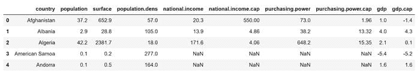

```py
df.describe()
```

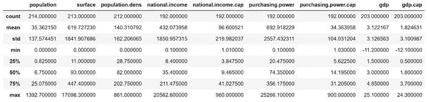

数据集中数值变量的一些基本统计信息。

```py
df.shape
```

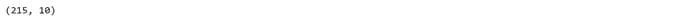

查看数据集结构的一种快速方法：215 行和 10 列。

```py
df.dtypes
```

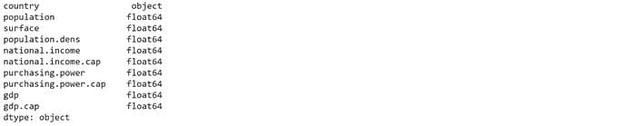

检查变量类型：除了国家名称是字符串，其余都是浮点数。有关如何更改变量类型的教程，请访问[这里](https://pbpython.com/pandas_dtypes.html)。

```py
df.info()
```

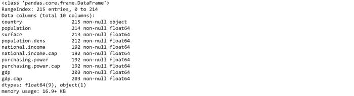

在这里我们看到一些变量有空值（例如，“人口”变量有 1 行缺失值，“面积”有 2 行，等等）。我们将看到如何处理这些空值。

### 缺失值

缺失值可能由不同原因引起，如数据输入错误或记录不完整。这非常常见，并可能对从数据中得出的结论产生重大影响。

我们已经看到这个数据集有几个缺失值，但让我们看看如何测试任何数据集。你可能想问的第一个问题是：是否有缺失值？

```py
print(df.isnull().values.any())
```


接下来，你可能想检查它们有多少：

```py
print(df.isnull().sum().sum())
```

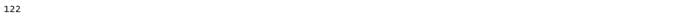

现在，让我们回顾一下这些缺失值的总结

```py
print(df.isnull().sum())
```

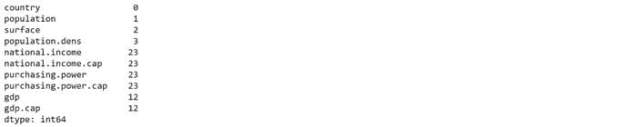

你看到什么熟悉的东西吗？这就是.info() 函数的另一面。处理缺失值有不同的策略，没有一种通用的方法。对于这个例子，我们将丢弃这些缺失值，因为进行填补没有意义：

```py
df1 = df.copy()df1.dropna(inplace=True)
```

我们回顾一下新数据集：

```py
df1.info()
```

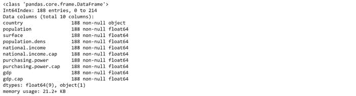

188 条记录仍然存在，没有空值。现在我们准备继续前进。

你可以在[这里](https://towardsdatascience.com/how-to-handle-missing-data-8646b18db0d4)找到处理缺失值的其他方法。

### 可视化

让我们用 Seaborn 可视化新的数据集：

```py
sns.pairplot(df1)
```

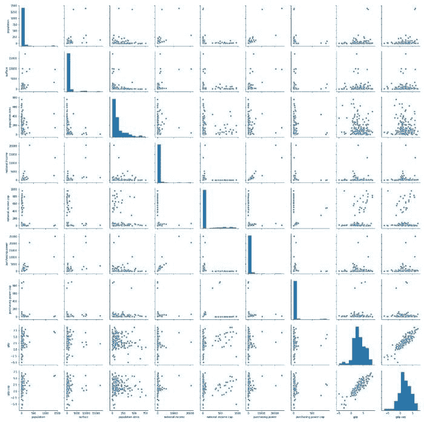

这样你可以快速识别异常值、聚类和变量之间明显的相关性。

让我们结合“gdp”和“人口”变量：

```py
sns.scatterplot(x='gdp.cap', y='population', data=df1, hue='population')
```

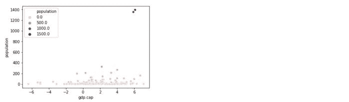

你看到右上角的两个明显的异常值了吗？有两个国家的总人口水平与其他数据有极端的差异。你可以通过单独分析“人口”变量来验证这个观察结果：

```py
sns.kdeplot(df1[‘population’], shade=True, color=’orangered’)
```

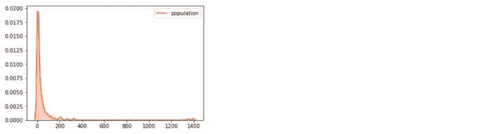

检测异常值的另一种方法是绘制箱线图：

```py
df1.plot(kind=’box’, subplots=True, layout=(3,3), sharex=False, sharey=False, figsize=(20, 20), color=’deeppink’)
```

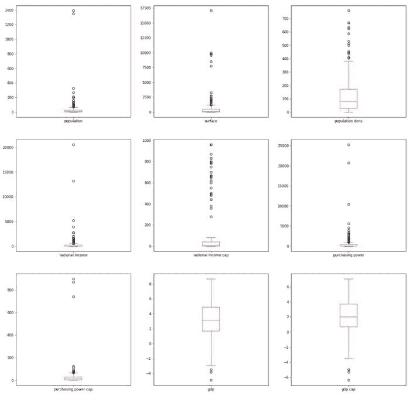

你还可以展示这些变量的密度图并分析它们的偏态：

```py
df1.plot(kind=’density’, subplots=True, layout=(3,3), sharex=False, figsize=(20, 20))
```

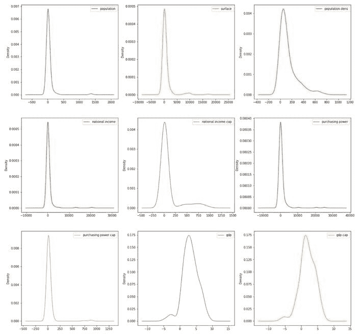

查看这个[链接](https://python-graph-gallery.com/100-calling-a-color-with-seaborn/)获取额外的 Seaborn 样式提示。

在这个例子中，我故意没有处理**异常值**，但有多种方法可以处理它们。你可以在[这里](https://www.pluralsight.com/guides/cleaning-up-data-from-outliers)找到一些异常值识别和处理的例子。

### 相关性

相关变量将节省你大量的分析时间，而且这是在对数据进行任何假设之前的必要步骤。相关性仅计算数值变量，因此了解数据集中的变量类型非常重要。

你可以在[这里](https://www.analyticsvidhya.com/blog/2016/12/introduction-to-feature-selection-methods-with-an-example-or-how-to-select-the-right-variables/)找到其他非数值变量的系数。

```py
mask = np.tril(df1.corr())
sns.heatmap(df1.corr(), fmt=’.1g’, annot = True, cmap= ‘cool’, mask=mask)
```

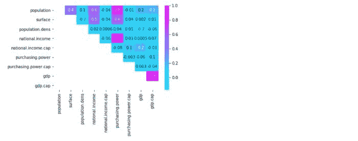

我已遮蔽了左下角的值，以避免重复并提供更清晰的视图。右侧的值刻度也提供了一个快速参考指南，用于极端值：你可以轻松发现变量之间的高相关性和低相关性（例如，“国民收入”与“购买力”具有高度正相关性）

在[这里](https://heartbeat.fritz.ai/seaborn-heatmaps-13-ways-to-customize-correlation-matrix-visualizations-f1c49c816f07)找到更多自定义相关矩阵的方法。

### 最后的思考

探索性数据分析对理解任何数据集至关重要。在这里，你可以提供见解并做出发现。这里是你将知识付诸实践的地方。

但探索性数据分析需要大量的准备工作，因为现实世界中的数据很少是干净和同质的。人们常说，[80%的数据科学家的宝贵时间都花在寻找、清理和组织数据上](https://www.ibm.com/cloud/blog/ibm-data-catalog-data-scientists-productivity)，剩下的 20%才用于实际分析。

与此同时，**完美是善的敌人**，你需要在有限的时间内推动你的见解。为分析准备数据是不可避免的，而你如何做将决定你的探索性数据分析的质量。

对这些话题感兴趣？在[Linkedin](https://www.linkedin.com/in/lopezyse/)或[Twitter](https://twitter.com/lopezyse)上关注我

**简历：[Diego Lopez Yse](https://www.linkedin.com/in/lopezyse/)**是一位拥有不同领域（资本市场、生物技术、软件、咨询、政府、农业）国际背景的经验丰富的专业人士。始终是团队成员。擅长商业管理、分析、金融、风险、项目管理和商业运营。拥有数据科学和企业金融硕士学位。

[原文](https://towardsdatascience.com/exploratory-data-analysis-on-steroids-e1488324fbaa)。已获得许可转载。

**相关：**

+   如何准备你的数据

+   数据科学项目准备的奇妙四步

+   时间复杂度：如何衡量算法的效率

### 更多相关主题

+   [停止学习数据科学以寻找目标，并寻找目标以…](https://www.kdnuggets.com/2021/12/stop-learning-data-science-find-purpose.html)

+   [数据科学学习统计的顶级资源](https://www.kdnuggets.com/2021/12/springboard-top-resources-learn-data-science-statistics.html)

+   [成功数据科学家的 5 个特征](https://www.kdnuggets.com/2021/12/5-characteristics-successful-data-scientist.html)

+   [每个数据科学家都应该知道的三个 R 库（即使你使用 Python）](https://www.kdnuggets.com/2021/12/three-r-libraries-every-data-scientist-know-even-python.html)

+   [一个 90 亿美元的 AI 失败案例分析](https://www.kdnuggets.com/2021/12/9b-ai-failure-examined.html)

+   [是什么使 Python 成为初创公司的理想编程语言](https://www.kdnuggets.com/2021/12/makes-python-ideal-programming-language-startups.html)
