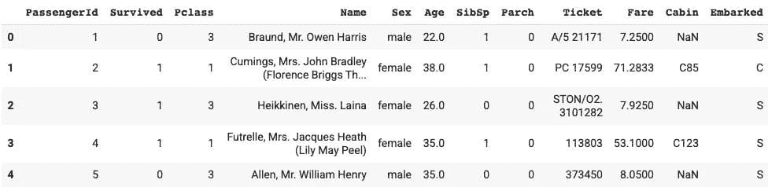
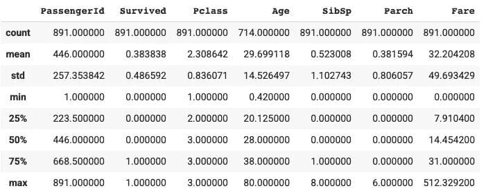
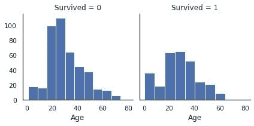
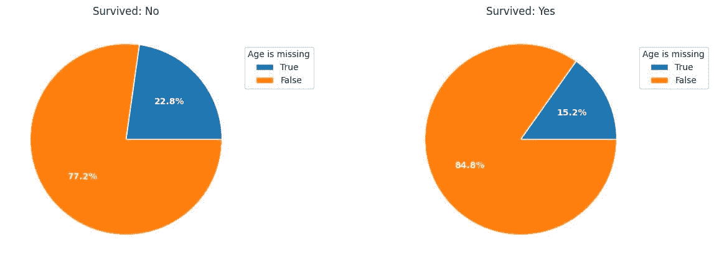

# 探索性数据分析技术针对非结构化数据

> 原文：[`www.kdnuggets.com/2023/05/exploratory-data-analysis-techniques-unstructured-data.html`](https://www.kdnuggets.com/2023/05/exploratory-data-analysis-techniques-unstructured-data.html)


作者提供的图片

探索性数据分析是机器学习开发生命周期中至关重要的阶段之一，在进行任何实际数据分析项目时，这个阶段几乎占据了整个项目时间的 50-60%。因为我们需要处理的原始数据必须在应用机器学习算法之前进行处理，以获得最佳性能。此步骤必须包括以下内容：

1.  这涉及更好地分析和总结数据集，以理解其潜在的模式、关系和趋势。

1.  这使分析师能够识别重要的数据特征，检测异常值或离群点，并确定预测未来结果的最合适建模技术。

* * *

## 我们的前三大课程推荐

 1\. [Google 网络安全证书](https://www.kdnuggets.com/google-cybersecurity) - 快速进入网络安全职业生涯。

 2\. [Google 数据分析专业证书](https://www.kdnuggets.com/google-data-analytics) - 提升你的数据分析能力

 3\. [Google IT 支持专业证书](https://www.kdnuggets.com/google-itsupport) - 支持你组织的 IT 部门

* * *

让我们通过一个故事来理解 EDA 在数据分析中的重要性。

# 通过一个故事理解 EDA 的重要性

从前，一家小公司刚刚在市场上开展业务。该公司拥有一组对其角色充满热情的专业人员，他们以一种能使整个公司获利的方式工作。随着公司在员工或产品用户方面的增长，管理团队意识到他们需要帮助来理解用户或客户对公司提供的产品或服务的需求和行为。

为了克服这个问题，他们开始招聘一些技术专业人员。最终，他们找到了一位数据分析师来更好地理解客户数据。该分析师能够从数据中找到重要信息或洞察。他们雇佣的分析师在类似类型的技术或项目中有很好的实际操作经验，主要工作于探索性数据分析。

因此，对于这个问题，他们开始以伦理的方式通过网络抓取从多个 API 收集数据，包括公司网站、社交媒体账号、论坛等。在数据收集之后，他们开始清理和处理数据，以便能够从中发现一些见解。他们使用了统计技术，如假设检验和商业智能工具，来探索数据并使用模式识别技术揭示隐藏的模式。

在创建了数据管道后，他们观察到公司客户最感兴趣的是购买环保和可持续的产品。基于这些见解，公司管理层推出了环保和可持续产品。因此，基于这些更新，新产品受到客户的欢迎，公司收入也开始增长。管理层开始意识到探索性数据分析的重要性，并雇佣了更多的数据分析师。

因此，在这篇文章中，受上述故事的启发，我们将了解数据管道中探索性数据分析阶段的不同技术，并使用这一过程中的流行工具，通过这些工具你可以为你的公司发现价值连城的见解。本文为初学者和经验丰富的数据分析师提供了 EDA 及其在数据科学中重要性的全面概述。

# 实施的不同技术

为了理解 EDA 中使用的每种技术，我们将通过一个数据集并使用 Python 数据科学库（如 NumPy、Pandas、Matplotlib 等）来实现它。

我们将在分析中使用的数据集是 Titanic 数据集，可以从[这里](https://www.kaggle.com/c/titanic/data)下载。我们将使用 train.csv 进行模型训练。

## 1\. 导入必要的库和依赖项

在实施之前，首先让我们导入将要使用的不同 EDA 技术所需的库，包括

1.  用于矩阵操作的 NumPy，

1.  用于数据分析的 Pandas，和

1.  用于数据可视化的 Matplotlib 和 Seaborn。

```py
import numpy as np
import pandas as pd
import matplotlib.pyplot as plt
import seaborn as sb
```

## 2\. 加载和分析数据集

在导入所有必要的库之后，我们将使用 Pandas 数据框加载 Titanic 数据集。然后，我们可以开始执行不同的数据预处理技术，以准备数据进行进一步建模和概括。

```py
passenger_data = pd.read_csv('titanic.csv')
passenger_data.head(5)
```

**输出：**



图 1 | 图片来源：作者

## 3\. 获取统计摘要

以下分析提供了数据中所有数值列的统计信息。我们可以从这个函数中获得的统计信息有：

1.  计数，

1.  平均值和中位数

1.  标准差

1.  最小值和最大值

1.  不同四分位数值

```py
passenger_data.describe()
```

**输出：**



图 2 | 图片来源：作者

通过解释上述输出，我们可以看到共有 891 名乘客，平均生存率为 38%。年龄列的最小值和最大值在 0.42 到 80 之间，平均年龄约为 30 岁。此外，至少 50%的乘客没有兄弟姐妹/配偶，至少 75%的乘客没有父母/孩子，票价列的值变化很大。

让我们尝试通过从头编写代码来计算生存率。

## 4\. 计算乘客的总体生存率

为了计算总体生存率，我们首先选择“Survived”列，检查值为 1 的行，然后计算所有这些行的数量。最后，为了找到百分比，我们将其除以总行数并打印出来。

```py
survived_data = passenger_data[passenger_data['Survived'] == 1]
survived = survived_data.count().values[1]
survival_percent = (survived/891) * 100
print('The percentage of survived people in training data are {}'.format(survival_percent))
```

## 输出：

```py
The percentage of survived people in training data are 38.38383838383838
```

## 5\. 按性别和“Pclass”列计算生存率

现在，我们需要使用一个聚合操作符来查找不同列的生存率，我们将使用“gender”和“Pclass”列，然后应用均值函数来找到并打印出来。

```py
survival_rate = passenger_data[['Pclass', 'Sex','Survived']].groupby(['Pclass', 'Sex'], as_index = False).mean().sort_values('Survived', ascending = False)
print(survival_rate)
```

## 输出：

```py
 Pclass     Sex  Survived
0       1  female  0.968085
2       2  female  0.921053
4       3  female  0.500000
1       1    male  0.368852
3       2    male  0.157407
5       3    male  0.135447
```

## 6\. 将 Passenger Id、Survived 和 Pclass 的数据类型更改为字符串

由于某些列的数据类型不同，我们将所有这些列转换为固定的数据类型，即字符串。

```py
Cols = [ 'PassengerId', 'Survived', 'Pclass' ]
for index in Cols:
     passenger_data[index] = passenger_data[index].astype(str)
passenger_data.dtypes
```

## 7\. 数据集中的重复行

在进行数据建模时，如果存在重复行，我们的性能可能会降低。因此，建议始终删除重复行。

```py
passenger_data.loc[passenger_data.duplicated(), :]
```

## 8\. 创建直方图以检查数据分布

为了找出基于该列可能值的生存列分布，以便检查类别偏差，如果存在任何问题，我们可以应用如过采样、欠采样、SMOTE 等技术来克服这些问题。

```py
sb.set_style("white")
g = sb.FacetGrid(data = train[train['Age'].notna()], col = 'Survived')
g.map(plt.hist, "Age");
```

**输出：**



图 3 | 作者提供的图片

现在，如果我们比较上述两个分布，那么建议使用相对频率而不是绝对频率，通过使用累计密度函数等。由于我们以 Age 列为例，绝对频率的直方图显示 20-30 岁年龄组的受害者明显多于幸存者。

## 9\. 绘制按生存情况的年龄缺失值百分比

在这里，我们创建了饼图来找出按生存值划分的缺失值百分比，然后查看分区情况。

```py
dt0 = train['Age'][train['Survived']=='0']
dt1 = train['Age'][train['Survived']=='1']
plt.figure(figsize = [15, 5])

plt.subplot(1, 2, 1)
age_na_pie(dt0)
plt.title('Survived: No');

plt.subplot(1, 2, 2)
age_na_pie(dt1)
plt.title('Survived: Yes');
```

**输出：**



图 4 | 作者提供的图片

饼图显示，年龄缺失的乘客更可能成为受害者。

## 10\. 查找每列的缺失值数量

```py
passenger_data.isnull().sum()
```

从输出中，我们观察到“Cabin”列有最多的缺失值，因此我们将从分析中删除该列。

## 11\. 每列的空值百分比

```py
passenger_data.isna().sum()/passenger_data.shape[0]
```

在年龄列中，大约 20%的数据缺失，Cabin 列中的数据缺失率约为 77%，Embarked 列中的数据缺失率为 0.2%。我们的目标是在建模之前处理缺失数据。

## 12. 从数据集中删除“Cabin”列

删除 Cabin 列，因为它有许多缺失值。

```py
drop_column = passenger_data.drop(labels = ['Cabin'], axis = 1)
print(drop_column)
```

为了处理“年龄”列，首先，我们将检查年龄列的数据类型，并将其转换为整数数据类型，然后用年龄列的中位数填补所有缺失值。

```py
datatype = passenger_data.info('Age')
fill_values = passenger_data['Age'].fillna(int(passenger_data['Age'].median()),inplace=True)
print(fill_values)
```

经过这些步骤，我们的数据集在缺失值、异常值等方面看起来很好。现在，如果我们应用机器学习算法来发现数据集中的模式，然后在测试数据上进行测试，模型的表现将比没有进行预处理和探索性数据分析或数据清洗的数据要好。

## 从 EDA 中获得的总结性见解

下面是幸存者的特征与受害者的比较。

1.  幸存者可能有父母或子女陪伴；与其他人相比，他们的票价更贵。

1.  儿童比所有年龄组的受害者更有可能幸存。

1.  年龄缺失的乘客不太可能成为幸存者。

1.  拥有更高 pclass（SES）的乘客更有可能幸存。

1.  女性比男性更有可能幸存。

1.  Cherbourg 的乘客比 Queenstown 和 Southampton 的乘客有更高的生存机会。

你可以在这里找到完整代码的 Colab 笔记本 - [Colab Notebook](https://colab.research.google.com/drive/1ZCpu-gUjz9oMZA9Y36rIKYFpFz46qv5k?usp=sharing)。

# 结论

这结束了我们的讨论。当然，探索性数据分析（EDA）中还有许多技术超出了我在这里所覆盖的内容，这取决于我们在问题陈述中使用的数据集。总之，了解你的数据，在用它来训练模型之前进行 EDA 是有益的。这种技术在任何数据科学项目中都起着至关重要的作用，使我们的简单模型在项目中表现更好。因此，每位有志成为数据科学家、数据分析师、机器学习工程师和分析经理的人都需要充分掌握这些技术。

直到那时，请继续阅读和学习。如果有任何问题或建议，请随时通过 Linkedin 与我联系。

**[Aryan Garg](https://www.linkedin.com/in/aryan-garg-1bbb791a3/)** 是一名电气工程专业的本科生，目前在本科学习的最后一年。他对网页开发和机器学习领域感兴趣。他已经追求了这个兴趣，并渴望在这些方向上进一步发展。

### 更多相关话题

+   [掌握 SQL、Python、数据清洗、数据整理和探索性数据分析的指南集合](https://www.kdnuggets.com/collection-of-guides-on-mastering-sql-python-data-cleaning-data-wrangling-and-exploratory-data-analysis)

+   [数据科学家探索性数据分析的必备指南](https://www.kdnuggets.com/2023/06/data-scientist-essential-guide-exploratory-data-analysis.html)

+   [掌握探索性数据分析的 7 个步骤](https://www.kdnuggets.com/7-steps-to-mastering-exploratory-data-analysis)

+   [非结构化数据：2022 年分析的必备条件](https://www.kdnuggets.com/2022/01/unstructured-data-analytics-2022.html)

+   [通过 LLMs 将非结构化数据转化为结构化数据](https://www.kdnuggets.com/2023/06/predibase-unstructured-structured-data-llms.html)

+   [将非结构化数据转化为结构化洞察的 5 种方法](https://www.kdnuggets.com/5-ways-of-converting-unstructured-data-into-structured-insights-with-llms)
