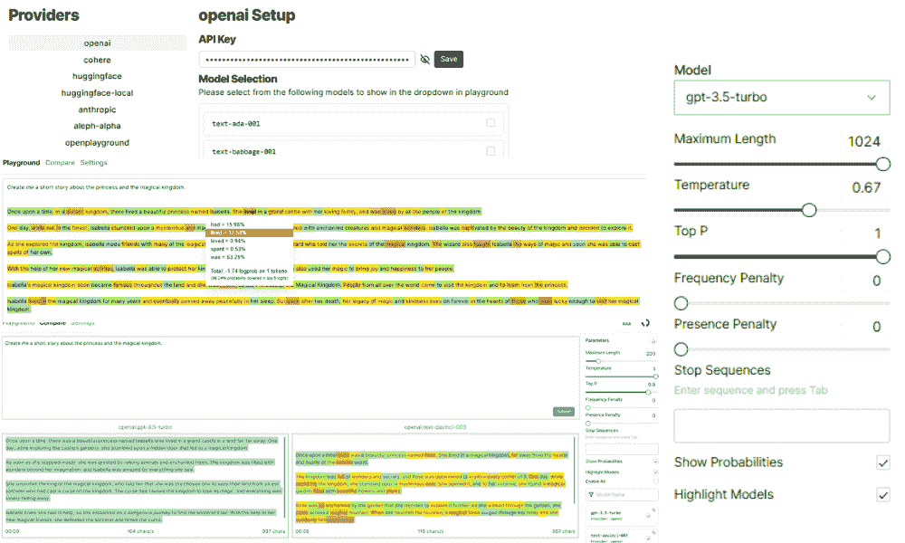
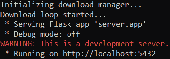
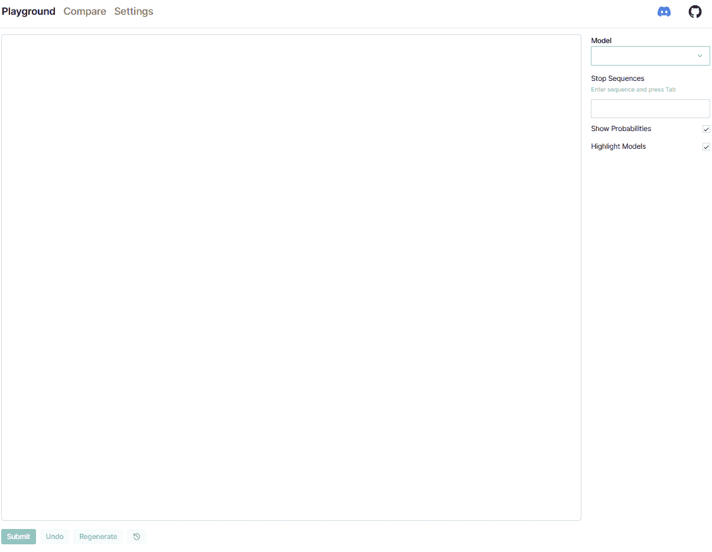
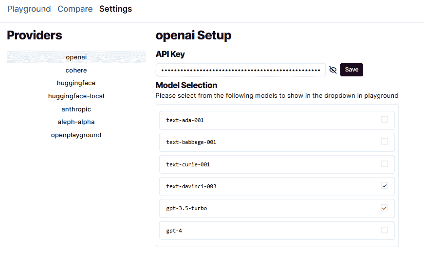
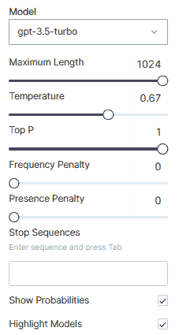
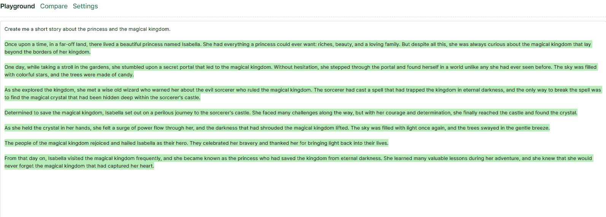
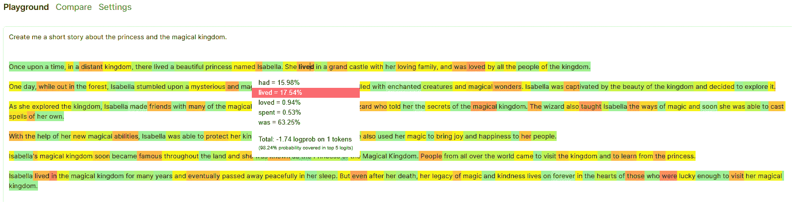
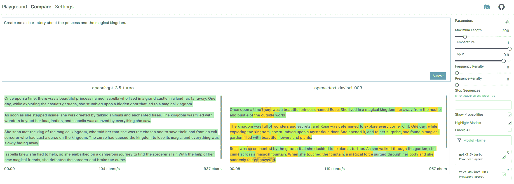

# 轻松在笔记本电脑上探索 LLMs

> 原文：[`www.kdnuggets.com/2023/04/explore-llms-easily-laptop-openplayground.html`](https://www.kdnuggets.com/2023/04/explore-llms-easily-laptop-openplayground.html)



图片由编辑提供

大型语言模型（LLM）是一个深度学习语言模型，旨在理解、解释和生成自然语言；它通常由数百万到数十亿个神经网络参数组成，并通过自我监督进行训练。著名的 LLM 包括 GPT-4、BERT 和 LLAMA。

* * *

## 我们的三大课程推荐

 1\. [Google 网络安全证书](https://www.kdnuggets.com/google-cybersecurity) - 快速进入网络安全职业生涯。

 2\. [Google 数据分析专业证书](https://www.kdnuggets.com/google-data-analytics) - 提升你的数据分析技能

 3\. [Google IT 支持专业证书](https://www.kdnuggets.com/google-itsupport) - 支持你的组织的 IT

* * *

访问 LLM 有时比较棘手，因为我们必须遵守环境要求和规格，这成为学习 LLM 的门槛。幸运的是，我们可以使用一个名为 [openplayground](https://github.com/nat/openplayground) 的 Python 包，在我们的笔记本电脑上高效地实验各种 LLM。

什么是 openplayground，我们如何从中受益？让我们进一步探索。

# 探索 openplayground

Python 包 openplaygorund 自我介绍为一个可以在笔记本电脑上运行的 LLM 游乐场，它们说得对。它是一个我们可以实验模型、调整参数、进行模型比较，并通过友好的用户界面追踪日志历史的游乐场。它们还使用来自多个实体的著名 LLM，如 OpenAI、HuggingFace 等。

我们如何开始使用 openplaygorund？让我们从安装软件包开始。

```py
pip install openplayground
```

然后在终端中运行以下命令。

```py
openplayground run
```

在终端中，你将获得以下信息。



图片由作者提供

openplayground 正在运行，你必须访问本地主机以使用游乐场用户界面。



图片由作者提供

在用户界面中，你会看到三个部分：Playground、Compare 和 Settings。我们首先去 Settings 选项卡，因为在提供必要信息之前我们无法进行工作。

当你打开设置时，会有一个“提供者”部分供你选择。对于本文示例，我们将使用来自 OpenAI 的提供者。点击 OpenAI 并提供 API 密钥，以便所有模型都可以在 openplayground 中访问，如下图所示。



图片来源：作者

启用你想要的模型，然后返回到 Playground 标签页。当你已经选择了一个模型时，右侧会有额外的参数可以调整。



图片来源：作者

这些参数使我们可以轻松地探索和实验 LLM 模型的结果。让我们尝试一个简单的提示：“给我创建一个关于公主和魔法王国的短篇故事。”



图片来源：作者

生成的文本会显示为绿色。如果启用“显示概率”，你可以获取令牌生成的概率（如果模型允许）。例如，‘text-DaVinci-03’ 模型可以显示这些概率。让我们再次提交提示，并查看结果。



图片来源：作者

将鼠标悬停在令牌上会显示令牌出现的概率有多高。此外，还有关于前 5 个令牌的信息，这些令牌可能成为生成的文本。

进入“比较”标签页，我们可以比较使用相同参数生成的各种 LLM 模型文本。让我们尝试使用与之前示例相同的提示。



图片来源：作者

“比较”标签提供了生成文本的两个或更多不同 LLM 模型的信息。信息包括令牌、模型生成文本的速度、所花时间和字符数。

尝试使用来自多个提供商的各种模型进行实验，以便从使用 openplayground 中获得更多价值。

# 结论

大型语言模型（LLM）是一个能够理解、解释和生成文本的模型。通过 openplayground，我们可以拥有一个简单的用户界面来探索和实验多个 LLM。

**[Cornellius Yudha Wijaya](https://www.linkedin.com/in/cornellius-yudha-wijaya/)** 是一位数据科学助理经理和数据撰写者。在全职工作于 Allianz Indonesia 的同时，他喜欢通过社交媒体和写作媒体分享 Python 和数据技巧。

### 更多相关主题

+   [轻松将 LLM 集成到你的 Scikit-learn 工作流中，使用 Scikit-LLM](https://www.kdnuggets.com/easily-integrate-llms-into-your-scikit-learn-workflow-with-scikit-llm)

+   [在你的笔记本电脑上使用 LLM 的 5 种方法](https://www.kdnuggets.com/5-ways-to-use-llms-on-your-laptop)

+   [使用 DuckDB 和…将您的笔记本电脑转变为个人分析引擎](https://www.kdnuggets.com/turn-your-laptop-into-a-personal-analytics-engine-with-duckdb-and-motherduck)

+   [无需编码即可轻松从网站抓取图像](https://www.kdnuggets.com/2022/06/octoparse-scrape-images-easily-websites-nocoding-way.html)

+   [开放助手：探索开放与协作的可能性](https://www.kdnuggets.com/2023/04/open-assistant-explore-possibilities-open-collaborative-chatbot-development.html)

+   [为何单独使用 LLM 无法满足您公司的预测需求](https://www.kdnuggets.com/2024/01/pecan-llms-used-alone-cant-address-companys-predictive-needs)
