# 探索生物信息学与机器学习的世界

> 原文：[`www.kdnuggets.com/2019/09/explore-world-bioinformatics-machine-learning.html`](https://www.kdnuggets.com/2019/09/explore-world-bioinformatics-machine-learning.html)

评论

生物信息学是一个利用计算从生物数据中提取知识的研究领域。它包括数据的收集、存储、检索、处理和建模，以便通过算法和软件的开发进行分析、可视化或预测。

我们可以用更简单的方式来引用**“生物信息学涉及用于理解和处理生物数据的计算和数学方法。”**

这是一个跨学科领域，开发新的计算方法来分析生物数据并进行生物发现。例如，基因组学和遗传学中的两个典型任务是对一个生物体的完整 DNA 序列进行测序和注释。在神经科学中，神经影像学技术，如计算机断层扫描（CT）、正电子发射断层扫描（PET）、功能性磁共振成像（fMRI）和扩散张量成像（DTI），用于研究活体大脑并理解神经系统的内部机制。

机器学习在生物学和神经影像数据中的应用为生物医学工程开辟了新的前沿：提高我们对复杂疾病如癌症或神经退行性和精神障碍的理解。这一领域的进展最终可以导致自动诊断工具和精准医疗的发展，精准医疗包括根据个体的变异性、生活方式和环境，制定定制化的医疗方案。

在机器学习算法出现之前，生物信息学算法必须手动编程，这对于诸如[蛋白质结构预测](https://en.wikipedia.org/wiki/Protein_structure_prediction)等问题而言，极其困难。


[蛋白质序列的三维结构](https://www.dnastar.com/blog/structural-biology/from-protein-sequence-to-3d-structure/)

机器学习技术，如[深度学习](https://en.wikipedia.org/wiki/Deep_learning)，使得算法能够利用自动[特征学习](https://en.wikipedia.org/wiki/Feature_learning)，这意味着仅根据数据集，算法就可以学习如何将多个[特征](https://en.wikipedia.org/wiki/Feature_(machine_learning))组合成更抽象的特征集，从而进行进一步的学习。这种对输入数据进行多层次学习模式的方式，使得这些系统在训练大型数据集时可以做出相当复杂的预测。近年来，可用生物数据集的规模和数量急剧增加，使生物信息学研究人员能够利用这些机器学习算法。

机器学习已应用于六个生物学领域：基因组学、蛋白质组学、微阵列、系统生物学、中风诊断和文本挖掘。

### **基因组学**

这是一个跨学科的生物学领域，专注于**基因组**的结构、功能、演化、绘图和编辑。基因组是一个生物体完整的 DNA 集合，包括所有基因。对能够自动确定给定 DNA 序列中蛋白质编码基因位置的机器学习系统的需求越来越大，这一问题在计算生物学中被称为[基因预测](https://en.wikipedia.org/wiki/Gene_prediction)。要了解更多基因组学信息，请点击[这里](https://en.wikipedia.org/wiki/Genomics)。

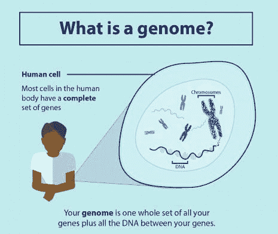

[基因组](https://www.genomicsengland.co.uk/understanding-genomics/)

### **蛋白质组学**

蛋白质组学是对**蛋白质组**的大规模研究。蛋白质组是指在一个生物体、系统或生物学背景下产生的蛋白质集合。

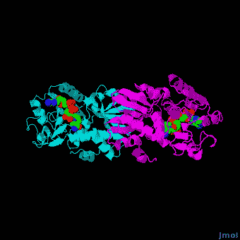

[蛋白质组](https://proteopedia.org/wiki/index.php/Book:Structural_Proteomics_and_its_Impact_on_the_Life_Sciences:6)

蛋白质，由[氨基酸](https://en.wikipedia.org/wiki/Amino_acid)链组成，其功能大部分来自于[蛋白质折叠](https://en.wikipedia.org/wiki/Protein_folding)，在此过程中它们形成了三维结构。这种结构由多个折叠层组成，包括[一级结构](https://en.wikipedia.org/wiki/Protein_primary_structure)（即氨基酸的平坦链）、[二级结构](https://en.wikipedia.org/wiki/Protein_secondary_structure)（[α螺旋](https://en.wikipedia.org/wiki/Alpha_helix)和[β折叠](https://en.wikipedia.org/wiki/Beta_sheet)）、[三级结构](https://en.wikipedia.org/wiki/Protein_tertiary_structure)和[四级结构](https://en.wikipedia.org/wiki/Protein_quaternary_structure)。

蛋白质二级结构预测是这一子领域的主要关注点，因为进一步的蛋白质折叠（三级和四级结构）是基于二级结构来确定的。解决蛋白质的真实结构是一个极其昂贵且耗时的过程，因此需要能够通过直接分析氨基酸序列来准确预测蛋白质结构的系统。在机器学习之前，研究人员需要手动进行这种预测。

目前最先进的二级结构预测使用一种称为 DeepCNF（深度卷积神经场）的系统，该系统依赖于[人工神经网络](https://en.wikipedia.org/wiki/Artificial_neural_network)的机器学习模型，以在将蛋白质序列中的氨基酸分类为三种结构类别（螺旋、折叠或线圈）时达到约 84%的准确率。

### **微阵列**

微阵列，一种[实验室芯片](https://en.wikipedia.org/wiki/Lab-on-a-chip)，用于自动收集大量生物材料的数据。机器学习可以帮助分析这些数据，并已应用于表达模式识别、分类和基因网络引导。

这项技术对于监测基因组内基因的表达尤其有用，帮助基于哪些基因被表达来诊断不同类型的癌症。在这一领域的主要问题之一是根据收集的数据识别哪些基因被表达。

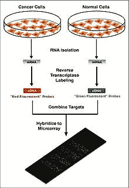

[DNA-微阵列芯片](https://en.wikipedia.org/wiki/File:Microarray-schema.jpg)

机器学习为解决这一问题提供了潜在的解决方案，因为可以使用各种分类方法进行识别。最常用的方法有[径向基函数网络](https://en.wikipedia.org/wiki/Radial_basis_function_network)、[深度学习](https://en.wikipedia.org/wiki/Deep_learning)、[贝叶斯分类](https://en.wikipedia.org/wiki/Naive_Bayes_classifier)、[决策树](https://en.wikipedia.org/wiki/Decision_tree)和[随机森林](https://en.wikipedia.org/wiki/Random_forest)。

### **系统生物学**

系统生物学专注于研究系统中简单生物组件复杂相互作用所产生的涌现行为。这些组件可以包括 DNA、RNA、蛋白质和代谢物等分子。

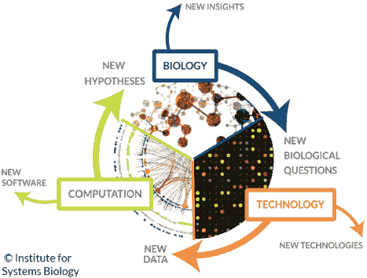

[系统生物学](https://systemsbiology.org/about/what-is-systems-biology/)

机器学习已经被用于帮助建模这些复杂的生物系统相互作用，涉及的领域包括基因网络、信号转导网络和代谢途径。[概率图模型](https://en.wikipedia.org/wiki/Graphical_model)，一种用于确定不同变量之间结构的机器学习技术，是建模基因网络的最常用方法之一。此外，机器学习还被应用于系统生物学问题，例如使用一种称为[马尔可夫链优化](https://en.wikipedia.org/wiki/Markov_chain)的技术识别[转录因子结合位点](https://en.wikipedia.org/wiki/DNA_binding_site)。基于自然进化过程的机器学习技术——[遗传算法](https://en.wikipedia.org/wiki/Genetic_algorithm)，已被用于建模基因网络和调控结构。

### **中风诊断**

用于分析[神经影像学](https://en.wikipedia.org/wiki/Neuroimaging)数据的机器学习方法被用于帮助诊断中风。三维卷积神经网络（CNN）和支持向量机（SVM）方法常常被使用。

### **文本挖掘**

可用生物出版物的增加导致了在所有来源中搜索和汇编与给定主题相关的所有信息难度增加的问题。这项任务被称为[知识提取](https://en.wikipedia.org/wiki/Knowledge_extraction)。这对于生物数据收集是必要的，这些数据随后可以输入机器学习算法，以生成新的生物学知识。机器学习可以使用诸如自然语言处理（NLP）等技术来完成这项知识提取任务，从数据库中的人类生成的报告中提取有用的信息。

该技术已被应用于寻找新药物靶点，因为这项任务需要检查存储在生物数据库和期刊中的信息。蛋白质数据库中的蛋白质注释通常不能反映每种蛋白质的完整已知知识集，因此必须从生物医学文献中提取额外的信息。机器学习已被应用于基因和蛋白质功能的自动注释、蛋白质亚细胞定位的确定、DNA 表达阵列的分析、大规模蛋白质相互作用分析和分子相互作用分析。

现在让我们在生物信息学数据集中实现**支持向量机（SVM）**算法，看看它是如何工作的。

### **利用支持向量机（SVM）进行基因表达监测的癌症分子分类**

尽管癌症分类在过去 30 年中有所改进，但仍然没有一种通用的方法来识别新的癌症类别（类别发现）或将肿瘤分配到已知类别（类别预测）。该数据集来自 Golub 等人在 1999 年发表的概念验证研究。该研究展示了如何通过基因表达监测（通过 DNA 微阵列）对新病例进行分类，从而提供了一种通用的方法来识别新的癌症类别并将肿瘤分配到已知类别。

目标是使用 SVM 算法对**急性髓系白血病（AML）**和**急性淋巴细胞白血病（ALL）**的患者进行分类。

数据集可以从[Kaggle](https://www.kaggle.com/crawford/gene-expression)下载。

**让我们开始编码：**

从加载三个基本的 python 库开始：

```py
import pandas as pd
import numpy as np
import matplotlib.pyplot as plt
```

加载数据集：

```py
Train_Data = pd.read_csv("/.../bioinformatics/data_set_ALL_AML_train.csv")
Test_Data = pd.read_csv("/.../bioinformatics/data_set_ALL_AML_independent.csv")
labels = pd.read_csv("/.../bioinformatics/actual.csv", index_col = 'patient')Train_Data.head()
```

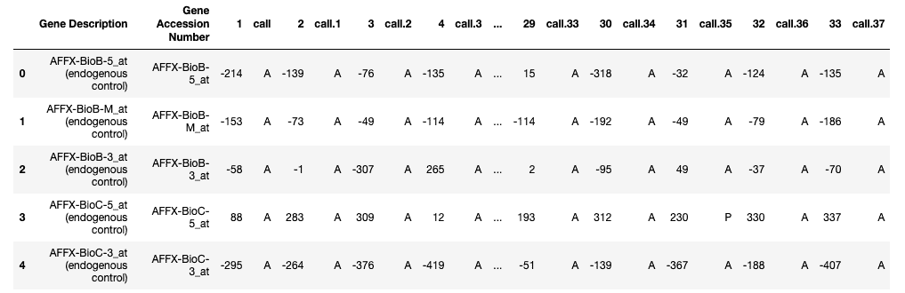

训练数据

```py
Test_Data.head()
```

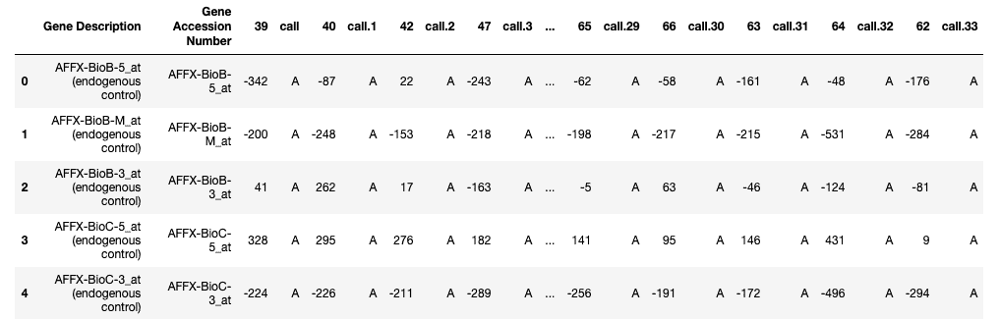

测试数据

**关于数据集：**

1.  每一行代表一个不同的基因。

1.  第 1 列和第 2 列是关于该基因的描述。

1.  每个编号的列是标签数据中的一个患者。

1.  每个患者有 7129 个基因表达值——即每个患者每个基因都有一个值。

1.  训练数据包含第 1 到第 38 位患者的基因表达值。

1.  测试数据包含第 39 到第 72 位患者的基因表达值。

现在检查两个数据集中是否有空值（这些数据集中没有空值）。

```py
print(Train_Data.isna().sum().max())
print(Test_Data.isna().sum().max())
```

现在从训练数据和测试数据中删除列‘`call`’，因为它没有任何统计相关性。

```py
cols = [col for col in Test_Data.columns if 'call' in col]
test = Test_Data.drop(cols, 1)
cols = [col for col in Train_Data.columns if 'call' in col]
train = Train_Data.drop(cols, 1)
```

现在将所有数据集连接起来并转置最终的连接数据。

```py
patients = [str(i) for i in range(1, 73, 1)]
df_all = pd.concat([train, test], axis = 1)[patients]
df_all = df_All.T
```

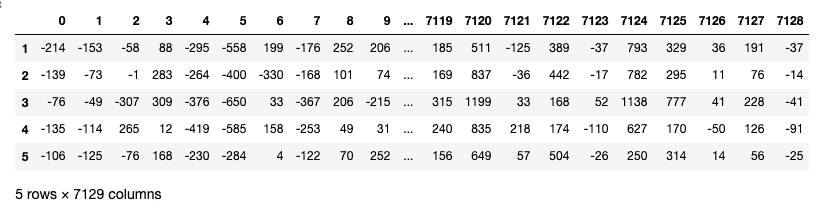

df_all

转置后，行已转换为列（7129 列/特征）。

现在将 patient 列转换为数值，并创建虚拟变量**（将类别转换为数值）**，因为‘`cancer`’是一个具有 2 个类别（ALL，AML）的分类列。

```py
df_all["patient"] = pd.to_numeric(patients)
labels["cancer"]= pd.get_dummies(Actual.cancer, drop_first=True)
```

现在在`patient`列上连接数据框`df_all`和`labels`。

```py
Data = pd.merge(df_all, labels, on="patient")
Data.head()
```

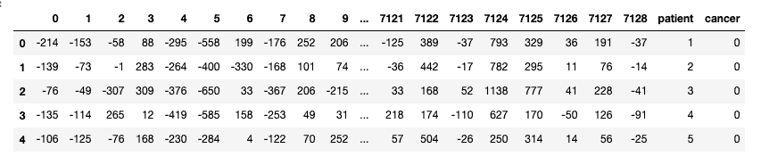

数据

我们的下一步是创建两个变量**X（自变量矩阵）**和**y（因变量向量）**。

```py
X, y = Data.drop(columns=["cancer"]), Data["cancer"]
```

接下来，我们将 75%的数据分为训练集，将 25%的数据分为测试集。**test_size**变量是我们实际指定测试集比例的地方。

```py
from sklearn.model_selection import train_test_split
X_train, X_test, y_train, y_test =  train_test_split(X,y,test_size = 0.25, random_state= 0)
```

下一步是规范化数据，因为如果我们仔细查看数据，自变量的值范围差异很大。因此，当自变量的值差异很大时，我们使用特征缩放以确保所有值保持在可比范围内。

```py
from sklearn.preprocessing import StandardScaler
sc_X = StandardScaler()
X_train = sc_X.fit_transform(X_train)
X_test = sc_X.transform(X_test)
```

我们正在处理的列/特征数量非常庞大。我们有 72 行和 7129 列。基本上，我们需要减少特征的数量（降维）以去除[**维度诅咒**](https://en.wikipedia.org/wiki/Curse_of_dimensionality)的可能性。

为了减少维度/特征的数量，我们将使用最流行的降维算法，即**PCA（主成分分析）**。

为了执行 PCA，我们必须选择我们希望数据中包含的特征/维度数量。

```py
from sklearn.decomposition import PCA
pca = PCA() 
X_train = pca.fit_transform(X_train)
X_test = pca.transform(X_test)
total=sum(pca.explained_variance_)
k=0
current_variance=0
while current_variance/total < 0.90:
    current_variance += pca.explained_variance_[k]
    k=k+1
```

上述代码给出了**k=38**。

现在我们选择 k=38，并对我们的自变量应用 PCA。

```py
from sklearn.decomposition import PCA
pca = PCA(n_components = 38)
X_train = pca.fit_transform(X_train)
X_test = pca.transform(X_test)cum_sum = pca.explained_variance_ratio_.cumsum()
cum_sum = cum_sum*100
plt.bar(range(38), cum_sum)
plt.ylabel("Cumulative Explained Variance")
plt.xlabel("Principal Components")
plt.title("Around 90% of variance is explained by the First 38 columns ")
```

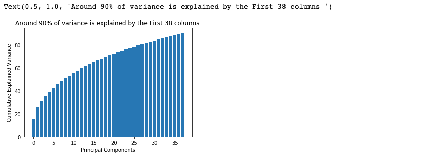

**注意：- PCA 可能会导致在没有或低特征相关性的 数据集上模型性能下降，或者不符合线性假设。**

下一步是将我们的数据适配到支持向量机（SVM）算法中，但在此之前我们将进行超参数优化。

> [**超参数优化**](https://en.wikipedia.org/wiki/Hyperparameter_optimization)或调整是选择学习算法的最佳超参数集的问题。超参数是用于控制学习过程的参数值。相比之下，其他参数的值是通过学习得到的。

我们将使用来自 sklearn 的 GridSearchCV 来选择最佳的超参数。

```py
from sklearn.model_selection import GridSearchCV
from sklearn.svm import SVCparameters = [{'C': [1, 10, 100, 1000], 'kernel': ['linear']},
              {'C': [1, 10, 100, 1000], 'kernel': ['rbf'], 'gamma': [0.1, 0.2, 0.3, 0.4, 0.5, 0.6, 0.7, 0.8, 0.9]}]search = GridSearchCV(SVC(), parameters, n_jobs=-1, verbose=1)
search.fit(X_train, y_train)
```

现在检查我们 SVM 算法的最佳参数。

```py
best_parameters = search.best_estimator_
```

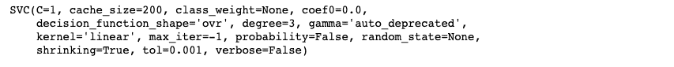

最佳超参数

现在让我们训练我们的 SVM 分类模型。

```py
model = SVC(C=1, cache_size=200, class_weight=None, coef0=0.0,
    decision_function_shape='ovr', degree=3, gamma='auto_deprecated',
    kernel='linear', max_iter=-1, probability=False, random_state=None,
    shrinking=True, tol=0.001, verbose=False)

model.fit(X_train, y_train)
```

是时候做一些预测了：

```py
y_pred=model.predict(X_test)
```

评估模型性能：

```py
from sklearn.metrics import accuracy_score, confusion_matrixfrom sklearn import metrics
print('Accuracy Score:',round(accuracy_score(y_test, y_pred),2))
#confusion matrix
cm = confusion_matrix(y_test, y_pred)Output: 
Accuracy Score: 0.67
```

混淆矩阵并使用热图进行可视化。

```py
class_names=[1,2,3]
fig, ax = plt.subplots()from sklearn.metrics import confusion_matrix
import seaborn as snscm = confusion_matrix(y_test, y_pred)class_names=['ALL', 'AML']
fig, ax = plt.subplots()
tick_marks = np.arange(len(class_names))
plt.xticks(tick_marks, class_names)
plt.yticks(tick_marks, class_names)
sns.heatmap(pd.DataFrame(cm), annot=True, cmap="viridis" ,fmt='g')
ax.xaxis.set_label_position("top")
plt.tight_layout()
plt.title('Confusion matrix', y=1.1)
plt.ylabel('Actual label')
plt.xlabel('Predicted label')
```

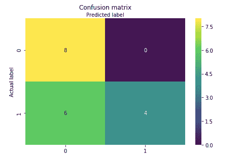

混淆矩阵的热图

好吧，这个例子表明，如果你只是预测每个患者都有 AML，你的正确率会比错误率高。

因此，我们的 SVM 分类模型以 67%的准确率预测了癌症患者，这显然不是很好。你可以尝试不同的分类器，如随机森林、K-NN、梯度提升、xgboost 等，并比较每个模型的准确率。

### 结论

在这篇文章中，我们展示了如何使用分类机器学习算法来预测患者的癌症。

我认为，要让机器学习真正蓬勃发展，关键在于更好的生物信息学数据。目前健康和生物信息学数据的统计能力相当差。它们通常要么信号较差（基因组学），要么噪声/偏差较高（电子健康记录），要么样本量较小。

好了，这就是本文的全部内容。我希望大家喜欢阅读，请在评论区分享您的建议/观点/问题。

你也可以通过[LinkedIn](https://www.linkedin.com/in/nagesh-singh-chauhan-6936bb13b/?source=post_page---------------------------)联系我，提出任何问题。


[图片来源](https://sighack.com/post/make-animated-gifs-in-processing)

感谢阅读！！！

**个人简介: [Nagesh Singh Chauhan](https://www.linkedin.com/in/nagesh-singh-chauhan-6936bb13b/)** 是一名数据科学爱好者，对大数据、Python、机器学习感兴趣。

[原文](https://towardsdatascience.com/explore-the-world-of-bioinformatics-with-machine-learning-47c62c482aaf)。经许可转载。

**相关内容：**

+   友好的支持向量机介绍

+   使用 K-最近邻分类心脏病

+   使用 K-Means 聚类进行图像分割简介

* * *

## 我们的前三个课程推荐

 1\. [Google 网络安全证书](https://www.kdnuggets.com/google-cybersecurity) - 快速进入网络安全职业。

 2\. [Google 数据分析专业证书](https://www.kdnuggets.com/google-data-analytics) - 提升您的数据分析技能。

 3\. [Google IT 支持专业证书](https://www.kdnuggets.com/google-itsupport) - 支持您的组织 IT 工作。

* * *

### 更多相关内容

+   [成为出色数据科学家所需的 5 项关键技能](https://www.kdnuggets.com/2021/12/5-key-skills-needed-become-great-data-scientist.html)

+   [每个初学者数据科学家应该掌握的 6 种预测模型](https://www.kdnuggets.com/2021/12/6-predictive-models-every-beginner-data-scientist-master.html)

+   [2021 年最佳 ETL 工具](https://www.kdnuggets.com/2021/12/mozart-best-etl-tools-2021.html)

+   [停止学习数据科学以寻找目标，并通过寻找目标来……](https://www.kdnuggets.com/2021/12/stop-learning-data-science-find-purpose.html)

+   [学习数据科学统计的最佳资源](https://www.kdnuggets.com/2021/12/springboard-top-resources-learn-data-science-statistics.html)

+   [成功数据科学家的 5 个特征](https://www.kdnuggets.com/2021/12/5-characteristics-successful-data-scientist.html)
