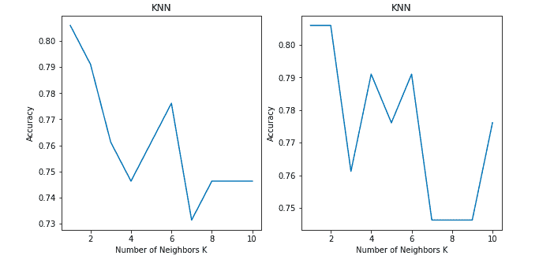
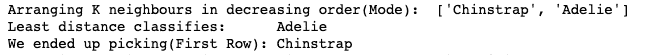
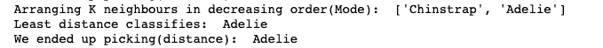

# 探索蛮力 K-最近邻算法

> 原文：[`www.kdnuggets.com/2020/10/exploring-brute-force-nearest-neighbors-algorithm.html`](https://www.kdnuggets.com/2020/10/exploring-brute-force-nearest-neighbors-algorithm.html)

评论

**[Murugan Yuvaraaj](https://www.linkedin.com/in/murugan-yuvaraaj-m-p-a369019a/)，Praxis 商学院**

* * *

## 我们的前三个课程推荐

 1\. [Google 网络安全证书](https://www.kdnuggets.com/google-cybersecurity) - 快速进入网络安全职业。

 2\. [Google 数据分析专业证书](https://www.kdnuggets.com/google-data-analytics) - 提升你的数据分析技能

 3\. [Google IT 支持专业证书](https://www.kdnuggets.com/google-itsupport) - 在 IT 方面支持你的组织

* * *

你发现这两个图之间有什么不同吗？

两者都显示了 K 值在 1 到 10 之间的分类问题的准确率。

两个图都使用了 KNN 分类模型，采用了 'Brute-force' 算法和 'Euclidean' 距离度量在相同数据集上。那么为什么两个图之间的准确率会有所不同呢？

在回答那个问题之前，让我带你浏览一下 KNN 算法的伪代码。

希望大家都对 k 最近邻算法有所了解。如果没有，你可以在 [`www.analyticsvidhya.com/blog/2018/03/introduction-k-neighbours-algorithm-clustering/`](https://www.analyticsvidhya.com/blog/2018/03/introduction-k-neighbours-algorithm-clustering/) 阅读其基础知识。

我们可以通过以下步骤实现 KNN 模型：

1.  加载数据

1.  初始化 k 的值

1.  为了获得预测的类别，从 1 遍历到所有训练数据点的总数。

1.  计算测试数据和每行训练数据之间的距离。这里我们将使用欧几里得距离作为我们的距离度量，因为它是最流行的方法。还可以使用其他度量方法，如切比雪夫、余弦等。

1.  根据距离值按升序排序计算得到的距离

1.  从排序数组中获取前 k 行

1.  获取这些行中最频繁的类别

1.  返回预测的类别

对于我们的分析，让我们只关注第 7 步，获取这些行中最频繁的类别。

在获取前 k 行之后，我们从这些行中挑选出最频繁的类别（众数）。这存在一个小问题。

在奇数 k 邻居的情况下，列表中总会有一个多数类别。因此，奇数 k 邻居不会出现问题。

那么对于偶数 k 邻居数量以及两个或更多类别获得相同多数的情况怎么办呢？

KNN 算法也可以为数据集提供高准确率，即使对于偶数 k 邻居。它并不局限于仅使用奇数 k 邻居来获取多数类别。

例如：

如果 k = 4，并且我们列表中有类别 A = 2 和类别 B = 2。在这种情况下，算法将选择位于前 K 行的类别，而不是查看距离度量。

为了解决这个问题，我们在算法中使用了**距离 - 模式 - 距离**作为偶数 K 个邻居的标准。

我们的算法与暴力搜索算法的工作方式相同，但对于偶数 K 邻居，它所带来的差异是巨大的。

我们的算法做的事情很简单。它从距离度量中取出前 K 行。在奇数 K 值的情况下，它取大多数类别。对于偶数 K 行，选择大多数类别。如果有两个或更多类别具有大多数，则这两个或更多主要类别的距离将再次进入距离度量循环，检查哪个类别的距离度量最低，并将该类别选择为主要类别。

让我们来看一个如何工作的示例。

我们的分析使用了企鹅数据集。

**暴力搜索算法：**

在这里我们设置了 k = 4。

类别‘Chinstrap’和‘Adelie’的模式为 2。在根据模式排列 K 个邻居后，暴力搜索选择了第一个类别，而不是选择距离度量中最小距离的类别。

这影响了当 k 值为偶数时暴力搜索算法的准确性。

**我们的模型：**

我们的模型能够在偶数邻居情况下提高准确性。

**结果：**

我比较了我们的模型与暴力搜索的准确性，结果如下。

| **K** | **暴力搜索** | **我们的模型** |
| --- | --- | --- |
| 1 | 0.805 | 0.805 |
| 2 | 0.746 | 0.805 |
| 3 | 0.761 | 0.761 |
| 4 | 0.746 | 0.791 |
| 5 | 0.776 | 0.776 |
| 6 | 0.716 | 0.791 |
| 7 | 0.746 | 0.746 |
| 8 | 0.686 | 0.746 |
| 9 | 0.746 | 0.746 |
| 10 | 0.701 | 0.776 |

我还比较了结果与**kd 树和球树算法**，结果相似。

GitHub 链接: [`github.com/myuvarajmp/Exploring_KNN_Algorithm`](https://github.com/myuvarajmp/Exploring_KNN_Algorithm)

感谢您的时间，并且请对我的反馈宽容，因为这是我的第一篇文章。

**个人简介: [Murugan Yuvaraaj](https://www.linkedin.com/in/murugan-yuvaraaj-m-p-a369019a/)** 是印度班加罗尔 Praxis 商学院的学生。

**相关内容：**

+   初学者指南：R 中的 K-最近邻算法，从零到英雄

+   K 最近邻算法的介绍及示例

+   使用 K-最近邻算法分类心脏病

### 更多相关内容

+   [从理论到实践：构建 k-最近邻分类器](https://www.kdnuggets.com/2023/06/theory-practice-building-knearest-neighbors-classifier.html)

+   [分类的最近邻](https://www.kdnuggets.com/2022/04/nearest-neighbors-classification.html)

+   [Scikit-learn 中的 K 最近邻](https://www.kdnuggets.com/2022/07/knearest-neighbors-scikitlearn.html)

+   [40% 的劳动力将在 3 年内受到 AI 的影响](https://www.kdnuggets.com/40-of-labour-force-will-be-affected-by-ai-in-3-years)

+   [数据库优化：探索 SQL 中的索引](https://www.kdnuggets.com/2023/07/database-optimization-exploring-indexes-sql.html)

+   [探索 AI/DL 的最新趋势：从元宇宙到量子计算](https://www.kdnuggets.com/2023/07/exploring-latest-trends-aidl-metaverse-quantum-computing.html)
