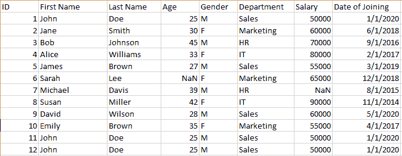

# 探索使用 Python 的数据清理技术

> 原文：[`www.kdnuggets.com/2023/04/exploring-data-cleaning-techniques-python.html`](https://www.kdnuggets.com/2023/04/exploring-data-cleaning-techniques-python.html)


图片来源：[freepik.com](https://www.freepik.com/free-vector/set-elements-chart-infographics-graphs-diagrams-chart-color_15573877.htm#query=graph&position=0&from_view=search&track=sph)

在实际的数据科学项目中，用于分析的数据可能包含多个缺陷，例如缺失数据、冗余数据、数据条目格式不正确、数据中的异常值等。数据清理指的是将原始数据进行预处理和转换，以便将其呈现为适合进一步分析的形式，例如描述性分析（数据可视化）或处方分析（模型构建）。必须使用干净、准确、可靠的数据进行后续分析，因为“*坏数据导致糟糕的预测模型*”。

* * *

## 我们的三大课程推荐

 1\. [Google Cybersecurity Certificate](https://www.kdnuggets.com/google-cybersecurity) - 快速进入网络安全职业生涯。

 2\. [Google Data Analytics Professional Certificate](https://www.kdnuggets.com/google-data-analytics) - 提升您的数据分析能力

 3\. [Google IT Support Professional Certificate](https://www.kdnuggets.com/google-itsupport) - 支持您的组织的 IT

* * *

Python 中的多个库，包括 pandas 和 numpy，可用于数据清理和转换。这些库提供了广泛的方法和功能来执行任务，包括处理缺失值、消除异常值，以及将数据转换为模型友好的格式。此外，消除冗余特征或将高度相关的特征组合成一个特征可能会导致维度减少。使用特征较少的数据集训练模型将提高模型的计算效率。此外，使用特征较少的数据集构建的模型更容易解释，并且具有更好的预测能力。

在本文中，我们将探索 Python 中用于清理、处理和转换数据的各种工具和技术。我们将使用下面展示的***data.cvs*** 数据集演示数据清理技术：



data.csv 展示了多种缺陷，例如重复数据、NaN 等。数据由作者创建。

# Python 数据清理库

在 Python 中，可以使用一系列库和工具，包括 pandas 和 NumPy，来清理数据。例如，pandas 中的 *dropna()*、*drop_duplicates()* 和 *fillna()* 函数分别可用于处理缺失数据、删除缺失数据和删除重复行。scikit-learn 工具包提供了处理离群值的工具（例如 *SimpleImputer* 类）和将数据转换为模型可以使用的格式的工具，例如用于标准化数值数据的 *StandardScaler* 类和用于归一化数据的 *MinMaxScaler*。

在本文中，我们将探讨在 Python 中可以使用的各种数据清理技术，以便为机器学习模型准备和预处理数据。

# 处理缺失数据

处理缺失数据是数据集中最重要的缺陷之一。Python 的 pandas 包提供了几种处理缺失数据的方法，包括**dropna()**和**fillna()**。**dropna()** 方法用于消除任何具有缺失值的列或行。例如，下面的代码将消除所有至少有一个缺失值的行：

```py
import pandas as pd

data = pd.read_csv('data.csv')

data = data.dropna()
```

**fillna()** 函数可用于用特定值或方法填充缺失值。例如，以下代码将用数据中的平均年龄填充 'age' 列中的缺失值：

```py
import pandas as pd

data = pd.read_csv('data.csv')

data['age'].fillna(data['age'].mean(), inplace=True)
```

# 处理离群值

处理离群值是典型的数据清理活动。那些与其余数据差异较大的值被视为离群值。这些因素需要小心处理，因为它们对模型的性能有显著影响。在 Python 的 scikit-learn 工具包中，*RobustScaler* 类用于处理离群值。通过删除中位数并根据四分位范围来缩放数据，可以使用该类来对数据进行缩放。

```py
from sklearn.preprocessing import RobustScaler

data = pd.read_csv('data.csv')

scaler = RobustScaler()

data = scaler.fit_transform(data)
```

# 编码分类变量

另一个常见的数据清理任务是将数据转换为模型可以使用的格式。例如，在分类数据可以用于模型之前，必须将其转换为数值数据。pandas 包中的 *get_dummies()* 方法允许将类别数据转换为数值数据。在下面的示例中，类别特征*‘Departmen*t’被转换为数值数据：

```py
import pandas as pd

data = pd.read_csv('data.csv')

data = pd.get_dummies(data, columns=['Department'])
```

# 删除重复数据

在数据清理过程中，还必须消除重复数据。要从 Python DataFrame 中删除重复的行，可以使用 pandas 包提供的*drop_duplicates()* 方法。例如，下面的代码将消除数据中的所有冗余行：

```py
import pandas as pd

data = pd.read_csv('data.csv')

data = data.drop_duplicates()
```

# 特征工程

特征选择和特征工程是数据清理的关键组成部分。选择数据集中仅相关特征的过程称为特征选择，而从现有特征中构建新特征的过程称为特征工程。下面的代码演示了特征工程的过程：

```py
import pandas as pd
from sklearn.preprocessing import StandardScaler

# read the data into a pandas dataframe
df = pd.read_excel("data.csv")

# create a feature matrix and target vector
X = df.drop(["Employee ID", "Date of Joining"], axis=1)
y = df["Salary"]

# scale the numerical features
scaler = StandardScaler()
X_scaled = scaler.fit_transform(X[["Age", "Experience"]])

# concatenate the scaled features with the categorical features
gender_dummies = pd.get_dummies(X["Gender"], prefix="Gender")
X_processed = pd.concat(
    [gender_dummies, pd.DataFrame(X_scaled, columns=["Age", "Experience"])],
    axis=1,
)

print(X_processed)
```

在上述代码中，我们首先通过删除'*员工编号*'和'*入职日期*'列来创建特征矩阵 (X)，然后创建一个包含'*薪资*'列的目标向量 (y)。接着，我们使用 scikit-learn 的 StandardScaler() 函数对数值特征'*年龄*'和'*经验*'进行缩放。

接下来，我们为分类列'*性别*'创建虚拟变量，并将其与缩放后的数值特征连接起来，创建最终处理后的特征矩阵 (X_processed)。

请注意，所使用的具体特征提取技术将取决于数据以及分析的具体要求。同时，在应用任何机器学习模型之前，重要的是将数据拆分为训练集和测试集，以避免过拟合。

# 结论

总之，数据清洗是机器学习过程中的一个重要阶段，因为它确保用于分析（描述性或规定性）的数据质量高。准备和预处理数据的重要方法包括转换数据格式、删除重复数据、处理缺失数据、异常值检测、特征工程和特征选择。Pandas、NumPy 和 scikit-learn 只是特征工程和数据清洗众多库和工具中的一部分。

**[本杰明·O·塔约](https://www.linkedin.com/in/benjamin-o-tayo-ph-d-a2717511/)** 是一名物理学家、数据科学教育者和作家，同时也是 DataScienceHub 的创始人。此前，本杰明曾在中央俄克拉荷马大学、大峡谷大学和匹兹堡州立大学教授工程学和物理学。

### 更多相关内容

+   [掌握数据清洗和预处理技术的 7 个步骤](https://www.kdnuggets.com/2023/08/7-steps-mastering-data-cleaning-preprocessing-techniques.html)

+   [在 Python 的 itertools 中探索无限迭代器](https://www.kdnuggets.com/exploring-infinite-iterators-in-python-itertools)

+   [使用 Python 探索 OpenAI API](https://www.kdnuggets.com/exploring-the-openai-api-with-python)

+   [探索 Python 中的自然排序](https://www.kdnuggets.com/exploring-natural-sorting-in-python)

+   [导航数据革命：探索数据科学和机器学习中的蓬勃趋势](https://www.kdnuggets.com/navigating-the-data-revolution-exploring-the-booming-trends-in-data-science-and-machine-learning)

+   [优化数据存储：探索 SQL 中的数据类型和标准化](https://www.kdnuggets.com/optimizing-data-storage-exploring-data-types-and-normalization-in-sql)
