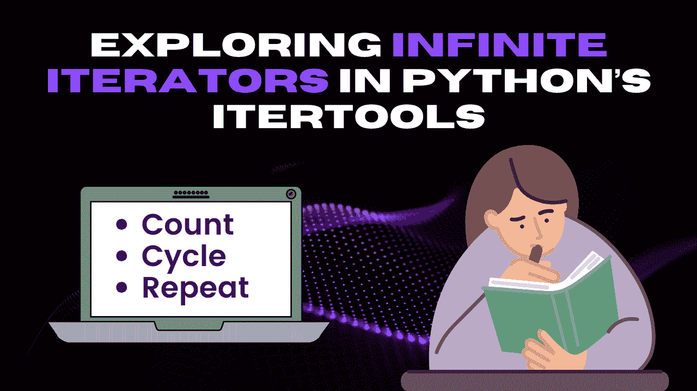

# 探索 Python 中 itertools 的无限迭代器

> 原文：[`www.kdnuggets.com/exploring-infinite-iterators-in-python-itertools`](https://www.kdnuggets.com/exploring-infinite-iterators-in-python-itertools)



作者提供的图像

# 介绍

* * *

## 我们的前三大课程推荐

 1\. [谷歌网络安全证书](https://www.kdnuggets.com/google-cybersecurity) - 快速进入网络安全职业。

 2\. [谷歌数据分析专业证书](https://www.kdnuggets.com/google-data-analytics) - 提升你的数据分析技能

 3\. [谷歌 IT 支持专业证书](https://www.kdnuggets.com/google-itsupport) - 支持你的组织 IT

* * *

如其名称所示，无限迭代器是一种特殊类型的迭代器，可以无限生成值。与像列表、元组和字典这样的内置迭代器最终会结束不同，无限迭代器可以产生源源不断的值流。这些迭代器有时也被称为无限生成器或序列。它们在模拟、生成序列、处理实时数据等问题的解决中有广泛应用。

Python 的 Itertools 库提供了三种内置的无限迭代器。

+   Count

+   Cycle

+   Repeat

# 1\. Count

**count()** 函数生成从指定值和步长开始的无限数字。count 迭代器的语法如下：

```py
itertools.count(start=0, step=1)
```

它有两个可选参数：“start”和“stop”，默认值分别为 0 和 1。“Start”表示计数的初始值，而“step”表示用于增加计数的增量。

让我们通过一个例子来分析这个函数。如果你需要生成一个步长为 3 的数字序列，就像 3 的乘法表一样，你可以使用以下代码：

```py
from itertools import count

counter = count(3,3)

print("The table of 3 is:")
for i in range(10):
  print(f"3 x {i+1} = {next(counter)}")
```

## 输出

```py
The table of 3 is: 
3 x 1 = 3 
3 x 2 = 6 
3 x 3 = 9 
3 x 4 = 12 
3 x 5 = 15 
3 x 6 = 18 
3 x 7 = 21 
3 x 8 = 24 
3 x 9 = 27 
3 x 10 = 30
```

# 2\. Cycle

**cycle()** 函数创建一个迭代器，并无限重复传递的容器中的所有项。以下是 cycle 迭代器的语法：

```py
itertools.cycle(iterable)
```

这里的“iterable”参数可以是 Python 中的任何可迭代数据结构，如列表、元组、集合等。考虑一个交通灯控制系统的例子，该系统不断循环显示不同的灯光。在不同颜色的灯光之间循环时不执行其他动作。我们将使用 5 秒的等待时间来显示结果。

```py
from itertools import cycle
import time

lights = ["red", "green", "yellow"]
cycle_iterator = cycle(lights)

while True:
  print(f"Current light is: {next(cycle_iterator)}")
  time.sleep(5)
```

## 输出

```py
Current light is: red 
Current light is: green 
Current light is: yellow 
Current light is: red 
Current light is: green 
Current light is: yellow
```

你将在大约 25 秒后看到这个输出。

# 3\. Repeat

**repeat()** 函数生成指定数量的无限序列。当你需要无限生成单个值时，它非常有用。repeat 迭代器的语法如下：

```py
itertools.repeat(value, times=inf)
```

我们这里有两个参数：“value”是你想要无限生成的数字，而“times”是一个可选参数，用于指定你想要生成该数字的次数。“times”的默认值是无限，意味着除非你明确指定有限的数字，否则它将不断打印。例如，如果你需要生成数字“9”三次，可以使用以下代码：

```py
from itertools import repeat

iterator = repeat(9, 3)

for value in iterator:
    print(value)
```

## 输出

```py
9
9 
9
```

# 结论

这些无限迭代器在我们需要处理数据流的场景中非常有用。“count”、“cycle”和“repeat”迭代器使我们能够更高效、优雅地解决问题。尽管使用它们需要谨慎，因为它们可能导致无限循环，但如果用得当，它们可以成为解决编程问题的宝贵资源。希望你喜欢这篇文章，如果你有任何分享，欢迎在下面的评论框中提出建议。

**[](https://www.linkedin.com/in/kanwal-mehreen1/)**[Kanwal Mehreen](https://www.linkedin.com/in/kanwal-mehreen1/)** Kanwal 是一名机器学习工程师和技术作家，对数据科学及 AI 与医学的交汇处有着深厚的热情。她共同编著了电子书《利用 ChatGPT 最大化生产力》。作为 2022 年 APAC 区的 Google Generation Scholar，她倡导多样性和学术卓越。她还被认可为 Teradata 多样性技术学者、Mitacs Globalink 研究学者以及 Harvard WeCode 学者。Kanwal 是变革的热情倡导者，创办了 FEMCodes 以赋能 STEM 领域的女性。

### 更多相关话题

+   [理解 Python 中的可迭代对象与迭代器](https://www.kdnuggets.com/2022/01/understanding-iterables-iterators-python.html)

+   [你可能不知道的 4 个 Python Itertools 过滤函数](https://www.kdnuggets.com/2023/08/4-python-itertools-filter-functions-probably-didnt-know.html)

+   [流式 LLM 介绍：无限长度输入的 LLMs](https://www.kdnuggets.com/introduction-to-streaming-llm-llms-for-infinite-length-inputs)

+   [使用 Python 探索数据清理技术](https://www.kdnuggets.com/2023/04/exploring-data-cleaning-techniques-python.html)

+   [使用 Python 探索 OpenAI API](https://www.kdnuggets.com/exploring-the-openai-api-with-python)

+   [在 Python 中探索自然排序](https://www.kdnuggets.com/exploring-natural-sorting-in-python)
