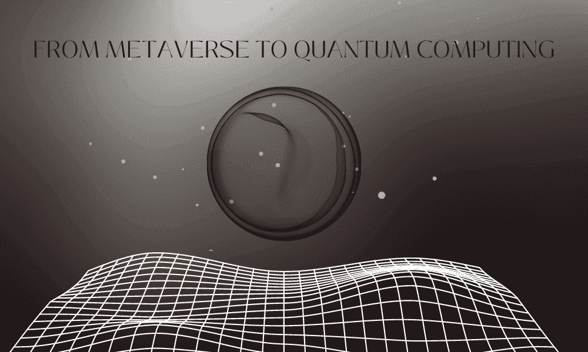
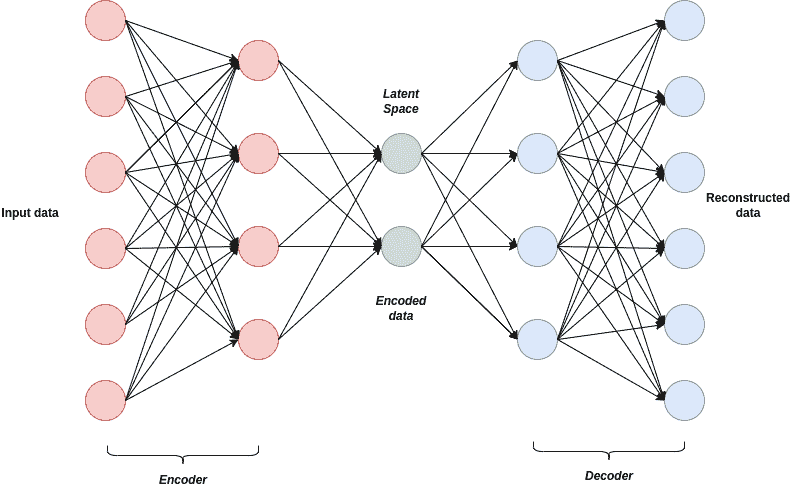
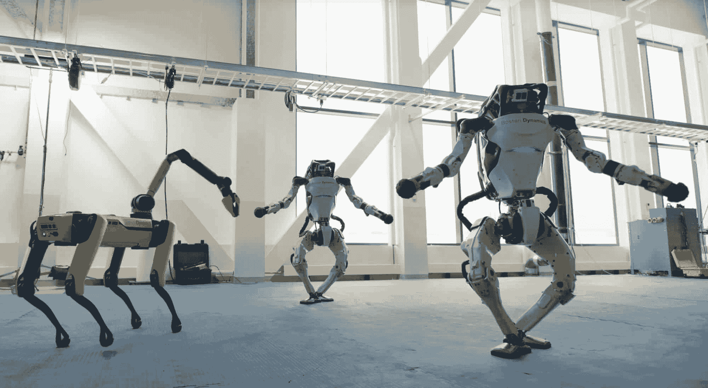
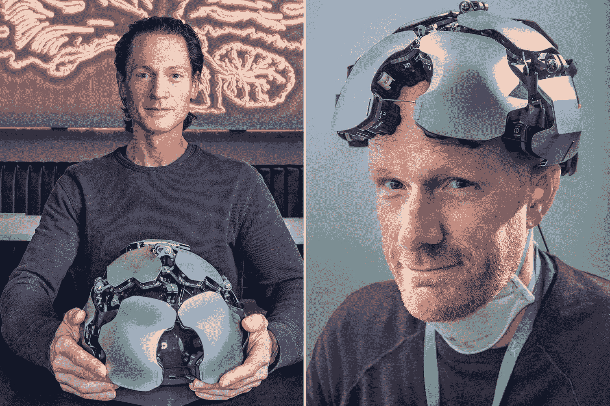

# 探索 AI/DL 的最新趋势：从元宇宙到量子计算

> 原文：[`www.kdnuggets.com/2023/07/exploring-latest-trends-aidl-metaverse-quantum-computing.html`](https://www.kdnuggets.com/2023/07/exploring-latest-trends-aidl-metaverse-quantum-computing.html)

图片由编辑提供

人工智能（AI）领域在不断发展，几种新兴趋势正在塑造这个领域，有潜力对各个行业和日常生活产生重大影响。最近的 AI 突破的推动力之一是深度学习（DL），也称为人工神经网络（ANNs）。深度学习在自然语言处理（NLP）、计算机视觉、强化学习和生成对抗网络（GANs）等领域显示了显著的进展。

* * *

## 我们的前三个课程推荐

 1\. [谷歌网络安全证书](https://www.kdnuggets.com/google-cybersecurity) - 快速进入网络安全职业轨道。

 2\. [谷歌数据分析专业证书](https://www.kdnuggets.com/google-data-analytics) - 提升你的数据分析技能

 3\. [谷歌 IT 支持专业证书](https://www.kdnuggets.com/google-itsupport) - 支持组织的 IT 需求

* * *

使深度学习（DL）更加迷人的是它与神经科学的紧密联系。研究人员常常从人脑的复杂性和功能中汲取洞察，以开发深度学习技术和架构。例如，卷积神经网络（CNNs）、激活函数和人工神经网络（ANNs）中的人工神经元都受到人脑生物神经元的结构和行为的启发。

尽管 AI/DL 和神经科学已经产生了显著影响，但还有一个领域拥有更大的变革潜力——量子计算。量子计算有潜力彻底改变计算能力，并在包括 AI 在内的多个领域解锁前所未有的进展。其进行复杂计算和同时处理大量数据的能力开启了新的可能性前沿。

# 深度学习

现代人工神经网络（ANNs）因其复杂的结构而获得了 *"深度学习"* 的称号。这些网络是一种机器学习模型，灵感来源于人脑的结构和功能。由多个相互连接的神经元层组成，ANNs 在数据流经网络时进行处理和转换。"深度" 一词指的是网络的深度，这由其结构中的隐藏层数量决定。传统的 ANNs 通常只有几个隐藏层，使其相对较浅。相比之下，深度学习模型可以具有数十层甚至数百层隐藏层，使其深度显著增加。这种增加的深度使得深度学习模型能够捕捉数据中的复杂模式和层次特征，从而在前沿机器学习任务中表现出色。

深度学习的一个显著应用是图像到文本和文本到图像生成。这些任务依赖于诸如生成对抗网络（GANs）或 [变分自编码器（VAEs）](https://jaan.io/what-is-variational-autoencoder-vae-tutorial/) 这样的深度学习技术，从庞大的数据集中学习文本与图像之间的复杂关系。这些模型在多个领域找到应用，包括计算机图形学、艺术、广告、时尚、娱乐、虚拟现实、游戏体验、数据可视化和讲故事。

VAE 算法的架构

尽管取得了显著进展，深度学习仍面临许多挑战和限制。主要的障碍在于计算资源和能源效率。深度学习模型通常需要大量的计算资源，如强大的 GPU（图形处理单元）或专用硬件，以高效地执行预测。这种对广泛计算基础设施的依赖可能限制了资源不足的研究人员或组织对深度学习的访问。此外，训练和运行深度学习模型可能会消耗大量的能源。随着模型规模每年不断增长，能源效率问题变得越来越重要。

# 大型模型

除了围绕大型语言模型和视觉模型的技术考虑外，全球范围内的政府带来了一个意想不到的挑战。这些治理机构正在推动对 AI 模型的监管，并要求模型拥有者，包括 [ChatGPT](https://www.assemblyai.com/blog/how-chatgpt-actually-works/) 等平台，解释其模型的内部工作原理。然而，像 OpenAI、微软或谷歌这样的主要实体，甚至 AI 科学界，都没有对这些问题给出具体的答案。他们承认对这些模型有一般性的了解，但无法准确指出为何模型会提供某种特定的回应。最近的事件，例如 ChatGPT 在意大利被禁用和埃隆·马斯克指控微软未经授权使用 Twitter 数据，都只是更大问题的开始。显然，主要 IT 公司之间正在酝酿一场新斗争，涉及谁可以声称拥有“最大模型”和 [哪些数据可以用于这些模型](https://www.politico.eu/article/chatgpt-world-regulatory-pain-eu-privacy-data-protection-gdpr/)。

在一篇名为《*AI 时代已经来临*》的最新博客文章中，微软联合创始人比尔·盖茨称赞了 ChatGPT 和相关的 [AI 进展为“革命性”](https://www.gatesnotes.com/The-Age-of-AI-Has-Begun)。盖茨强调了需要“革命性”解决方案来应对当前面临的挑战。因此，这促使人们重新评估诸如“版权”、“大学考试”以及甚至对“学习”本质的哲学探讨等概念。

# 神经科学

在他最近的书籍《*千脑理论*》中，J. Hawkins 提出了一个关于人脑如何处理信息和产生智能行为的新颖且不断发展的观点。千脑理论认为，大脑像是一个由成千上万个独立的迷你大脑组成的网络，每个迷你大脑负责同时处理感觉输入和产生运动输出。根据这一理论，新皮层，即大脑外层与高级认知功能相关的部分，由众多功能上独立的柱状结构组成，这些柱状结构可以类比为迷你大脑。

该理论建议，新皮层中的每个柱状结构学习并建模来自周围环境的感觉输入，并对未来的感觉输入做出预测。这些预测随后与实际的感觉输入进行比较，任何差异都会被用来更新柱状结构中的内部模型。这个不断的预测和比较过程形成了新皮层处理信息和产生智能行为的基础。

根据千脑理论，各种感觉输入（如视觉、听觉和触觉）在独立的列中处理。这些列的输出随后被结合起来，以创建对世界的统一感知。这种非凡的能力使大脑能够整合来自不同感觉通道的信息，并[形成对周围环境的连贯表征](https://www.numenta.com/resources/books/a-thousand-brains-by-jeff-hawkins/)。

千脑理论中的一个关键概念是“稀疏表示”。这一概念突出了人脑中只有一部分神经元在任何给定时间是活跃的或发射的，而其余神经元则相对不活跃或静默。稀疏编码通过减少冗余或不必要的神经活动，使大脑能够高效地处理和编码信息。稀疏表示的一个重要好处是其能够实现大脑中的选择性更新。在这个过程中，只有活跃的神经元或神经通路会在响应新信息或经历时被更新或修改。

这种选择性更新机制使大脑能够通过将资源集中在最相关的信息或任务上，而不是同时更新所有神经元，从而高效地适应和学习。神经元的选择性更新在神经可塑性中发挥了关键作用，神经可塑性指的是大脑通过学习和经验改变和适应的能力。它使大脑能够根据持续的认知和行为需求来完善其表征和连接，同时节省能源和计算资源。

Numenta 理论的实际应用已显而易见。例如，最近与 Intel 的合作已经在自然语言处理和计算机视觉等各种使用案例中带来了显著的性能提升。得益于这一合作，客户可以实现[性能提高从 10 倍到 100 倍以上](https://mailchi.mp/numenta/news-digest-10)。

# 元宇宙

尽管许多人将注意力集中在大型语言模型上，Meta 采取了一种独特的方法。在一篇标题为[*"从人类活动和模拟互动的视频中学习的机器人"*](https://ai.facebook.com/blog/robots-learning-video-simulation-artificial-visual-cortex-vc-1/?utm_source=linkedin&utm_medium=organic_social&utm_campaign=research&utm_content=video)的博客文章中，Meta AI 团队强调了一个名为“莫拉维克悖论”的有趣概念。根据这一论点，AI 中最具挑战性的问题围绕感知运动技能，而非抽象思维或推理。为了支持这一观点，该团队宣布了在通用体现在 AI 代理领域的两个重大进展。

1.  首先，他们引入了人工视觉皮层，称为 VC-1。这一突破性的感知模型是第一个提供广泛感知运动技能、环境和具身支持的模型。

1.  此外，Meta 团队开发了一种名为自适应（感知运动）技能协调（ASC）的创新方法。这种方法在机器人移动操控的严苛任务中达到了近乎完美的表现，成功率高达 98%。它涉及到导航到一个物体、拾取物体、移动到另一个位置、放置物体并重复这些动作——所有这些都在物理环境中完成。

Meta 的这些进展标志着从对大型语言模型的主要关注转变。通过优先考虑感知运动技能和具身人工智能，它们促进了能够以更全面、更细致的方式与世界互动的智能体的发展。

尽管基于统计方法，ChatGPT 模型获得了大量的炒作和不成比例的公众关注。相比之下，Meta 最近的突破代表了实质性的科学进展。这些成就为虚拟现实（VR）和机器人技术领域的革命性扩展奠定了基础。我们强烈推荐阅读完整文章，以获得见解，并为即将到来的人工智能创新浪潮做好准备，因为这将以显著的方式塑造这些领域的未来。

# 机器人技术

目前，领域中有两款显著的机器人是[Atlas](https://www.bostondynamics.com/atlas)和[Spot (robodog)](https://www.bostondynamics.com/products/spot)，这两款机器人均可在网上轻松购买。这些机器人代表了工程学上的显著成就，但它们的能力仍受到缺乏先进“智能”的限制。这正是 Meta 人工视觉皮层发挥作用的地方，可能会带来突破性的改变。通过将机器人技术与人工智能结合，它有可能彻底改变许多行业和领域，包括制造业、医疗保健、运输、农业和娱乐等。Meta 人工视觉皮层有望增强这些机器人的能力，并为机器人技术领域的前所未有的进步铺平道路。

波士顿动力的 Atlas 和 Spot 机器人

# 人类的新接口：脑-计算机/脑-脑接口

尽管可能会担心被人工智能超越，但人脑具有现代人工智能所缺乏的关键优势：神经可塑性。神经可塑性，也称为脑可塑性，指的是大脑在结构和功能上对经验、学习和环境变化的惊人适应能力。然而，尽管有这种优势，人脑仍然缺乏与其他人脑或人工智能系统的先进通信方法。为了克服这些限制，开发新的脑接口是必要的。

由于传统的沟通方式，如视觉、听觉或打字，速度有限，难以与现代人工智能模型竞争。为了解决这个问题，正在探索基于直接脑神经网络电活动的新接口。进入现代脑机接口（BCIs）的领域，这些前沿技术实现了大脑与外部设备或系统之间的直接通信和互动，绕过了传统的外围神经系统路径。BCIs 的应用领域包括神经假体、神经康复、沟通、残疾人士控制、认知增强和神经科学研究。此外，BCIs 最近也涉足了虚拟现实娱乐领域，例如['Galea'](https://galea.co/#home)等设备，可能成为我们日常现实的一部分。

另一个有趣的例子是[Kernel Flow](https://www.kernel.com/)，这是一种能够从大脑皮层捕获脑电图（EEG）和全头覆盖的类似功能性磁共振成像（fMRI）数据的设备。凭借这些能力，我们有可能最终直接从梦境中创造虚拟世界。

与非侵入性的 BCIs 如'Galea'和'Kernel'相比，[Neuralink](https://neuralink.com/)由埃隆·马斯克创办，采用了不同的方法，推广侵入式脑植入。一些人称其为“与外界的插口”，提供比任何现代非侵入式 BCIs 更广泛的通信渠道。侵入式 BCIs 的另一个重要优势是潜在的双向通信。想象一个未来，信息无需通过我们的眼睛或耳朵，而是可以直接传递到我们的大脑皮层。

布莱恩·约翰逊（左）Kernel Flow

# 量子计算

如果神经科学和人脑尚不够吸引人，还有一个令人费解的话题可以探索：量子计算机。这些非凡的机器有可能在某些计算任务中超越经典计算机。利用量子叠加和纠缠——现代物理学的前沿——量子计算机可以执行并行计算，更高效地解决特定问题。包括大数因式分解、解决复杂优化问题、模拟量子系统，以及量子传输这一未来概念。这些进展有望彻底改变加密学、药物发现、材料科学和金融建模等领域。要体验量子编程，你可以访问 [www.quantumplayground.net](http://www.quantumplayground.net/) 并 [在几分钟内编写你的第一个量子脚本](https://quantumalgorithms.org/)。

尽管未来本质上是不确定的，但有一点是明确的：人类未来的轨迹将由个人、社区、机构和政府的选择和行动所塑造。我们必须共同努力，追求积极的变革，解决紧迫的全球问题，促进包容性和可持续性，并共同努力创造一个更美好的未来。

**[Ihar Rubanau](https://www.linkedin.com/in/irubanau)** 是 Sigma Software Group 的高级数据科学家

### 相关话题

+   [量子计算解析：对数据科学和 AI 的影响](https://www.kdnuggets.com/breaking-down-quantum-computing-implications-for-data-science-and-ai)

+   [人工智能与元宇宙](https://www.kdnuggets.com/2022/02/artificial-intelligence-metaverse.html)

+   [探索 Zephyr 7B：最新大型语言模型的综合指南](https://www.kdnuggets.com/exploring-the-zephyr-7b-a-comprehensive-guide-to-the-latest-large-language-model)

+   [探索谷歌最新的 AI 工具：初学者指南](https://www.kdnuggets.com/exploring-googles-latest-ai-tools-a-beginners-guide)

+   [数据革命导航：探索数据科学和机器学习中的蓬勃趋势](https://www.kdnuggets.com/navigating-the-data-revolution-exploring-the-booming-trends-in-data-science-and-machine-learning)

+   [在你的数据科学旅程中取得量子飞跃](https://www.kdnuggets.com/2023/02/make-quantum-leaps-data-science-journey.html)
