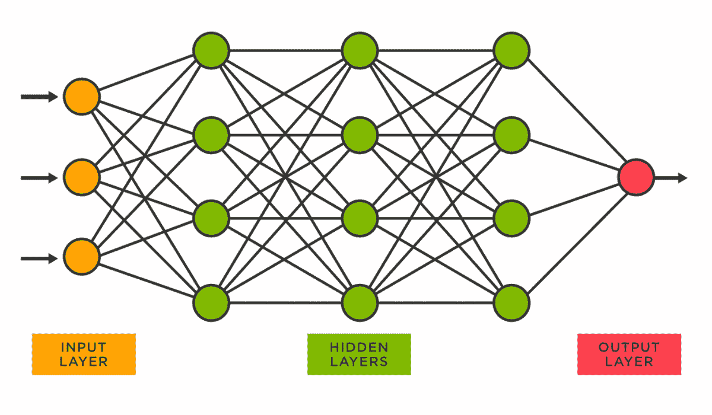
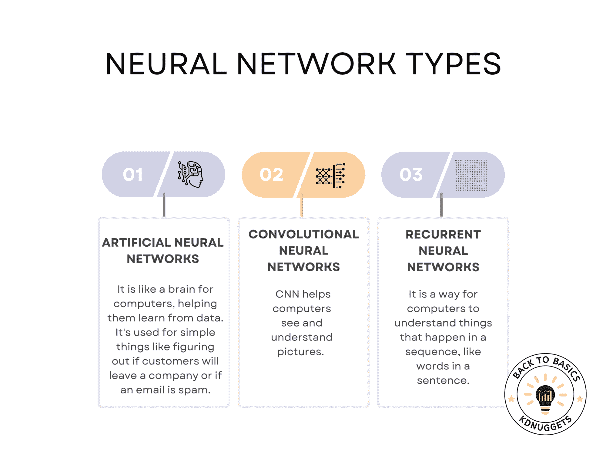

# 探索神经网络

> 原文：[`www.kdnuggets.com/exploring-neural-networks`](https://www.kdnuggets.com/exploring-neural-networks)

想象一下，一台机器像人脑一样思考、学习和适应，并发现数据中的隐藏模式。

这项技术，神经网络（NN），算法在模拟认知。稍后我们将深入探讨神经网络是什么以及它们如何运作。

* * *

## 我们的前三大课程推荐

 1\. [Google 网络安全证书](https://www.kdnuggets.com/google-cybersecurity) - 快速进入网络安全职业

 2\. [Google 数据分析专业证书](https://www.kdnuggets.com/google-data-analytics) - 提升你的数据分析技能

 3\. [Google IT 支持专业证书](https://www.kdnuggets.com/google-itsupport) - 支持你的组织进行 IT 支持

* * *

在这篇文章中，我将向你解释神经网络（NN）的基本方面——结构、类型、实际应用和定义操作的关键术语。

# 什么是神经网络？

来源: [vitalflux.com](https://vitalflux.com/sklearn-neural-network-regression-example-mlpregressor/)

称为神经网络（NN）的算法试图在数据中寻找关系，模拟人脑的操作以“学习”数据。

神经网络可以与深度学习和机器学习相结合。因此，首先解释这些术语将是有益的。让我们开始吧。

# 神经网络与深度学习与机器学习

神经网络构成了深度学习的基础，深度学习是机器学习的一个子集。虽然机器学习模型从数据中学习并进行预测，但深度学习更深入，可以处理大量数据，识别复杂模式。

如果你想了解更多关于机器学习算法的信息，可以阅读这篇[文章](https://www.stratascratch.com/blog/machine-learning-algorithms-you-should-know-for-data-science/)。

此外，这些神经网络已经成为许多领域的核心部分，作为众多现代技术的支柱，这些应用范围从面部识别到自然语言处理，我们将在后续部分中看到。

让我们探索神经网络在提升日常生活中发挥重要作用的一些常见领域。

# 神经网络的类型

现实世界的应用丰富了对神经网络的理解，凭借准确、高效的解决方案革新了各行业的传统方法。

让我们突显一些神经网络推动创新和改变日常体验的有趣例子，包括神经网络类型。

作者提供的图片

## 人工神经网络（ANN）：

人工神经网络（ANN）的架构受到人脑生物神经网络的启发。网络由相互连接的层组成，包括输入层、隐藏层和输出层。每一层包含多个神经元，这些神经元与相邻层的每个神经元相连。

随着数据在网络中流动，每个连接应用一个权重，每个神经元应用一个激活函数，如 ReLU、Sigmoid 或 Tanh。这些函数引入非线性，使网络能够从错误中学习并做出复杂决策。

在训练过程中，使用称为反向传播的技术来调整这些权重。这种技术使用梯度下降来最小化预定义的损失函数，旨在使网络的预测尽可能准确。

### ANN 使用案例

**客户流失预测**

人工神经网络分析用户行为、购买历史和与客服的互动等多个特征，以预测客户离开服务的可能性。

人工神经网络可以建模这些特征之间的复杂关系，提供细致的视角，对于准确预测客户流失至关重要。

**销售预测**

人工神经网络利用历史销售数据和其他变量，如营销支出、季节性和经济指标，来预测未来销售。

他们从错误中学习并调整变量之间复杂的非线性关系的能力使他们非常适合这个任务。

**垃圾邮件过滤**

人工神经网络分析邮件的内容、上下文和其他特征，以将其分类为垃圾邮件或非垃圾邮件。

他们可以学习识别新的垃圾邮件模式，并随着时间的推移进行调整，这使他们在过滤不需要的消息时非常有效。

## CNN（卷积神经网络）：

卷积神经网络（CNNs）专门用于涉及空间层次结构的任务，如图像识别。网络使用称为卷积层的专用层，将一系列滤波器应用于输入图像，生成一组特征图。

这些特征图随后通过池化层，减少其维度，使网络在计算上更高效。最后，一个或多个全连接层进行分类。

训练过程涉及反向传播，类似于人工神经网络（ANNs），但调整以保持特征的空间层次结构。

### CNN 使用案例

**图像分类**

卷积神经网络应用一系列滤波器和池化层来自动识别图像中的层次模式。

他们减少维度并关注重要特征的能力使他们在图像分类中既高效又准确。

**对象检测**

卷积神经网络不仅分类，还通过绘制边界框来定位图像中的对象。

该架构设计用于识别空间层次结构，使其能够在单个图像中识别多个对象。

**图像分割**

卷积神经网络可以将标签分配给图像中的每个像素，将其分类为属于特定对象或背景。

网络的粒度像素级理解使其非常适合于医疗成像等需要精确分割的任务。

## RNN（循环神经网络）：

循环神经网络（RNNs）的不同之处在于它们具有内部循环或递归结构，使它们能够存储信息。这使得它们非常适合处理序列数据，因为每个神经元可以利用其内部状态记住序列中前一个时间步的信息。

在处理数据时，网络会考虑当前和之前的输入，从而形成一种短期记忆。然而，RNNs 可能会遇到梯度消失和爆炸等问题，这使得学习数据中的长期依赖关系变得困难。

为了解决这些问题，开发了更高级的版本，如长短期记忆（LSTM）和门控递归单元（GRU）网络。

### RNN 使用案例

**语音转文本**

RNNs 接受音频序列作为输入，产生文本序列作为输出，考虑到口语语言中的时间依赖关系。

RNNs 的递归性质使其能够考虑音频输入的序列，使其擅长理解人类语音中的上下文和细微差别。

**机器翻译**

RNNs 将一个语言的序列转换为另一个语言的序列，考虑整个输入序列以产生准确的输出序列。

序列到序列学习能力保持语言之间的上下文，使翻译更准确且具有上下文相关性。

**情感分析**

RNNs 分析文本序列以识别和提取观点和情感。

RNNs 中的记忆特性有助于捕捉文本序列中的情感积累，使其适合用于情感分析任务。

# 结论

展望未来，前景承诺神经网络的持续进步和特殊应用场景。随着算法的发展，以处理更复杂的数据，它们将在医疗、交通、金融等领域解锁新的可能性。

要学习神经网络，做一个实际项目非常有效。从面部识别到疾病预测，它们正在重塑我们的生活和工作方式。

在本文中，我们回顾了其基本原理、面部检测和识别等实际例子，以及更多内容。

感谢阅读！

**[Nate Rosidi](https://www.stratascratch.com)** 是一名数据科学家和产品战略专家。他还是一名兼职教授，教授分析学，并且是[StrataScratch](https://www.stratascratch.com/)的创始人，该平台帮助数据科学家准备来自顶级公司的真实面试问题。他可以通过[Twitter: StrataScratch](https://twitter.com/StrataScratch)或[LinkedIn](https://www.linkedin.com/in/nathanrosidi/)与他联系。

### 更多相关话题

+   [在神经网络之前尝试的 10 个简单方法](https://www.kdnuggets.com/2021/12/10-simple-things-try-neural-networks.html)

+   [使用 PyTorch 进行可解释的神经网络](https://www.kdnuggets.com/2022/01/interpretable-neural-networks-pytorch.html)

+   [深度神经网络并未引导我们迈向 AGI](https://www.kdnuggets.com/2021/12/deep-neural-networks-not-toward-agi.html)

+   [可解释的预测与现状预测：前沿深度学习方法](https://www.kdnuggets.com/2021/12/sota-explainable-forecasting-and-nowcasting.html)

+   [使用卷积神经网络（CNNs）进行图像分类](https://www.kdnuggets.com/2022/05/image-classification-convolutional-neural-networks-cnns.html)

+   [关于可信图神经网络的全面调研：隐私、鲁棒性、公平性、可解释性](https://www.kdnuggets.com/2022/05/comprehensive-survey-trustworthy-graph-neural-networks-privacy-robustness-fairness-explainability.html)
