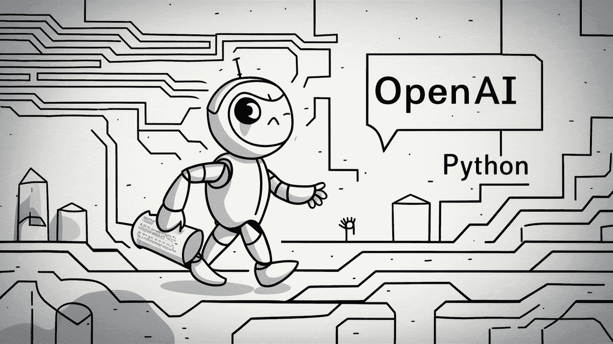

# 使用 Python 探索 OpenAI API

> 原文：[`www.kdnuggets.com/exploring-the-openai-api-with-python`](https://www.kdnuggets.com/exploring-the-openai-api-with-python)



图片由 [Ideogram.ai](http://ideogram.ai) 生成

谁没有听说过 OpenAI？这个人工智能研究实验室因其著名产品 ChatGPT 改变了世界。

* * *

## 我们的前三大课程推荐

 1\. [Google 网络安全证书](https://www.kdnuggets.com/google-cybersecurity) - 快速入门网络安全职业。

 2\. [Google 数据分析专业证书](https://www.kdnuggets.com/google-data-analytics) - 提升你的数据分析能力

 3\. [Google IT 支持专业证书](https://www.kdnuggets.com/google-itsupport) - 支持你的组织 IT 工作

* * *

它确实改变了 AI 实施的格局，现在许多公司急于成为下一个大热门。

尽管竞争激烈，OpenAI 仍然是满足任何生成式 AI 业务需求的首选公司，因为它拥有最佳的模型之一并提供持续的支持。该公司提供了许多最先进的生成式 AI 模型，具备各种任务能力：图像生成、文本转语音等等。

OpenAI 提供的所有模型都可以通过 API 调用获得。只需简单的 Python 代码，你就可以使用这些模型。

在这篇文章中，我们将探索如何使用 Python 操作 OpenAI API 以及你可以完成的各种任务。希望你从这篇文章中学到很多东西。

# OpenAI API 设置

要跟随这篇文章，你需要准备一些东西。

你最重要的需求是来自 OpenAI 的 API 密钥，因为没有密钥你无法访问 OpenAI 模型。要获取访问权限，你必须注册一个 OpenAI 账户并在[账户页面](https://platform.openai.com/api-keys)申请 API 密钥。收到密钥后，请将其保存到一个你能记住的地方，因为它不会再次出现在 OpenAI 界面中。

接下来你需要做的就是购买预付费信用卡以使用 OpenAI API。最近，OpenAI 宣布了关于[他们的账单工作方式](https://help.openai.com/en/articles/8264644-what-is-prepaid-billing)的变化。我们不再是在月末付款，而是需要购买用于 API 调用的预付费信用。你可以访问[OpenAI 定价](https://openai.com/pricing)页面来估算你需要的信用额度。你也可以查看他们的[模型页面](https://platform.openai.com/docs/models/overview)以了解你需要哪个模型。

最后，你需要在你的环境中安装 OpenAI Python 包。你可以使用以下代码来完成这一操作。

```py
pip install openai
```

然后，你需要使用下面的代码设置你的 OpenAI 密钥环境变量。

```py
import os

os.environ['OPENAI_API_KEY'] = 'YOUR API KEY'
```

一切就绪后，让我们开始使用 Python 探索 OpenAI 模型的 API。

# OpenAI API 文本生成

OpenAI API 的明星是他们的文本生成模型。这些大型语言模型系列可以根据称为提示的文本输入生成文本输出。提示基本上是我们对模型期望的指令，例如文本分析、生成文档草稿等。

让我们开始执行一个简单的文本生成 API 调用。我们将使用 OpenAI 的 GPT-3.5-Turbo 模型作为基础模型。它不是最先进的模型，但通常最便宜的模型足以执行文本相关任务。

```py
from openai import OpenAI
client = OpenAI()

completion = client.chat.completions.create(
  model="gpt-3.5-turbo",
  messages=[
    {"role": "system", "content": "You are a helpful assistant."},
    {"role": "user", "content": "Generate me 3 Jargons that I can use for my Social Media content as a Data Scientist content creator"}
  ]
)

print(completion.choices[0].message.content)
```

1.  *“释放预测分析的力量，以驱动数据驱动的决策！”*

1.  *“深入数据海洋，揭示有价值的见解。”*

1.  *“通过先进算法将原始数据转化为可操作的智能。”*

文本生成模型的 API 调用使用 API 端点 *chat.completions* 来根据我们的提示创建文本响应。

文本生成有两个必需的参数：模型和消息。

对于模型，你可以查看相关模型页面上可以使用的模型列表。

关于消息，我们传递一个包含两个对的字典：角色和内容。角色键指定了对话模型中的角色发送者。有 3 种不同的角色：系统、用户和助手。

使用消息中的角色，我们可以帮助设置模型行为，并提供一个模型应该如何回答我们提示的示例。

让我们通过角色助手扩展前面的代码示例，以指导我们的模型。此外，我们还会探索一些文本生成模型的参数，以改善其结果。

```py
completion = client.chat.completions.create(
    model="gpt-3.5-turbo",
    messages=[
        {"role": "system", "content": "You are a helpful assistant."},
        {"role": "user", "content": "Generate me 3 jargons that I can use for my Social Media content as a Data Scientist content creator."},
        {"role": "assistant", "content": "Sure, here are three jargons: Data Wrangling is the key, Predictive Analytics is the future, and Feature Engineering help your model."},
        {"role": "user", "content": "Great, can you also provide me with 3 content ideas based on these jargons?"}
    ],
    max_tokens=150,
    temperature=0.7,
    top_p=1,
    frequency_penalty=0
)

print(completion.choices[0].message.content)
```

*当然！以下是基于提供的术语的三个内容创意：*

1.  *“释放数据处理的力量：数据科学家的逐步指南” - 创建一篇博客文章或视频教程，展示在现实数据科学项目中数据处理的最佳实践和工具。*

1.  *“预测分析的未来：数据科学中的趋势与创新” - 写一篇思想领导文章，讨论预测分析中出现的新兴趋势和技术，以及它们如何塑造数据科学的未来。”*

1.  *“掌握特征工程：提升模型性能的技术” - 开发一张信息图或社交媒体系列，突出不同的特征工程技术及其对提高机器学习模型准确性和效率的影响。*

生成的输出遵循我们提供给模型的示例。如果我们有特定的风格或结果想让模型遵循，使用角色助手是很有用的。

关于参数，这里是我们使用的每个参数的简单解释：

+   **max_tokens**：此参数设置模型可以生成的最大词数。

+   **temperature**: 此参数控制模型输出的不可预测性。较高的温度会导致输出更加多样化和富有想象力。可接受的范围是从 0 到无穷大，虽然 2 以上的值不常见。

+   **top_p**: 也称为核采样，此参数帮助确定模型从中抽取输出的概率分布子集。例如，top_p 值为 0.1 意味着模型仅考虑概率分布的前 10% 进行采样。其值范围从 0 到 1，值越高，输出多样性越大。

+   **frequency_penalty**: 对模型输出中重复的标记进行惩罚。惩罚值范围从 -2 到 2，其中正值会减少标记的重复，负值则会鼓励重复的单词使用。值为 0 表示没有对重复进行惩罚。

最后，你可以使用以下代码将模型输出更改为 JSON 格式。

```py
completion = client.chat.completions.create(
  model="gpt-3.5-turbo",
  response_format={ "type": "json_object" },
  messages=[
    {"role": "system", "content": "You are a helpful assistant designed to output JSON.."},
    {"role": "user", "content": "Generate me 3 Jargons that I can use for my Social Media content as a Data Scientist content creator"}
  ]
)

print(completion.choices[0].message.content)
```

{

"术语": [

"利用预测分析解锁有价值的洞察",

"深入研究先进机器学习算法的复杂性",

"利用大数据的力量推动数据驱动决策"

]

}

结果是 JSON 格式，并符合我们输入到模型中的提示。

要查看完整的 [文本生成 API 文档](https://platform.openai.com/docs/api-reference/chat)，请访问他们的专用页面。

# OpenAI 图像生成

OpenAI 模型对于文本生成用例非常有用，也可以调用 API 进行图像生成。

使用 DALL·E 模型，我们可以根据请求生成图像。执行此操作的简单方法是使用以下代码。

```py
from openai import OpenAI
from IPython.display import Image

client = OpenAI()

response = client.images.generate(
  model="dall-e-3",
  prompt="White Piano on the Beach",
  size="1792x1024",
  quality="hd",
  n=1,
)

image_url = response.data[0].url
Image(url=image_url)
```


使用 DALL·E 3 生成的图像

对于参数，以下是解释：

+   **model**: 要使用的图像生成模型。目前，API 仅支持 DALL·E 3 和 DALL·E 2 模型。

+   **prompt**: 这是模型将根据其生成图像的文本描述。

+   **size**: 确定生成图像的分辨率。对于 DALL·E 3 模型，有三种选择（1024x1024、1024x1792 或 1792x1024）。

+   **quality**: 此参数影响生成图像的质量。如果需要计算时间，“标准”比“高清”更快。

+   **n**: 指定根据提示生成图像的数量。DALL·E 3 一次只能生成一张图像。DALL·E 2 一次最多可以生成 10 张图像。

也可以从现有图像生成变体图像，但这仅在使用 DALL·E 2 模型时可用。API 也只接受小于 4 MB 的方形 PNG 图像。

```py
from openai import OpenAI
from IPython.display import Image

client = OpenAI()

response = client.images.create_variation(
  image=open("white_piano_ori.png", "rb"),
  n=2,
  size="1024x1024"
)

image_url = response.data[0].url

Image(url=image_url)
```

由于使用的是较旧的模型，生成的图像可能不如 DALL·E 3 生成的图像那么好。

# OpenAI 视觉

OpenAI 是一家领先的公司，提供能够理解图像输入的模型。这个模型被称为 Vision 模型，有时被称为 GPT-4V。该模型能够回答我们提供的图像所提出的问题。

让我们尝试使用 Vision 模型 API。在这个示例中，我会使用我们从 DALL·E 3 模型生成的白色钢琴图像并将其存储到本地。此外，我还会创建一个函数，该函数接受图像路径并返回图像描述文本。别忘了将 api_key 变量更改为你的 API 密钥。

```py
from openai import OpenAI
import base64
import requests
def provide_image_description(img_path):

    client = OpenAI()

    api_key = 'YOUR-API-KEY'
    # Function to encode the image
    def encode_image(image_path):
      with open(image_path, "rb") as image_file:
        return base64.b64encode(image_file.read()).decode('utf-8')

    # Path to your image
    image_path = img_path

    # Getting the base64 string
    base64_image = encode_image(image_path)

    headers = {
      "Content-Type": "application/json",
      "Authorization": f"Bearer {api_key}"
    }

    payload = {
      "model": "gpt-4-vision-preview",
      "messages": [
        {
          "role": "user",
          "content": [
            {
              "type": "text",
              "text": """Can you describe this image? """
            },
            {
              "type": "image_url",
              "image_url": {
                "url": f"data:image/jpeg;base64,{base64_image}"
              }
            }
          ]
        }
      ],
      "max_tokens": 300
    }

    response = requests.post("https://api.openai.com/v1/chat/completions", headers=headers, json=payload)

    return response.json()['choices'][0]['message']['content']
```

*这张图像展示了一架置于宁静海滩环境中的大钢琴。钢琴是白色的，表明其表面通常与优雅相关。乐器正位于海岸线的边缘，温柔的海浪轻轻拂过沙滩，形成的泡沫刚刚碰触到钢琴及其配套凳子的底部。海滩的环境暗示着一种宁静和孤立的感觉，天空湛蓝，远处有蓬松的云朵，平静的大海延展到地平线。钢琴周围的沙滩上散落着许多大小不一的贝壳，突显了环境的自然美和宁静氛围。在自然海滩环境中摆放经典音乐乐器的对比创造了一种超现实和视觉上富有诗意的构图。*

你可以调整上述字典中的文本值以符合你的 Vision 模型要求。

# OpenAI 音频生成

OpenAI 还提供了一个基于 Text-to-Speech 模型生成音频的模型。使用起来非常简单，但语音叙述风格有限。此外，该模型支持多种语言，你可以在他们的 [语言支持页面](https://github.com/openai/whisper#available-models-and-languages) 查看。

要生成音频，你可以使用下面的代码。

```py
from openai import OpenAI
client = OpenAI()

speech_file_path = "speech.mp3"
response = client.audio.speech.create(
  model="tts-1",
  voice="alloy",
  input="I love data science and machine learning"
)

response.stream_to_file(speech_file_path)
```

你应该能在你的目录中看到音频文件。尝试播放它，看看它是否符合你的标准。

目前，你只能为 Text-to-Speech 模型使用几个参数：

+   model: 要使用的 Text-to-Speech 模型。仅有两个模型可用（tts-1 或 tts-1-hd），其中 tts-1 优化速度，tts-1-hd 优化质量。

+   voice: 要使用的声音风格，其中所有声音都优化为英语。选择包括 alloy、echo、fable、onyx、nova 和 shimmer。

+   response_format: 音频格式文件。目前，支持的格式包括 mp3、opus、aac、flac、wav 和 pcm。

+   speed: 生成音频的速度。你可以选择 0.25 到 4 之间的值。

+   input: 创建音频的文本。目前，模型仅支持最多 4096 个字符。

# OpenAI 语音转文字

OpenAI 提供了转录和翻译音频数据的模型。使用 whispers 模型，我们可以将支持的语言的音频转录为文本文件，并将其翻译成英文。

让我们尝试对之前生成的音频文件进行简单的转录。

```py
from openai import OpenAI
client = OpenAI()

audio_file= open("speech.mp3", "rb")
transcription = client.audio.transcriptions.create(
  model="whisper-1",
  file=audio_file
)

print(transcription.text)
```

*我热爱数据科学和机器学习。*

还可以将音频文件翻译成英文。目前尚无模型支持翻译成其他语言。

```py
from openai import OpenAI
client = OpenAI()

audio_file = open("speech.mp3", "rb")
translate = client.audio.translations.create(
  model="whisper-1",
  file=audio_file
)
```

# 结论

我们已经深入了解了 OpenAI 提供的几种模型服务，包括文本生成、图像生成、音频生成、视觉和文本转语音模型。每种模型都有其 API 参数和规范，你需要在使用之前学习。

**[Cornellius Yudha Wijaya](https://www.linkedin.com/in/cornellius-yudha-wijaya/)** 是一名数据科学助理经理和数据撰稿人。在全职工作于安联印度尼西亚期间，他喜欢通过社交媒体和写作媒体分享 Python 和数据技巧。Cornellius 涉及各种人工智能和机器学习话题。

### 更多相关主题

+   [免费 ChatGPT 课程：使用 OpenAI API 编写 5 个项目](https://www.kdnuggets.com/2023/05/free-chatgpt-course-openai-api-code-5-projects.html)

+   [OpenAI 的 Whisper API 用于转录和翻译](https://www.kdnuggets.com/2023/06/openai-whisper-api-transcription-translation.html)

+   [OpenAI API 入门：易于跟随的起始指南](https://www.kdnuggets.com/openai-api-for-beginners-your-easy-to-follow-starter-guide)

+   [使用噪声标记数据微调 OpenAI 语言模型](https://www.kdnuggets.com/2023/04/finetuning-openai-language-models-noisily-labeled-data.html)

+   [OpenAI 的新 ChatGPT 和 Whisper API](https://www.kdnuggets.com/2023/03/new-chatgpt-whisper-apis-openai.html)

+   [使用 OpenAI GPT 模型的最佳实践](https://www.kdnuggets.com/2023/08/best-practices-openai-gpt-model.html)
