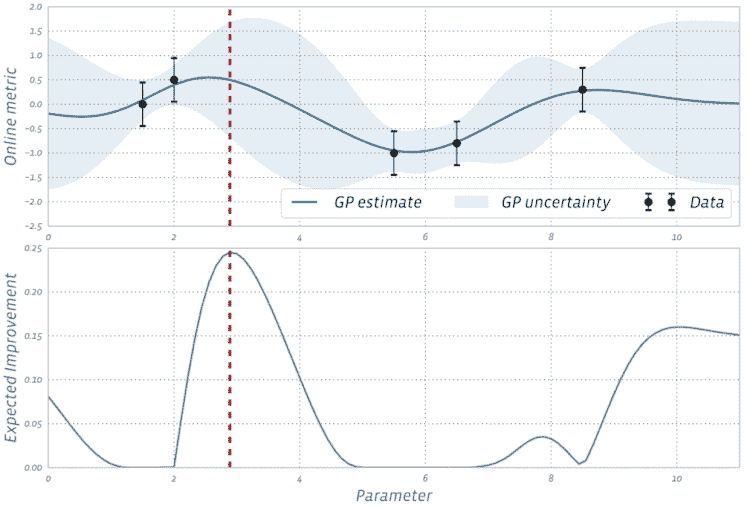
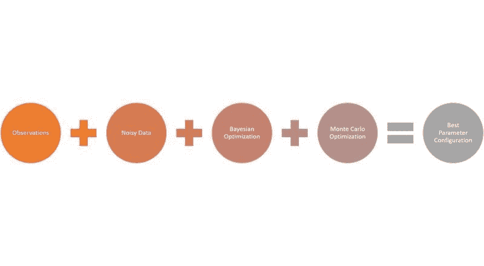
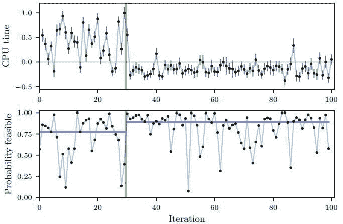

# Facebook 利用贝叶斯优化在机器学习模型中进行更好的实验

> 原文：[`www.kdnuggets.com/2020/08/facebook-bayesian-optimization-better-experiments-machine-learning.html`](https://www.kdnuggets.com/2020/08/facebook-bayesian-optimization-better-experiments-machine-learning.html)

评论 

来源：[`www.persado.com/2016/06/machine-learning-trumps-a-b-split-testing/`](https://www.persado.com/2016/06/machine-learning-trumps-a-b-split-testing/)

> 我最近开始了一份新的关注人工智能教育的通讯。《TheSequence》是一份无废话（即没有炒作，没有新闻等）的 AI 专注通讯，阅读时间为 5 分钟。目标是让你了解最新的机器学习项目、研究论文和概念。请通过以下方式订阅试试：

超参数优化是机器学习应用生命周期中的一个关键方面。尽管诸如网格搜索之类的方法在优化特定孤立模型的超参数方面极为有效，但它们很难在大规模模型和实验的排列中进行扩展。像 Facebook 这样的公司运营着数千个并发的机器学习模型，这些模型需要不断地进行调整。为此，Facebook 工程团队需要定期进行 A/B 测试，以确定合适的超参数配置。这些测试中的数据难以收集，并且通常是孤立进行的，最终导致计算成本极高。在这一领域最具创新性的方法之一来自 Facebook 的一个 AI 研究团队，他们[发表了一篇基于贝叶斯优化的方法来自适应设计 A/B 测试轮次的论文](https://projecteuclid.org/euclid.ba/1533866666)，该方法基于之前测试的结果。

### 为什么选择贝叶斯优化？

贝叶斯优化是一种强大的方法，用于解决涉及昂贵函数评估的黑箱优化问题。最近，贝叶斯优化已发展成为优化机器学习模型中的超参数的重要技术。概念上，贝叶斯优化从评估少量随机选择的函数值开始，并将高斯过程（GP）回归模型拟合到结果中。GP 后验提供了每一点的函数值估计以及该估计的不确定性。GP 在贝叶斯优化中表现良好，因为它提供了出色的不确定性估计，并且在理论上易于处理。它提供了一个估计，说明在线度量如何随着感兴趣的参数变化。

让我们设想一个环境，其中我们对机器学习模型进行随机和定期的实验。在这种情况下，贝叶斯优化可以用来构建参数与在线结果之间关系的统计模型，并使用该模型来决定运行哪些实验。这个概念在下图中得到了很好的说明，其中每个数据标记对应于该参数值的 A/B 测试结果。我们可以使用 GP 来决定下一个测试哪个参数，通过在探索（高不确定性）与利用（良好的模型估计）之间取得平衡来完成。这是通过计算一个获取函数来完成的，该函数估计运行任何给定参数值实验的价值。

来源：[`projecteuclid.org/download/pdfview_1/euclid.ba/1533866666`](https://projecteuclid.org/download/pdfview_1/euclid.ba/1533866666)

在应用于超参数优化时，贝叶斯优化的基本目标是确定特定超参数配置的实验价值。从概念上讲，贝叶斯优化对于孤立模型非常有效，但在运行随机实验的场景中，其价值主张面临挑战。根本挑战与观察中引入的噪声有关。

### 噪声与贝叶斯优化

机器学习系统中的随机实验引入了高水平的观察噪声。此外，许多特定实验的约束本身也可以视为噪声数据，这可能会影响实验结果。假设我们试图评估给定观察*x*的函数*f(x)*的值。由于观察噪声，我们不仅对值*f(x)*有不确定性，而且对当前最佳观察*x*及其值*f(x)*也存在不确定性。

通常，贝叶斯优化模型使用启发式方法来处理噪声观察，但这些方法在噪声水平较高时表现很差。为了解决这个问题，Facebook 团队提出了一个巧妙的答案：为什么不把噪声作为观察的一部分呢？

想象一下，如果我们观察到的不是*f(x)*的期望，而是*yi = f(xi) + €i*，其中*€i*是观察噪声。从数学上讲，GP 在处理带噪声的观察时与处理无噪声数据的方式类似。虽然数学细节较多，但在他们的研究论文中，Facebook 团队展示了这种类型的近似非常适合蒙特卡洛优化，这种优化方法能准确估计正确的观察结果。

### 带噪声数据的贝叶斯优化实践

Facebook 团队在几个现实世界的场景中测试了他们的研究，规模达到 Facebook 级别。第一个场景是优化 Facebook 排名系统的 6 个参数。第二个例子是优化 7 个与 CPU 使用相关的数字编译器标志，这些标志用于他们的 HipHop 虚拟机（HHVM）。在第二个实验中，前 30 次迭代是随机生成的。此时，噪声数据下的贝叶斯优化方法能够识别出 CPU 时间作为需要评估的超参数配置，并开始运行不同的实验以优化其值。结果在下图中清晰地展示出来。

来源：[`projecteuclid.org/download/pdfview_1/euclid.ba/1533866666`](https://projecteuclid.org/download/pdfview_1/euclid.ba/1533866666)

噪声数据下的贝叶斯优化等技术在大规模机器学习算法中极具威力。虽然我们在优化方法上做了大量工作，但大多数方法仍然高度理论化。很高兴看到 Facebook 推动了这个新兴领域的边界。

[原始文章](https://medium.com/dataseries/facebook-uses-bayesian-optimization-to-conduct-better-experiments-in-machine-learning-models-6f834169d005)。经许可转载。

**相关：**

+   学习贝叶斯统计的必备资源

+   Uber 的 Ludwig 是一个用于低代码机器学习的开源框架

+   Facebook 开源 Blender，最大规模的开放领域聊天机器人

* * *

## 我们的前三大课程推荐

 1\. [Google 网络安全证书](https://www.kdnuggets.com/google-cybersecurity) - 快速进入网络安全职业。

 2\. [Google 数据分析专业证书](https://www.kdnuggets.com/google-data-analytics) - 提升你的数据分析技能

 3\. [Google IT 支持专业证书](https://www.kdnuggets.com/google-itsupport) - 支持你的组织 IT

* * *

### 更多相关内容

+   [LinkedIn 如何使用机器学习来排序你的动态](https://www.kdnuggets.com/2022/11/linkedin-uses-machine-learning-rank-feed.html)

+   [KDnuggets 新闻，11 月 16 日：LinkedIn 如何使用机器学习 •…](https://www.kdnuggets.com/2022/n45.html)

+   [机器学习实验的版本控制与追踪](https://www.kdnuggets.com/2021/12/versioning-machine-learning-experiments-tracking.html)

+   [用于深度学习实验的 Hydra 配置](https://www.kdnuggets.com/2023/03/hydra-configs-deep-learning-experiments.html)

+   [顶级编程语言及其应用](https://www.kdnuggets.com/2021/05/top-programming-languages.html)

+   [KDnuggets™ 新闻 22:n04, 1 月 26 日: 高收入的副业…](https://www.kdnuggets.com/2022/n04.html)
