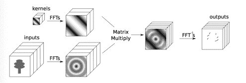

# Facebook 为 Torch 开源的深度学习模块

> 原文：[`www.kdnuggets.com/2015/02/facebook-open-source-deep-learning-torch.html`](https://www.kdnuggets.com/2015/02/facebook-open-source-deep-learning-torch.html)

如果你是 Torch 用户，并且对大规模深度学习感兴趣，你可能已经尝试过 Facebook 人工智能研究院发布的深度学习模块。他们为 Torch 优化的深度学习模块，[fbcunn](https://github.com/facebook/fbcunn)，正在广泛讨论中。

> 这些模块比 Torch 中的默认模块要快得多，使我们的研究项目加速，因为它们允许我们在更短的时间内训练更大的神经网络。

Torch 是一个为 Lua 编程语言设计的深度学习库，广泛应用于谷歌、脸书和 IBM 等科技公司。最近发布的版本包含了训练卷积神经网络和其他深度学习模型的工具。

+   允许用户在多个 GPU 上并行训练的容器

+   一个优化的查找表，常用于词嵌入和神经语言模型。

+   Hierarchical SoftMax 模块，用于加速训练极大量的类别。现在对 100 万个类别进行分类是一种实际可行的策略。

+   Cross-map pooling，常用于某些类型的视觉和文本模型。

+   基于[论文](http://l.facebook.com/l.php?u=http%3A%2F%2Fresearch.microsoft.com%2Fapps%2Fpubs%2F%3Fid%3D230137&h=XAQFeHapf&s=1) 的 1-bit SGD 的 GPU 实现，由 Frank Seide 等人提出。

+   一个显著更快的 Temporal Convolution 层（比 Torch 的 cunn 实现快 1.5 倍到 10 倍）。

这些发布的模块中最重要的是一个基于 FFT 的快速卷积层，运行在 NVIDIA GPU 上。他们声称，他们的 FFT 基于卷积层的代码比其他任何公开代码都要快，用于训练流行架构时，他们的实验表明，比 NVIDIA 的 CuDNN 快多达 23.5*。当内核大小变大时，速度提升更加显著（从 5*5 开始）。

该代码基于[NYU 研究人员发布的算法](http://arxiv.org/pdf/1312.5851v5.pdf)，在傅里叶域中执行卷积作为乘积。他们提出先对每组矩阵进行傅里叶变换，然后进行成对卷积作为乘积。由于特征图的规模很大，使用 FFT 加速了训练。

Facebook 人工智能研究院 (FAIR) 成立于 2013 年 12 月，由 Yann LeCun 领导。查看 FAIR 发布的[深度学习模块](https://github.com/facebook/fbcunn)。

**相关：**

+   **CuDNN – 一个新的深度学习库**

+   **KDnuggets 独家：与深度学习专家、Facebook AI 实验室主任 Yann LeCun 的访谈**

+   **深度学习 – 学习和理解的重要资源**

### 更多相关内容

+   [使用 Tableau 创建高效的组合数据源](https://www.kdnuggets.com/2022/05/create-efficient-combined-data-sources-tableau.html)

+   [用于高级数据科学项目的前 16 个技术数据源](https://www.kdnuggets.com/top-16-technical-data-sources-for-advanced-data-science-projects)

+   [前 18 名数据科学 Facebook 群组](https://www.kdnuggets.com/2022/06/top-18-data-science-facebook-groups.html)

+   [开放助理：探索开放和协作的可能性…](https://www.kdnuggets.com/2023/04/open-assistant-explore-possibilities-open-collaborative-chatbot-development.html)

+   [介绍 Objectiv：开源产品分析基础设施](https://www.kdnuggets.com/2022/06/objectiv-introducing-objectiv-opensource-product-analytics-infrastructure.html)

+   [DeepMind 的 AlphaTensor 首个开源实现](https://www.kdnuggets.com/2023/03/first-open-source-implementation-deepmind-alphatensor.html)
