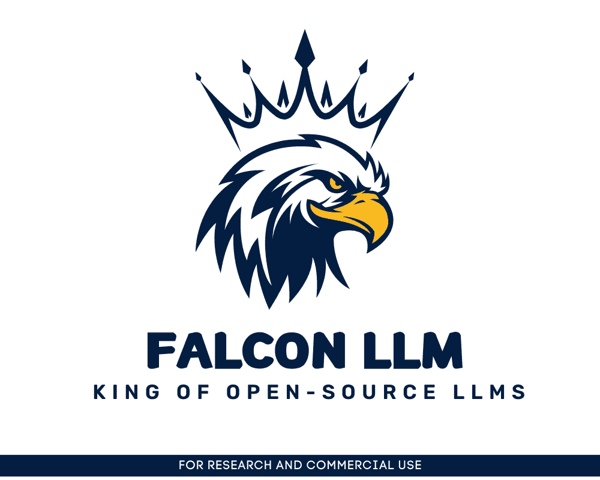
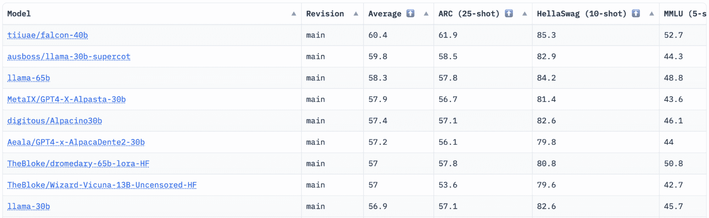

# Falcon LLM: 开源 LLM 新霸主

> 原文：[`www.kdnuggets.com/2023/06/falcon-llm-new-king-llms.html`](https://www.kdnuggets.com/2023/06/falcon-llm-new-king-llms.html)



图片由编辑提供

我们看到每周都有大量语言模型（LLMs）问世，更多的聊天机器人供我们使用。然而，确定哪个是最好的，了解每个模型的进展以及哪个最有用，可能会很困难。

* * *

## 我们的前三课程推荐

 1\. [Google 网络安全证书](https://www.kdnuggets.com/google-cybersecurity) - 快速进入网络安全职业。

 2\. [Google 数据分析专业证书](https://www.kdnuggets.com/google-data-analytics) - 提升您的数据分析技能

 3\. [Google IT 支持专业证书](https://www.kdnuggets.com/google-itsupport) - 支持您的组织进行 IT 工作

* * *

[HuggingFace](https://huggingface.co/spaces/HuggingFaceH4/open_llm_leaderboard) 拥有一个开放的 LLM 排行榜，跟踪、评估和排名正在发布的 LLM。它们使用独特的框架来测试生成性语言模型在不同评估任务上的表现。

最近，LLaMA（大型语言模型 Meta AI）曾位居排行榜首位，但近期被新预训练的 LLM - Falcon 40B 取代。



图片由 [HuggingFace 开放 LLM 排行榜](https://huggingface.co/spaces/HuggingFaceH4/open_llm_leaderboard) 提供

# 关于技术创新研究所

[Falcon LLM](https://falconllm.tii.ae/) 由 [技术创新研究所](https://www.tii.ae/)（TII）创立并开发，TII 是阿布扎比政府高级技术研究委员会的一部分。该政府机构监管阿联酋的技术研究，科学家、研究人员和工程师的团队专注于提供变革性技术和科学发现。

# 什么是 Falcon 40B？

[Falcon-40B](https://huggingface.co/tiiuae/falcon-40b) 是一个具有 40B 参数的基础 LLM，训练数据为一万亿个标记。Falcon 40B 是一个自回归解码器模型。自回归解码器模型意味着该模型被训练来预测序列中给定先前标记后的下一个标记。GPT 模型是一个很好的例子。

Falcon 的架构在仅使用 75% 的训练计算预算的情况下，已显著超越 GPT-3，并且在推理时仅需要 ? 的计算量。

数据质量在规模化方面是技术创新研究所团队的重要关注点，因为我们知道 LLM 对训练数据的质量非常敏感。该团队建立了一个数据管道，扩展到数万个 CPU 核心以进行快速处理，并能够通过广泛的过滤和去重从网络中提取高质量内容。

他们还有一个较小的版本：[Falcon-7B](https://huggingface.co/tiiuae/falcon-7b)，具有 7B 参数，训练于 1500B 个 token。此外，还有一个[Falcon-40B-Instruct](https://huggingface.co/tiiuae/falcon-40b-instruct)和[Falcon-7B-Instruct](https://huggingface.co/tiiuae/falcon-7b-instruct)模型可供使用，如果你在寻找一个现成的聊天模型。

## Falcon 40B 可以做什么？

与其他 LLM 类似，Falcon 40B 可以：

+   生成创意内容

+   解决复杂问题

+   客户服务操作

+   虚拟助手

+   语言翻译

+   情感分析。

+   减少和自动化“重复性”工作。

+   帮助阿联酋公司提高效率

## Falcon 40B 是如何训练的？

由于训练了 1 万亿个 token，它在 AWS 上需要 384 个 GPU，耗时超过两个月。训练于 1000B 个 token 的[RefinedWeb](https://huggingface.co/datasets/tiiuae/falcon-refinedweb)，这是 TII 构建的大型英语网页数据集。

预训练数据包括来自网络的公共数据集，使用了[CommonCrawl](https://commoncrawl.org/)。团队经过了严格的过滤阶段，以去除机器生成的文本和成人内容，并进行了去重，从而组装了一个近五万亿 token 的预训练数据集。

基于 CommonCrawl 构建的 RefinedWeb 数据集显示，使用此数据集训练的模型比使用策划数据集训练的模型表现更好。RefinedWeb 也是多模态友好的。

一旦准备好，Falcon 就通过了如 EAI Harness、HELM 和 BigBench 等开源基准测试的验证。

# Falcon LLM 是开源的

他们已将[Falcon LLM 开源](https://huggingface.co/tiiuae)给公众，使 Falcon 40B 和 7B 对研究人员和开发人员更加可及，因为它基于 Apache License Version 2.0 发布。

曾经仅用于研究和商业用途的 LLM，现在已成为开源，以满足全球对 AI 包容性访问的需求。它现在在商业使用中不再受版税限制，因为阿联酋致力于改变 AI 中的挑战和边界，并在未来发挥重要作用。

旨在培养一个合作、创新和知识共享的 AI 生态系统，Apache 2.0 确保了安全和安全的开源软件。

# 如何使用 Falcon-7B Instruct LLM

如果你想尝试一个更简单的 Falcon-40B 版本，适合处理通用指令风格的聊天机器人，你可以使用 Falcon-7B。

那么让我们开始吧…

如果你还没有，请安装以下软件包：

```py
!pip install transformers
!pip install einops
!pip install accelerate
!pip install xformers
```

一旦您安装了这些包，您可以继续运行[Falcon 7-B Instruct](https://huggingface.co/tiiuae/falcon-7b-instruct)提供的代码。

```py
from transformers import AutoTokenizer, AutoModelForCausalLM
import transformers
import torch

model = "tiiuae/falcon-7b-instruct"

tokenizer = AutoTokenizer.from_pretrained(model)
pipeline = transformers.pipeline(
    "text-generation",
    model=model,
    tokenizer=tokenizer,
    torch_dtype=torch.bfloat16,
    trust_remote_code=True,
    device_map="auto",
)
sequences = pipeline(
   "Girafatron is obsessed with giraffes, the most glorious animal on the face of this Earth. Giraftron believes all other animals are irrelevant when compared to the glorious majesty of the giraffe.\nDaniel: Hello, Girafatron!\nGirafatron:",
    max_length=200,
    do_sample=True,
    top_k=10,
    num_return_sequences=1,
    eos_token_id=tokenizer.eos_token_id,
)
for seq in sequences:
    print(f"Result: {seq['generated_text']}")
```

# 总结

作为最好的开源模型，Falcon 已经接过 LLaMAs 的王冠，人们对其强大的优化架构、具有独特许可的开源性质以及提供 40B 和 7B 参数两种尺寸感到惊讶。

你尝试过了吗？如果尝试过，请在评论中告诉我们你的想法。

**[尼莎·阿娅](https://www.linkedin.com/in/nisha-arya-ahmed/)** 是一位数据科学家、自由技术作家以及 KDnuggets 的社区经理。她特别感兴趣于提供数据科学职业建议或教程以及基于数据科学的理论知识。她还希望探索人工智能如何/可以如何有助于人类寿命的延续。作为一个热心学习者，她寻求拓宽自己的技术知识和写作技能，同时帮助指导他人。

### 更多相关主题

+   [系好安全带：Falcon 180B 来了！](https://www.kdnuggets.com/fasten-your-seatbelt-falcon-180b-is-here)

+   [Streaming-LLM 介绍：适用于无限长度输入的 LLM](https://www.kdnuggets.com/introduction-to-streaming-llm-llms-for-infinite-length-inputs)

+   [轻松将 LLMs 集成到您的 Scikit-learn 工作流程中，使用 Scikit-LLM](https://www.kdnuggets.com/easily-integrate-llms-into-your-scikit-learn-workflow-with-scikit-llm)

+   [Web LLM：将 LLM 聊天机器人带到浏览器](https://www.kdnuggets.com/2023/05/webllm-bring-llm-chatbots-browser.html)

+   [Mistral 7B-V0.2：用…微调 Mistral 的新开源 LLM](https://www.kdnuggets.com/mistral-7b-v02-fine-tuning-mistral-new-open-source-llm-with-hugging-face)

+   [介绍 MPT-7B：一种新的开源 LLM](https://www.kdnuggets.com/2023/05/introducing-mpt7b-new-opensource-llm.html)
